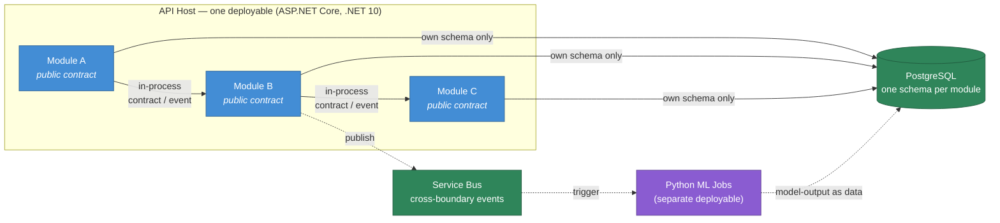

# ADR 0001 — Modular Monolith over Microservices

> Records why BeeEye ships as a single deployable ASP.NET Core host composed of strictly-bounded internal modules, rather than a fleet of independently-deployed microservices.

| Field | Value |
|-------|-------|
| **Status** | Accepted |
| **Date** | 2026-07-22 |
| **Deciders** | BeeEye platform architecture team |
| **Applies to** | Target production architecture for ADMC (Saudi Arabia; SAR) |
| **Supersedes** | — |
| **Related** | [architecture/overview.md](../architecture/overview.md), [architecture/module-boundaries.md](../architecture/module-boundaries.md), [architecture/deployment-and-ip-protection.md](../architecture/deployment-and-ip-protection.md) |

---

## Context

BeeEye is a vendor product deployed **into ADMC's own Azure tenant and subscription** — a single-customer,
single-region installation, not a multi-tenant public SaaS. The POC ("Meridian BI") proved the analytics
(metrics, Holt-Winters + baseline forecasting with holdout back-testing, an explainable additive risk model,
a rules-based recommendation engine, and a deterministic grounded insight layer) as framework-free JavaScript
in `docs/wireframes/engine.js`. The production build ("BeeEye", .NET namespace root `BeeEye`) must re-home
that logic into a maintainable, Azure-deployable platform while preserving determinism and explainability.

Several forces constrain the deployment shape:

| Force | Implication |
|-------|-------------|
| **Team size** | A small vendor engineering team owns the whole platform. There is no capacity to run, on-call, and independently version ~19 separately-deployed services. |
| **Single customer, single tenant** | One production installation in ADMC's tenant. There is no fan-out of tenants or traffic that would justify per-service horizontal scaling or independent release cadences. |
| **Data-and-analytics workload** | The domain is read-heavy and pipeline-shaped: Integration → DataQuality → MasterData → SalesActuals/Inventory → Forecasting → Predictions → Recommendations → DecisionsAndOutcomes. Many flows need **transactional consistency across contexts** (e.g., persisting a decision alongside its audit record). Distributed transactions across services would add cost without benefit here. |
| **Oracle Fusion is the system of record (read-only)** | BeeEye never writes back to enterprise systems; recommendations require human approval. The transactional surface BeeEye owns is comparatively small — its own curated model, metrics, predictions, decisions, and audit state in one PostgreSQL Flexible Server. |
| **Operational simplicity** | ADMC operates the platform in their tenant. Fewer moving parts means simpler deployment, observability, backup/restore, and incident response. |
| **Long-running compute is already out-of-band** | Statistical model fitting (Holt-Winters, back-testing, SHAP, gradient-boosted models) runs as **Python Container Apps Jobs**, off the request path. That heavy, independently-scalable tier already lives outside the request-serving process, so the API host does not need to be decomposed to isolate it. |
| **Future optionality** | If a single context later develops genuinely divergent scaling, security, or lifecycle needs, the team must be able to extract it into its own service **without a rewrite**. |

The genuine decision is therefore *not* "one process vs. many" in the naive sense — the Python ML tier is
already a separate deployable — but whether the **.NET domain and application layer** should be one deployable
with strong internal boundaries, or fragmented into many independently-deployed services from day one.

---

## Decision

**BeeEye's .NET back-end is a modular monolith: one deployable ASP.NET Core (.NET 10) API host composed of
independently-owned bounded-context module libraries, linked in-process behind explicit contracts, and
designed so any module can be extracted into its own service later without a rewrite.**

Concretely:

1. **One deployable, many modules.** The API host is a single Azure Container Apps deployment. Inside it,
   each of the nineteen bounded contexts — Identity, Organisation, MasterData, Integration, DataQuality,
   SalesActuals, Forecasting, Inventory, Procurement, AfterSales, SpareParts, ModelsAndExperiments,
   Predictions, Recommendations, DecisionsAndOutcomes, ExecutiveInsights, Notifications, Audit,
   PlatformAdministration — is its own module library with its own domain model and `DbContext`.

2. **Strict boundaries enforced, not merely encouraged.** Modules communicate only through **explicit
   in-process contracts** (public application-layer interfaces / commands / queries) and **domain events**.
   Direct reach-through into another module's tables or entities is **prohibited**. Boundaries are enforced
   in the build (project references restricted to a module's public contract assembly; architecture tests
   assert no cross-module type leakage; each module owns a distinct PostgreSQL schema).

3. **Async boundaries ride Service Bus.** When a domain event crosses an asynchronous boundary — notably
   into or out of the ML job tier, or into Notifications — it is carried on **Azure Service Bus**, using the
   same event contract that an extracted service would consume. In-process handlers and out-of-process
   subscribers share one contract shape.

4. **Extractable seam preserved.** Because modules never share tables and never call each other except
   through published contracts, extracting a module means swapping an in-process dispatch for a network call
   behind the same interface and splitting its schema out — a mechanical change, not a redesign.

5. **The ML tier stays separate by design.** Python forecasting/risk/SHAP jobs remain **Container Apps Jobs**,
   triggered by Service Bus and cron, reading `model-input` and writing `model-output` via ADLS Gen2. They are
   not part of the monolith; results flow back as data, never as synchronous API calls. This is a deliberate
   split for compute isolation and independent scaling — orthogonal to the monolith decision above.

---

## Consequences

### Positive

- **Operational simplicity for a single-tenant install.** One API deployment to build, ship, monitor, back
  up, and roll back in ADMC's tenant. One set of OpenTelemetry traces without cross-service correlation
  overhead. This directly matches the team-size and single-customer forces.
- **In-process transactional consistency.** Cross-context flows that must be atomic (a decision plus its
  audit entry; a validated batch promoted across DataQuality → MasterData) commit in a single PostgreSQL
  transaction — no sagas, no eventual-consistency reconciliation, no distributed-transaction machinery.
- **Fast, refactorable boundaries.** Contracts are compiled interfaces, so cross-module changes are caught by
  the compiler and architecture tests, and refactors that move a responsibility between contexts are cheap
  while the design is still settling.
- **Lower latency and cost.** In-process calls have no network hop or serialization tax; a single host has a
  smaller Azure footprint than a service-per-context fleet.
- **Clean extraction path.** Strict boundaries + one-schema-per-module + shared event contracts mean a context
  can graduate to its own service if it ever earns the right to (see Alternatives), without a rewrite.
- **Preserves POC determinism guardrails.** The deterministic engines and the "GenAI narrates, never computes"
  rule live in clearly-owned modules; a monolith does not dilute those invariants.

### Negative / risks (with mitigations)

| Risk | Mitigation |
|------|------------|
| Boundaries erode over time ("big ball of mud") | Enforce in the build: restricted project references, architecture/dependency tests (e.g. `NetArchTest`), one PostgreSQL schema per module, code-review checklist. A violation fails CI, not just review. |
| One process = coupled scaling and one blast radius | The heavy compute (ML) is already a separate job tier. The request-serving tier scales horizontally as replicas behind Container Apps; a bad deploy affects one well-tested unit, mitigated by health probes, staged rollout, and dev/test/prod isolation. |
| A shared database becomes a hidden coupling point | No cross-schema foreign keys or reach-through queries; each module owns its schema and exposes data only through its contract. This keeps the schema split extraction-ready. |
| Independent release cadence per context is not available | Accepted: a single customer with a small team wants coordinated, tested releases, not nineteen cadences. Revisit only if a context's lifecycle genuinely diverges. |
| Temptation to bypass Service Bus for in-process events | In-process and cross-process handlers share one event contract, so the async seam is always present in the design even when a handler currently runs in-process. |

---

## Alternatives Considered

### A. Microservices from day one — *Rejected*

Decompose the nineteen bounded contexts into independently-deployed services immediately.

- **Against:** For one customer, one tenant, one small team, this multiplies deployment units, CI/CD
  pipelines, service meshes, distributed tracing complexity, and on-call surface with **no scaling or
  autonomy benefit to match**. Flows that need cross-context atomicity would require sagas and
  compensating actions where a single transaction suffices today. Network hops add latency and failure
  modes to what is fundamentally a read-heavy analytics workload.
- **Why not:** Premature distribution is the classic way to pay the operational cost of microservices while
  reaping none of the organisational-scaling benefit that justifies them.

### B. Unstructured ("big ball of mud") monolith — *Rejected*

A single deployable with no enforced internal boundaries.

- **Against:** Cheap to start, expensive forever. Without strict contracts and per-module schemas, contexts
  entangle, the extraction seam is lost, and the analytics/decision guardrails blur.
- **Why not:** The modular monolith keeps the low operational cost while explicitly buying back the boundary
  discipline this option throws away.

### C. Serverless / functions-only back-end — *Rejected*

Model each capability as an Azure Function.

- **Against:** Poor fit for a rich transactional domain model with cross-context invariants and a shared
  curated store; cold-start and orchestration complexity for stateful, transaction-heavy flows.
- **Where it survives:** Event-driven, out-of-band jobs (ingestion, ML) already use the equivalent pattern
  via **Container Apps Jobs** — the right tool for that slice, not for the domain/application core.

### D. Multi-tenant SaaS platform — *Out of scope*

Build for many customers behind one shared control plane.

- **Against:** The engagement is a **vendor product deployed into ADMC's own tenant**; data must not leave
  that tenant, and there is no second tenant to amortise a multi-tenant control plane against.
- **Why not:** It would impose isolation, noisy-neighbour, and tenancy complexity that the single-customer
  deployment model explicitly does not require.

### Decision summary

| Option | Op. simplicity | Fits team size | Cross-context transactions | Extractable later | Verdict |
|--------|:--:|:--:|:--:|:--:|:--:|
| **Modular monolith** | High | Yes | In-process (simple) | Yes (seam preserved) | **Accepted** |
| Microservices day one | Low | No | Sagas (complex) | N/A | Rejected |
| Big-ball-of-mud monolith | High | Yes | In-process | No | Rejected |
| Serverless-only | Medium | Partial | Hard | Partial | Rejected |
| Multi-tenant SaaS | Low | No | — | — | Out of scope |

---

## When to revisit

Re-evaluate extracting a specific context into its own service when — and only when — one of these is
demonstrably true for that context:

- Its load profile diverges enough that coupled scaling wastes significant resource (e.g., a spike-prone
  integration or notification path).
- It needs an independent release cadence or a different runtime/security boundary than the rest of the host.
- A compliance or data-residency requirement forces physical isolation.

Because boundaries are strict and schemas are already split, such an extraction is a targeted, mechanical
change behind an existing contract — not a re-architecture. Until then, the modular monolith is the default.

---

## Traceability

- Target architecture map (C4, tech stack, the modular-monolith container view) →
  [architecture/overview.md](../architecture/overview.md)
- The nineteen bounded contexts, contracts, and events →
  [architecture/module-boundaries.md](../architecture/module-boundaries.md)
- Azure deployment topology (Container Apps host + jobs) →
  [architecture/deployment-and-ip-protection.md](../architecture/deployment-and-ip-protection.md)
- POC integration future-state that this decision productionises →
  [wireframes/docs/INTEGRATION_AZURE_ORACLE.md](../wireframes/docs/INTEGRATION_AZURE_ORACLE.md)
- POC assumptions & limitations (determinism, human-in-the-loop, read-only source) →
  [wireframes/docs/ASSUMPTIONS_LIMITATIONS.md](../wireframes/docs/ASSUMPTIONS_LIMITATIONS.md)
