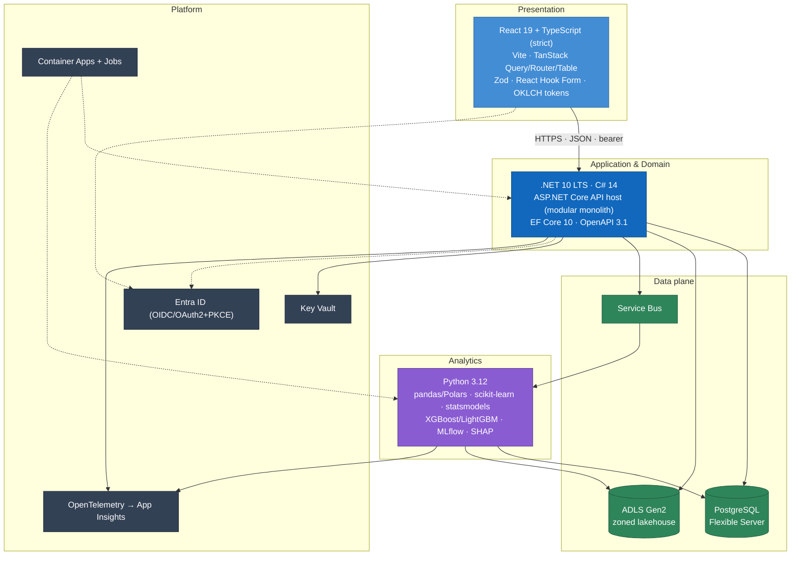

# ADR 0002 — Technology Stack

> Records the platform-wide technology choices for BeeEye — runtime, front-end, ML tier, data stores, messaging, hosting, identity and observability — with the rationale and the alternatives we rejected.

| | |
|---|---|
| **Status** | Accepted |
| **Date** | 2026-07-22 |
| **Deciders** | BeeEye architecture team (for ADMC) |
| **Context tier** | Cross-cutting / whole-platform |
| **Supersedes** | — |
| **Depends on** | [ADR 0001 — Architecture Style (Modular Monolith)](./0001-architecture-style.md) |

---

## 1. Context

BeeEye is a production-grade AI decision-intelligence platform delivered as a **vendor product deployed
into ADMC's own Azure tenant** (SAR currency, ADMC-controlled region, no customer data leaving the
tenant). It productionises the "Meridian BI" POC — a framework-free JavaScript engine (`engine.js`)
covering metrics, Holt-Winters + baseline forecasting with holdout back-testing, an explainable additive
risk model, a rules-based recommendation engine, and a deterministic grounded AI insight layer — into a
durable, Azure-native system.

The stack must satisfy several standing constraints that shape every choice below:

| Constraint | Implication for the stack |
|-----------|---------------------------|
| **Determinism first** | All numbers (forecasts, risk scores, quantities, values, decisions) come from deterministic engines. GenAI narrates validated metrics and **never** computes. The stack must keep statistical compute reproducible and out of the request path. |
| **Oracle Fusion is read-only** | The system of record is reached only through a versioned anti-corruption layer; BeeEye never writes back. The stack owns its *own* curated store, not Fusion's. |
| **Modular monolith** ([ADR 0001](./0001-architecture-style.md)) | One deployable API host composed of ~19 bounded-context modules. Favours a single strongly-typed runtime with mature in-process modularity over a polyglot fleet of services. |
| **Tenant-resident, Azure-native** | Managed PaaS preferred over self-managed infrastructure; managed identity, Key Vault, and Azure-first observability are baseline, not add-ons. |
| **Explainability & lineage** | Additive risk breakdown, transparent demand-fallback hierarchy, SHAP, and source-row lineage through storage zones — the ML tooling must support this natively. |
| **Small, senior team; long horizon** | LTS runtimes, strong static typing, first-class tooling, and hiring-friendly ecosystems reduce operational and staffing risk over the product's life. |

This ADR selects the concrete technologies. The *shape* (why a modular monolith with an out-of-band ML
tier, rather than microservices) is decided in [ADR 0001](./0001-architecture-style.md) and is treated
here as given.

---

## 2. Decision

Adopt the following stack. Versions reflect the July 2026 target baseline; exact patch levels are pinned
per environment.

### 2.1 Decision summary

| Layer | Choice | Version / SKU |
|-------|--------|---------------|
| Back-end runtime | **.NET (LTS) + ASP.NET Core** | .NET 10, C# 14, ASP.NET Core 10 |
| Data access | **Entity Framework Core** | EF Core 10, per-module `DbContext` |
| API contract | **OpenAPI / Swagger** | OpenAPI 3.1 |
| Front-end framework | **React + TypeScript (strict)** | React 19, TypeScript 5.8 |
| Front-end build | **Vite** | Vite 7 |
| Front-end libraries | **TanStack Query / Router / Table, Zod, React Hook Form** | TanStack Query v5, Router v1, Table v8; Zod 4; RHF 7 |
| ML runtime | **Python** | 3.12 |
| ML libraries | **pandas/Polars, scikit-learn, statsmodels, XGBoost/LightGBM, MLflow, SHAP** | see [overview §6](../architecture/overview.md#6-technology-stack) |
| Transactional store | **Azure Database for PostgreSQL** | Flexible Server, PG 17 |
| Lakehouse storage | **Azure Data Lake Storage Gen2** | Standard, hierarchical namespace on |
| Async messaging | **Azure Service Bus** | Standard/Premium |
| Compute / hosting | **Azure Container Apps + Container Apps Jobs** | Consumption + Dedicated |
| Secrets | **Azure Key Vault** | Standard, managed identity |
| Identity | **Microsoft Entra ID** | OIDC / OAuth2 + PKCE |
| Observability | **OpenTelemetry + Application Insights** | OTel 1.x |
| Generative AI | **Provider-neutral abstraction** | aliases · routing · fallback · structured-output validation |

The full per-library version table lives in the architecture
[overview §6](../architecture/overview.md#6-technology-stack) and is kept consistent with this ADR.

---

## 3. Rationale & rejected alternatives

Each subsection states *why* the choice fits BeeEye's constraints and the specific alternatives we
considered and rejected.

### 3.1 Back-end runtime — .NET 10 LTS + ASP.NET Core

**Why.** A single strongly-typed, high-performance runtime is the natural home for a modular monolith of
~19 bounded contexts linked in-process. .NET 10 is an **LTS** release (multi-year support window) — the
right horizon for a product ADMC will run for years. ASP.NET Core gives a first-class Web API host,
policy-based authorization for the Executive/Analyst/IT personas, OpenAPI 3.1 out of the box, and EF Core
for per-module data access with migrations. It is Azure-native (managed identity, Key Vault, Container
Apps, App Insights integrations are all first-party) and lets us enforce module boundaries with C# 14's
access controls and analyzers rather than by network topology.

| Rejected alternative | Why not |
|----------------------|---------|
| **Node.js / NestJS** | Weaker for CPU-bound in-process work and large typed domains; TypeScript-on-the-server duplicates the front-end language but loses the compile-time guarantees and tooling maturity of C# for a 19-module monolith. We keep TypeScript where it shines (the SPA). |
| **Java / Spring Boot** | Comparable capability, but a heavier operational footprint on Azure and a weaker first-party Azure/Entra/App Insights integration story than .NET; no advantage that offsets the switch. |
| **Python-only back-end (FastAPI)** | Would collapse API and ML into one runtime, but Python is a poor fit for a large, strongly-typed transactional domain and for enforcing module boundaries. We instead keep Python **only** for the analytics tier (§3.3). |

### 3.2 Front-end — React 19 + TypeScript (strict) + Vite + TanStack

**Why.** The POC proved the ten screens as a Vue-via-CDN prototype; productionising to **React +
TypeScript (strict)** buys the largest component ecosystem, the deepest hiring pool, and — decisively —
the **TanStack** family that the metric-heavy screens need: Query for server-state caching / background
refresh / request de-duplication, Router for type-safe routing with typed search params (shareable
dashboard state), and Table for headless virtualised grids (the 291-unit inventory and detail grids with
expandable rows). Zod gives one runtime source of truth for API/form shapes; React Hook Form handles the
POC-Settings-style forms (risk weights, thresholds, analysis date). **Vite** provides a fast dev server
and optimised production bundles with first-class TS/React support. The POC's OKLCH light/dark design
tokens (IBM Plex Sans/Mono, Material Symbols, radius 12px, risk and aging colour scales) port directly.

| Rejected alternative | Why not |
|----------------------|---------|
| **Next.js** | SSR/RSC and an integrated Node server add infrastructure and a second back-end runtime we don't need: BeeEye is an authenticated internal SPA behind an ASP.NET Core API inside ADMC's tenant, not a public SEO-sensitive site. A static SPA served as assets is simpler to secure, deploy and reason about. |
| **Angular** | Viable and strongly-typed, but a heavier framework with no equivalent to the headless TanStack table/query stack we rely on; larger learning surface for a small team. |
| **Vue 3** (POC's family) | Continuity is tempting, but React's ecosystem, TanStack integration, and hiring pool win for a multi-year product; the POC's *logic* (`engine.js`) is framework-free and re-homes regardless of the view layer. |
| **Create React App / Webpack** | CRA is deprecated; Webpack config overhead is unjustified when Vite delivers faster builds with less configuration. |

### 3.3 ML tier — Python 3.12

**Why.** The forecasting and risk methodology depends on the mature Python scientific stack:
**statsmodels** for Holt-Winters (level/trend/seasonal, period 12) and classical baselines,
**scikit-learn** for preprocessing/evaluation, **XGBoost/LightGBM** for demand and spare-parts models,
**MLflow** for experiment tracking and a model registry, and **SHAP** for explainability that mirrors the
POC's transparent, additive philosophy. pandas/Polars cover tabular transforms. Running these as
**out-of-band jobs** (see §3.7) keeps long statistical compute off the API request path and independently
scalable, and preserves determinism: results are written as data, never computed live in a chat turn.

| Rejected alternative | Why not |
|----------------------|---------|
| **ML.NET (stay in C#)** | Avoids a second language, but lacks first-class equivalents for statsmodels' Holt-Winters, MLflow tracking, and the SHAP ecosystem; we would reimplement well-validated statistics, undermining trust and reproducibility. |
| **R** | Strong statistics, but a weaker production/containerisation and MLOps story on Azure and a smaller overlap with the team's skills. |
| **Reimplement stats in the .NET host** | Couples slow model fitting to the request path and the deploy cadence of the monolith, and forfeits the Python ecosystem's validated implementations. The two-tier split is deliberate. |

### 3.4 Transactional store — Azure Database for PostgreSQL (Flexible Server)

**Why.** The curated business model, computed metrics, predictions, decisions and audit state are
relational and query-heavy — a natural fit for PostgreSQL. **Flexible Server** gives zone-redundant HA,
point-in-time restore, managed identity auth, and fine-grained control over compute/storage. PostgreSQL's
open-source nature avoids per-core SQL Server licensing, keeps the product portable, and offers rich types
(JSONB for semi-structured payloads, strong window-function support for the trailing-average and
demand-fallback computations) and a healthy extension ecosystem should time-series or geospatial needs
grow.

| Rejected alternative | Why not |
|----------------------|---------|
| **Azure SQL Database** | Excellent product, but carries SQL Server licensing cost, ties us more tightly to a single vendor's SQL dialect, and offers no capability BeeEye needs that PostgreSQL lacks. Portability and cost favour PostgreSQL. |
| **Azure Cosmos DB** | A document/multi-model store optimised for global distribution and key-value/document access — a poor fit for the relational, join-heavy curated model and analytical queries at the heart of BeeEye. |
| **PostgreSQL Single Server** | Retired/legacy deployment option; **Flexible Server** is the current, supported target with better HA and maintenance controls. |
| **Microsoft Fabric warehouse / Synapse** | Analytics-warehouse scale we do not need for a curated model of this size; adds cost and operational surface. Curated aggregates live in PostgreSQL, cold/large data in ADLS (§3.5). |

### 3.5 Lakehouse storage — Azure Data Lake Storage Gen2

**Why.** Raw Oracle Fusion extracts, validated and curated datasets, quarantine, model-input/model-output,
and export artefacts need **zoned** storage that preserves lineage and reproducibility. ADLS Gen2's
**hierarchical namespace** gives directory semantics and POSIX-style ACLs for per-zone governance, which
plain blob containers lack. The zone layout (raw → validated → curated → quarantine → model-input →
model-output → export) provides the audit trail from any curated figure back to a source extract.

| Rejected alternative | Why not |
|----------------------|---------|
| **Azure Blob Storage (flat, no HNS)** | No hierarchical namespace, so no directory-level ACLs or efficient rename/move — weaker governance and lineage for a zoned lakehouse. ADLS Gen2 *is* Blob with HNS enabled, so we lose nothing by choosing it. |
| **OneLake / Fabric** | Compelling for BI-scale lakehouses, but heavier and costlier than ADMC's data volumes warrant at this stage; ADLS Gen2 keeps us portable and simple. |
| **Storing everything in PostgreSQL** | Large raw/curated extracts and model artefacts do not belong in the transactional store; separating hot relational state (PG) from cold zoned data (ADLS) is intentional. |

### 3.6 Async messaging — Azure Service Bus

**Why.** Ingestion, ML orchestration, and notifications must be **decoupled and reliable**: the API
enqueues forecast/refit commands and integration events; jobs consume them and publish completion events.
Service Bus provides topics/subscriptions, sessions (ordered per-series processing), dead-lettering,
scheduled delivery, and back-pressure — the transactional-messaging semantics this orchestration needs.

| Rejected alternative | Why not |
|----------------------|---------|
| **Azure Storage Queues** | Cheaper and simpler, but no topics/subscriptions, sessions, or rich dead-lettering — insufficient for fan-out ML orchestration and command routing. |
| **Azure Event Grid** | An eventing/reactive-notification service, not a command/work-queue broker; wrong semantics for durable, ordered ML commands. |
| **Azure Event Hubs** | Built for high-throughput streaming/telemetry ingestion, not discrete command orchestration with per-message settlement. |
| **Self-hosted Kafka / RabbitMQ** | Operational overhead (clusters to run and patch) that contradicts the managed-PaaS preference; no benefit at BeeEye's scale. |

### 3.7 Compute & hosting — Azure Container Apps + Container Apps Jobs

**Why.** The API host runs as a long-lived **Container App**; the Python analytics runs as **Container
Apps Jobs** (cron-scheduled nightly refits plus Service-Bus-triggered on-demand runs). Container Apps
gives a serverless-container platform with KEDA-based autoscaling (including scale-to-zero for idle jobs),
revisions/blue-green, managed ingress, and managed identity — without operating a Kubernetes control
plane. It cleanly separates the interactive tier (scale on HTTP) from the batch tier (scale on queue
depth / schedule).

| Rejected alternative | Why not |
|----------------------|---------|
| **Azure Kubernetes Service (AKS)** | Maximum control, but the cluster/node operational burden (upgrades, patching, capacity, networking) is disproportionate for a single-monolith + job workload run by a small team. Container Apps delivers the container and autoscaling benefits without the cluster to run. |
| **Azure Functions** | Great for short event-driven work, but forecast/refit jobs are long-running and CPU-heavy; Functions' timeout ceilings and cold-start behaviour make them a poor fit for statistical model fitting. |
| **Azure App Service** | Fine for the web API, but weaker for scheduled/queue-triggered batch jobs and container-first workflows; Container Apps + Jobs covers both tiers with one model. |
| **Plain VMs / VM Scale Sets** | Reintroduces OS patching and orchestration we explicitly want to avoid; contradicts the managed-PaaS preference. |

### 3.8 Identity — Microsoft Entra ID (OIDC / OAuth2 + PKCE)

**Why.** BeeEye deploys into ADMC's Microsoft-centric Azure tenant, where Entra ID is already the
corporate identity provider. Using it gives SSO for ADMC staff, standards-based **OIDC / OAuth2 with
PKCE** for the SPA, short-lived tokens validated at the API, and RBAC mapped to the Executive / Analyst /
IT-Admin personas — with no separate user directory to run or secure.

| Rejected alternative | Why not |
|----------------------|---------|
| **Auth0 / Okta** | Capable third-party IdPs, but redundant when ADMC already standardises on Entra; adds cost, a second identity surface, and external dependency. |
| **Custom auth (local users, JWT-by-hand)** | Reinvents identity, weakens security posture, and forfeits SSO/conditional-access ADMC already governs centrally. Non-starter for an enterprise product. |

### 3.9 Observability — OpenTelemetry + Application Insights

**Why.** **OpenTelemetry** is the vendor-neutral instrumentation standard for traces, metrics and logs
across the .NET host and Python jobs; exporting to **Application Insights** keeps telemetry inside ADMC's
Azure tenant with correlation across the SPA → API → Service Bus → job → data-plane path. Standard
instrumentation now, freedom to change the backend later.

| Rejected alternative | Why not |
|----------------------|---------|
| **Proprietary agent-only (no OTel)** | Locks instrumentation to one vendor's SDK; OTel keeps the code portable and the backend swappable. |
| **Datadog / New Relic** | Strong tooling, but external SaaS cost and a data-egress path out of ADMC's tenant; App Insights keeps observability first-party and tenant-resident. |
| **Self-hosted ELK / Grafana stack** | More to operate and secure, against the managed-PaaS preference, with no capability gain for this workload. |

### 3.10 Generative AI — provider-neutral abstraction

**Why.** GenAI in BeeEye **narrates validated metrics and never computes** forecasts, risk probabilities,
values, quantities or decisions. A provider-neutral abstraction (model aliases, routing, fallback, and
structured-output validation) prevents lock-in to any single model vendor and lets structured-output
validation reject any narrative that alters or invents a number. See the guardrails in
[overview §8](../architecture/overview.md#8-cross-cutting-guardrails).

| Rejected alternative | Why not |
|----------------------|---------|
| **Hard-wire Azure OpenAI only** | Simpler short-term, but couples the product to one provider and one model lifecycle; the abstraction costs little and preserves optionality and fallback. |

---

## 4. Consequences

**Positive**

- One LTS back-end runtime (.NET 10) for a 19-module monolith: strong typing, mature tooling, enforced
  module boundaries, and first-party Azure/Entra/App Insights integration.
- Clear two-tier split — deterministic .NET host + out-of-band Python analytics — keeps slow statistics
  off the request path and independently scalable, upholding the **determinism-first** guardrail.
- Managed-PaaS throughout (PostgreSQL Flexible Server, ADLS Gen2, Service Bus, Container Apps, Key Vault)
  minimises operational surface for a small team and keeps all data tenant-resident.
- Type safety end-to-end: TypeScript (strict) + Zod on the client, C# + EF Core on the server, an
  OpenAPI 3.1 contract between them.
- Open-source data core (PostgreSQL) avoids SQL Server licensing and preserves portability.

**Costs & trade-offs**

- **Polyglot** codebase (C#, TypeScript, Python) — three toolchains to build, test and secure; mitigated
  by tight boundaries (Python only in the ML tier) and shared CI.
- **Two runtimes to operate** (API host + job tier) — extra deployment units, justified by the workload
  separation.
- Container Apps abstracts Kubernetes; if BeeEye ever needs deep cluster-level control, a future migration
  to AKS would be revisited (revisit trigger, not a current need).
- Provider-neutral GenAI adds an abstraction layer over a single-provider call — accepted for optionality
  and safety.

**Neutral / deferred**

- Exact patch/minor versions are pinned per environment and reviewed each release train.
- SKUs (e.g., Service Bus Standard vs Premium, Container Apps Consumption vs Dedicated) are sized during
  environment provisioning against the non-functional budgets.

---

## Traceability

This ADR records the *what*; the following documents carry the surrounding detail and are kept consistent
with it.

- Architecture style this stack serves → [ADR 0001 — Architecture Style (Modular Monolith)](./0001-architecture-style.md)
- Full container view, version tables and non-functional goals → [architecture/overview.md](../architecture/overview.md)
- Canonical data model realised on PostgreSQL + ADLS → [architecture/canonical-data-model.md](../architecture/canonical-data-model.md)

POC provenance (source of the analytics and data model this stack productionises):

- Forecasting & risk methodology → [../wireframes/docs/METHODOLOGY.md](../wireframes/docs/METHODOLOGY.md)
- Data dictionary → [../wireframes/docs/DATA_DICTIONARY.md](../wireframes/docs/DATA_DICTIONARY.md)
- Integration blueprint (POC future-state) → [../wireframes/docs/INTEGRATION_AZURE_ORACLE.md](../wireframes/docs/INTEGRATION_AZURE_ORACLE.md)
- Assumptions & limitations → [../wireframes/docs/ASSUMPTIONS_LIMITATIONS.md](../wireframes/docs/ASSUMPTIONS_LIMITATIONS.md)
