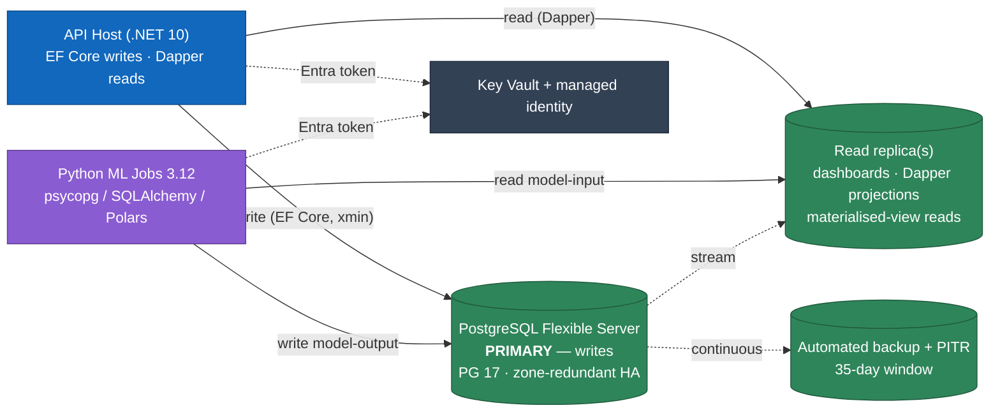

# ADR 0003 — PostgreSQL as Operational Database

> Purpose: record why BeeEye's operational store is **Azure Database for PostgreSQL Flexible Server**, and how the relational, time-series, and immutable-derived shape of the [canonical data model](../architecture/canonical-data-model.md) drives the physical design (access strategy, identifiers, partitioning, indexing, concurrency, constraints) while staying portably close to Azure SQL.

| Field | Value |
|-------|-------|
| Status | **Accepted** |
| Date | 2026-07-22 |
| Deciders | BeeEye platform architecture |
| Scope | Operational persistence for the .NET 10 modular-monolith API host and the Python ML tier |
| Supersedes | — |
| Related | [Architecture Overview](../architecture/overview.md) · [Canonical Data Model](../architecture/canonical-data-model.md) |

---

## Context

BeeEye is a production-grade AI decision-intelligence platform deployed **into ADMC's own Azure
tenant**, productionising the "Meridian BI" POC. It needs one operational database that serves both the
transactional workload of the ASP.NET Core host (~19 bounded-context modules) and the read-heavy
analytical workload behind the dashboards, while the Python ML tier reads model-input and writes
model-output through the same store.

The data shape is not incidental — it is decided by the canonical model and is emphatically
**relational**:

- **Deeply relational, integrity-bound.** Sales and inventory share one vehicle taxonomy and join on
  `location + model + variant`; every derived record references the exact `StockUnit`, `ForecastRun`,
  or `Prediction` it came from. Referential integrity, SCD-2 dimensions, and multi-table joins are the
  norm, not the exception.
- **Time-series facts that grow.** `SalesFact` is monthly (3,120 rows today, Jan 2022 – Apr 2026) and
  grows every period; the future-state After-Sales and Spare-Parts clusters add higher-volume event
  streams. Derived tables (`Prediction`, `RiskScore`, `FeatureValue`, `AuditEvent`) accrete on every
  analysis re-run.
- **Immutable, versioned outputs.** Predictions, risk scores, recommendations and narratives are never
  edited — a re-run inserts a new row and flips the prior `is_current`/`superseded_by`. Reads are
  overwhelmingly filtered to "the current one".
- **Money and time have hard rules.** Money is `decimal(18,2)` + explicit `currency` (SAR) — **never**
  float; audit timestamps are UTC `timestamptz`; business dates stay `date`; the inventory **Analysis
  Date** is an explicit pinned context, never the wall clock (see
  [ASSUMPTIONS_LIMITATIONS](../wireframes/docs/ASSUMPTIONS_LIMITATIONS.md)).
- **Precomputed, cached serving.** Per the non-functional budgets, dashboards are served from
  precomputed rollups; the request path does **not** fit models or run heavy aggregation synchronously.

The store must therefore enforce integrity at the database (last line of defence), express time-series
partitioning cleanly, make "current row" lookups cheap, and precompute aggregate rollups — all inside
ADMC's tenant with managed HA/DR. It must also keep an Azure SQL exit viable without collapsing the
design to a lowest-common-denominator schema.

---

## Decision

### 1. Database service — Azure Database for PostgreSQL Flexible Server (PG 17)

Adopt **Azure Database for PostgreSQL Flexible Server**, PostgreSQL 17, as the single operational store
for the curated business model, metrics, predictions, decisions, and audit state (as already fixed in
the [Architecture Overview](../architecture/overview.md) container view).

| Concern | Decision |
|---------|----------|
| SKU / tier | General Purpose (burstable in dev/test), **zone-redundant HA** in prod |
| Networking | Private access (VNet-integrated, no public endpoint); TLS 1.2+ enforced |
| Backups / DR | Automated backups, **PITR** (35-day window); geo-redundant backup in prod |
| Read scale | One or more **read replicas** carry analytical/dashboard read traffic |
| Auth | **Microsoft Entra ID** authentication to the DB via **managed identity** — no passwords in code or images; secrets/connection metadata in Key Vault. *Current scaffold deviates: password auth via a pipeline-supplied secret — see [tech-debt TD-2](../architecture/tech-debt.md)* |
| Encryption | At rest (platform-managed, CMK optional via Key Vault) and in transit |
| Pooling | Built-in PgBouncer connection pooling to absorb Container Apps scale-out |



### 2. Access strategy — EF Core for transactional writes, Dapper for analytical reads

Split by workload character, not by dogma:

- **EF Core 10, one `DbContext` per bounded context** for all transactional writes, migrations,
  change-tracking, and optimistic concurrency. Each context maps to its **own PostgreSQL schema**;
  cross-module reach-through into another module's tables is prohibited (the modular-monolith boundary
  is enforced physically by schema separation and least-privilege grants).
- **Dapper for read projections and analytical queries** — the metric-heavy dashboard endpoints,
  aging rollups, and forecast-accuracy grids — where hand-tuned SQL over materialised views and
  partitioned facts beats an ORM's generated plans, and where read models deliberately don't match the
  write aggregates. These run against the **read replica**.

This keeps writes safe and evolvable (migrations, concurrency tokens, invariants in the domain) while
reads stay fast and explicit. All Dapper SQL lives behind a repository seam so the physical schema and
any provider-specific SQL are isolated from the domain (this also bounds the portability surface — see
§10).

### 3. Identifiers — sortable UUIDv7 surrogate keys, source natural keys preserved

Internal PKs are `uuid`, matching the canonical model. To avoid the index write-amplification and
B-tree fragmentation that random UUIDv4 keys cause on high-insert tables (facts, predictions, audit),
BeeEye uses **time-ordered UUIDv7** generated application-side with `Guid.CreateVersion7()` (.NET 10 /
C# 14). UUIDv7 embeds a millisecond timestamp, so freshly inserted rows cluster at the right of the
index — near-sequential locality with global uniqueness and no central sequence bottleneck.

Every entity originating in a source system additionally keeps its **source natural key** (`stock_id`,
`chassis_no`, `source_row_ref`) and lineage columns; these are never discarded and carry their own
`UNIQUE` constraints. Surrogate `uuid` for joins and stability; natural key for lineage and
reconciliation back to Oracle Fusion.

### 4. Partitioning — declarative range partitions for time-series and append-only tables

Tables that grow with time or with analysis re-runs use **PostgreSQL declarative range partitioning**;
maintenance (create-ahead, retention drops) is automated with **pg_partman** run from a Container Apps
Job.

| Table | Partition key | Strategy | Rationale |
|-------|---------------|----------|-----------|
| `sales_fact` | `sale_date` | RANGE, yearly | Monthly grain, ever-growing; partition-pruning for period queries |
| `prediction` | `created_at_utc` | RANGE, monthly | High churn on re-runs; prune to current, drop cold |
| `risk_score` | `created_at_utc` (via `analysis_context`) | RANGE, monthly | Re-scored per analysis run; supersession churn |
| `feature_value` | `analysis_context` window | RANGE, monthly | One set per run, rarely read after supersession |
| `audit_event` | `at_utc` | RANGE, monthly | Append-only; retention by dropping whole partitions |
| `service_event`, `spare_part_demand` *(future)* | `service_date` / `period` | RANGE, monthly | Higher-volume event streams |

Partition pruning keeps "current period" and "current analysis" queries touching only recent
partitions, and partition drops make retention a metadata operation rather than a mass `DELETE`.

### 5. Indexing — partial indexes for the current-row and hot-status access patterns

The immutable-supersession and SCD-2 patterns mean the vast majority of reads want **only the current
row**. Partial (filtered) indexes make those lookups small and hot:

```sql
-- Only ever query the live prediction for a subject
CREATE INDEX ix_prediction_current ON prediction (subject_ref, type)
    WHERE is_current;

-- SCD-2 current dimension rows
CREATE INDEX ix_location_current ON location (source_location_code)
    WHERE is_current;
CREATE INDEX ix_configuration_current ON configuration (model_id, variant_id)
    WHERE is_current;

-- Open procurement work only
CREATE INDEX ix_order_proposal_open ON order_proposal (location_id, target_period)
    WHERE status = 'pending';

-- Stock that can still be actioned (not yet sold)
CREATE INDEX ix_stock_unit_active ON stock_unit (location_id, configuration_id)
    WHERE current_status <> 'sold';
```

Composite btree indexes back the canonical `location + model + variant` demand join and the FK columns;
JSONB payloads (SHAP values, hyperparameters, rationale/evidence) get GIN indexes only where actually
queried.

### 6. Materialised views — precomputed rollups for sub-second dashboards

Per the performance budgets, dashboard numbers are **precomputed**. Materialised views hold the
aggregate rollups that the SPA reads through Dapper:

| Materialised view | Serves | Sourced from |
|-------------------|--------|--------------|
| `mv_executive_kpis` | Executive Cockpit (UC8) — revenue, units, inventory value by region/period | `sales_fact`, `stock_unit` |
| `mv_inventory_aging` | Inventory Intelligence (UC5) — aging-band and risk-band counts per location/model | `risk_score`, `stock_unit`, current `analysis_context` |
| `mv_forecast_accuracy` | Sales Forecasting (UC2) — WMAPE/MAE/bias per method and cell | `backtest_result`, `forecast_run` |

Each MV has a `UNIQUE` index so it can be refreshed with `REFRESH MATERIALIZED VIEW CONCURRENTLY`
**off the request path**, triggered by ML-completion events on Service Bus (never synchronously). A
`last_refreshed_at_utc` is surfaced to the UI so staleness is explicit.

> **Boundary preserved.** Materialised views perform only deterministic SQL **aggregation** (SUM/AVG/
> COUNT) of numbers already computed by the deterministic engines. They do **not** compute forecasts,
> risk probabilities, quantities, or decisions — that remains the ML/engine tier's job, and GenAI still
> only narrates. This upholds the platform's determinism guardrail.

### 7. Optimistic concurrency — `xmin` tokens on mutable state

Human-editable and workflow state can be touched concurrently (two approvers, an analyst changing
settings mid-review). These entities carry an optimistic-concurrency token mapped in EF Core to
PostgreSQL's system column `xmin`:

```csharp
modelBuilder.Entity<ManagementDecision>()
    .Property<uint>("xmin").IsRowVersion().HasColumnName("xmin");
```

Applied to `ManagementDecision`, `ApprovalStep`, `OrderProposal` (status transitions), and `Setting`
(risk weights / thresholds / analysis date). A stale write raises `DbUpdateConcurrencyException` and is
surfaced as a 409 with a reload prompt. **Immutable derived records need no token** — they are
insert-only, so there is nothing to conflict on; correctness there comes from the supersession pattern,
not locking.

### 8. Database constraints — the last line of defence

Integrity is enforced in the schema, not left to application code alone:

| Constraint kind | Examples grounded in the data model |
|-----------------|-------------------------------------|
| `CHECK` (domains) | `discount_pct IN (0,5,10,15,20)`; `total_score BETWEEN 0 AND 100`; component contributions `>= 0`; `lead_time_days >= 0`; `purchase_price >= 0`; `holding_cost_per_day >= 0` |
| `CHECK` (money) | monetary columns `numeric(18,2)` with a non-null `currency`; float prohibited by type choice |
| Generated column | `risk_band` **STORED generated** from `total_score` (Low 0–34 · Med 35–59 · High 60–79 · Crit 80–100) so band can never disagree with score |
| `UNIQUE` | `stock_id`, `chassis_no`, `part_number`, `dataset_version` |
| `FOREIGN KEY` | `configuration_id`, `location_id`, `forecast_run_id`, `recommendation_id`, etc. |
| `NOT NULL` | keys, versions (`dataset_version`, `weights_version`), `currency`, timestamps |
| Exclusion (`btree_gist`) | SCD-2 no-overlap: one current validity interval per natural key on `location`/`configuration` |

Enum-like reference sets (brand, type, variant, colour, interior, status) resolve to lookup tables with
FKs rather than free text, so the vehicle taxonomy stays closed and joinable.

### 9. High availability, DR, and separation of concerns

Zone-redundant HA and PITR come from the managed service (§1). Analytical/dashboard reads and the ML
tier's model-input reads target **read replicas**, keeping heavy scans off the write primary. This gives
transactional/analytical separation **within one engine** — appropriate at this data scale (thousands
of sales rows, hundreds of units) without standing up a separate analytical warehouse; the ADLS Gen2
curated zone already carries the lakehouse/lineage concerns.

### 10. Portability stance — close to Azure SQL, but not lowest-common-denominator

BeeEye keeps an Azure SQL migration **viable and estimable**, but will **not** weaken the design to run
unchanged on both. Portability is protected structurally, not by feature avoidance:

- EF Core owns the write-side schema via migrations; domain code is provider-agnostic.
- Dapper SQL and any PG-specific DDL sit behind a repository/migration seam, so the blast radius of a
  port is bounded and known up front.
- Deliberately-used PostgreSQL features (partial indexes, declarative partitioning, materialised views,
  `xmin`, exclusion constraints, JSONB) are the ones that materially serve the immutable/versioned/
  time-series model. Each has a documented Azure SQL equivalent and migration cost:

| PG feature used | Why | Azure SQL equivalent | Port cost |
|-----------------|-----|----------------------|-----------|
| Partial indexes | Current-row / hot-status reads | Filtered indexes | Low (near 1:1) |
| Declarative range partitioning | Time-series facts + append-only churn | Partition function + scheme | Medium (rewrite DDL) |
| Materialised views (concurrent refresh) | Precomputed dashboards | Indexed views (more restrictive) or job-refreshed tables | Medium |
| `xmin` concurrency token | Free optimistic concurrency | `rowversion` column | Low (add column) |
| Exclusion constraint (btree_gist) | SCD-2 no-overlap | Trigger or filtered unique index | Medium–High (accepted) |
| JSONB + GIN | SHAP / hyperparameters / rationale | `nvarchar(max)` + JSON functions | Low–Medium |
| UUIDv7 PKs | Insert locality | App-side `Guid.CreateVersion7()` (already provider-neutral) | None |

The stance is explicit: **portable, not diluted.** We accept a bounded, catalogued migration cost in
exchange for a schema that fits the domain.

---

## Alternatives considered

### Rejected — Azure SQL Database as the default

The obvious pick for a .NET-centric team, with excellent EF Core support and low operational
friction. Rejected as the *default* because it offers no decisive advantage for this workload while
costing on the axes that matter here:

- **Feature fit.** PostgreSQL's partial indexes, mature declarative partitioning, materialised views,
  `xmin` concurrency, exclusion constraints, and first-class JSONB map cleanly onto the current-row,
  time-series, immutable-supersession, and flexible-payload patterns of the canonical model. Azure SQL
  can approximate each, but the fit is looser.
- **ML-tier interop.** The Python 3.12 tier reads/writes the same store via psycopg / SQLAlchemy /
  Polars, all of which treat PostgreSQL as a first-class citizen alongside the ADLS Gen2 lakehouse.
- **Licensing / cost / lock-in.** Open-source engine, no per-core SQL Server licensing, and a cleaner
  exit than a proprietary engine — relevant for a vendor product deployed into a customer's tenant.

Azure SQL remains the **designated fallback** (see §10), which is exactly why portability is protected —
but it is not the default.

### Rejected — Azure Cosmos DB

A globally-distributed, schemaless NoSQL store. Wrong shape for this domain:

- The model is **relational to its core** — FK integrity, the `location + model + variant` join, SCD-2
  dimensions, and immutable supersession chains would all have to be re-implemented in application code,
  losing the database as the last line of defence.
- Dashboards need **ad-hoc joins and aggregation** (rollups, WMAPE by method/cell); Cosmos's query model
  and RU-based cost make scan-and-aggregate workloads awkward and cost-unpredictable.
- We need **no** global multi-region write distribution or schemaless flexibility here — a single
  tenant-resident region with a strict, versioned schema is the requirement. Cosmos would add cost and
  complexity while removing guarantees we depend on.

### Considered and deferred — a separate analytical warehouse (Synapse / Fabric)

Overkill at this data scale. The ADLS Gen2 curated zone plus PostgreSQL read replicas and materialised
views cover analytical serving today. Revisit only if After-Sales / Spare-Parts volumes or cross-tenant
reporting outgrow a single-engine design.

---

## Consequences

**Positive**

- Database-enforced integrity for a deeply relational model; correctness does not depend solely on app
  code.
- Time-series partitioning and partial indexes fit the monthly facts, growing derived tables, and
  current-row read pattern natively — cheap reads, cheap retention.
- Materialised views deliver the precomputed, sub-second dashboards the NFRs demand, refreshed off the
  request path.
- `xmin` gives optimistic concurrency for the human-approval workflow essentially for free.
- Open-source engine with native Python/Polars interop for the ML tier and a cleaner vendor-exit story.

**Negative / risks (with mitigations)**

- *PostgreSQL operability in a .NET-centric team.* → Managed Flexible Server removes most day-2 ops;
  runbooks and IaC standardise the rest.
- *Partitioning + MV maintenance complexity.* → pg_partman automates partition lifecycle; MV refresh is
  a scheduled/event-driven Container Apps Job, not manual.
- *Some PG features raise Azure SQL migration cost.* → Accepted and **catalogued** (§10); portability is
  protected by the repository/migration seam, not by avoiding the features.
- *Connection churn under Container Apps scale-out.* → Built-in PgBouncer pooling.
- *Materialised-view staleness window.* → Event-driven `REFRESH … CONCURRENTLY` on ML completion, with
  `last_refreshed_at_utc` shown in the UI.

**Neutral**

- Confirms the container-view decision already recorded in the [Architecture Overview](../architecture/overview.md);
  this ADR supplies the design rationale and the physical-design commitments behind it.

---

## Traceability

| Related document | Relationship |
|------------------|--------------|
| [Architecture Overview](../architecture/overview.md) | Fixes PostgreSQL Flexible Server + EF Core in the container view; this ADR is the rationale and physical-design detail behind it. |
| [Canonical Data Model](../architecture/canonical-data-model.md) | The source-agnostic entities, keys, money/time rules, and immutability/versioning invariants this physical design realises. |
| [DATA_DICTIONARY](../wireframes/docs/DATA_DICTIONARY.md) | Field-level types and domains behind the `CHECK`/`UNIQUE` constraints (`discount_pct`, `stock_id`, `chassis_no`, money). |
| [METHODOLOGY](../wireframes/docs/METHODOLOGY.md) | Risk bands, aging bands, and the demand-fallback tier persisted alongside derived records. |
| [ASSUMPTIONS_LIMITATIONS](../wireframes/docs/ASSUMPTIONS_LIMITATIONS.md) | The explicit Analysis-Date and `service_date`-excluded assumptions the schema honours. |
| [INTEGRATION_AZURE_ORACLE](../wireframes/docs/INTEGRATION_AZURE_ORACLE.md) | Oracle Fusion read-only ingestion and lineage feeding the operational store. |
| `../architecture/data-platform-and-storage.md` *(sibling)* | Physical schema, ADLS Gen2 zones, and the full DDL realisation referenced by the canonical model. |
| Other ADRs in `docs/adr/` | Prior/subsequent decisions (architecture style, data access, integration) that this database choice depends on and complements. |
