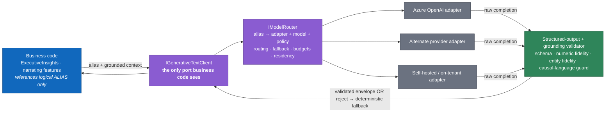
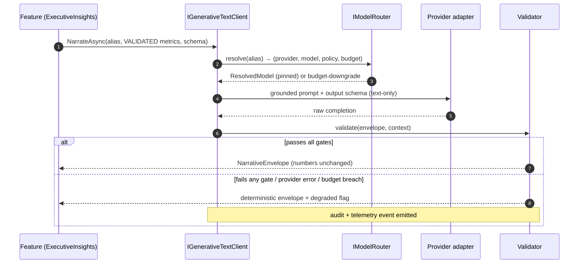

# ADR 0004 — Provider-Neutral AI Abstraction

> Purpose: mandate that BeeEye reach generative-AI providers only through logical model aliases, provider adapters, and a router — with strict structured-output validation — so the platform stays portable, governed, cost-controlled, and safe (GenAI narrates validated metrics but never computes business values).

| | |
|---|---|
| **Status** | Accepted — target architecture (July 2026 baseline) |
| **Deciders** | Platform architecture, ML/AI, Security & governance |
| **Scope** | All generative-AI usage across BeeEye (ExecutiveInsights and any narrating feature) |
| **Supersedes** | The POC's implicit single-provider assumption ("Azure OpenAI, grounded natural-language insights") in the [integration blueprint](../wireframes/docs/INTEGRATION_AZURE_ORACLE.md) |

---

## Context

The POC ("Meridian BI") proved the analytics with a **deterministic, framework-free** insight layer:
`engine.js` (`execInsights`, `answer`, `resp`) computes every metric and returns a fixed envelope —
`answer`, `findings[]`, `metrics[]`, `actions[]`, `targets[]`, `confidence` — with **no LLM in the loop**.
The [methodology](../wireframes/docs/METHODOLOGY.md#ai-grounding) already fixes the grounding contract for
production: the AI layer "only uses metrics computed by the engine, states when data is unavailable or a
fallback was used, avoids causal claims and production-grade validation claims, and never implies the
sample data is live Oracle Fusion data." Live mode "receives a compact aggregated context and must preserve
the engine's numbers."

The production platform ("BeeEye", .NET namespace root `BeeEye`) introduces real generative AI to *narrate*
those validated results (executive summaries, forecast/risk explanations, natural-language Q&A over already
-computed metrics). Deployed into ADMC's own Azure tenant, the obvious first provider is Azure OpenAI (Azure
AI Foundry). That obviousness is the trap: it invites feature code to call a provider SDK directly and pin a
concrete deployment/model id (`gpt-4o-2024-…`, a deployment name) inline.

Doing so creates four problems the rest of the architecture is explicitly built to avoid:

1. **Provider lock-in.** Model ids, request shapes, token accounting, and safety knobs leak into ~19
   bounded-context modules. Switching providers, regions, or model generations becomes a cross-cutting rewrite.
2. **Weak governance.** No single place to enforce data-residency, PII-aware logging, allowed-model policy,
   prompt/version pinning, or the determinism guardrail. Grounding validation gets reimplemented per feature.
3. **No cost control.** Spend is invisible and unbudgeted; a chatty screen can silently escalate cost with
   no per-use-case ceiling, quota, or downgrade path.
4. **Safety erosion.** With direct SDK access, nothing structurally stops a call from asking the model to
   *compute* a forecast, risk score, monetary value, quantity, or decision — violating the platform-wide
   **determinism-first** guardrail in the [architecture overview](../architecture/overview.md#8-cross-cutting-guardrails).

BeeEye is decision-intelligence for ADMC (SAR currency, automotive distribution). Numbers drive procurement,
transfers, discounts, and executive decisions. The AI must be **additive, never authoritative**.

---

## Decision

All generative-AI access flows through a **shared platform capability** (`BeeEye.Ai`) — a cross-cutting
component, not a bounded context — consumed by ExecutiveInsights and any narrating feature. Business code
never references a provider SDK type or a concrete model id. The capability has three seams plus two
non-negotiable guarantees.



### 1. Logical model aliases

Business code requests a **logical alias** describing *intent and quality tier*, never a vendor model.
The alias catalog is configuration owned by PlatformAdministration; each alias resolves to a concrete
provider+model at runtime through the router.

| Alias | Intended use | Quality tier | Temperature | Notes |
|-------|--------------|--------------|-------------|-------|
| `narrative.executive` | Executive Cockpit summaries (UC8) | Quality-first | Low (~0.2) | Highest-stakes prose; strictest validation |
| `narrative.analyst` | Forecast & risk explanations (UC2, UC5) | Balanced | Low | Explains method comparison, WMAPE, risk breakdown |
| `narrative.long-context` | Large aggregated context (multi-location roll-ups) | Long-context | Low | Routed to a large-context model |
| `narrative.economy` | High-volume tooltips / short captions | Economy | Low | Cheapest model; hard cost ceiling |
| `classify.intent` | Natural-language Q&A intent routing (POC `answer()` dispatch) | Fast/cheap | 0 | Maps question → deterministic handler; returns a label, not prose |
| `embed.default` | Semantic search over the metrics/doc catalog (optional) | — | — | Embeddings only; never generative |

Adding, retiring, or re-pointing an alias is a config + review action — **no business-code change**.

### 2. Provider adapters

Each provider sits behind one adapter implementing a common port. Adapters own SDK specifics, request/response
translation, token accounting, timeout/retry, and provider-side safety settings. The rest of the platform is
adapter-agnostic.

```csharp
// Shared port — the ONLY generative surface business code may use.
public interface IGenerativeTextClient
{
    Task<NarrativeEnvelope> NarrateAsync(
        ModelAlias alias,          // e.g. "narrative.executive" — never a model id
        GroundedContext context,   // validated metrics + entities, read-only
        NarrationRequest request,  // template id, task, output schema
        CancellationToken ct);
}

// Per-provider translation — never referenced outside the BeeEye.Ai capability.
internal interface IGenerativeProviderAdapter
{
    ProviderId Provider { get; }
    Task<RawCompletion> CompleteAsync(ResolvedModel model, ProviderRequest req, CancellationToken ct);
}
```

Adapters are registered by DI; a **fake in-memory adapter** ships for tests, so feature/domain tests run with
zero provider calls and deterministic output.

### 3. Router & routing policy

`IModelRouter` resolves an alias to a concrete `(provider, model, parameters)` using declarative policy, and
owns **fallback, budgets, and residency**. Policy is configuration (Key Vault + app config), reloadable
without redeploy.

| Policy dimension | Behaviour |
|------------------|-----------|
| Primary / fallback chain | Ordered provider list per alias; on error, timeout, content-filter block, or quota exhaustion, fail over to the next entry, then to a deterministic-only response |
| Cost budget | Per-alias and per-use-case monthly SAR ceiling; on breach the alias auto-downgrades (e.g. `executive` → `economy`) or disables narration, returning the deterministic envelope |
| Rate / quota | Token & request-per-minute caps per alias; back-pressure surfaced as graceful degradation, not user error |
| Data residency | Only tenant-resident / approved endpoints eligible; cross-region providers excluded by policy so no ADMC data leaves the approved region |
| Determinism guard | Aliases are **text-generation only**; provider tool/function-calling that could trigger computation is disabled at the router |
| Model pinning | Alias resolves to a **pinned** model+version; migration is an explicit, reviewed config change with an eval gate |

### 4. Strict structured outputs

Every generative call declares an **output schema** and returns a typed `NarrativeEnvelope` — the production
analogue of the POC `resp()` shape. The response is validated **before** it reaches business code; validation
is the same regardless of provider.

`NarrativeEnvelope` (schema-validated, Zod on the SPA boundary / equivalent contract server-side):

| Field | Type | Rule |
|-------|------|------|
| `answer` | string | Prose narration; every number/entity in it must originate from `context` |
| `findings` | string[] | Bullet observations; same fidelity rule |
| `metrics` | `{k,v}[]` | Echoed **verbatim** from the validated context — the model may select, never recompute |
| `confidence` | `Low\|Medium\|High` | Must equal the deterministic layer's confidence for the underlying result |
| `caveats` | string[] | Fallback/sparsity notes preserved from the engine |
| `citations` | string[] | Keys of the validated metrics the narrative used |

Validation gate (fail → **reject narrative, return deterministic result alone**, emit audit + telemetry):

1. **Schema conformance** — shape and types match the declared contract.
2. **Numeric fidelity** — every numeric token in `answer`/`findings` matches a value present in `context`
   (exact, at the engine's rounding); no invented or altered numbers.
3. **Entity fidelity** — every location / model / variant named exists in `context`.
4. **Causal-language guard** — reject disallowed causal verbs; enforce "associated with", not "caused by"
   (per the methodology's explanation rules).
5. **Claim guard** — reject production-validation claims and any implication that sample data is live Oracle
   Fusion data.

This is exactly the check the overview's [forecast-to-narration flow](../architecture/overview.md#5-representative-flow--forecast-to-narrated-insight)
prescribes: "If structured-output validation detects the model altering or inventing a number, the narrative
is rejected and the deterministic result is returned on its own."

### 5. Guarantee — GenAI never computes business values

Forecasts, risk scores/probabilities, monetary values (SAR), quantities, and decisions are produced **only**
by the deterministic engines (Forecasting, Inventory risk, Recommendations — ported from `engine.js`) and the
Python ML jobs. The GenAI capability receives those results as **read-only, already-validated** context and
produces prose. This is enforced structurally, not by prompt wording alone:

- The port accepts a `GroundedContext` of validated metrics; it exposes no path to raw data or compute.
- The router disables tool/function-calling that could reach data or perform calculation.
- The validation gate rejects any output whose numbers or entities are not already in the context.



---

## Consequences

**Positive**

- **Portability.** Provider/region/model changes are config in one capability; the ~19 modules are untouched.
- **Governance in one place.** Residency, PII-aware logging, allowed-model policy, prompt/version pinning, and
  the determinism guard live behind a single seam and are audited uniformly (Audit context, App Insights).
- **Cost control.** Per-alias/per-use-case SAR budgets, quotas, and automatic downgrade make spend visible and
  bounded; economy aliases carry hard ceilings.
- **Safety by construction.** The narrate-never-compute guarantee is structural (port shape + router + validator),
  not a hopeful instruction in a prompt.
- **Testability.** The fake adapter makes domain/feature tests deterministic and provider-free; grounding
  validation is unit-testable against fixtures.
- **Continuity with the POC.** `NarrativeEnvelope` mirrors the proven `resp()` contract, so the deterministic
  fallback is always a first-class, shippable answer.

**Negative / costs**

- An extra abstraction layer to build and maintain (port, router, adapters, alias catalog, validator).
- Adapters must track provider SDK and API drift.
- The grounding validator adds latency and must be kept in lockstep with the engines' rounding/format.
- Alias catalog and routing policy need ownership and change discipline (PlatformAdministration).

**Neutral**

- Providers become interchangeable commodities; model selection is an operational, reviewable decision rather
  than a code-level one.

---

## Alternatives Considered (Rejected)

| # | Option | Why rejected |
|---|--------|--------------|
| 1 | **Hard-code Azure OpenAI model ids / deployment names in business code** (the naive default) | Provider lock-in; secrets and model strings scattered across ~19 modules; no central cost/residency governance; painful model migration; grounding re-implemented per feature; couples domain tests to a live provider. This is the anti-pattern the ADR exists to forbid. |
| 2 | **One global model constant / single provider client, no aliases** | Removes per-use-case quality tiering, budgets, and fallback; a single model change is still global and blunt; no downgrade path under cost pressure. |
| 3 | **Direct provider SDK calls per feature with a shared helper** | Helper does not stop features from bypassing it; no structural determinism guard; inconsistent validation and telemetry. |
| 4 | **Let GenAI compute/aggregate via tool- or function-calling to data** | Directly violates the determinism-first guardrail; makes numbers non-reproducible and unauditable; unacceptable for procurement/executive decisions. |
| 5 | **Adopt a heavy third-party orchestration framework as the primary seam** | More dependency surface and less control over the exact grounding/validation contract than a thin, owned abstraction; may be used *inside* an adapter if ever justified, but not as the platform boundary. |

---

## Compliance & Enforcement

- **Architecture tests** fail the build if any provider SDK type is referenced outside the `BeeEye.Ai`
  capability, or if a model-id string literal appears in a business module.
- **No secrets in code.** Provider credentials live in Key Vault, accessed via managed identity (per the
  overview's security controls); adapters read them at runtime only.
- **Determinism guard test.** Contract tests assert the port exposes no compute/data path and that the router
  disables computational tool-calling.
- **Grounding eval gate.** A red-team/eval fixture suite (numeric-fidelity, entity-fidelity, causal-language,
  claim guard) runs in CI; regressions block release and block model-migration config changes.
- **Auditability.** Every generative call logs alias, resolved model+version, budget state, validation outcome,
  and a PII-aware record of prompt/response to the Audit context and App Insights.

---

## Traceability

This ADR realises the "provider-neutral GenAI & grounding" commitment in the architecture map and inherits the
grounding contract proven in the POC.

- Architecture map & determinism guardrails → [../architecture/overview.md](../architecture/overview.md)
- Provider-neutral GenAI & grounding (detailed design) → [../architecture/ai-provider-abstraction.md](../architecture/ai-provider-abstraction.md)
- AI grounding rules & explanation constraints → [../wireframes/docs/METHODOLOGY.md](../wireframes/docs/METHODOLOGY.md#ai-grounding)
- Integration blueprint (POC "Azure OpenAI, strict grounding") → [../wireframes/docs/INTEGRATION_AZURE_ORACLE.md](../wireframes/docs/INTEGRATION_AZURE_ORACLE.md)
- Assumptions & limitations (decision-support, human approval) → [../wireframes/docs/ASSUMPTIONS_LIMITATIONS.md](../wireframes/docs/ASSUMPTIONS_LIMITATIONS.md)
- Deterministic insight engine ported from → [../wireframes/engine.js](../wireframes/engine.js) (`execInsights`, `answer`, `resp`)

Related ADRs in this series cover the modular-monolith host, the Oracle Fusion read-only anti-corruption layer,
and the ML platform & model lifecycle; this ADR governs only the generative-AI seam.
