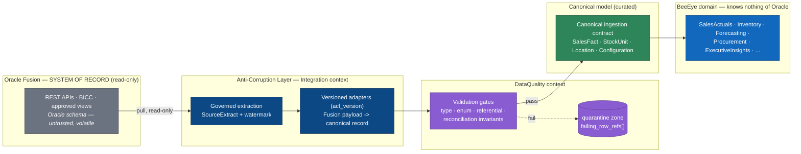

# ADR 0005 — Oracle Fusion Anti-Corruption Layer

> Why BeeEye reads Oracle Fusion **only** through a read-only, versioned anti-corruption layer that maps an untrusted external schema into BeeEye's canonical ingestion contract — and never lets Oracle's shape reach the domain.

| Field | Value |
|-------|-------|
| **Status** | Accepted |
| **Date** | 2026-07-22 |
| **Deciders** | Platform architecture, Integration lead, Data governance |
| **Context tags** | integration · data-quality · lineage · read-only · system-of-record |
| **Owning contexts** | `Integration`, `DataQuality` (produces records for every downstream context) |
| **Supersedes / relates** | Elaborates the read-only guardrail asserted in [architecture/overview.md](../architecture/overview.md) §1, §7 and the Platform-Operations cluster in [architecture/canonical-data-model.md](../architecture/canonical-data-model.md) (Cluster 9). |

---

## 1. Context

Oracle Fusion is ADMC's **system of record** for ERP, sales, inventory, finance and after-sales. BeeEye
is a decision-intelligence platform deployed into ADMC's own Azure tenant; it consumes Fusion data to
compute forecasts, inventory risk, procurement proposals and executive insights. Three forces shape how
that consumption must be designed:

**1.1 Fusion is authoritative and BeeEye is a consumer, not a co-owner.** BeeEye must never mutate the
system of record. Recommendations require human approval and are actioned in the source systems by
people, through Fusion's own workflows — never by an automated write-back from BeeEye. The integration
is therefore intrinsically **one-directional and read-only**.

**1.2 The source schema is volatile, vendor-controlled, and not ours to shape.** Oracle Fusion's
physical tables, BICC view definitions, and REST payloads evolve on Oracle's release cadence and ADMC's
configuration choices, not on BeeEye's. They carry Fusion-specific concerns — flexfields, effective-date
semantics, internal surrogate keys, denormalised reporting views — that are meaningless inside BeeEye's
bounded contexts. If those shapes leaked into domain code, a Fusion patch or a re-configured extract
could ripple into `Forecasting`, `Inventory`, `Procurement`, and every other module.

**1.3 The source data is not clean, and its semantics are not all confirmed.** The POC data set
(3,120 sales rows, 291 inventory units — see [DATA_DICTIONARY](../wireframes/docs/DATA_DICTIONARY.md))
already exhibits exactly the hazards a real Fusion feed will present:

| Hazard observed in source data | Why the domain must not trust it raw |
|--------------------------------|--------------------------------------|
| `is_ramadan` and `discount_applied` arrive as free-text `"True"/"False"`, `"Yes"/"No"`. | A business flag must be *resolved deterministically* (BeeEye derives `is_ramadan` from a `SeasonalPeriod` calendar), not trusted from a source string. |
| `service_date` has **unconfirmed business meaning**. | It is displayed but **excluded from risk scoring** ([ASSUMPTIONS_LIMITATIONS](../wireframes/docs/ASSUMPTIONS_LIMITATIONS.md)); the ACL must carry it without letting it silently feed a computation. |
| Dates originate as **Excel serials**, normalised to ISO. | Type coercion and timezone anchoring (`Asia/Riyadh`) is a translation concern, not a domain concern. |
| `revenue` must reconcile to `units × price × (1 − discount%/100)`; `lead_time_days` to `purchase − manufacture`. | These invariants must be **validated at the boundary**, and violations quarantined, before any curated figure is trusted. |
| `Mecca` appears in sales but **holds no inventory** (14 vs 15 locations). | Cardinality quirks must be handled explicitly at ingestion, not discovered as null-reference bugs downstream. |
| `discount_pct` is an enumerated set (0/5/10/15/20); `model`/`variant`/`brand` are controlled vocabularies. | Values outside the known domain must be caught and quarantined, not persisted as silent corruption. |

Given these forces, coupling BeeEye's domain to Oracle's schema — or querying Fusion live on the request
path — would trade the platform's determinism, testability and auditability for fragility. This ADR
records the decision to interpose an **anti-corruption layer (ACL)**.

---

## 2. Decision

**BeeEye integrates with Oracle Fusion exclusively through a read-only, versioned anti-corruption layer,
owned by the `Integration` bounded context, that translates governed source extracts into BeeEye's
canonical ingestion contract. No domain code ever references an Oracle schema, type, or identifier
directly. The source is treated as untrusted input until it has passed `DataQuality` gates.**

Concretely:

1. **Read-only, governed extraction.** Fusion is reached only via approved, governed channels — Fusion
   REST APIs, BICC extracts, or ADMC-approved views — pulled on a schedule (Azure Data Factory / Container
   Apps Jobs). BeeEye holds no write credentials to Fusion. Each pull is recorded as a `SourceExtract`
   (`extract_id`, `source_system`, `source_object`, `acl_version`, `extracted_at_utc`, `source_watermark`).

2. **Versioned adapters, one per source object.** Each Fusion source object is handled by a named,
   independently **versioned adapter** stamped with an `acl_version`. An adapter is a pure translation
   unit: *Fusion payload → canonical ingestion record*. When Oracle changes a payload, we ship a **new
   adapter version** side-by-side; we never edit history and never break the canonical contract.

3. **Canonical ingestion contract as the only crossing point.** Adapters emit records conforming to
   BeeEye's canonical vocabulary (see [canonical-data-model.md](../architecture/canonical-data-model.md)) —
   `SalesFact`, `StockUnit`, `Location`, `Configuration`, etc. — **not** Oracle rows. Downstream contexts
   subscribe to the canonical contract and know nothing of Fusion.

4. **Source treated as untrusted → validated → curated or quarantined.** Every ingested record flows
   through `DataQuality` rules (type/enum conformance, referential presence, the reconciliation
   invariants of §1.3). Passing rows land in the **validated** then **curated** ADLS zones; failing rows
   route to **quarantine** with `failing_row_refs[]` and are never silently dropped or zero-filled.

5. **Lineage preserved end-to-end.** Every canonical record keeps its **source natural key**
   (`stock_id`, `chassis_no`), `source_row_ref`, and lineage columns (`source_system`, `extract_id`,
   `extracted_at_utc`, `acl_version`). Any curated figure traces back through the ADLS zones to the exact
   originating Fusion extract.

6. **No live coupling on the request path.** BeeEye reads its own curated PostgreSQL model and ADLS
   zones. It does **not** issue synchronous queries to Fusion to serve a user request.

### 2.1 The layered boundary



### 2.2 The canonical ingestion contract (shape, not physical schema)

Every adapter, regardless of Fusion source object, emits envelopes of the same shape. The **envelope** is
BeeEye's; the **payload** conforms to a canonical entity. Nothing Oracle-specific crosses this line.

| Envelope field | Purpose |
|----------------|---------|
| `extract_id`, `source_system`, `source_object` | Which governed pull this record came from. |
| `acl_version` | The exact adapter version that produced this record — pinned for reproducibility. |
| `source_natural_key` | Fusion's own key (`stock_id`, `chassis_no`) — retained, never discarded. |
| `source_row_ref` | Pointer back to the originating source row for full lineage. |
| `extracted_at_utc`, `source_watermark` | When it was pulled and the incremental high-water mark. |
| `canonical_type` | The target canonical entity (`SalesFact`, `StockUnit`, `Location`, …). |
| `payload` | The canonical entity instance — validated against its Zod-equivalent contract. |

### 2.3 Adapter versioning

```mermaid
sequenceDiagram
    autonumber
    participant F as Oracle Fusion
    participant A1 as Adapter v1 (acl_version=sales.v1)
    participant A2 as Adapter v2 (acl_version=sales.v2)
    participant C as Canonical contract
    participant D as DataQuality

    Note over F,A2: Oracle changes the sales extract payload
    F->>A1: legacy payload
    A1->>C: canonical SalesFact (stamped sales.v1)
    Note over A2: New adapter version ships side-by-side
    F->>A2: new payload
    A2->>C: canonical SalesFact (stamped sales.v2)
    C->>D: validate (same gates for both)
    Note over C,D: Canonical contract unchanged; downstream unaffected.<br/>Historical records keep their original acl_version.
```

An `acl_version` bump is a first-class, audited event. It changes **only** how a source payload is
translated; it never rewrites already-ingested canonical records, which keep the `acl_version` that
produced them (mirroring the "version everything derived" cross-cutting rule of the canonical model).

---

## 3. Decision rules (invariants)

These are non-negotiable and are enforced in code review, tests, and architecture fitness checks.

| # | Rule |
|---|------|
| R1 | **No Oracle types in the domain.** No EF Core entity, DTO, or domain model maps to an Oracle table/view. Only the `Integration` module references anything Fusion-shaped. A dependency-direction test fails the build if a domain assembly references an adapter's source type. |
| R2 | **Read-only, always.** BeeEye holds no write/DDL credentials to Fusion. There is no code path that emits an `INSERT`/`UPDATE`/`DELETE`/stored-proc mutation to the source. |
| R3 | **Untrusted until validated.** No canonical record is considered curated until it passes `DataQuality` gates. Failures quarantine, never zero-fill, never silently coerce. |
| R4 | **Deterministic derivation, not source trust.** Business flags with ambiguous source encodings (`is_ramadan`) are resolved from BeeEye's own reference data, not copied from the source string. |
| R5 | **Lineage is mandatory.** Source natural keys and `source_row_ref` are preserved on every canonical record; a curated figure must be traceable to its `SourceExtract`. |
| R6 | **Versioned, additive adapters.** Source-shape changes ship as a new `acl_version`; the canonical contract is evolved only through additive, backward-compatible change. |
| R7 | **No synchronous Fusion calls on the request path.** User requests are served from the curated model; Fusion is reached only by scheduled/event-driven ingestion jobs. |
| R8 | **Explicit cardinality handling.** Known asymmetries (e.g. Mecca in sales but not inventory) are modelled at the boundary, not left to surface as downstream null errors. |

---

## 4. Consequences

### Positive
- **Domain stability.** Oracle release changes and extract re-configuration are absorbed by a versioned
  adapter; `Forecasting`, `Inventory`, `Procurement` and the rest are insulated.
- **Testability & determinism.** The domain runs against the canonical model with deterministic fixtures;
  no test needs a live Fusion connection. This preserves the platform's determinism-first guardrail.
- **Auditability & reproducibility.** `acl_version` + lineage columns make every curated number
  reproducible and every ingested row traceable — a precondition for the human-approval workflow and the
  immutable audit trail.
- **Data-quality containment.** Bad source rows are caught and quarantined at the boundary rather than
  corrupting curated metrics or forecasts.
- **Clean future extraction.** Because the seam is explicit, an adapter can later target a different
  source (or a new Fusion module) without touching the domain.

### Negative / costs
- **Translation cost.** Each source object needs a maintained adapter and a mapping to canonical
  entities; new Fusion objects are not "free".
- **Ingestion latency.** Read-only, scheduled ingestion means BeeEye reflects Fusion **as of the last
  extract**, not to-the-second. This is acceptable for monthly-grain analytics and is made explicit via
  `extracted_at_utc` / `source_watermark`; it is a deliberate trade against live coupling.
- **Duplication of shape.** The canonical model restates concepts that also exist in Fusion. This is the
  intended price of decoupling — the canonical model is source-agnostic by design.

### Neutral
- Mapping tables and `acl_version` history grow over time; they are cheap, append-only metadata.

---

## 5. Alternatives considered and rejected

### 5.1 Direct schema coupling — **Rejected**
*Map BeeEye's EF Core entities (or shared database views) directly onto Oracle Fusion tables, so the
domain reads Fusion's shape.*

- **Rejected because** it welds domain logic to a vendor-controlled, volatile schema (§1.2). A Fusion
  patch, a flexfield change, or a re-pointed view would ripple straight into `Forecasting`/`Inventory`
  code. It forfeits deterministic, offline testing; it makes lineage and quarantine impossible to express
  cleanly; and it invites accidental write-back. It fundamentally violates R1 and R2.

### 5.2 Live queries against Fusion on the request path — **Rejected**
*Serve user requests by querying Fusion synchronously (read-through), skipping a curated store.*

- **Rejected because** it couples BeeEye's availability and latency to Fusion, pushes load onto the
  system of record, and makes the analytics **non-reproducible** (the same request returns different
  numbers as source data shifts mid-session). It defeats the performance budgets — forecasts and risk are
  served from precomputed, cached results, not computed live (see
  [overview.md](../architecture/overview.md) §7). It cannot enforce data-quality gating or quarantine
  before the number reaches the user. Violates R3 and R7.

### 5.3 Trust the source, skip validation — **Rejected**
*Ingest Fusion extracts as-is into the curated model without `DataQuality` gates.*

- **Rejected because** the real data already demonstrates un-trustworthy encodings and unconfirmed
  semantics (§1.3: free-text flags, `service_date`, reconciliation invariants). Trusting them raw would
  silently corrupt forecasts, risk scores and the ~SAR 46.75M capital figures. Validation-and-quarantine
  is mandatory (R3).

### 5.4 Canonical model owned by the source system — **Rejected**
*Let Oracle's data model *be* the canonical model; adapters only rename fields.*

- **Rejected because** it makes Oracle the arbiter of BeeEye's vocabulary. BeeEye's canonical model is
  deliberately **source-agnostic** so that After-Sales / Spare-Parts (future-state) and any non-Fusion
  source can conform to it. The canonical model is a conceptual contract BeeEye owns, not a mirror of a
  source schema.

### 5.5 Bi-directional sync / write-back to Fusion — **Rejected (out of scope by policy)**
*Push approved BeeEye recommendations back into Fusion automatically.*

- **Rejected because** BeeEye is a decision-support platform: recommendations require **human approval**
  and no automated write-back to enterprise systems is permitted (overview §1;
  [ASSUMPTIONS_LIMITATIONS](../wireframes/docs/ASSUMPTIONS_LIMITATIONS.md)). Read-only is a policy
  invariant, not merely a convenience.

---

## 6. Compliance & verification

| Mechanism | What it enforces |
|-----------|------------------|
| Architecture fitness test (dependency direction) | R1 — no domain assembly references Fusion-shaped types. |
| Credential/policy review | R2 — BeeEye's managed identity has read-only grants to the extraction surface only. |
| `DataQuality` rule suite + quarantine metrics | R3, R4, R8 — enum/type/referential/reconciliation gates; quarantine rate monitored. |
| Contract tests on the canonical envelope | R6 — adapters conform to the canonical ingestion contract; changes are additive. |
| Lineage assertions | R5 — every curated record resolves to a `SourceExtract`. |
| API tracing (OpenTelemetry) | R7 — no synchronous Fusion span appears on a user-request trace. |

---

## Traceability

| Related document | Relationship |
|------------------|--------------|
| [architecture/overview.md](../architecture/overview.md) | Asserts the read-only, versioned-ACL guardrail (§1, §7, §8) that this ADR elaborates. |
| [architecture/canonical-data-model.md](../architecture/canonical-data-model.md) | Defines `SourceExtract`, `DatasetVersion`, `DataQualityResult` and the canonical entities adapters emit (Cluster 9; cross-cutting rules 1–2). |
| [architecture/integration-oracle-fusion.md](../architecture/integration-oracle-fusion.md) | Detailed integration & ACL design that implements this decision *(planned sibling)*. |
| [wireframes/docs/INTEGRATION_AZURE_ORACLE.md](../wireframes/docs/INTEGRATION_AZURE_ORACLE.md) | POC future-state blueprint (governed extraction, validation on load, lineage preserved). |
| [wireframes/docs/DATA_DICTIONARY.md](../wireframes/docs/DATA_DICTIONARY.md) | Source field definitions and the reconciliation invariants validated at the boundary. |
| [wireframes/docs/ASSUMPTIONS_LIMITATIONS.md](../wireframes/docs/ASSUMPTIONS_LIMITATIONS.md) | `service_date` exclusion, "no live Fusion connection", "no write-back" — the assumptions this ADR formalises. |
