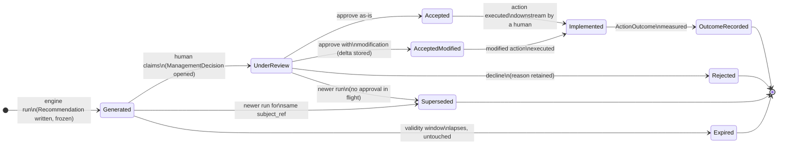
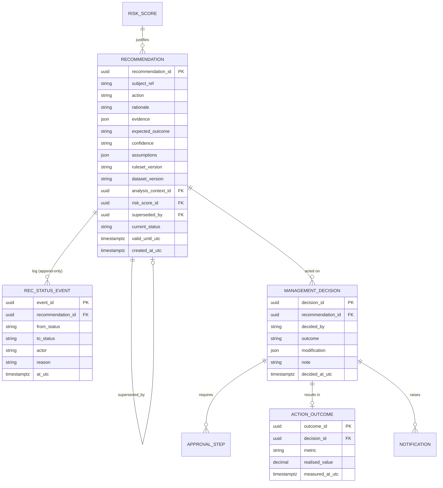

# ADR 0006 — Versioned Recommendations & Decision Workflow

> Purpose: fix how BeeEye persists a recommendation, moves it through a human decision loop, and records the realised outcome — without ever overwriting the original AI/rule-engine output.

| Field | Value |
|-------|-------|
| Status | Accepted |
| Date | 2026-07-22 |
| Deciders | Platform Architecture, Data Governance, ADMC Sales & Procurement leadership |
| Owning contexts | `Recommendations`, `DecisionsAndOutcomes`, `Notifications`, `Audit` |
| Applies to use cases | UC1, UC4 (order / procurement quantities), UC5 (aging & overstock actions), UC8 (executive cockpit) |
| Supersedes | POC behaviour — the "Meridian BI" prototype stored management actions only in browser `localStorage` |

---

## 1. Context & Problem

The POC ("Meridian BI") rules engine (`docs/wireframes/engine.js`, `recommend()`) emits one of seven
transparent, evidence-carrying actions per subject — **Retain · Transfer stock · Start targeted
promotion · Apply controlled discount (0–20%) · Pause/reduce procurement · Prioritise liquidation ·
Investigate demand data** — each with a `rationale`, `evidence[]`, `expected_outcome`, `confidence`
and `assumptions[]`. In the prototype those suggestions live only in `localStorage`, are recomputed on
every page load, and are lost the moment settings change or the tab closes
([ASSUMPTIONS_LIMITATIONS.md](../wireframes/docs/ASSUMPTIONS_LIMITATIONS.md)).

That is acceptable for a demo and unacceptable for production. In BeeEye a recommendation is the head
of a chain of consequential human decisions worth millions of SAR (inventory purchase value is
~SAR 46.75M across 291 units). We must be able to answer, months later and under audit:

- **What exactly did the system recommend, and on what basis?** (which ruleset, which dataset, which
  risk score, which analysis date).
- **Who reviewed it, what did they decide, and did they change it?**
- **What actually happened after the action was taken?**

A recommendation is therefore not transient UI text; it is a **business record** with legal,
governance and learning value. The problem this ADR settles is the *shape and lifecycle* of that
record.

### Decision drivers

| Driver | Why it matters here |
|--------|--------------------|
| **Auditability** | ADMC governance and internal audit must reconstruct any decision from an immutable trail; the [Audit context](../architecture/canonical-data-model.md) stores append-only `AuditEvent`s with before/after hashes. |
| **Explainability** | The platform's core promise is transparency (additive risk, rule rationale, no black box — [METHODOLOGY.md](../wireframes/docs/METHODOLOGY.md)). The stored recommendation must preserve the exact rationale/evidence shown to the human. |
| **IP & liability** | The rule/AI output and the *human* decision must be distinguishable. Liability for an action rests with the approver, not the algorithm; the vendor's recommendation logic is protected by `ruleset_version` provenance. |
| **Human-in-the-loop** | Recommendations are decision-support, never automated actions; BeeEye never writes back to Oracle Fusion (system of record, read-only). A human approval gate is mandatory before any downstream action ([overview.md](../architecture/overview.md), §7). |
| **Reproducibility** | Every derived record is stamped with the exact versions that produced it (`dataset_version`, `ruleset_version`, `weights_version`, `analysis_context_id`). |
| **Learning loop** | Realised outcomes must be captured to later assess whether recommendations were good — closing the loop back to model/ruleset evaluation. |

---

## 2. Decision

**Actionable recommendations are persisted as versioned, append-only business records and moved through
an explicit lifecycle state machine. The original engine output is frozen at generation and is never
mutated; the human's decision, any modification, and the realised outcome are stored as separate linked
records.**

Concretely:

1. **The original is immutable.** A `Recommendation` (see
   [canonical-data-model.md → Cluster 7](../architecture/canonical-data-model.md)) captures the engine
   output verbatim: `action`, `rationale`, `evidence`, `expected_outcome`, `confidence`, `assumptions`,
   plus the provenance stamps (`ruleset_version`, `dataset_version`, `weights_version`,
   `analysis_context_id`, and the `risk_score_id`/`forecast_run_id` that justified it). It is written
   once and never edited — like `Prediction`, it can only be *superseded*, never overwritten.

2. **The human action is a separate record.** A `ManagementDecision`
   ([Cluster 8](../architecture/canonical-data-model.md)) references the exact `recommendation_id` it
   acted on and records `decided_by`, `outcome`, `note`, `decided_at_utc`. Multi-step sign-off is
   modelled as `ApprovalStep` rows.

3. **A modification is captured as a delta, not an edit.** "Accepted with modification" (e.g. the
   analyst keeps a Transfer but changes the quantity, or trims a proposed discount from 15% to 10%)
   stores the *modified* action/parameters on the decision record. The original recommended values
   remain readable side-by-side.

4. **The outcome is recorded after the fact.** An `ActionOutcome` links to the decision and captures
   the realised `metric` / `realised_value` / `measured_at_utc`, closing the learning loop.

5. **Lifecycle status is a projection over an append-only status log**, never a mutable field that
   erases history. The current state is derived; every transition is an appended, audited event.

6. **The GenAI layer may narrate but never decide.** A grounded `AiNarrative` can describe a
   recommendation or a decision in natural language, but must never compute, alter, or author the
   action, quantity, value, or the accept/reject verdict (hard boundary from
   [overview.md](../architecture/overview.md) §8 and the canonical model's Cluster 7 note).

### What is a versioned record vs. ephemeral text

Not every rule evaluation deserves a heavyweight, audited lifecycle instance. The scoping rule:

| Engine output | Treatment |
|---------------|-----------|
| **Actionable** — Transfer, Targeted promotion, Controlled discount, Pause/reduce procurement, Prioritise liquidation, Investigate demand data | Persisted as a versioned `Recommendation` **and** instantiated as a decision-workflow lifecycle. Carries liability and requires a human verdict. |
| **Retain** ("No action required", empty `assumptions`) | Rendered as **ephemeral advisory text** on the dashboard. It asserts no action, creates no liability, and spawns no workflow. It is regenerated each analysis run and not carried forward. |

This is the *only* place ephemeral dashboard text is used — see the rejected alternative in §5.

---

## 3. Lifecycle State Machine

States, and the actor/entity that drives each transition:



| State | Trigger | Actor | Records written | Terminal? |
|-------|---------|-------|-----------------|-----------|
| **Generated** | `Recommendations` module runs the ruleset over a fresh `RiskScore` / `ForecastRun` | System | `Recommendation` (frozen) + status event | No |
| **Under Review** | Analyst/Exec opens the item to work it | Human | `ManagementDecision` (open) + `ApprovalStep`s | No |
| **Accepted** | Approver accepts the action unchanged | Human | Decision `outcome = accepted` | No (→ Implemented) |
| **Accepted with Modification** | Approver accepts but changes quantity/percentage/target | Human | Decision `outcome = accepted_modified` + modification delta | No (→ Implemented) |
| **Rejected** | Approver declines; reason mandatory | Human | Decision `outcome = rejected` + `note` | **Yes** |
| **Expired** | Validity window (tied to `target_period` / `analysis_context`) lapses before review | System (job) | Status event `expired` | **Yes** |
| **Superseded** | A later analysis run emits a fresh recommendation for the same `subject_ref` and no approval is in flight | System | `superseded_by` link on the old record | **Yes** |
| **Implemented** | The human confirms the action was executed in enterprise systems (BeeEye never writes back) | Human / Integration confirmation | Status event `implemented` | No (→ Outcome) |
| **Outcome Recorded** | Realised effect measured (e.g. sell-through, holding-cost avoided) | System / Human | `ActionOutcome` | **Yes** |

**Guards.**
- Expiry is **suspended once a record is Under Review** — a human owns it, so it will not silently
  expire mid-decision.
- Supersession is **blocked once an `ApprovalStep` is in flight**; the in-flight decision completes
  first, then the newer recommendation is offered separately. This prevents a race from erasing a
  decision a human is actively making.
- Every state-sensitive computation uses the explicit **Analysis Date** from the pinned
  `AnalysisContext`, never the wall-clock "now" (inherited POC guardrail).

---

## 4. Record Model — original, decision, outcome

The three-layer separation is the heart of this ADR: the **original** is frozen, the **human layer**
and the **outcome layer** are appended around it.



Notes on the additions to the canonical model:

- `Recommendation.current_status` is a **cached projection** of the `REC_STATUS_EVENT` log for query
  efficiency; the log is the source of truth. `valid_until_utc` drives the Expired transition.
- `REC_STATUS_EVENT` is the append-only lifecycle log (mirrors the `Audit` context's philosophy).
- `ManagementDecision.modification` (json) is the **delta** for "accepted with modification" — e.g.
  `{ "field": "proposed_qty", "from": 40, "to": 30 }` or `{ "field": "discount_pct", "from": 15,
  "to": 10 }`. The original recommendation is untouched.

### End-to-end example (a Transfer recommendation)

```mermaid
sequenceDiagram
    autonumber
    participant J as Recommendations job
    participant DB as PostgreSQL (curated)
    participant A as Analyst (SPA)
    participant AP as Approver
    participant O as Outcome job
    J->>DB: Write Recommendation "Transfer 40 × Patrol VX, Jeddah→Riyadh"\n(frozen; ruleset v3, weights v2)
    A->>DB: Open ManagementDecision (Under Review)
    A->>DB: Accept-with-modification (qty 40 → 30)\nmodification delta stored, original intact
    AP->>DB: ApprovalStep signed off → Accepted-Modified
    Note over DB: Human executes transfer in enterprise systems\n(BeeEye never writes to Oracle Fusion)
    AP->>DB: Mark Implemented
    O->>DB: ActionOutcome: holding cost avoided SAR X, measured_at
```

At every step the *original* "Transfer 40" recommendation with its rationale and evidence remains
readable next to the human's "30" decision and the realised outcome. Nothing is overwritten.

---

## 5. Considered Options

| Option | Summary | Verdict |
|--------|---------|---------|
| **A. Ephemeral dashboard text** | Recompute recommendations on every load and show them as transient UI text; persist nothing (the POC's behaviour). | **Rejected** |
| **B. Single mutable record** | One row per recommendation; the human "edits" it in place to accept/modify/reject; status is a mutable column. | **Rejected** |
| **C. Versioned, append-only record + lifecycle log** (this ADR) | Freeze the original; append decision, modification, outcome, and a status-event log; supersede rather than edit. | **Accepted** |

**Why A (ephemeral dashboard text) is rejected.** It destroys the audit trail the moment the page
reloads or settings change: there is no way to prove what the system recommended, who acted, or what
resulted. It collapses the crucial distinction between the *algorithm's* suggestion and the *human's*
binding decision — an IP and liability hazard. It also loses every rejected recommendation, so the
platform can never learn from "we were advised to discount and chose not to." Ephemeral text survives
in exactly one narrow, safe role: the non-actionable **Retain** advisory (§2), which asserts nothing
and binds no one.

**Why B (single mutable record) is rejected.** In-place edits overwrite the original engine output, so
the frozen "what did the AI actually say" record is lost the first time a human touches it. A mutable
status column has no history — you cannot see the order or authorship of transitions. It makes
"accepted with modification" indistinguishable from "the system recommended the modified value,"
directly undermining explainability and liability separation. Append-only (Option C) is the standard
remedy and aligns with how `Prediction` is already handled (`superseded_by`, `is_current`).

---

## 6. Consequences

### Positive

- **Full auditability.** Any decision reconstructs end-to-end: engine input versions → frozen
  recommendation → reviewer(s) → modification delta → realised outcome, all append-only and hashed in
  the `Audit` context.
- **Clean liability boundary.** The record proves a *named human* made the binding call; the algorithm
  only advised. The vendor's rule logic is traceable via `ruleset_version` without exposing it as the
  decision-maker.
- **Explainability preserved.** The exact rationale/evidence/assumptions shown to the approver are
  retained verbatim, matching the platform's transparency promise.
- **Learning loop closes.** `ActionOutcome` lets ADMC and BeeEye later evaluate recommendation quality
  (accepted vs rejected vs outcome), feeding ruleset and model review.
- **No record bloat from no-ops.** Retain suggestions stay ephemeral, so the ~291-unit monthly runs do
  not fill the store with "do nothing" rows.

### Negative / costs

- **More entities and storage** than a single mutable row: a status-event log per recommendation plus
  decision/approval/outcome records. Mitigated by the `current_status` projection for hot-path queries
  and by not persisting Retain no-ops.
- **Migration/status-log discipline.** All writers must go through the transition service (which
  validates guards and appends events); no direct status column updates are allowed.
- **Outcome capture is manual/partial.** Realised outcomes depend on downstream execution and later
  measurement; not every decision will have a clean `ActionOutcome`. Accepted as an honest limitation.

### Neutral

- Aligns the `Recommendations` and `DecisionsAndOutcomes` bounded contexts with the already-immutable
  `Prediction` pattern, so the platform has one consistent "derived records are versioned, never
  edited" philosophy.
- The productionised **Management Actions** screen (POC screen 5) becomes the UI surface for the
  Under Review → Accepted/Rejected transitions, replacing `localStorage`.

---

## 7. Compliance & Guardrail Notes

- **Read-only system of record.** Reaching Implemented never means BeeEye wrote to Oracle Fusion; a
  human executes the action in enterprise systems, then confirms. Integration may *read back*
  confirmation but never writes.
- **Discounts stay within observed bounds.** A "Controlled discount" recommendation and any modified
  discount must remain within the historically observed **0–20%** range
  ([METHODOLOGY.md](../wireframes/docs/METHODOLOGY.md)); the workflow validates this on accept.
- **Association, not causation.** `expected_outcome` text is preserved as written by the engine, which
  states associations ("historically moved more volume in discounted periods"), never causal claims.
- **GenAI narration is validated.** Any AI narrative attached to a recommendation or decision passes
  structured-output validation; if it alters a number or invents an action it is discarded and the
  deterministic record stands alone.

---

## Traceability

- Canonical entities (`Recommendation`, `ManagementDecision`, `ApprovalStep`, `ActionOutcome`,
  `AuditEvent`) and the "version everything derived" principle →
  [canonical-data-model.md](../architecture/canonical-data-model.md)
- Platform guardrails (human-in-the-loop, read-only Oracle Fusion, GenAI narrates only) →
  [architecture/overview.md](../architecture/overview.md)
- Recommendation rules, seven actions, evidence/confidence/assumptions →
  [wireframes/docs/METHODOLOGY.md](../wireframes/docs/METHODOLOGY.md)
- Decision-support (not automated), POC `localStorage` limitation →
  [wireframes/docs/ASSUMPTIONS_LIMITATIONS.md](../wireframes/docs/ASSUMPTIONS_LIMITATIONS.md)
- Consuming use cases →
  [UC1 Monthly Order Optimisation](../product/use-cases/uc1-monthly-vehicle-order-optimisation.md) ·
  [UC4 Procurement Quantity Optimisation](../product/use-cases/uc4-procurement-quantity-optimisation.md) ·
  [UC5 Inventory Aging & Overstock Risk](../product/use-cases/uc5-inventory-aging-overstock-risk.md) ·
  [UC8 Executive Decision Cockpit](../product/use-cases/uc8-executive-decision-cockpit.md)
