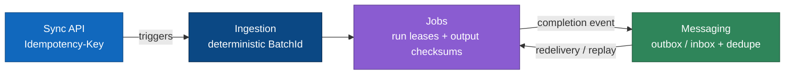
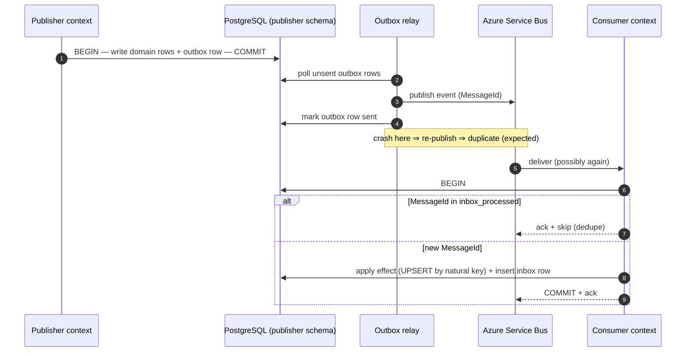

# ADR 0007 — Idempotency & Replay Safety

> Purpose: mandate idempotency at every BeeEye tier — API, ingestion, jobs, and messaging — so that at-least-once delivery, retries, and deliberate replays never create duplicate facts, predictions, recommendations, or notifications.

| Field | Value |
|-------|-------|
| Status | **Accepted** |
| Date | 2026-07-22 |
| Deciders | Platform architecture (BeeEye vendor team) |
| Scope | Platform-wide cross-cutting concern; binds all 19 bounded contexts and the Python ML tier |
| Supersedes / superseded by | — |

---

## 1. Context

BeeEye is a `.NET 10` modular monolith with an out-of-band Python ML tier, an Azure Service Bus
async backbone, per-context PostgreSQL schemas, and a zoned ADLS Gen2 lakehouse (see
[../architecture/overview.md](../architecture/overview.md) and
[../architecture/module-boundaries.md](../architecture/module-boundaries.md)). Several properties of
this shape make duplicate work not a possibility but a **certainty** we must design for:

1. **At-least-once delivery.** Azure Service Bus guarantees at-least-once, not exactly-once. Any
   integration event (`RawExtractLanded`, `DataValidated`, `SalesBatchPublished`,
   `InventoryPositionChanged`, `ForecastProduced`, `PredictionServed`, `RecommendationRaised`,
   `DecisionRecorded`, …) can be redelivered after a consumer crash between *processing* and *ack*, or
   after a lock-expiry, or after a transient publish retry.
2. **The dual-write problem.** A handler that "commits to PostgreSQL, then publishes to Service Bus"
   as two independent steps can crash between them — losing the event — or publish then fail to
   commit — emitting a phantom event. There is no cross-resource atomic commit between a database and
   a broker.
3. **Deliberate replay is a first-class operation.** Re-extracting an overlapping period from Oracle
   Fusion, re-running a nightly forecast batch, backfilling after a fix, or re-driving a dead-letter
   queue are all routine. Oracle Fusion is the **read-only system of record**; overlapping
   re-extracts of the same business period are normal, not exceptional.
4. **Retries everywhere.** The SPA (TanStack Query) retries failed mutations; Service Bus retries up
   to `MaxDeliveryCount`; Container Apps Jobs restart on failure; ingestion re-runs after a validation
   fix. Every one of these can present the same logical operation twice.

Because BeeEye stores **facts and money**, duplication is not a cosmetic bug — it corrupts decisions:

| If we double-apply… | The damage |
|---------------------|-----------|
| A monthly `SalesFact` row | Over-counts units/revenue (SAR); poisons YoY/MoM/YTD, Ramadan and discount-band comparisons, and every back-test that reads `IDemandHistory`. |
| A `StockUnit` landing | Phantom inventory; inflates holding cost and stock-cover, skewing the additive overstock-risk score. |
| A served `Prediction` / `RiskScore` | Conflicting forecasts/risk for one join key; the Inventory Intelligence and Cockpit screens disagree with themselves. |
| A `Recommendation` | Duplicate "reduce procurement" / "prioritise liquidation" cards; erodes trust and double-counts expected impact. |
| A `Notification` | Approvers spammed with duplicate critical-risk / approval alerts. |
| A `Decision` / `Approval` | The human-in-the-loop ledger records the same approval twice — an audit and governance failure. |

A further constraint from the POC provenance: **determinism**. Same inputs + same **Analysis Date** +
same config version must yield the same outputs (see
[../wireframes/docs/ASSUMPTIONS_LIMITATIONS.md](../wireframes/docs/ASSUMPTIONS_LIMITATIONS.md) and
[../wireframes/docs/METHODOLOGY.md](../wireframes/docs/METHODOLOGY.md)). A replay must therefore
**converge** on the existing result, never diverge from it — which is only true if writes are idempotent.

---

## 2. Decision

**Idempotency is mandatory at every tier of BeeEye.** No component may assume it will see a message,
request, or batch exactly once. We adopt four concrete mechanisms, one per interaction style.



### 2.1 Synchronous API — `Idempotency-Key`

Every state-changing HTTP endpoint (`POST`/`PUT`/`PATCH`/`DELETE`) that creates or mutates a durable
record **MUST** honour a client-supplied `Idempotency-Key` request header (a client-generated UUIDv4 or
ULID). `GET`/read endpoints are naturally idempotent and require no key.

Semantics, enforced by shared middleware in `BeeEye.Api`:

1. On first sight of a key, the handler runs, and — **in the same PostgreSQL transaction as the
   effect** — writes a row to an `idempotency_keys` table: `(key, route, request_fingerprint,
   response_status, response_body, principal_id, created_at, expires_at)`. A `UNIQUE(key)` constraint
   is the concurrency guard.
2. On a **replay with a matching fingerprint**, the stored response (same status code and body) is
   returned; the effect is not re-run.
3. On **key reuse with a different body** (`request_fingerprint` mismatch), return `422 Unprocessable
   Entity` — the client is misusing the key.
4. On a **concurrent in-flight duplicate**, the `UNIQUE` violation resolves to `409 Conflict` (or a
   short wait-then-replay), never a double effect.
5. Keys are retained for a bounded window (default **48 h**) and garbage-collected; the window must
   exceed the client's maximum retry horizon.

| Endpoint class | Example | Key required |
|----------------|---------|:---:|
| Approve / reject a recommendation | `POST /decisions` (DecisionsAndOutcomes) | ✅ |
| Change platform config | `PUT /config/risk-weights` (PlatformAdministration) | ✅ |
| Trigger an extract or ML job | `POST /integration/extracts` · `POST /forecasts/refit` | ✅ |
| Manual data override / annotation | `PATCH /inventory/{stockId}` | ✅ |
| Read metrics, forecasts, grids | `GET /sales/kpis`, `GET /predictions/{joinKey}` | ❌ (idempotent) |

The `Idempotency-Key` semantics mirror the emerging IETF HTTP idempotency-key convention; BeeEye pins
the behaviour above regardless of client library.

### 2.2 Ingestion — deterministic batch identity

Batches are **not** identified by a random GUID minted at extract time. Every landed batch receives a
**deterministic `BatchId`** derived from its scope and content, so that re-extracting the same source
rows for the same window yields the **same** id:

```
BatchId = hash(
    source_system,                 // e.g. OracleFusion
    entity,                        // Sales | Inventory | AfterSales | SpareParts
    business_period,               // the extract window (e.g. 2026-04)
    extract_predicate / watermark, // the governed query bounds
    source_contract_version,       // ACL schema version (SourceContractVersion)
    content_hash(row_set)          // hash over normalised source rows
)
```

Consequences of deterministic identity, owned by **Integration** and **DataQuality**:

- **Raw zone is content-addressed.** The raw ADLS landing object is named by `BatchId`; re-landing an
  identical extract is a no-op overwrite of the same immutable object, preserving lineage and the
  source-row references BeeEye keeps for audit.
- **Promotion is a no-op on replay.** `DataQuality` emits `DataValidated{BatchId}`. If SalesActuals /
  Inventory have already promoted that `BatchId` (recorded in their inbox — §2.4), the second
  `DataValidated` is acknowledged and ignored.
- **Curated writes are upserts on the natural business key, never blind appends:**

  | Context | Natural key for merge | Grain |
  |---------|----------------------|-------|
  | SalesActuals | `location + model + variant + colour + interior + discount_pct + sale_date` (with preserved source-row reference) | monthly sales fact |
  | Inventory | `stock_id` (PK), `chassis_no` (unique) | physical unit |
  | AfterSales / SpareParts | service/part business key + period | period aggregate |

  Reconciliation invariants from the data model still hold after merge (revenue = units × price ×
  (1 − discount%/100); `lead_time_days` = purchase − manufacture) — see
  [../wireframes/docs/DATA_DICTIONARY.md](../wireframes/docs/DATA_DICTIONARY.md).

```mermaid
sequenceDiagram
    autonumber
    participant F as Oracle Fusion (RO, ACL)
    participant I as Integration
    participant Q as DataQuality
    participant S as SalesActuals / Inventory
    F->>I: governed extract (period P, contract vN)
    I->>I: compute deterministic BatchId (scope + content hash)
    alt BatchId already landed
        I-->>I: overwrite identical raw object (no-op)
    else new content
        I->>I: land raw @ BatchId, preserve source-row refs
    end
    I->>Q: RawExtractLanded{BatchId}
    Q->>Q: validate; reconciliation + completeness gates
    Q->>S: DataValidated{BatchId}
    alt BatchId already promoted (inbox hit)
        S-->>S: ack + skip (no duplicate facts)
    else first promotion
        S->>S: UPSERT curated facts by natural key
    end
```

### 2.3 Jobs (Container Apps Jobs) — run leases + output checksums

Python ML jobs run as Container Apps Jobs on **cron and Service-Bus triggers**; overlapping schedules,
retries, and manual re-runs mean the same unit of work can start more than once concurrently.

- **Run leases.** Before computing, a job acquires a lease keyed by `(job_type, scope,
  input_version)` — a lease row `(lease_key, owner, acquired_at, expires_at)` claimed via an atomic
  conditional update (or PostgreSQL advisory lock). Only the lease holder computes; other instances
  no-op or wait. Leases have an expiry so a crashed holder cannot deadlock the scope.
- **Deterministic output identity + checksum.** Every served result is keyed deterministically by
  `(join_key, model_version, config_version, analysis_date, input_batch_id)` and written to the
  `model-output` zone / `Predictions` store as a versioned artifact. The job computes an **output
  checksum**; if an artifact with that key **and** matching checksum already exists, the write and its
  completion event are **skipped** (identical replay). If inputs changed, the new version
  **supersedes** the prior one (last-writer-wins by version) rather than appending a rival value.
- **Atomic publish.** Outputs are written to a staging path and **atomically promoted**, then the
  completion event is emitted via the outbox (§2.4) — never a partial half-written result.
- **Poison isolation.** Failing jobs dead-letter and quarantine after bounded retries; they never
  leave partially applied output.

This preserves the platform invariant that forecasts, risk scores, values, and quantities are
deterministic engine outputs — a re-run of the ported `engine.js` logic on identical inputs is
byte-identical, so idempotency here is *checkable*, not merely asserted.

### 2.4 Messaging — transactional outbox / inbox + consumer dedupe

We solve the dual-write problem with the **transactional outbox** and guard consumers with a
**transactional inbox**; handlers are additionally written to be idempotent by construction.

**Outbox (publish side).** A domain state change and its integration event(s) are committed
**together** in one PostgreSQL transaction: business rows + an `outbox` row. A separate relay
(background dispatcher) reads unsent `outbox` rows, publishes to Service Bus, and marks them sent.
Because the relay can crash after publish but before marking, publication is at-least-once by design —
which the inbox absorbs. Every event carries a stable `MessageId` (deterministic where possible, e.g.
derived from `aggregate_id + version`) plus `CorrelationId` / `CausationId`.

**Inbox (consume side).** A handler records the incoming `MessageId` in an `inbox_processed` table
**within the same transaction** as its side effects. A redelivered message whose `MessageId` already
exists is acknowledged and skipped. Even so, handlers upsert by natural key so correctness never
depends on the inbox alone (defence in depth).



Service Bus features are used as **defence-in-depth, not as the guarantee**:

| Feature | Role | Not relied on for |
|---------|------|-------------------|
| Duplicate detection window | Cheap early filter for rapid re-publish | Correctness beyond the window; DB dual-write |
| Sessions | Per-`join_key` ordering where sequence matters | General ordering (events are version-stamped) |
| Dead-letter queues + `MaxDeliveryCount` | Poison-message isolation, safe re-drive | — |
| Delivery ordering | Best-effort | Consumers apply last-writer-wins by version and ignore stale events |

---

## 3. Invariants (what CI and review enforce)

| # | Invariant |
|---|-----------|
| I-1 | No handler publishes to Service Bus outside the transactional outbox. |
| I-2 | Every event-consuming handler is guarded by an inbox `MessageId` check **and** is upsert-by-natural-key. |
| I-3 | No ingestion path performs a blind `INSERT` of curated facts — merge on the documented natural key only. |
| I-4 | Batch identity is deterministic (content + scope hash); random GUIDs for batch identity are prohibited. |
| I-5 | Every ML job acquires a run lease for its scope and writes checksum-keyed, versioned outputs. |
| I-6 | Every mutating API endpoint accepts and enforces `Idempotency-Key`; reads never require one. |
| I-7 | Audit remains append-only, but ingests events deduped by `MessageId` so a redelivery adds no duplicate audit entry. |

---

## 4. Consequences

**Positive**

- Retries, redeliveries, and deliberate replays/backfills are **safe by construction** — no duplicate
  facts, predictions, recommendations, decisions, or notifications.
- Re-processing any Oracle Fusion period (overlapping windows included) converges on the existing
  curated state; lineage and source-row references are preserved.
- The deterministic-engine guarantee becomes verifiable: a re-run's output checksum must match.
- Failure handling is uniform — dead-letter, fix, re-drive — with no fear of double application.
- Each context keeps its own outbox/inbox/idempotency tables, so contexts stay independently
  extractable to services later without a redesign.

**Negative / costs (accepted)**

- Additional per-context infrastructure tables: `idempotency_keys`, `outbox`, `inbox_processed`,
  `run_leases`, plus a relay dispatcher and retention/GC jobs.
- Developers must design a **natural business key** and a **deterministic message/result id** for
  every fact, event, and output — this is a required design step, not optional.
- Storage and a small latency overhead from staging-then-promote and inbox writes.
- New operational signals to watch: outbox lag, dead-letter depth, lease contention, idempotency-key
  table growth.

---

## 5. Alternatives considered & rejected

### 5.1 Assume exactly-once delivery — **Rejected**

There is no exactly-once across a database + broker boundary (the two-generals / dual-write problem);
Azure Service Bus is explicitly at-least-once. Building on an exactly-once assumption would push
duplicates into silent fact/recommendation/notification corruption under entirely normal redelivery.
Exactly-once *processing* is achievable only as *at-least-once delivery + idempotent effects* — which
is precisely the decision above.

### 5.2 Delete-and-reload (truncate + full reload each cycle) — **Rejected**

Reloading each cycle by wiping and re-inserting was rejected because it:

- **Destroys lineage and audit** — the append-only Audit trail and preserved source-row references
  (required for governance) cannot survive a truncate.
- **Is unsafe under partial failure** — a crash mid-reload leaves data *deleted* with no atomic
  rollback across zones, i.e. an outage that erases the curated model.
- **Breaks reproducibility** — back-test inputs (`IDemandHistory`) and served-prediction history must
  be stable; wholesale reloads make prior results irreproducible.
- **Does not scale incrementally** — full reloads grow with total history, not with the delta.

Deterministic-identity **upsert/merge** (§2.2) delivers the same "reflect the latest source truth"
outcome incrementally, safely, and with lineage intact.

### 5.3 Random per-extract batch GUIDs — **Rejected**

A random `BatchId` cannot recognise that a re-extract carries the same content, so every overlapping
re-extract would append duplicates. Deterministic content-addressed identity (§2.2) is required.

### 5.4 Broker duplicate-detection as the sole guarantee — **Rejected as sole mechanism**

Service Bus duplicate detection is window-bounded and does nothing about the DB dual-write or job
re-runs. It is retained only as a cheap first-line filter (defence-in-depth), never as the guarantee.

---

## Traceability

This ADR is part of the BeeEye planning & architecture package and governs cross-cutting behaviour
described in the architecture set.

- Container view, Service Bus backbone & guardrails → [../architecture/overview.md](../architecture/overview.md)
- Bounded contexts, integration-event catalogue & architecture tests → [../architecture/module-boundaries.md](../architecture/module-boundaries.md)
- Data zones, curated model & lineage → [../architecture/canonical-data-model.md](../architecture/canonical-data-model.md)
- Determinism, Analysis Date & replay convergence → [../wireframes/docs/ASSUMPTIONS_LIMITATIONS.md](../wireframes/docs/ASSUMPTIONS_LIMITATIONS.md), [../wireframes/docs/METHODOLOGY.md](../wireframes/docs/METHODOLOGY.md)
- Natural keys, reconciliation invariants & join key → [../wireframes/docs/DATA_DICTIONARY.md](../wireframes/docs/DATA_DICTIONARY.md)

Related ADRs in this series address the async messaging topology, the Oracle Fusion anti-corruption
layer, and the ADLS data-zone model; this ADR is the authoritative source for the idempotency and
replay-safety rules those decisions rely on.
