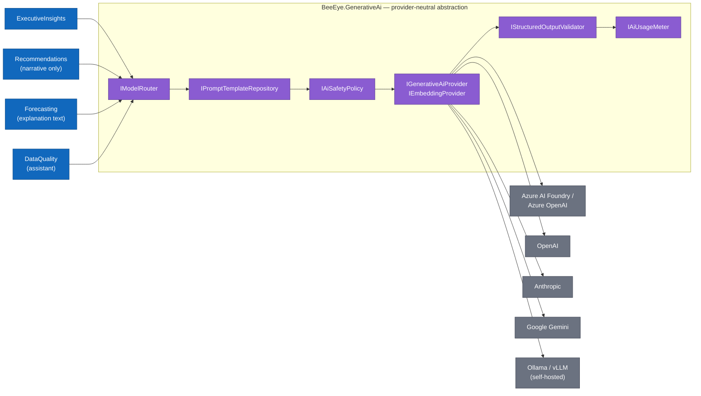
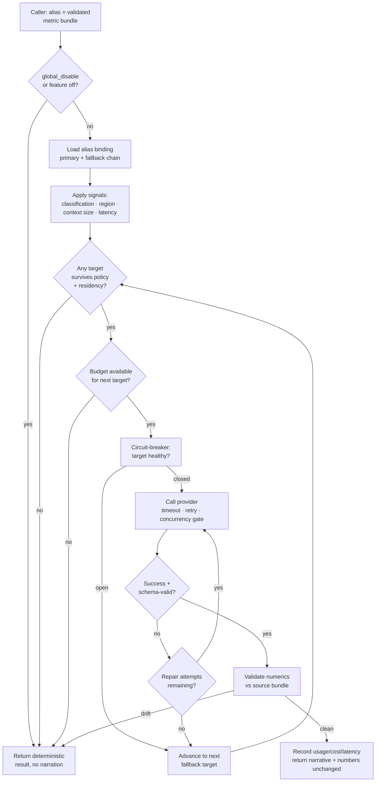

# Generative-AI Provider Abstraction

> How BeeEye talks to *any* large-language-model provider through one narrow, policy-governed seam — so models narrate validated metrics but never compute forecasts, risk, values, quantities, or decisions.

BeeEye treats generative AI as a **replaceable narration and assistance layer**, not a source of truth.
Every deterministic number — forecasts (Holt-Winters + baselines), the additive 0–100 risk score,
procurement quantities, monetary values in SAR — is produced by the analytics engines ported from the
POC (`engine.js`) and the Python ML tier. The GenAI layer receives those *already-validated* figures and
turns them into prose, explanations, and conversational answers. This document specifies the abstraction
that makes the underlying model provider a **configuration choice** and enforces the guardrail in code.

The POC ("Meridian BI") proved the principle with a fully deterministic, framework-free insight engine
(`execInsights` / `answer` in `engine.js`) that composed grounded sentences from computed metrics with
**no model call at all**. Production ("BeeEye", .NET namespace root `BeeEye`) keeps that grounding
discipline and adds a real provider abstraction on top, so the platform can use Azure AI Foundry, Azure
OpenAI, OpenAI, Anthropic, Google Gemini, or a self-hosted Ollama/vLLM endpoint interchangeably.

---

## 1. The non-negotiable guardrail

The generative model is a **narrator and language interface** over a closed set of validated inputs.

| The model MAY | The model MUST NOT |
|---------------|--------------------|
| Rephrase and summarise metrics already computed and validated by the platform. | Compute, estimate, adjust, round, or invent any forecast, risk score, probability, monetary value, quantity, or price. |
| Explain *which* factors drove a risk score, given the additive breakdown. | Decide an action, approve a recommendation, or rank options on its own authority. |
| Answer natural-language questions by selecting from platform-supplied facts. | Read enterprise systems, call unlisted tools, or fetch data outside the provided context. |
| Draft an executive narrative from a structured metric bundle. | Assert causation ("caused by") — only association ("associated with"), matching POC methodology. |
| Ask a clarifying question or say "insufficient data". | Imply sample data is live Oracle Fusion data, or make production-validation claims. |

Enforcement is layered and does not rely on the prompt alone: (1) the model only ever receives a bundle
of **pre-validated** metrics; (2) its output is constrained to a **strict JSON schema** that has no
free-numeric fields the platform then trusts; (3) `IStructuredOutputValidator` re-checks every emitted
figure against the source bundle and rejects any drift; (4) if validation fails after a bounded repair
attempt, the deterministic result is returned **without** narration. AI is additive, never authoritative.

---

## 2. Where the abstraction sits

The abstraction is a single module (`BeeEye.GenerativeAi`) consumed by the narration-producing bounded
contexts — chiefly **ExecutiveInsights**, **Recommendations** (narrative only), **Forecasting**
(explanation text), and **DataQuality** (assistant) — and never by the numeric engines themselves.



Callers depend only on the **logical alias** (`executive-summary`, `analyst-explanation`,
`recommendation-narrative`, `data-quality-assistant`) and a validated metric bundle. They never name a
provider, model id, or endpoint — routing resolves that at request time from configuration and policy.

---

## 3. Core abstractions

Seven interfaces, each with one responsibility. All async methods take a `CancellationToken`; all return
typed results, never raw strings the caller must re-parse for numbers.

| Interface | Responsibility | Key contract |
|-----------|---------------|--------------|
| `IGenerativeAiProvider` | One concrete provider adapter (chat/completion + structured output). | `CompleteAsync(GenerationRequest) → GenerationResult` |
| `IEmbeddingProvider` | Text → vector, for semantic search over docs/glossary/prior insights. | `EmbedAsync(EmbeddingRequest) → EmbeddingResult` |
| `IModelRouter` | Resolve a logical alias + request signals to a concrete `(provider, model, params)` with fallback chain. | `ResolveAsync(AliasRequest) → RoutePlan` |
| `IPromptTemplateRepository` | Versioned, reviewed prompt templates (system + user) with typed placeholders. | `Get(alias, version) → PromptTemplate` |
| `IStructuredOutputValidator` | Enforce JSON schema **and** re-check every numeric against the source bundle; drive controlled repair. | `Validate<T>(raw, schema, sourceBundle) → ValidationOutcome<T>` |
| `IAiUsageMeter` | Record tokens, latency, cost, cache hits per feature/alias/provider; enforce budget ceilings. | `Record(UsageEvent)` · `IsWithinBudget(scope) → bool` |
| `IAiSafetyPolicy` | Prompt-injection defence, data-classification gating, tool allow-listing, output content checks. | `Guard(GenerationRequest) → PolicyDecision` |

### 3.1 Provider adapter

```csharp
namespace BeeEye.GenerativeAi.Abstractions;

public interface IGenerativeAiProvider
{
    string ProviderKey { get; }               // "azure-foundry" | "openai" | "anthropic" | "gemini" | "local-vllm"
    ProviderCapabilities Capabilities { get; } // json-schema mode, tool use, max context, streaming, region

    Task<GenerationResult> CompleteAsync(
        GenerationRequest request,             // resolved model id + params + messages + json schema
        CancellationToken ct);
}

public sealed record GenerationRequest(
    string ModelId,
    IReadOnlyList<ChatMessage> Messages,       // system + delimited user content, no raw untrusted text
    JsonSchema? ResponseSchema,                // strict structured-output contract (required for narration)
    GenerationParameters Parameters,           // temperature (low, default 0.2), maxOutputTokens, topP, seed
    IReadOnlyList<ToolDefinition> AllowedTools,// allow-list; empty for pure narration
    RequestBudget Budget);                     // per-call token + latency ceiling
```

Each provider ships as its own adapter package (`BeeEye.GenerativeAi.Provider.AzureFoundry`,
`...Anthropic`, `...OpenAI`, `...Gemini`, `...Local`) implementing this interface and normalising that
vendor's request/response, structured-output mode, token accounting, and error taxonomy into BeeEye's
shared shapes. Adding a provider is a new package + a config entry — no change to any calling context.

---

## 4. Logical model aliases

Callers request work by **capability alias**, decoupling business intent from the model behind it.

| Alias | Used by | Task shape | Latency class | Default data classification |
|-------|---------|-----------|---------------|-----------------------------|
| `executive-summary` | ExecutiveInsights (UC8) | Concise board-level narrative over a KPI bundle | Interactive | Internal — aggregates only |
| `analyst-explanation` | Forecasting, Inventory | Explain a forecast/risk breakdown factor-by-factor | Interactive | Internal — aggregates only |
| `recommendation-narrative` | Recommendations | Turn a rules-engine recommendation into rationale prose | Interactive | Internal — aggregates only |
| `data-quality-assistant` | DataQuality | Explain validation failures, suggest remediation steps | Async-tolerant | Internal — schema + row refs |

Aliases map to concrete providers/models **only in configuration**, per environment. A representative
binding (secrets/endpoints resolved from Key Vault at runtime, never in the file):

```yaml
genai:
  defaults:
    temperature: 0.2
    max_output_tokens: 900
    structured_output: strict     # json-schema enforced or the request fails
  aliases:
    executive-summary:
      primary:  { provider: azure-foundry, model: gpt-4o,        region: ksa-central }
      fallback: [ { provider: anthropic,   model: claude-sonnet, region: eu } ]
      cost_ceiling_usd_per_call: 0.03
      max_context_tokens: 32000
      timeout_ms: 8000
    analyst-explanation:
      primary:  { provider: azure-foundry, model: gpt-4o-mini,   region: ksa-central }
      fallback: [ { provider: openai,      model: gpt-4o-mini,   region: eu } ]
      cost_ceiling_usd_per_call: 0.01
      timeout_ms: 6000
    recommendation-narrative:
      primary:  { provider: azure-foundry, model: gpt-4o-mini,   region: ksa-central }
      fallback: [ { provider: local-vllm,  model: llama-3.1-70b, region: ksa-central } ]
      timeout_ms: 6000
    data-quality-assistant:
      primary:  { provider: local-vllm,    model: llama-3.1-8b,  region: ksa-central }  # keep row-level data in-tenant
      fallback: [ { provider: azure-foundry, model: gpt-4o-mini, region: ksa-central } ]
      timeout_ms: 15000
  features:
    executive_summary_enabled: true
    recommendation_narrative_enabled: true
    global_disable: false          # master kill-switch; when true, all aliases return deterministic-only
```

Note the deliberate choices: the **data-quality-assistant** defaults to an **in-tenant** self-hosted
model because it can see row references and schema detail, while the executive summary — which sees only
aggregates — may use a managed regional model. Region pins keep KSA-resident data in-region wherever the
data classification requires it.

---

## 5. Routing

`IModelRouter` turns an `(alias, request signals)` pair into a `RoutePlan` — an ordered primary +
fallback chain of concrete `(provider, model, parameters, region)` targets — evaluated against policy.

### 5.1 Routing signals

| Signal | Source | Effect on routing |
|--------|--------|-------------------|
| **Feature / alias** | Caller | Selects the base binding block and defaults. |
| **Data classification** | Metric bundle metadata | Row-level or restricted data forces an in-tenant/region-locked provider; blocks external providers. |
| **Region** | Tenant config + data residency | Prefers `ksa-central`; only allows cross-region fallback when classification permits. |
| **Cost ceiling** | Alias config + `IAiUsageMeter` | If a target would exceed per-call or per-scope budget, skip to a cheaper target or disable. |
| **Context size** | Estimated prompt tokens | If the bundle exceeds a target's `max_context_tokens`, route to a larger-context model or compact the bundle. |
| **Latency class** | Alias (interactive vs async) | Interactive aliases prefer low-latency small models; async-tolerant may use larger ones. |
| **Policy** | `IAiSafetyPolicy` | A `Deny` decision removes a target from the chain (e.g. provider not approved for this classification). |

### 5.2 Routing flow



The invariant across every branch: **failure degrades to the deterministic result**, never to a guessed
one. There is no path where an unvalidated model output reaches the user as authoritative data.

---

## 6. Resilience & limits

Every provider call runs inside a resilience envelope (implemented with a `ResiliencePipeline`) so a slow
or failing model degrades gracefully rather than blocking a dashboard.

| Control | Default | Behaviour |
|---------|---------|-----------|
| **Timeout** | Per-alias (`timeout_ms`, 6–15 s) | Hard per-attempt deadline; on expiry, advance to fallback then deterministic-only. |
| **Retry** | ≤ 2, exponential backoff + jitter | Only on transient/5xx/429; never on schema-validation or content-policy failures. |
| **Circuit-breaker** | Per provider+model | Opens after a failure-rate threshold; open circuits are skipped in routing and half-open probed. |
| **Concurrency limit** | Bounded semaphore per provider | Caps in-flight calls to respect provider rate limits and protect latency budgets. |
| **Per-call token cap** | `max_output_tokens` + input estimate | Requests exceeding the cap are compacted or rejected before dispatch. |
| **Budget ceiling** | Per call, per feature, per tenant/day | `IAiUsageMeter` blocks calls that would breach the ceiling; over-budget → deterministic-only. |
| **Feature disable switch** | `features.*` + `global_disable` | Per-alias and master kill-switch; flips the whole platform to deterministic-only with zero code change. |
| **Repair attempts** | ≤ 1 controlled repair | Bounded structured-output repair (see §7); exhausted → fallback/deterministic. |

Because the request path serves **precomputed, validated** metrics, a disabled or unavailable GenAI layer
never breaks a screen — the number-bearing panels render exactly as before; only the narrative prose is
withheld, replaced by the POC-style deterministic sentence where one exists.

---

## 7. Structured outputs, validation & controlled repair

Narration is requested in **strict JSON-schema mode**: the model must return an object matching a schema
whose numeric-looking fields are **echoes** the validator can check, not new values the platform trusts.

```jsonc
// response schema for executive-summary (illustrative)
{
  "type": "object",
  "additionalProperties": false,
  "required": ["headline", "narrative", "cited_metrics", "caveats"],
  "properties": {
    "headline":  { "type": "string", "maxLength": 120 },
    "narrative": { "type": "string", "maxLength": 1200 },
    "cited_metrics": {                       // MUST echo values from the supplied bundle verbatim
      "type": "array",
      "items": {
        "type": "object",
        "additionalProperties": false,
        "required": ["key", "value_echo"],
        "properties": {
          "key":        { "type": "string" },   // e.g. "high_risk_value_sar"
          "value_echo": { "type": "string" }     // string, so the model cannot silently re-arithmetic
        }
      }
    },
    "caveats": { "type": "array", "items": { "type": "string" } }
  }
}
```

`IStructuredOutputValidator` then performs two checks:

1. **Schema conformance.** The raw output must parse and satisfy the JSON schema (strict, no extra keys).
2. **Numeric grounding.** Every `cited_metrics[].value_echo` must **exactly match** the corresponding
   value in the source bundle (by key, after canonical formatting). The narrative is additionally scanned
   for numeric/currency tokens that are not present in the bundle — any such token is treated as drift.

**Controlled repair** runs at most once: on a schema or grounding failure, the validator returns a
structured, machine-generated correction prompt ("field X failed: expected echo of `high_risk_value_sar`
= `SAR 12,480,000`; do not introduce other numbers") and re-invokes the same target. If the second
attempt still fails, routing advances to the fallback target; if all targets fail, the caller receives the
**deterministic result with no narrative**. The platform **never parses business values out of prose** —
displayed numbers always come from the metric bundle, and the prose is only shown once it has been proven
to agree with them.

---

## 8. Prompt-injection & data-minimisation defences

Untrusted text (customer notes, document extracts, free-text data-quality reasons, prior chat turns) is
handled as **data, not instructions**. `IAiSafetyPolicy` and the prompt templates enforce:

- **Delimited untrusted content.** Any source text is wrapped in explicit, unspoofable delimiters and the
  system prompt states that content inside them is *reference material only* and must never be executed as
  instructions. Delimiter tokens are randomised per request so injected copies cannot forge the boundary.
- **Allow-listed tools only.** Aliases run with an explicit tool allow-list (empty for pure narration).
  A model request to call any tool outside the list is rejected by the safety policy, not the model.
- **Least data.** The metric bundle carries the **minimum** needed for the task — aggregates for executive
  and analyst narration, and only the specific row references required for the data-quality assistant.
  No credentials, connection strings, full extracts, or cross-tenant data ever enter a prompt.
- **No live-system reach.** The model has no network egress and no path to Oracle Fusion, PostgreSQL, or
  ADLS; it receives a frozen bundle and returns text. All enterprise reads happen through the ACL *before*
  the prompt is built.
- **Output content checks.** Emitted narratives are screened for injected instructions echoed back,
  causal-claim language ("caused by"), and production-validation claims, consistent with POC grounding
  rules; violations trigger repair or suppression.
- **Classification gating.** Restricted or row-level bundles are structurally barred from external
  providers by the router (§5), so a prompt-injection attempt cannot exfiltrate data the provider never
  received in the first place.

---

## 9. AI observability

`IAiUsageMeter` and the OpenTelemetry instrumentation emit a consistent event per provider call, feeding
App Insights dashboards for cost, reliability, and grounding quality. PII/row-level content is never
logged — only identifiers, counts, and outcomes.

| Field | Purpose |
|-------|---------|
| `alias`, `feature`, `bounded_context` | Attribute usage to a business capability. |
| `provider_key`, `model_id`, `region` | Which concrete target actually served the call (post-routing). |
| `route_reason`, `was_fallback`, `fallback_depth` | Why this target — signal that drove routing and whether primary was skipped. |
| `input_tokens`, `output_tokens`, `est_cost_usd` | Token accounting and cost, rolled up against budget ceilings. |
| `latency_ms`, `time_to_first_token_ms` | Interactive-budget adherence. |
| `outcome` (`ok` / `schema_fail` / `grounding_fail` / `timeout` / `circuit_open` / `budget_block` / `policy_deny`) | Reliability and guardrail telemetry. |
| `repair_attempted`, `repair_succeeded` | Structured-output repair health. |
| `numeric_drift_detected` | Grounding-violation rate — a first-class quality SLI. |
| `degraded_to_deterministic` | How often narration was withheld and the deterministic result served alone. |
| `prompt_template_version`, `schema_version` | Reproducibility and prompt-change attribution. |
| `trace_id`, `tenant`, `user_persona` | Correlation with the originating request (Executive/Analyst/IT). |

Key SLIs: **grounding-violation rate** (`numeric_drift_detected`), **degradation rate**
(`degraded_to_deterministic`), **fallback rate**, **p95 latency per alias**, and **cost per feature per
day**. A rising grounding-violation rate is treated as a correctness incident, not a cosmetic one.

---

## 10. Mapping to bounded contexts & use cases

| Alias | Owning context | Serves use case |
|-------|---------------|-----------------|
| `executive-summary` | ExecutiveInsights | UC8 Executive Decision Cockpit |
| `analyst-explanation` | Forecasting / Inventory | UC2 Forecast accuracy narration · UC5 Inventory aging/overstock explanation |
| `recommendation-narrative` | Recommendations | UC1 Order optimisation · UC4 Procurement quantity — rationale prose only |
| `data-quality-assistant` | DataQuality | Cross-cutting — explains validation failures during ingestion |

In all four cases the numbers originate in the deterministic engines and ML tier; the alias only supplies
the words around them. The abstraction is what lets ADMC change providers — for cost, residency, or
capability reasons — without touching a single line of the analytics or the calling contexts.

---

## Traceability

- Architecture index & guardrails → [overview.md](./overview.md)
- Provider-neutral GenAI grounding & narration flow → [genai-architecture.md](./genai-architecture.md)
- Bounded contexts (ExecutiveInsights, Recommendations, Forecasting, DataQuality) → [bounded-contexts.md](./bounded-contexts.md)
- Security, identity & data classification → [security-and-identity.md](./security-and-identity.md)
- Canonical data model (metric bundle fields, SAR values) → [canonical-data-model.md](./canonical-data-model.md)
- ML platform (source of validated forecasts/risk the model narrates) → [ml-platform.md](./ml-platform.md)

POC provenance:

- Grounding discipline & deterministic insight engine → [../wireframes/docs/METHODOLOGY.md](../wireframes/docs/METHODOLOGY.md)
- Assumptions & limitations (no live Oracle, human-in-the-loop) → [../wireframes/docs/ASSUMPTIONS_LIMITATIONS.md](../wireframes/docs/ASSUMPTIONS_LIMITATIONS.md)
- Future-state integration blueprint → [../wireframes/docs/INTEGRATION_AZURE_ORACLE.md](../wireframes/docs/INTEGRATION_AZURE_ORACLE.md)
