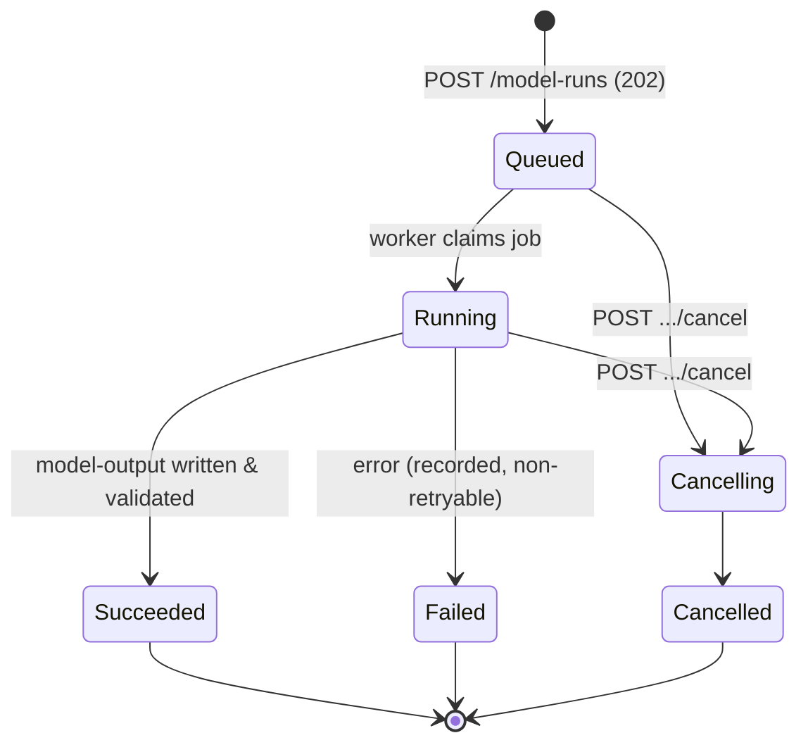
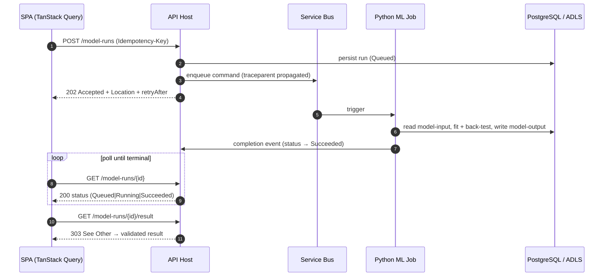

# API Design Guidelines

> The contract rules for BeeEye's HTTP surface: versioned REST under `/api/v1`, one consistent shape for every resource, error, page, date and monetary value — so the typed React client, the ML job tier, and future integrators all speak the same language.

BeeEye exposes a single REST API from the ASP.NET Core modular-monolith host. It fronts ~19 bounded
contexts (Identity → PlatformAdministration) but presents **one coherent contract**: predictable URLs,
RFC 9457 Problem Details, cursor pagination, ETag concurrency, idempotent writes, and a first-class
long-running-job pattern for deterministic ML runs. This document is normative — every endpoint in every
module conforms to it, and the OpenAPI document is the machine-readable expression of these rules.

Two platform guardrails shape the whole surface and are repeated here because they change the contract:

1. **Oracle Fusion is read-only.** No endpoint writes to the system of record. Mutations only ever touch
   BeeEye-owned state (model-runs, decisions/approvals, settings, notifications).
2. **GenAI narrates, never computes.** Endpoints may return a `narrative` string, but every number in
   the payload comes from the deterministic engines. See [ai-provider-abstraction.md](./ai-provider-abstraction.md).

---

## 1. Design principles

| Principle | Rule |
|-----------|------|
| Contract-first | The OpenAPI 3.1 document is the source of truth; the SPA client is generated from it, never hand-written. |
| Resource-oriented | URLs name **things** (nouns), not operations; state changes use HTTP verbs. |
| Predictable envelopes | Collections, errors, and pages share one shape across every module. |
| Explicit over implicit | No silent defaults for time, currency, tenant, or scope — the client states intent; the server enforces authority. |
| Deterministic numbers | Money, quantities, forecasts and risk scores are never floats-by-accident and never AI-authored. |
| Backward-compatible by default | Additive change within a version; breaking change forces a new version. |
| Least privilege | Every response is filtered to the caller's organisation, persona, and location scope server-side. |

---

## 2. Versioning

- **URL-path versioning:** every route is prefixed `/api/v{major}`. The current major is `/api/v1`.
- **Major bump** (`/api/v2`) only for breaking changes: removing/renaming a field, changing a type,
  tightening validation, or changing the meaning of a value. Both majors run side-by-side during a
  published deprecation window.
- **Additive changes are not breaking** and ship within `v1`: new endpoints, new optional request fields,
  new response fields. Clients MUST ignore unknown response fields (the generated TS client does).
- **Deprecation** is signalled with the `Deprecation` and `Sunset` response headers plus a `Link` to the
  migration note; deprecated endpoints are also flagged `deprecated: true` in OpenAPI.
- No version numbers in payloads, no `?version=` query flags, no `Accept` header version negotiation.

---

## 3. Resource naming & URL structure

Resources are **plural, kebab-case nouns**, grouped by the owning bounded context (lower-camel context
segment). Nesting expresses ownership and is kept to a **maximum depth of two** collections; deeper
relationships are expressed with query filters or links, not deeper paths.

| Pattern | Example | Notes |
|---------|---------|-------|
| Collection | `GET /api/v1/inventory/stock-items` | Plural noun. |
| Item | `GET /api/v1/inventory/stock-items/{stockId}` | `stockId` is the domain PK (`stock_id`). |
| Sub-collection | `GET /api/v1/forecasting/forecasts/{id}/intervals` | Owned child. |
| Non-CRUD action | `POST /api/v1/models/model-runs/{id}/cancel` | Verb only as a controlled action sub-resource. |
| Search projection | `GET /api/v1/inventory/risk-scores?filter[band]=Critical` | Filtering, not a new path. |

Representative resources by context:

| Context | Resource(s) |
|---------|-------------|
| SalesActuals | `sales/actuals`, `sales/summaries` |
| Forecasting | `forecasting/forecasts`, `forecasting/backtests` |
| Inventory | `inventory/stock-items`, `inventory/risk-scores`, `inventory/aging` |
| Procurement | `procurement/order-suggestions`, `procurement/quantities` |
| Recommendations | `recommendations` |
| DecisionsAndOutcomes | `decisions`, `decisions/{id}/approvals` |
| ModelsAndExperiments | `models/model-runs`, `models/experiments` |
| ExecutiveInsights | `executive/cockpit`, `executive/insights` |
| PlatformAdministration | `admin/settings`, `admin/analysis-date` |

Rules: no verbs in collection names (`getForecasts` ✗); no file extensions; no trailing slash;
identifiers are opaque to the client; `location + model + variant` grouping keys are passed as query
filters, never assembled into path segments.

---

## 4. HTTP methods & status codes

| Method | Use | Idempotent | Body |
|--------|-----|-----------|------|
| `GET` | Read a resource/collection | Yes | none |
| `POST` | Create; or invoke an action sub-resource; or start a job | No (needs `Idempotency-Key`) | request DTO |
| `PUT` | Full replace of a mutable resource | Yes (with `If-Match`) | full DTO |
| `PATCH` | Partial update (JSON Merge Patch, RFC 7396) | Yes (with `If-Match`) | partial DTO |
| `DELETE` | Remove/soft-delete a BeeEye-owned resource | Yes | none |

| Status | When |
|--------|------|
| `200 OK` | Successful read or synchronous update. |
| `201 Created` | Resource created; `Location` header set. |
| `202 Accepted` | Long-running job accepted (see §14); async cancel accepted. |
| `204 No Content` | Successful `DELETE` or empty-body action. |
| `303 See Other` | Job complete → redirect to the result resource. |
| `304 Not Modified` | `If-None-Match` ETag matched. |
| `400 Bad Request` | Malformed request / validation failure (Problem Details, §10). |
| `401 / 403` | Unauthenticated / out-of-scope (§13). |
| `404 Not Found` | Absent, **or** hidden by scope (we do not leak existence). |
| `409 Conflict` | Idempotency-key body mismatch; illegal state transition. |
| `412 Precondition Failed` | `If-Match` ETag stale (§9). |
| `422 Unprocessable Entity` | Well-formed but domain-invalid (business rule). |
| `429 Too Many Requests` | Rate limit exceeded (§12). |
| `5xx` | Server fault; correlation id always present. |

We distinguish **400** (shape/format is wrong — caught by FluentValidation) from **422** (shape is fine
but a domain rule fails, e.g. a discount outside the observed 0–20% range).

---

## 5. Request & response conventions

- **Media type:** `application/json; charset=utf-8` for success, `application/problem+json` for errors.
- **Casing:** all JSON DTO fields are **camelCase**. Source-system snake_case (`sale_date`, `units_sold`,
  `holding_cost_per_day`) is mapped to camelCase in the integration ACL, never surfaced raw.
- **Envelope:** collections always return `{ "data": [...], "pagination": {...} }`. Single resources
  return the object directly (no `data` wrapper) plus a strong `ETag`.
- **No nulls-as-absent ambiguity:** optional fields are omitted when absent; `null` means "known to be
  empty". Generated Zod schemas encode this precisely.

### Example — read a forecast

```http
GET /api/v1/forecasting/forecasts?location=Riyadh&model=Patrol&variant=VX&horizon=6&analysisDate=2026-04-01 HTTP/1.1
Host: beeeye.admc.internal
Authorization: Bearer <access-token>
Accept: application/json
Accept-Language: en-SA
```

```http
HTTP/1.1 200 OK
Content-Type: application/json; charset=utf-8
ETag: "f3a1c9e7"
RateLimit-Limit: 600
RateLimit-Remaining: 597
RateLimit-Reset: 41
X-Correlation-Id: 5d8e2a10-3f1b-4c07-9a2d-1f6b0c8e44a1
```

```json
{
  "series": { "location": "Riyadh", "model": "Patrol", "variant": "VX" },
  "analysisDate": "2026-04-01",
  "method": { "selected": "SeasonalNaive", "reason": "lowest WMAPE on holdout" },
  "backtest": { "holdoutMonths": 6, "wmape": 0.114 },
  "confidenceLevel": 0.80,
  "points": [
    { "period": "2026-05-01", "forecastUnits": 42, "lower": 33, "upper": 51 },
    { "period": "2026-06-01", "forecastUnits": 39, "lower": 30, "upper": 48 }
  ],
  "currency": "SAR",
  "narrative": "Demand is associated with a mild seasonal dip into summer; seasonal-naive tracked the holdout most closely.",
  "generatedAt": "2026-07-22T09:14:05Z"
}
```

The `narrative` is produced by the GenAI layer from the numbers above and structurally validated before
return; if it alters any figure it is dropped and the payload ships without it.

---

## 6. Data formats — dates, time, money, enums

Consistency here is a contract, not a preference — the front-end binds these formats directly.

| Concept | Format | Example |
|---------|--------|---------|
| Calendar date | ISO 8601 `YYYY-MM-DD` (dates originate as Excel serials, normalised on ingest) | `2026-04-01` |
| Monthly period | First-of-month calendar date | `2026-05-01` |
| Timestamp | RFC 3339, UTC, `Z` suffix — always UTC on the wire | `2026-07-22T09:14:05Z` |
| **Analysis Date** | Explicit `analysisDate` request param; **never a silent server "now"** | `2026-04-01` |
| Money | Object `{ "amount": "46750000.00", "currency": "SAR" }` — decimal **string**, 2 dp, ISO 4217 | see below |
| Quantity | Integer units (`forecastUnits`, `unitsSold`) | `42` |
| Percentage | Decimal fraction `0.0–1.0` (`wmape`, `confidenceLevel`); discount uses the observed integer set `0/5/10/15/20` as `discountPct` | `0.114` |
| Enum | Stable PascalCase string tokens, never magic numbers | `"Critical"` |
| Identifier | Opaque string | `"NIS-PAT-0142"` |

Money is **never** a bare JSON number (float rounding is unacceptable for SAR capital values such as the
~46.75M inventory total). Amounts are decimal strings; currency is always `SAR` for ADMC but is carried
explicitly so the format survives any future multi-currency need.

```json
{ "purchasePrice": { "amount": "180500.00", "currency": "SAR" },
  "holdingCostPerDay": { "amount": "11.12", "currency": "SAR" } }
```

Enum vocabularies mirror the domain: risk bands `Low | Medium | High | Critical` (0–34 / 35–59 / 60–79 /
80–100); aging bands `New | Healthy | Watch | HighAttention | Critical` (≤30 / ≤60 / ≤90 / ≤120 / >120
days); forecast methods `PreviousMonthNaive | MovingAverage3 | SeasonalNaive | HoltWinters`. Adding an
enum value is a **breaking change** for exhaustive consumers and is treated as such.

---

## 7. Pagination, filtering, sorting

**Cursor pagination** is the default for all collections (stable under concurrent inserts, no deep-offset
cost).

- Request: `?pageSize=50&cursor=<opaque>` — `pageSize` default 50, max 200.
- Response `pagination` block: `{ "pageSize": 50, "nextCursor": "eyJrIjoi…", "hasMore": true }`.
- `nextCursor` is opaque, signed, and version-bound; clients echo it back untouched.

**Filtering** uses bracketed field + optional operator suffix:

| Query | Meaning |
|-------|---------|
| `filter[band]=Critical` | equality |
| `filter[riskScore][gte]=60` | `riskScore ≥ 60` |
| `filter[location]=Riyadh,Jeddah` | IN (comma list) |
| `filter[dateOfPurchase][lt]=2026-03-01` | range |

Supported operators: `eq` (default), `ne`, `gt`, `gte`, `lt`, `lte`, `in`. Unknown fields/operators →
`400`. Filterable fields are declared per resource in OpenAPI.

**Sorting** uses `sort=` with a comma list; leading `-` = descending:

```
GET /api/v1/inventory/risk-scores?filter[band][in]=High,Critical&sort=-riskScore,model&pageSize=100
```

Only allow-listed sort fields are honoured; anything else → `400`. Default sort is documented per resource
(risk-scores default to `-riskScore`).

---

## 8. Concurrency — ETags & optimistic locking

Every mutable single resource returns a **strong `ETag`** (a hash/rowversion of its state).

- **Conditional read:** client sends `If-None-Match: "<etag>"` → `304 Not Modified` when unchanged
  (saves payload on cockpit polling).
- **Conditional write:** `PUT`/`PATCH`/`DELETE` MUST send `If-Match: "<etag>"`. A stale tag → `412
  Precondition Failed` with Problem Details; the client re-reads and retries.
- A mutating request **without** `If-Match` on a resource that requires it → `428 Precondition Required`.

```http
PATCH /api/v1/decisions/DEC-2026-0417 HTTP/1.1
If-Match: "a91f0c22"
Content-Type: application/json

{ "status": "Approved", "approverNote": "Proceed with controlled 10% discount." }
```

This matters most for the human-in-the-loop approval flow: two managers must never silently overwrite each
other's decision on a recommendation.

---

## 9. Validation — FluentValidation → Problem Details

Request DTOs are validated by **FluentValidation** in a pipeline behaviour that runs before any handler.

- **Structural/format rules** (required, range, pattern, enum membership, `pageSize ≤ 200`) → `400` with a
  field-keyed error map.
- **Cross-field & domain rules** that need state (e.g. `holdoutMonths ∈ {3,6,12}`, discount within the
  observed `0–20%` band, an approval on a decision not in `Pending`) → `422`.
- Validators are colocated with each module's contracts; messages are safe to display and never leak
  internal identifiers, SQL, or stack traces.

Validation failures use the same Problem Details envelope (§10) with an `errors` extension:

```json
{
  "type": "https://beeeye.admc/errors/validation",
  "title": "One or more validation errors occurred.",
  "status": 400,
  "detail": "The request failed validation.",
  "instance": "/api/v1/forecasting/forecasts",
  "code": "VALIDATION_FAILED",
  "traceId": "00-4bf92f3577b34da6a3ce929d0e0e4736-00f067aa0ba902b7-01",
  "timestamp": "2026-07-22T09:14:05Z",
  "errors": {
    "horizon": ["Must be between 1 and 12."],
    "confidenceLevel": ["Must be one of 0.80, 0.90, 0.95."]
  }
}
```

---

## 10. Error model — Problem Details (RFC 9457)

All error responses use `application/problem+json` per **RFC 9457** (which obsoletes RFC 7807), with a
fixed set of BeeEye extensions.

| Member | Meaning |
|--------|---------|
| `type` | Absolute URI to the error catalog entry (`/errors/{code}`). |
| `title` | Short, stable, human-readable summary. |
| `status` | HTTP status, mirrored in the response line. |
| `detail` | Human-readable, request-specific explanation (display-safe). |
| `instance` | The request path (or a URN for the failed operation). |
| `code` | Stable machine token the client switches on (`VALIDATION_FAILED`, `ETAG_STALE`, `RATE_LIMITED`, `JOB_NOT_COMPLETE`, `OUT_OF_SCOPE`, `IDEMPOTENCY_CONFLICT`). |
| `traceId` | W3C trace id tying the error to logs/telemetry (§11). |
| `timestamp` | RFC 3339 UTC. |
| `errors` | (Validation only) field → messages map. |

The `code` — not the prose — is the client's branching key, so wording can change without breaking clients.
A catalog of codes lives at `/api/v1/errors` and is rendered from the same registry that documents them.

---

## 11. Correlation & tracing

- Every request carries a **W3C `traceparent`** header. If absent, the API mints one; it is always echoed
  and surfaced as `traceId` in Problem Details.
- A human-friendly `X-Correlation-Id` (GUID) is accepted and echoed; if omitted, the API generates one.
- The correlation/trace context is **propagated end-to-end**: onto Service Bus messages, into Python ML
  jobs, and into every log line and OpenTelemetry span — so a forecast request, its enqueued command, the
  job that fulfils it, and the narrated response all share one trace. See
  [overview.md#7-non-functional-goals](./overview.md#7-non-functional-goals).

---

## 12. Rate limiting

- Per-caller (subject + client) **token-bucket** limits, tuned per persona and endpoint class (reads are
  generous; job-creation and export are tighter).
- Every response carries the IETF draft headers: `RateLimit-Limit`, `RateLimit-Remaining`,
  `RateLimit-Reset` (seconds).
- On exceed: `429 Too Many Requests` + `Retry-After` + Problem Details `code: RATE_LIMITED`.
- Limits are enforced at the API host (in front of the modules) so a runaway export cannot starve the
  interactive cockpit.

---

## 13. Idempotency

All non-idempotent writes (`POST` that creates a resource or starts a job) require an **`Idempotency-Key`**
request header (a client-generated UUID).

- **Scope of a key:** `tenant (organisation) + caller (token subject) + endpoint + operation`. The same key
  from a different tenant, caller, or endpoint is a *different* key — keys never collide across those axes.
- The server stores, for a **24-hour** window: the key, a fingerprint (hash) of the request body, and the
  final response (status + body + `Location`).
- **Replay** (same key + same fingerprint) returns the **stored response** verbatim — the side effect runs
  once. A safe network retry never creates two model-runs or two approvals.
- **Conflict** (same key + *different* fingerprint) → `409 Conflict`, `code: IDEMPOTENCY_CONFLICT` — the
  client reused a key for a different request.
- Keys are also honoured on retried action sub-resources (e.g. submitting a decision approval).

```http
POST /api/v1/models/model-runs HTTP/1.1
Idempotency-Key: 6f4c2b1e-9a77-4d0c-8b21-2e5f7c1a9d33
Content-Type: application/json
```

---

## 14. Server-side scope enforcement

Authorisation is **always** decided on the server from the validated Entra ID token — never from anything
the client asserts in the body or query.

- The access token carries the principal's identity, **organisation**, persona (`Executive` / `Analyst` /
  `IT-Admin`), and any **location scope**. OAuth2 scopes (`forecasting.read`, `decisions.write`, …) gate
  which endpoints are reachable at all.
- Every query is composed with a mandatory server-side predicate for the caller's organisation and location
  scope. A client cannot widen its view by passing `filter[location]=…` for a location it may not see — the
  filter can only ever *narrow* within the allowed set.
- Out-of-scope access returns **`404`** for existence-sensitive resources (we do not confirm that a hidden
  record exists) and `403` where the resource class itself is forbidden.
- Persona gating is policy-based per bounded context (e.g. only `Executive` may finalise an approval).
  Details in [security-threat-model.md](./security-threat-model.md).

---

## 15. Long-running jobs — the `model-runs` pattern

Deterministic ML work (Holt-Winters refits, back-tests, risk re-scoring, SHAP) is **never** run
synchronously on the request path. It follows one uniform async pattern built on the `model-runs`
resource. These runs are pure numeric compute in the Python job tier — GenAI is not involved.

| Step | Request | Response |
|------|---------|----------|
| Start | `POST /api/v1/models/model-runs` (`Idempotency-Key` required) | `202 Accepted`, `Location: …/model-runs/{id}`, body with `status: "Queued"` |
| Poll status | `GET /api/v1/models/model-runs/{id}` | `200` with `status` + `progress` |
| Cancel | `POST /api/v1/models/model-runs/{id}/cancel` | `202 Accepted` (best-effort) |
| Fetch result | `GET /api/v1/models/model-runs/{id}/result` | `303 See Other` → result when `Succeeded`; `409` (`JOB_NOT_COMPLETE`) while running; `410` if expired |

Terminal states are `Succeeded`, `Failed`, `Cancelled`. Status responses carry `retryAfter` guidance so the
SPA (TanStack Query) polls at a sensible cadence rather than hammering.

### Start request / accepted response

```http
POST /api/v1/models/model-runs HTTP/1.1
Idempotency-Key: 6f4c2b1e-9a77-4d0c-8b21-2e5f7c1a9d33
Content-Type: application/json

{ "runType": "ForecastRefit",
  "scope": { "location": "Riyadh", "model": "Patrol", "variant": "VX" },
  "analysisDate": "2026-04-01",
  "params": { "holdoutMonths": 6, "confidenceLevel": 0.80 } }
```

```http
HTTP/1.1 202 Accepted
Location: /api/v1/models/model-runs/mr_01J9Z8
Content-Type: application/json

{ "id": "mr_01J9Z8", "runType": "ForecastRefit", "status": "Queued",
  "submittedAt": "2026-07-22T09:14:05Z", "retryAfter": 5 }
```

### Job lifecycle (state machine)



### End-to-end contract (SPA ↔ API ↔ jobs)



The result is a first-class resource with its own ETag; cancellation is best-effort (a job past the point
of no return still completes and is reported honestly). Job orchestration detail lives in
[mlops-and-models.md](./mlops-and-models.md).

---

## 16. OpenAPI & typed front-end client

- The host emits an **OpenAPI 3.1** document at `/api/v1/openapi.json` (and served Swagger UI in
  non-prod). It is generated from the controllers, DTOs, and FluentValidation metadata — hand-editing the
  spec is prohibited.
- The **React client is generated** from that spec in CI: TypeScript types + TanStack Query hooks
  (via `openapi-typescript` / `orval`) and matching **Zod** schemas for runtime payload validation. No
  fetch/axios calls are written by hand.
- A CI gate diffs the committed spec against the freshly generated one; a drift fails the build, so the
  contract and the client can never silently diverge.
- Every response field, enum, and error `code` documented here appears in the spec, giving the strict-mode
  TypeScript front-end end-to-end type safety from route to render.

---

## 17. Conventions checklist

- [ ] Route is `/api/v1/{context}/{plural-kebab-noun}`; non-CRUD is a `POST` action sub-resource.
- [ ] JSON is camelCase; dates `YYYY-MM-DD`; timestamps RFC 3339 UTC `Z`; money is `{amount(string),currency}`.
- [ ] Time-sensitive reads take an explicit `analysisDate` — no silent "now".
- [ ] Collections return `{data, pagination}` with a cursor; sorts/filters are allow-listed.
- [ ] Mutations require `If-Match`; creates/jobs require `Idempotency-Key`.
- [ ] Errors are RFC 9457 `problem+json` with a stable `code` and `traceId`.
- [ ] Scope is enforced server-side from the token; filters only narrow within allowed scope.
- [ ] Long work uses `model-runs` (202 → poll → 303 result); GenAI is not on that path.
- [ ] The endpoint is in OpenAPI and the generated client/CI diff passes.

---

## Traceability

- Architecture index & container view → [overview.md](./overview.md)
- Bounded contexts that own each resource → [module-boundaries.md](./module-boundaries.md)
- Auth, personas, scope & token claims → [security-threat-model.md](./security-threat-model.md)
- ML job orchestration behind `model-runs` → [mlops-and-models.md](./mlops-and-models.md)
- GenAI narration & structured-output validation → [ai-provider-abstraction.md](./ai-provider-abstraction.md)
- Oracle Fusion read-only ACL (source of curated data) → [data-integration-and-quality.md](./data-integration-and-quality.md)
- Rate limits, tracing & performance budgets → [overview.md#7-non-functional-goals](./overview.md#7-non-functional-goals)

POC provenance for the domain vocabulary used in examples:

- Data model, currency & date normalisation → [../wireframes/docs/DATA_DICTIONARY.md](../wireframes/docs/DATA_DICTIONARY.md)
- Forecasting methods, risk bands & fallback hierarchy → [../wireframes/docs/METHODOLOGY.md](../wireframes/docs/METHODOLOGY.md)
