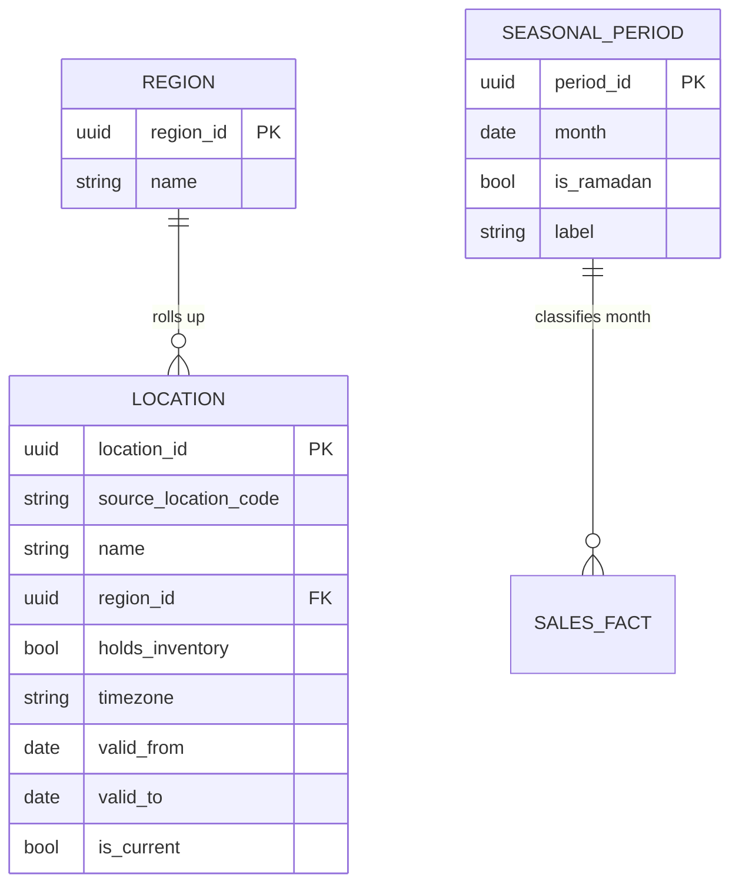
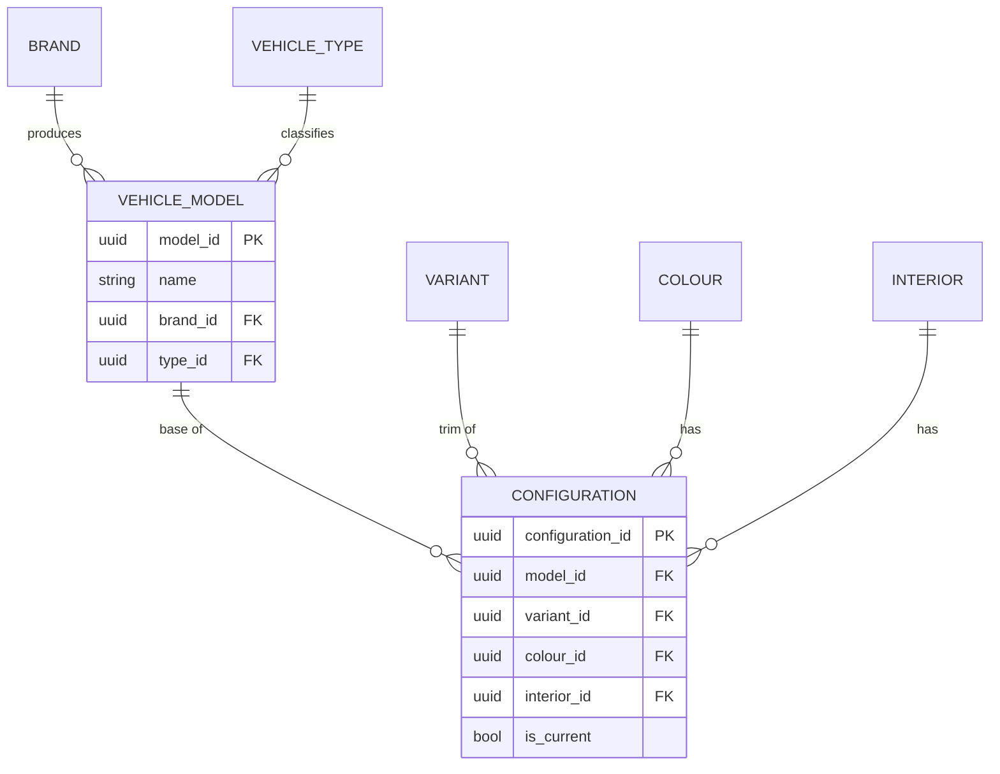
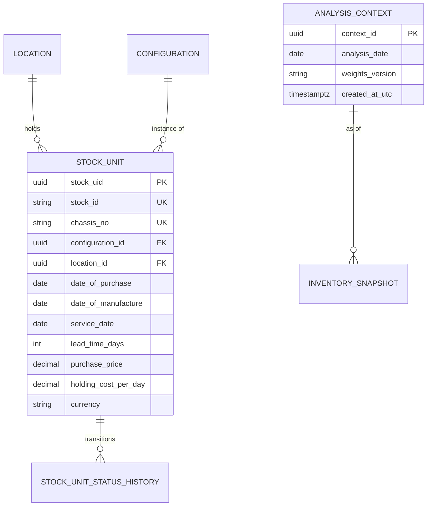
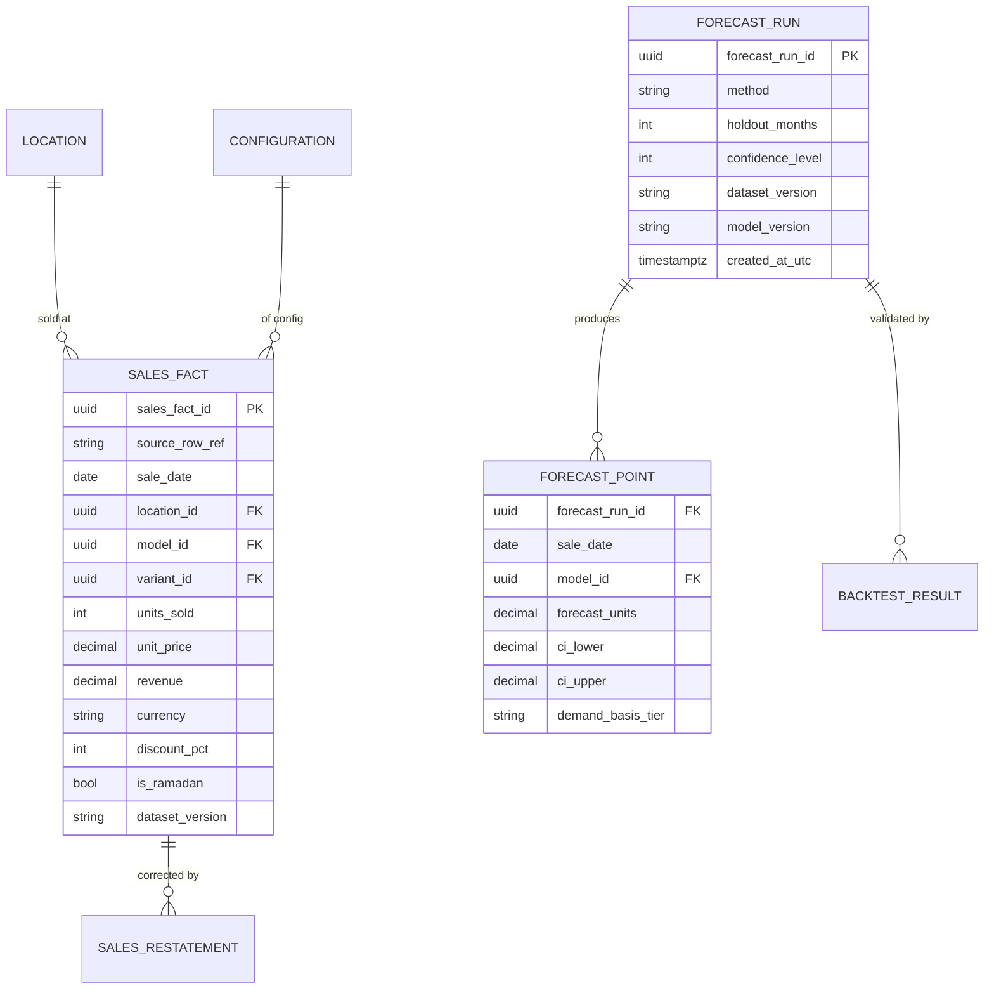
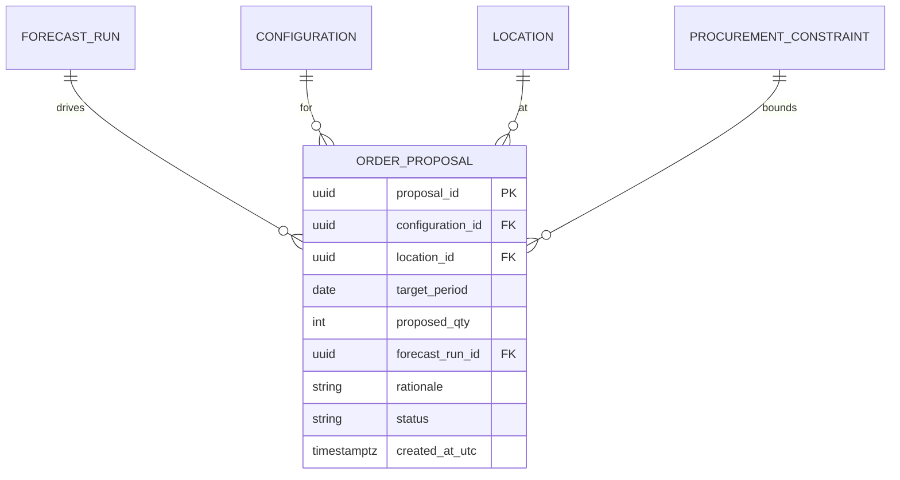
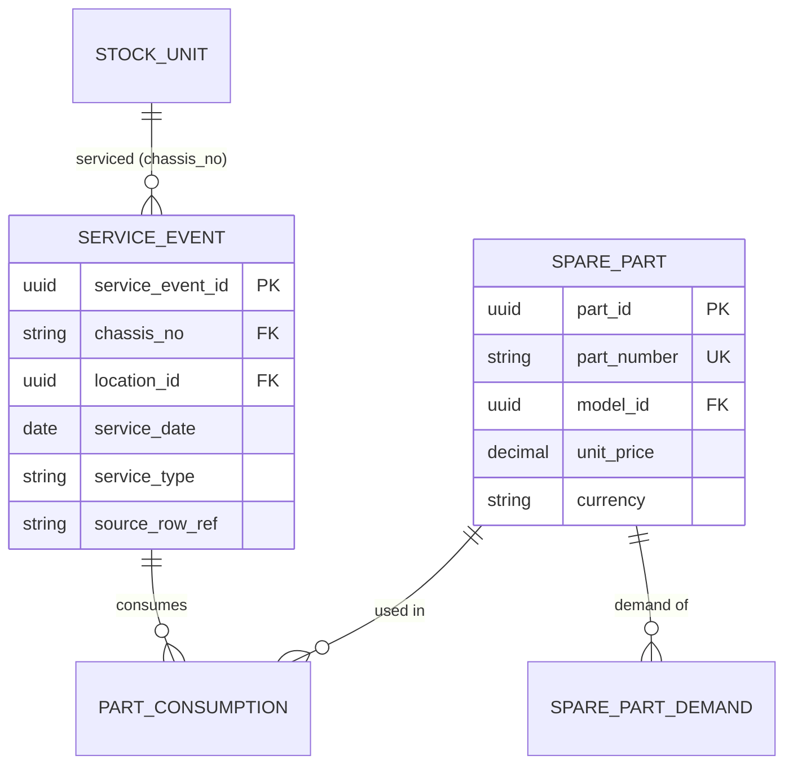
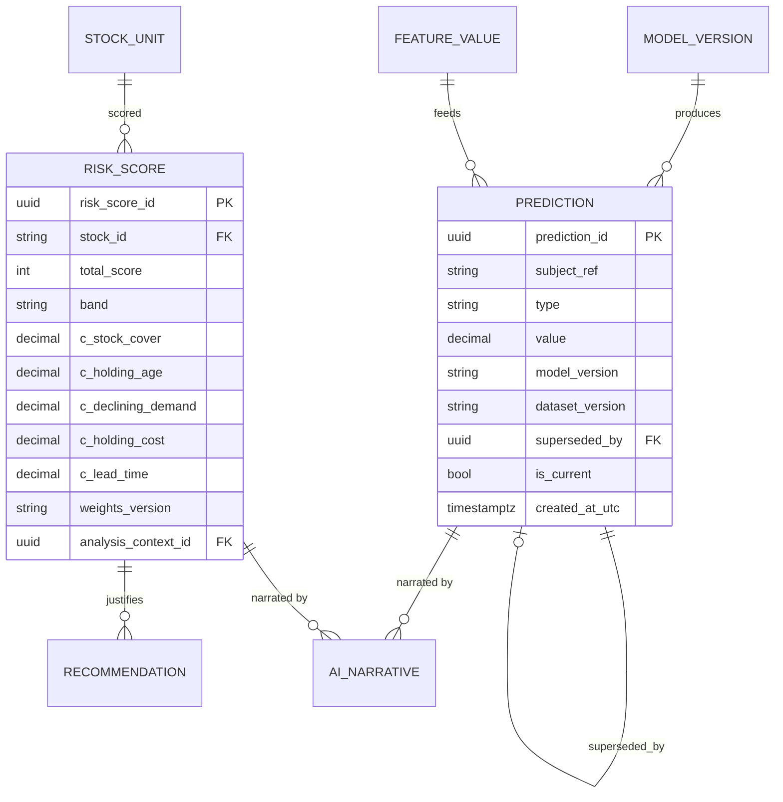
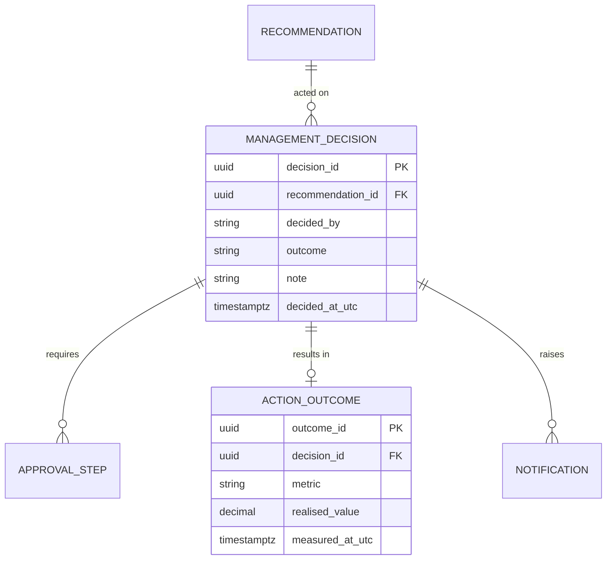
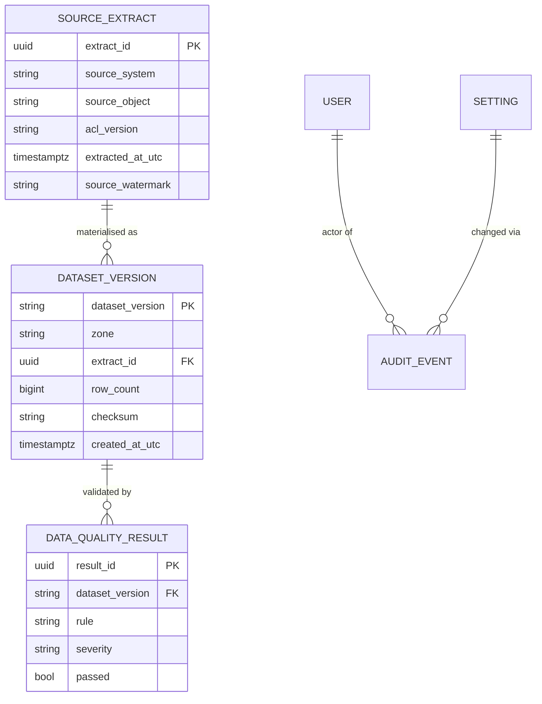

# Canonical Data Model

> The single, source-agnostic vocabulary of entities, keys and relationships that every BeeEye
> bounded context reads from and writes to — spanning all eight ADMC use cases from raw Oracle Fusion
> extracts through to grounded executive insights.

The canonical model is **not** a physical schema. It is the shared conceptual model that the physical
PostgreSQL tables, ADLS Gen2 curated datasets, and module contracts all conform to. Each bounded
context owns its slice; foreign concepts are referenced by stable identifier, never by copied mutable
state. Everything below is grounded in the real POC data (see
[DATA_DICTIONARY](../wireframes/docs/DATA_DICTIONARY.md)) and the target architecture; entities that
extend beyond the POC sample data (After-Sales, Spare Parts) are marked **future-state**.

## Modelling conventions (read first)

| Convention | Rule |
|------------|------|
| Grain of sales | Monthly period × `location` × `model` × `variant` (with `colour`, `interior`, `discount_pct`, `is_ramadan` as attributes). The POC has 3,120 such rows, Jan 2022 – Apr 2026. |
| Grain of inventory | One physical vehicle (`stock_id`, 291 units). |
| Demand join key | `location + model + variant`, with the documented four-tier fallback hierarchy for sparse cells (see [METHODOLOGY](../wireframes/docs/METHODOLOGY.md)). |
| Identifiers | Internal surrogate `uuid` PKs. Every entity that originates in a source system also carries the **source natural key** (e.g. `stock_id`, `chassis_no`) and lineage columns — never discarded. |
| Money | `decimal(18,2)` + explicit `currency` (SAR). **Never** `float`/`double`. |
| Time | Internal audit timestamps are UTC `timestamptz`; business dates (`sale_date`, `date_of_purchase`) stay as `date`; the originating local timezone (`Asia/Riyadh`) is preserved. |
| Derived records | Predictions, risk scores, recommendations and insights are **immutable** and stamped with the exact `dataset_version` / `model_version` / `feature_version` / `ruleset_version` that produced them. |

---

## Cluster 1 — Organisation

**Purpose.** The dealer/branch network, its regional roll-ups, and the seasonal calendar that drives
the `is_ramadan` business flag. Owned by the **Organisation** context; SCD Type-2 so that branch
re-organisations do not rewrite history.

| Entity | Purpose | Notable fields |
|--------|---------|----------------|
| `Region` | Roll-up of locations for executive reporting (UC8). | `region_id`, `name` |
| `Location` | The 15 sales locations. **Mecca holds no inventory** (`holds_inventory=false`); it appears in sales but not the 14-location inventory set. | `location_id`, `source_location_code`, `name`, `region_id`, `holds_inventory`, `timezone` (`Asia/Riyadh`), `valid_from`, `valid_to`, `is_current` |
| `SeasonalPeriod` | Calendar of Ramadan / national periods; resolves `is_ramadan` deterministically per month rather than trusting a free-text flag. | `period_id`, `month`, `is_ramadan`, `label` |

---

## Cluster 2 — Product & Configuration

**Purpose.** The vehicle taxonomy shared identically by sales and inventory. Owned by **MasterData**.
The sellable/stockable **Configuration** is the finest master grain; the coarser `model + variant` is
the demand grain used for forecasting and risk.

| Entity | Purpose | Notable fields |
|--------|---------|----------------|
| `Brand` | Nissan, Toyota, HAVAL, Lexus. | `brand_id`, `name` |
| `VehicleType` | SUV, Hatchback, Sedan, Luxury Sedan. | `type_id`, `name` |
| `VehicleModel` | Patrol, Corolla, Haval H9, Camry, ES 350. | `model_id`, `name`, `brand_id`, `type_id` |
| `Variant` | VX, ZX, MX. | `variant_id`, `name` |
| `Colour` / `Interior` | 5 colours, 4 interiors. | `colour_id`/`interior_id`, `name` |
| `Configuration` | The concrete sellable SKU (model+variant+colour+interior). SCD-2 so re-specced configs keep history. | `configuration_id`, `model_id`, `variant_id`, `colour_id`, `interior_id`, `valid_from`, `valid_to`, `is_current` |

---

## Cluster 3 — Inventory

**Purpose.** Physical stock, its aging, and holding-cost exposure (UC5). Owned by **Inventory**.
Derived measures (age, accumulated holding cost, aging band) are computed against a **configurable
Analysis Date** — never the silent system date — defaulting to 30 Jun 2026.

| Entity | Purpose | Notable fields |
|--------|---------|----------------|
| `StockUnit` | One physical vehicle (291 in POC). | `stock_id` (source PK), `chassis_no` (unique), `configuration_id`, `location_id`, `date_of_purchase`, `date_of_manufacture`, `service_date` *(meaning unconfirmed — displayed, **excluded from risk**)*, `lead_time_days`, `purchase_price` (decimal SAR), `holding_cost_per_day` (decimal SAR), `currency` |
| `StockUnitStatusHistory` | SCD/event log of status transitions (in-stock → reserved → transferred → sold). Append-only; supports late corrections. | `stock_id`, `status`, `effective_from`, `source_event_ref` |
| `AnalysisContext` | Named, reproducible "as-of" date + parameter set an analytics run pins to. | `context_id`, `analysis_date`, `weights_version`, `created_at_utc` |
| `InventorySnapshot` | Point-in-time frozen inventory position for reproducible reporting. | `snapshot_id`, `analysis_date`, `dataset_version` |

---

## Cluster 4 — Sales & Forecasts

**Purpose.** Actual sales history (UC2/UC3) and every forecast produced from it. Owned by
**SalesActuals** and **Forecasting**. Sales are append-only facts; corrections arrive as
**restatements**, not in-place edits (see cross-cutting rules).

| Entity | Purpose | Notable fields |
|--------|---------|----------------|
| `SalesFact` | Monthly sales row. `revenue` reconciles to `units_sold × unit_price × (1 − discount_pct/100)` on every row. | `sales_fact_id`, `source_row_ref`, `sale_date`, `location_id`, `model_id`, `variant_id`, `colour_id`, `interior_id`, `units_sold`, `unit_price` (decimal), `revenue` (decimal), `currency`, `discount_applied`, `discount_pct` (0/5/10/15/20), `is_ramadan`, `dataset_version` |
| `SalesRestatement` | Late-arriving correction to a prior period; carries the delta and reason, never overwrites the original. | `restatement_id`, `sales_fact_id`, `delta_units`, `delta_revenue`, `reason`, `effective_at_utc` |
| `ForecastRun` | One forecasting execution over a training window. Records the method chosen by lowest WMAPE. | `forecast_run_id`, `method` (naive / MA-3 / seasonal-naive / Holt-Winters), `train_window`, `holdout_months` (3/6/12), `confidence_level` (80/90/95), `dataset_version`, `model_version`, `created_at_utc` |
| `ForecastPoint` | Per period × demand-cell forecast. | `forecast_run_id`, `sale_date`, `location_id`, `model_id`, `variant_id`, `forecast_units` (decimal), `ci_lower`, `ci_upper`, `demand_basis_tier` (fallback tier used) |
| `BacktestResult` | Holdout accuracy per method/cell. | `forecast_run_id`, `wmape`, `mae`, `rmse`, `bias`, `over_forecast_freq`, `under_forecast_freq` |

---

## Cluster 5 — Procurement

**Purpose.** Turning forecasts and stock-cover into recommended monthly order quantities (UC1, UC4)
and pause/reduce signals. Owned by **Procurement**. Proposals are decision-support artefacts that
enter the Workflow cluster for human approval — nothing is auto-ordered.

| Entity | Purpose | Notable fields |
|--------|---------|----------------|
| `OrderProposal` | Recommended order quantity for a config × location for a target period. | `proposal_id`, `configuration_id`, `location_id`, `target_period`, `proposed_qty`, `forecast_run_id`, `rationale`, `status`, `created_at_utc` |
| `ProcurementConstraint` | Business limits applied to proposals (MOQ, budget cap in SAR, lead-time buffer). | `constraint_id`, `scope`, `moq`, `budget_cap` (decimal), `lead_time_buffer_days` |
| `SupplierLeadTime` | Reference lead time by brand/model; POC derives `lead_time_days = purchase − manufacture`. | `brand_id`, `model_id`, `expected_lead_time_days` |

---

## Cluster 6 — After-Sales *(future-state)*

**Purpose.** Service demand and its correlation with sales (UC6), and spare-parts demand prediction
(UC7). **Not present in POC sample data** — modelled here for the target platform. Owned by
**AfterSales** and **SpareParts**. Linked to vehicles via `chassis_no`.

| Entity | Purpose | Notable fields |
|--------|---------|----------------|
| `ServiceEvent` | A workshop/after-sales visit for a vehicle. | `service_event_id`, `chassis_no`, `location_id`, `service_date`, `service_type`, `mileage`, `source_row_ref` |
| `SparePart` | Part master with model applicability. | `part_id`, `part_number`, `description`, `model_id`, `unit_price` (decimal), `currency` |
| `PartConsumption` | Parts used per service event — the link that powers sales↔after-sales correlation. | `service_event_id`, `part_id`, `qty_used` |
| `SparePartDemand` | Monthly parts demand history + forecast basis (UC7). | `part_id`, `location_id`, `period`, `units`, `dataset_version` |

---

## Cluster 7 — Analytics & AI

**Purpose.** The explainable analytical outputs and their provenance: feature values, model versions,
immutable predictions, the additive risk score, rule-based recommendations, and GenAI narratives.
Owned by **ModelsAndExperiments**, **Predictions**, **Recommendations**, **ExecutiveInsights**.

> **Hard boundary.** Generative AI may only *narrate* metrics already computed by the engine. It must
> **never** compute forecasts, risk probabilities, values, quantities or decisions. Every `AiNarrative`
> references the exact metric records it describes.

| Entity | Purpose | Notable fields |
|--------|---------|----------------|
| `ModelVersion` | An MLflow-registered model/algorithm version. | `model_version`, `algorithm`, `hyperparameters`, `trained_on_dataset_version`, `registered_at_utc` |
| `FeatureValue` | A computed feature for a cell (demand velocity, stock-cover months, demand trend). | `feature_id`, `feature_name`, `feature_version`, `cell_key`, `value`, `analysis_context_id` |
| `Prediction` | **Immutable** forecast/score record. Superseded, never edited. | `prediction_id`, `subject_ref`, `type`, `value`, `model_version`, `dataset_version`, `superseded_by`, `is_current`, `created_at_utc` |
| `RiskScore` | Additive 0–100 score with full component breakdown. Bands: Low 0–34 · Med 35–59 · High 60–79 · Crit 80–100. | `risk_score_id`, `stock_id`, `total_score`, `band`, `c_stock_cover` (30%), `c_holding_age` (25%), `c_declining_demand` (20%), `c_holding_cost` (15%), `c_lead_time` (10%), `weights_version`, `analysis_context_id` |
| `Recommendation` | Rule-based action: Retain / Transfer / Promotion / Controlled discount (0–20%) / Pause procurement / Liquidate / Investigate. | `recommendation_id`, `subject_ref`, `action`, `rationale`, `evidence`, `expected_outcome`, `confidence`, `assumptions`, `ruleset_version` |
| `AiNarrative` | Grounded natural-language insight over validated metrics only. | `narrative_id`, `subject_ref`, `text`, `grounding_refs[]`, `model_alias`, `dataset_version` |

---

## Cluster 8 — Workflow

**Purpose.** The human decision loop. **Human approval is required before any recommended action is
executed.** Owned by **DecisionsAndOutcomes** and **Notifications**. Every decision links back to the
exact immutable recommendation it acted on.

| Entity | Purpose | Notable fields |
|--------|---------|----------------|
| `ManagementDecision` | A human's response to a recommendation (approve / reject / modify). | `decision_id`, `recommendation_id`, `decided_by`, `outcome`, `note`, `decided_at_utc` |
| `ApprovalStep` | Multi-step approval chain state. | `step_id`, `decision_id`, `approver_role`, `status`, `acted_at_utc` |
| `ActionOutcome` | Realised result tracked after execution (closes the learning loop). | `outcome_id`, `decision_id`, `metric`, `realised_value`, `measured_at_utc` |
| `Notification` | Alert on risk thresholds / pending approvals. | `notification_id`, `channel`, `subject_ref`, `severity`, `sent_at_utc` |

---

## Cluster 9 — Platform Operations

**Purpose.** Cross-cutting operational entities: identity & RBAC, ingestion lineage from Oracle
Fusion, data-quality gating, immutable audit, and configurable settings. Owned by **Identity**,
**Integration**, **DataQuality**, **Audit**, **PlatformAdministration**.

| Entity | Purpose | Notable fields |
|--------|---------|----------------|
| `User` / `Role` | Entra ID principals mapped to the Exec / Analyst / IT personas. | `user_id` (Entra OID), `role` (Exec/Analyst/IT), `location_scope[]` |
| `SourceExtract` | One governed pull from Oracle Fusion (system of record, read-only via the anti-corruption layer). | `extract_id`, `source_system`, `source_object`, `acl_version`, `extracted_at_utc`, `source_watermark` |
| `Dataset` / `DatasetVersion` | Immutable, versioned dataset snapshot per ADLS zone (raw/validated/curated/quarantine/model-input/model-output/export). | `dataset_version`, `zone`, `extract_id`, `row_count`, `checksum`, `created_at_utc` |
| `DataQualityResult` | Outcome of a validation rule; failing rows route to the quarantine zone. | `result_id`, `dataset_version`, `rule`, `severity`, `passed`, `failing_row_refs[]` |
| `AuditEvent` | Append-only record of every consequential action. | `audit_id`, `actor`, `action`, `subject_ref`, `at_utc`, `before_hash`, `after_hash` |
| `Setting` | Configurable parameters (risk weights, aging thresholds, analysis date) — the productionised "POC Settings" screen. | `setting_key`, `value`, `version`, `changed_by`, `changed_at_utc` |

---

## Cross-cutting rules

These invariants hold across **every** cluster and are non-negotiable.

### 1. Preserve source identifiers and timestamps
Every entity sourced from Oracle Fusion keeps its **natural key** (`stock_id`, `chassis_no`,
`source_row_ref`) alongside the internal `uuid`, plus lineage columns (`source_system`, `extract_id`,
`extracted_at_utc`, `source_updated_at`). Source references are never discarded — full lineage back to
the originating row is always reconstructable (required for auditability and the anti-corruption layer).

### 2. Version everything derived
Any computed record is stamped with the exact versions that produced it:
`dataset_version`, `model_version`, `feature_version`, `ruleset_version`, `weights_version`.
Given a `Prediction`, `RiskScore`, `Recommendation` or `AiNarrative`, the precise inputs and logic are
reproducible. Changing risk weights or thresholds creates a **new** `weights_version`; it never
retroactively alters existing scores.

### 3. UTC internally, local timezone preserved
Audit/event timestamps are UTC `timestamptz` (`*_at_utc`). Business dates that carry no clock component
(`sale_date` as month-start, `date_of_purchase`, `date_of_manufacture`) stay as `date`. The originating
local timezone (`Asia/Riyadh`) is preserved so local reporting boundaries remain correct. The inventory
**Analysis Date** is always an explicit, pinned `AnalysisContext` — never the silent system clock.

### 4. Decimal money with explicit currency — never float
All monetary fields are `decimal(18,2)` accompanied by a `currency` column (`SAR` throughout the POC).
Binary floating point is prohibited for money. No implicit currency conversion; a value without its
currency is invalid. This preserves the row-level revenue reconciliation
(`revenue = units × price × (1 − discount%/100)`) and the ~SAR 46.75M inventory capital total.

### 5. Slowly-changing dimensions where history matters
`Location`, `Configuration` and other master entities are **SCD Type-2** (`valid_from`, `valid_to`,
`is_current`) so historical facts always resolve against the dimension state that was true when the fact
occurred. Reference lookups that carry no analytical history (e.g. `Colour`) may be Type-1.

### 6. Late-arriving data, corrections and reversals
Facts are **append-only**. A correction to a posted period is a `SalesRestatement` (or a reversal +
re-post), carrying the delta, reason and `effective_at_utc` — the original row is preserved. Stock
status changes append to `StockUnitStatusHistory`. This keeps every prior report reproducible and every
change explainable.

### 7. Never silently mutate historical predictions
`Prediction`, `RiskScore`, `Recommendation` and `AiNarrative` are immutable once written. A re-run
inserts a **new** record and sets the previous one's `superseded_by` / `is_current=false`. History of
what the platform said, when, and on what basis is therefore permanent — essential for trust, audit,
and the human-approval workflow.

### 8. Demand join key and fallback provenance
The `location + model + variant` join key is canonical for demand. Where a cell is sparse, the four-tier
fallback hierarchy applies and the **tier actually used** is persisted on the record
(`demand_basis_tier`) — a missing combination is never silently treated as zero demand.

---

## Traceability

| Related document | Relationship |
|------------------|--------------|
| [DATA_DICTIONARY](../wireframes/docs/DATA_DICTIONARY.md) | Source field-level definitions for Sales & Inventory clusters. |
| [DERIVED_METRICS](../wireframes/docs/DERIVED_METRICS.md) | Formulae behind `FeatureValue`, `RiskScore` and forecast-accuracy entities. |
| [METHODOLOGY](../wireframes/docs/METHODOLOGY.md) | Forecasting, the additive risk model, and the demand fallback hierarchy. |
| [ASSUMPTIONS_LIMITATIONS](../wireframes/docs/ASSUMPTIONS_LIMITATIONS.md) | Analysis-Date, `service_date`, and sparse-demand assumptions reflected above. |
| [INTEGRATION_AZURE_ORACLE](../wireframes/docs/INTEGRATION_AZURE_ORACLE.md) | Oracle Fusion ingestion and lineage feeding the Platform Operations cluster. |
| `./bounded-contexts.md` | Ownership map from clusters/entities to the 19 bounded contexts. |
| `./data-platform-and-storage.md` | Physical PostgreSQL schema and ADLS Gen2 zone realisation of this model. |
| `./integration-and-acl.md` | The versioned anti-corruption layer that maps Oracle Fusion into these entities. |
