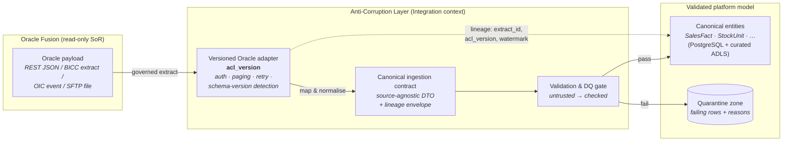
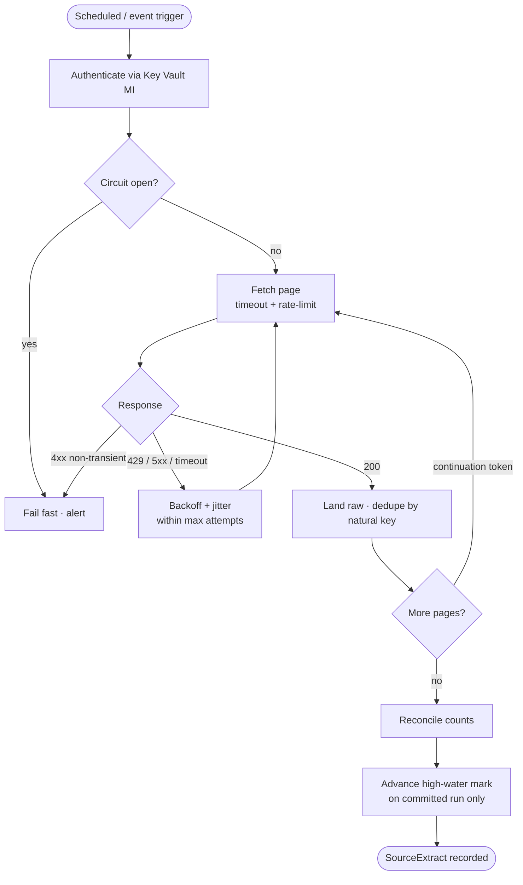
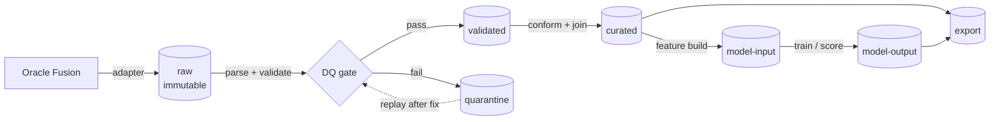
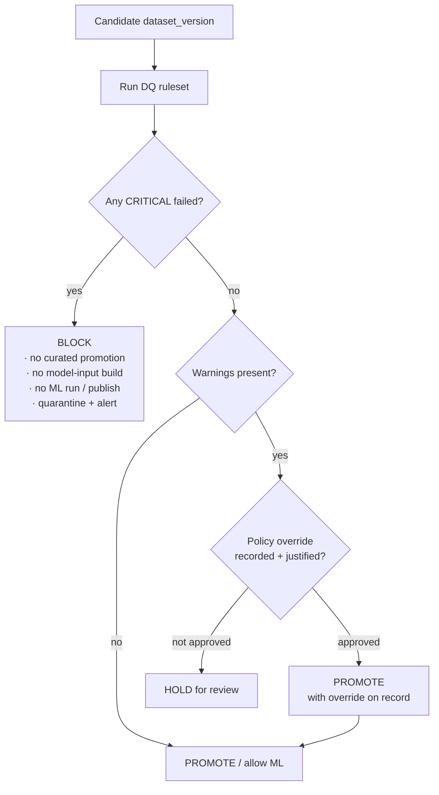

# Data Integration (Oracle ACL) & Data Quality

> How BeeEye pulls read-only extracts from Oracle Fusion through a versioned anti-corruption layer, lands them in a zoned ADLS Gen2 lakehouse, and gates every dataset through a data-quality framework before any model is allowed to run or publish.

Oracle Fusion is ADMC's **system of record** for sales, inventory, finance and after-sales. BeeEye
treats it as **read-only** and **untrusted at the boundary**: nothing is written back, and no source
payload is believed until it has passed validation. This document specifies the anti-corruption layer
(ACL), the source-adapter concerns and modes, the ADLS zone model, and the data-quality gates that
stand between raw Oracle bytes and a curated figure an executive can act on. Everything here productionises
the POC's [Integration Blueprint](../wireframes/docs/INTEGRATION_AZURE_ORACLE.md) and is grounded in the
real POC data described in [DATA_DICTIONARY](../wireframes/docs/DATA_DICTIONARY.md).

Ownership: the **Integration** bounded context owns extraction and the ACL; **DataQuality** owns rules,
results and gates; **Audit** records lineage. See [canonical-data-model.md](./canonical-data-model.md)
Cluster 9 (Platform Operations) for the persisted entities (`SourceExtract`, `DatasetVersion`,
`DataQualityResult`).

---

## 1. Position: Oracle Fusion is read-only, and untrusted

| Principle | Consequence |
|-----------|-------------|
| **Read-only system of record.** | BeeEye never issues writes, updates or workflow calls to Oracle Fusion. Recommendations require human approval and are actioned in enterprise systems by humans, outside BeeEye. |
| **Boundary is a contract, not a coupling.** | Oracle's field names, codes, date encodings and quirks stop at the ACL. Downstream contexts speak only the [canonical model](./canonical-data-model.md); an Oracle schema change is absorbed by a new adapter version, not a ripple through 19 contexts. |
| **Source data is untrusted.** | Every extract is validated (Section 7) before promotion. Failing rows are quarantined, never silently dropped or coerced. |
| **Lineage is permanent.** | Every canonical record keeps its source natural key (`stock_id`, `chassis_no`, `source_row_ref`), `extract_id`, `acl_version` and `extracted_at_utc`. Any curated figure is traceable back to the originating source row. |
| **No silent "now".** | Extraction watermarks and business `analysis_date` are explicit; ingestion never depends on the wall clock to decide what is "new". |

---

## 2. The Anti-Corruption Layer (ACL)

The ACL is a **four-stage, versioned** transformation. Each stage has a distinct responsibility and a
distinct artefact, so a failure or drift can be localised precisely.

| Stage | Input | Output | Responsibility |
|-------|-------|--------|----------------|
| **1. Oracle payload** | Oracle Fusion object (REST resource, BICC business view, OIC message, SFTP file) | Raw bytes | The unmodified source representation. Landed to the **raw** zone byte-for-byte before anything reads it. |
| **2. Versioned Oracle adapter** | Raw payload | Typed source records | Oracle-specific concerns: auth, pagination, retry, rate-limit, schema-version detection. Stamped with `acl_version`. This is the **only** code that knows Oracle field names/codes. |
| **3. Canonical ingestion contract** | Typed source records | Source-agnostic ingestion DTOs + lineage envelope | Maps Oracle vocabulary to canonical vocabulary (e.g. Oracle location code → `source_location_code`; Excel serial → ISO `date`). Pure, deterministic, unit-testable. |
| **4. Validated platform model** | Ingestion DTOs | Canonical entities in PostgreSQL / curated ADLS | Only rows that pass the DQ gate (Section 7) are promoted. Failures route to quarantine with reasons. |

**Versioning rule.** The adapter and the contract each carry a version. A backward-compatible Oracle
change (new optional field) bumps the adapter's minor version; a breaking change (renamed/removed field,
new required code) forces a **new `acl_version`** running side-by-side until cutover. `SourceExtract`
records the exact `acl_version` used, so a re-run is reproducible and a bad adapter version is isolatable.

---

## 3. Adapter concerns

Every source adapter implements the same resilience and correctness envelope, regardless of mode. These
are not optional add-ons; they are the contract of "governed extraction".

| Concern | Behaviour |
|---------|-----------|
| **Authentication** | OAuth2 client-credentials / JWT assertion to Oracle Fusion; secrets from **Key Vault via managed identity** only — never in images, config or client code. Tokens are short-lived and refreshed ahead of expiry. |
| **Pagination** | Cursor/offset paging with a bounded page size; the adapter walks all pages to completion and records page counts. Partial page walks are treated as failures, not partial success. |
| **Rate limiting** | Client-side token-bucket throttle honouring Oracle's published limits and `Retry-After`; concurrency capped per source object to avoid overwhelming Fusion. |
| **Retry with backoff + jitter** | Transient failures (429, 5xx, timeouts, connection resets) retried with **exponential backoff + full jitter**, bounded max attempts. Non-transient errors (4xx auth/validation) fail fast — no retry. |
| **Timeout** | Per-request and per-page deadlines; a run has an overall budget. A stuck source cannot hang a job indefinitely. |
| **Circuit breaker** | Repeated failures against a source open the breaker; subsequent calls fail fast for a cool-down window, then half-open to probe recovery. Protects both BeeEye jobs and Fusion. |
| **Incremental extraction** | Default mode is delta, not full. Uses a source change marker (`LastUpdateDate` / `SysEffectiveDate` / BICC extract sequence) to pull only records changed since the last successful run. |
| **High-water marks** | Each `SourceExtract` persists `source_watermark` (the max change-marker consumed). The next run resumes from it. Watermarks advance **only** on a fully validated, committed run. |
| **Continuation tokens** | Where Oracle returns opaque continuation/cursor tokens, they are checkpointed so a long extract can resume mid-stream without re-reading completed pages. |
| **Correlation & source IDs** | Every run has a `correlation_id` threaded through logs/traces (OpenTelemetry) and stamped on landed rows; every canonical row keeps its `source_row_ref` / natural key. |
| **De-duplication** | Idempotent by natural key + change marker. Re-delivered or overlapping-window records are collapsed to the latest version; replays never double-count (critical for the 3,120-row sales grain and 291 stock units). |
| **Schema-version detection** | The adapter fingerprints the payload shape (field set, types, code domains) and asserts it matches the expected `acl_version` contract. An unrecognised shape halts promotion and raises a `schema-drift` issue rather than mis-mapping. |
| **Dead-letter / quarantine** | Un-parseable payloads or rows failing critical rules are written to the **quarantine** zone with the raw content, `extract_id`, rule id and reason — retained for investigation and replay, never discarded. |
| **Reconciliation counts** | Source-reported counts (extract manifest / `SELECT COUNT`) are compared to landed, validated and rejected counts. A mismatch fails the run (Section 7, `reconciliation` category). |
| **Replay from checkpoint** | Any run is re-runnable from its watermark/continuation checkpoint. Because raw is immutable and derived records are versioned, a replay reproduces or supersedes cleanly — it never corrupts prior state. |

---

## 4. Source-adapter modes

Oracle Fusion exposes data through several mechanisms; ADMC's landscape and volumes decide which is used
per object. All modes converge on the **same canonical ingestion contract** — downstream contexts cannot
tell (and must not care) which mode delivered a row.

| Mode | Transport | Best for | Notes |
|------|-----------|----------|-------|
| **REST** | Fusion REST APIs (paged JSON) | Low-latency, near-real-time reads of modest volumes; reference/master data | Incremental via `q=LastUpdateDate>…`; watermark on update date. Rate-limit sensitive. |
| **BICC** | Business Intelligence Cloud Connector extracts → object storage | High-volume bulk fact extraction (sales/inventory history) | Governed, offset-based extract sequences; ideal for the monthly sales grain and full/incremental fact loads. |
| **OIC** | Oracle Integration Cloud events / integrations | Event-driven pushes, orchestrated flows | BeeEye consumes onto **Azure Service Bus**; adapter treats messages as another source payload. |
| **SFTP** | Scheduled file drop (secure) | Batch handoff where direct API access is restricted | Files land to the raw zone; checksum + manifest verified before parse. |
| **CSV** | Delimited files (SFTP / landing zone) | Manual or legacy extracts, one-off backfills | Strict schema + type parsing; header contract asserted; encoding pinned (UTF-8). |
| **Parquet** | Columnar files (ADLS / BICC output) | Large curated extracts, efficient re-processing | Preferred lake format for validated/curated zones; schema embedded, enabling `schema-drift` detection. |
| **Landing zone** | ADLS Gen2 drop container (any of the above outputs) | The common inbox all file-based modes write into | A watcher triggers ingestion (Service Bus / Container Apps Job); the landing drop is copied to immutable raw, then processed. |
| **Synthetic-demo** | Deterministically generated in-process from an already-ingested source object | Demonstrating a use case whose real feeds are not yet onboarded (UC6/UC7) | `source_system = "synthetic-demo"`; clearly labelled, never presented as real. See §4.1. |

Adapters are **pluggable behind one `ISourceAdapter` port**: each mode is a driver implementing the
Section 3 envelope. Adding a mode (or a new Oracle object) is a new driver + contract mapping, not a
change to DataQuality, Forecasting or any downstream context.

### 4.1 Synthetic-demo data (UC6 / UC7)

The POC sample ships **sales history and inventory only** — it has no service events, warranty/recall
records, odometer readings, parts catalogue, part usage or part stock. UC6 (Sales vs After-Sales
Correlation) and UC7 (Spare Parts Demand Prediction) therefore cannot be computed from it directly. To
make these use cases exercisable end-to-end, BeeEye ships a **deterministic synthetic generator**
(`BeeEye.Persistence.SyntheticData.SyntheticAfterSalesImporter`) that derives a plausible, reproducible
after-sales & parts dataset **from the real sales facts**, so the correlations UC6/UC7 surface track the
real sales mix rather than noise.

Rules this data honours (identical discipline to the `SampleDataImporter`):

- **Always labelled synthetic.** Every generated row carries `source_system = "synthetic-demo"` on its
  ingestion batch, and every UC6/UC7 API response and screen discloses `provenance: "synthetic-demo"`.
  It is **never** presented as real after-sales data or as Oracle Fusion.
- **Deterministic, no unseeded randomness.** All variation comes from a SplitMix64 PRNG seeded from a
  hash of a stable key (VIN, month, event index). No `Random()`, no wall clock in generation. Same
  inputs ⇒ identical output ⇒ ingestion is idempotent (a re-run with the same checksum is skipped;
  a generation-logic change purges the stale dataset and regenerates exactly one).
- **PII minimisation.** VINs are synthetic surrogates (prefixed `SYN`); no customer names, contacts or
  personal identifiers exist anywhere in the generated data.
- **Zeros are real signal.** Parts demand series are built as a dense monthly grid with explicit zeros,
  so UC7's intermittent-demand methods (Croston/SBA/TSB) see genuine inter-demand intervals.

**Real source datasets that replace it.** When ADMC onboards the real feeds, the synthetic adapter is
removed and these Oracle Fusion objects flow through the ACL exactly like sales/inventory today — the
required fields are specified in the use-case docs:
[UC6 §3 Required source datasets](../product/use-cases/uc6-sales-aftersales-correlation.md#3-required-source-datasets)
(`service_orders`, `service_order_lines`, `vehicle_master`, `warranty_recall`, `odometer_readings`,
`workshop_capacity`) and
[UC7 §2 Required inputs](../product/use-cases/uc7-spare-parts-demand-prediction.md#2-scope--data-honesty-poc-vs-target-state)
(part master, model-to-part compatibility, supersession/alternate relationships, service/work-order
lines, parts issues, on-hand + inbound stock, lead time, emergency-procurement history). Because every
UC6/UC7 metric is computed by the same deterministic analytics regardless of source, swapping synthetic
for real is an ingestion change, not an analytics change.

---

## 5. Canonical ingestion contract — treat source data as untrusted

The contract is the source-agnostic DTO plus a **lineage envelope**. Mapping from Oracle to canonical is
pure and deterministic. Before any DTO becomes a platform entity it passes the validation list below;
these mirror the invariants the POC data already satisfies (see [DATA_DICTIONARY](../wireframes/docs/DATA_DICTIONARY.md)
and [DERIVED_METRICS](../wireframes/docs/DERIVED_METRICS.md)).

**Lineage envelope (on every ingested row):** `source_system`, `source_object`, `extract_id`,
`acl_version`, `source_row_ref`, `source_natural_key`, `source_updated_at`, `extracted_at_utc`,
`correlation_id`.

**Validation list (untrusted-source checks):**

- **Types & encodings** — parse, don't trust: Excel serial dates → ISO `date`; numerics are real numbers; text is UTF-8; booleans normalised (`"Yes"/"No"`, `"True"/"False"` → bool). A parse failure quarantines the row.
- **Required fields present** — e.g. `stock_id`, `chassis_no`, `sale_date`, `location`, `model`, `variant`, `units_sold`, `unit_price`, `revenue`, `currency`. Missing required → reject.
- **Domain / enum membership** — `discount_pct ∈ {0,5,10,15,20}`; `brand ∈ {Nissan, Toyota, HAVAL, Lexus}`; `type ∈ {SUV, Hatchback, Sedan, Luxury Sedan}`; `variant ∈ {VX, ZX, MX}`; `currency = SAR`. Unknown codes are flagged, not silently mapped.
- **Money is decimal + currency** — monetary fields parse to `decimal(18,2)` with an explicit `currency`; binary float is rejected. A value without its currency is invalid.
- **Row-level reconciliation** — `revenue == units_sold × unit_price × (1 − discount_pct/100)` (sales); `lead_time_days == date_of_purchase − date_of_manufacture` (inventory). Tolerance is defined per rule; violations quarantine.
- **Key integrity** — `stock_id` unique (PK); `chassis_no` unique; sales grain unique on period × `location` × `model` × `variant` × config attributes.
- **Referential validity** — every `location`, `model`, `variant`, `colour`, `interior` resolves against MasterData; **Mecca is expected in sales but absent from inventory** (14 inventory locations vs 15 sales locations) and is handled, not treated as an error.
- **Temporal sanity** — dates within plausible windows (sales Jan 2022–present; `date_of_manufacture` precedes `date_of_purchase`); no future business dates beyond an allowed grace.
- **Unconfirmed semantics preserved** — `service_date` is carried through but **flagged as unconfirmed and excluded from risk scoring** downstream (never invented meaning).
- **No injection / control chars** — text fields sanitised of control characters; the adapter never `eval`s or interpolates source strings into queries or prompts.

Rows that pass become canonical entities; rows that fail become `DataQualityResult` records with
`failing_row_refs` pointing into quarantine. **The mapper never coerces a bad value into a plausible one.**

---

## 6. ADLS Gen2 zones — never overwrite raw

The lakehouse is a set of purpose-scoped zones. Data moves **forward only**; each promotion is a new,
immutable `DatasetVersion` (with `row_count` and `checksum`). Raw is the permanent source of truth for
replay and audit.

| Zone | Contents | Mutability | Written by |
|------|----------|------------|------------|
| **raw** | Byte-for-byte Oracle payloads exactly as extracted | **Immutable, append-only — never overwritten** | Source adapters |
| **validated** | Parsed, typed, canonical-contract rows that **passed** DQ | Immutable versions | ACL / DataQuality |
| **curated** | Business-ready modelled datasets (joined, conformed, demand cells) | Immutable versions | Curation jobs |
| **quarantine** | Rows that **failed** validation, with raw content + rule + reason | Append-only | DataQuality |
| **model-input** | Feature/training frames pinned to a `dataset_version` | Immutable versions | ML feature jobs |
| **model-output** | Forecasts, risk scores, SHAP artefacts from ML runs | Immutable versions | ML jobs |
| **export** | Report extracts / downloads for the app and users | Immutable versions | Reporting/export |

**Invariants.** (1) A promotion **reads** the prior zone and **writes a new version** in the next — it
never edits in place. (2) `raw` is written once per extract and never mutated; a re-extract is a *new*
`SourceExtract` and a *new* raw version, so history is complete. (3) `curated`, `model-input` and
`model-output` are stamped with the `dataset_version` / `model_version` that produced them, so any
executive figure is reproducible end-to-end.

---

## 7. Data-quality framework

Validation is expressed as **rules**, each in a **category**, each producing a typed **issue**. Rules run
at ingestion (contract stage) and again on curated datasets before ML consumes them.

### 7.1 Rule categories

| Category | Question it answers | Grounded examples |
|----------|--------------------|-------------------|
| **Completeness** | Are required values present? | No null `stock_id` / `sale_date` / `revenue`; expected months present per active demand cell. |
| **Uniqueness** | Are keys unique? | `stock_id` PK unique; `chassis_no` unique; one sales row per period × location × model × variant × config. |
| **Validity** | Is each value well-formed and in-domain? | `discount_pct ∈ {0,5,10,15,20}`; `currency = SAR`; parseable dates; `brand`/`type`/`variant` in domain. |
| **Consistency** | Do related fields agree? | `revenue = units × price × (1 − discount%/100)`; `lead_time_days = purchase − manufacture`; `discount_applied` matches `discount_pct > 0`. |
| **Timeliness** | Is the data fresh and on-time? | Extract landed within its window; watermark advanced; no unexpected gap in the monthly cadence. |
| **Referential integrity** | Do foreign concepts resolve? | Every `location`/`model`/`variant`/`colour`/`interior` exists in MasterData; Mecca-has-no-inventory is a *known* asymmetry, not a violation. |
| **Reconciliation** | Do counts and totals tie out? | Source count = landed + rejected; inventory capital ≈ SAR 46.75M; aggregate holding cost ≈ SAR 3,235/day within tolerance. |
| **Distribution anomaly** | Has the data's shape shifted unexpectedly? | Sudden spike in units, revenue or discount mix vs trailing baseline; unexpected surge in null rate. |
| **Schema drift** | Has the source structure changed? | New/renamed/removed field, changed type, new enum code vs the expected `acl_version` contract. |

### 7.2 Issue shape

Every rule evaluation yields a structured issue (persisted as `DataQualityResult`, see
[canonical-data-model.md](./canonical-data-model.md) Cluster 9):

| Field | Meaning |
|-------|---------|
| `result_id` | Unique id of this evaluation. |
| `rule_id` / `rule_name` | Which rule fired. |
| `category` | One of the nine categories above. |
| `severity` | `critical` (blocking) or `warning` (non-blocking, policy-overridable). |
| `dataset_version` | The dataset evaluated. |
| `zone` | Zone the rule ran in (validated / curated / model-input). |
| `passed` | Boolean outcome. |
| `observed` / `expected` | Measured value vs threshold/domain (e.g. `count=3118` vs `expected=3120`). |
| `failing_row_refs[]` | `source_row_ref`s of offending rows → quarantine. |
| `correlation_id` / `extract_id` | Lineage back to the run and source. |
| `evaluated_at_utc` | When it ran. |

### 7.3 Critical gates block model publish/run

Severity drives the gate. The rule is simple and hard:

- **Critical failure ⇒ block.** A failed `critical` rule stops the dataset from being promoted to
  curated, stops the `model-input` build, and **stops any model run or publish**. Forecasts, risk scores
  and recommendations are never produced from data that failed a critical gate. Rows are quarantined and
  the run alerts (Notifications context).
- **Warning ⇒ proceed, or override with policy.** A `warning` (e.g. a mild distribution anomaly) does
  not block by default. Where a warning *is* configured to block, an authorised user can record a
  **policy override** — an explicit, audited, justified decision — to proceed. The override is stamped on
  the `dataset_version` and written to the immutable Audit trail; it is never a silent skip.
- **Determinism.** Which rules are critical vs warning, and their thresholds, are **configurable settings**
  (versioned, like risk weights) — not hard-coded. Changing a threshold creates a new ruleset version and
  never retroactively rewrites past results.

This gate is the enforcement point behind the platform guardrail that **GenAI may narrate only validated
metrics**: if the underlying dataset did not pass, there is no validated metric to narrate.

---

## 8. Mock Oracle server & contract fixtures (testability)

The ACL is testable **without** a live Oracle Fusion tenant, so the pipeline can be exercised
deterministically in CI and locally.

| Test asset | Purpose |
|------------|---------|
| **Mock Oracle server** | A local stub implementing the Fusion REST/BICC/OIC surfaces the adapters call: pagination, `Retry-After`/429s, 5xx bursts, slow responses and auth-expiry — so retry, backoff+jitter, rate-limit, timeout and circuit-breaker behaviour are verified against reproducible failure modes. |
| **Contract fixtures** | Golden Oracle payloads (REST JSON, BICC extract samples, CSV/Parquet files) pinned per `acl_version`, paired with the **expected canonical output**. Any mapping regression fails the contract test. |
| **Schema-drift fixtures** | Deliberately mutated payloads (renamed field, new enum code, type change) assert the adapter *detects drift and halts* rather than mis-mapping. |
| **Quality-gate fixtures** | Datasets seeded with known defects — a broken `revenue` reconciliation, a duplicate `stock_id`, an out-of-domain `discount_pct`, a missing month — assert the correct rule fires at the correct severity and routes to quarantine. |
| **Reconciliation fixtures** | Extracts with a manifest count deliberately ≠ landed count assert the `reconciliation` rule blocks the run. |
| **Replay fixtures** | A checkpointed partial run + its continuation assert idempotent resume with no double-counting (dedupe by natural key). |

Fixtures double as **living documentation of the contract**: the canonical shape ADMC's data must
conform to is exactly what the golden files encode. When Oracle Fusion changes, updating a fixture (and
bumping `acl_version`) is the first, test-driven step of absorbing that change.

---

## Traceability

| Related document | Relationship |
|------------------|--------------|
| [overview.md](./overview.md) | System context and the cross-cutting guardrails (read-only Oracle, lineage, determinism) this document enforces. |
| [canonical-data-model.md](./canonical-data-model.md) | The validated platform model the ACL targets; Cluster 9 defines `SourceExtract`, `DatasetVersion`, `DataQualityResult`. |
| [../wireframes/docs/INTEGRATION_AZURE_ORACLE.md](../wireframes/docs/INTEGRATION_AZURE_ORACLE.md) | POC integration blueprint (future-state) this document productionises. |
| [../wireframes/docs/DATA_DICTIONARY.md](../wireframes/docs/DATA_DICTIONARY.md) | Field-level source definitions the validation list is built from. |
| [../wireframes/docs/DERIVED_METRICS.md](../wireframes/docs/DERIVED_METRICS.md) | Reconciliation formulae (`revenue`, `lead_time_days`, holding cost) used by the consistency rules. |
| [../wireframes/docs/ASSUMPTIONS_LIMITATIONS.md](../wireframes/docs/ASSUMPTIONS_LIMITATIONS.md) | Source of the `service_date`-unconfirmed and Mecca-no-inventory handling. |
| `./data-architecture.md` | Deeper ADLS Gen2 zone realisation and PostgreSQL physical schema. |
| `./ml-platform.md` | Consumer of the `model-input` zone and the critical-gate that blocks model runs. |
| `./security-and-identity.md` | Key Vault / managed-identity auth and audit controls the adapters rely on. |
