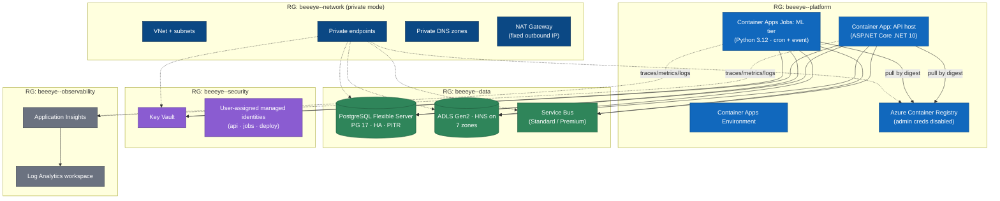
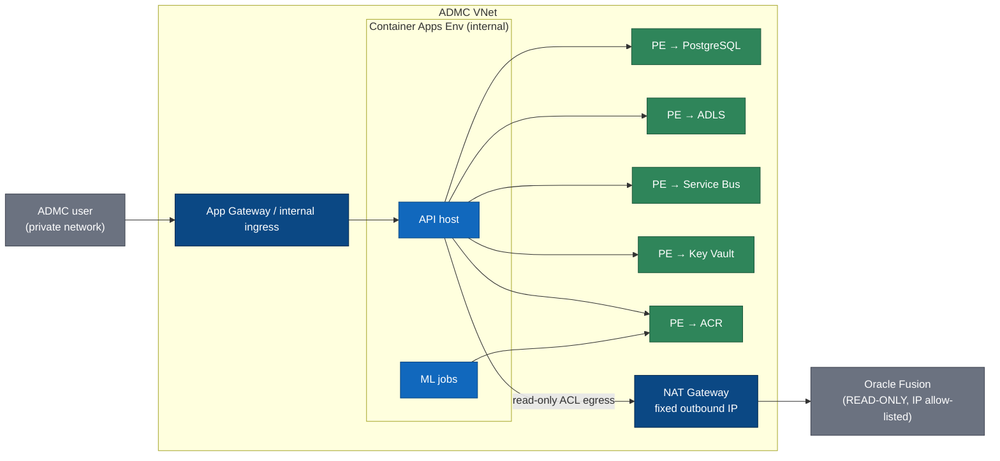
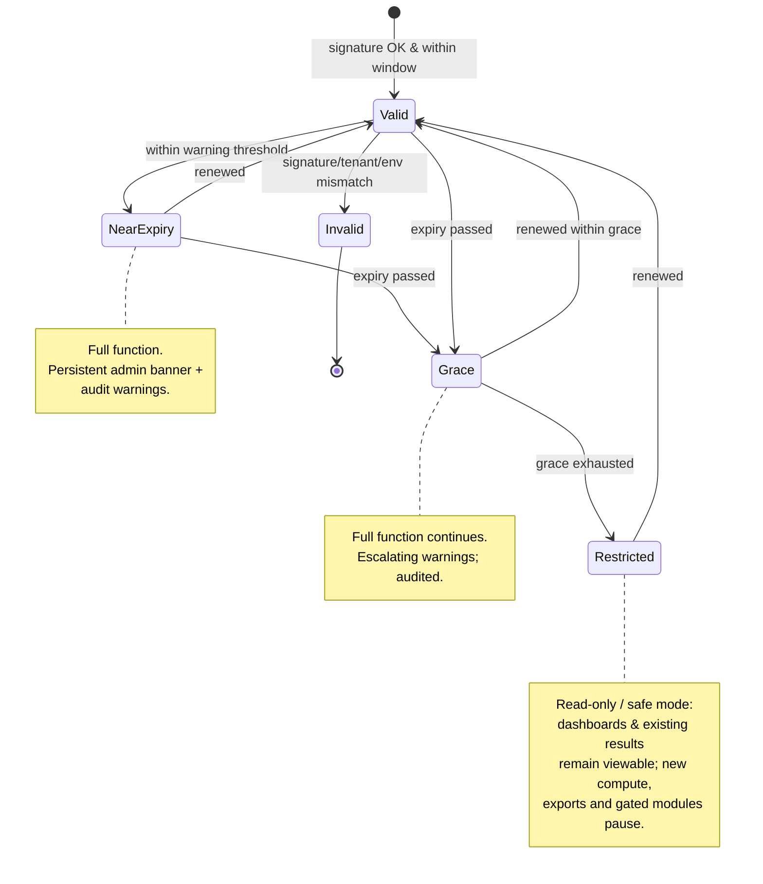

# Azure Deployment & IP Protection

> How the BeeEye vendor product is provisioned into ADMC's own Azure tenant with reproducible Bicep,
> promoted as immutable signed images, and protected as intellectual property through contract,
> licensing, controlled source and runtime hardening — with an honest account of what compiled
> binaries in a customer environment can and cannot guarantee.

BeeEye is delivered as a **vendor product deployed into ADMC's own Azure tenant and subscription**.
The vendor never operates a shared multi-tenant service; every customer runs their own isolated
estate in an ADMC-controlled region, with SAR-denominated data resident in that tenant and Oracle
Fusion reached read-only through the anti-corruption layer. This document covers the two things that
follow from that model: **how the estate is stood up** (Infrastructure as Code, environments,
networking modes) and **how the vendor's IP survives shipping compiled artefacts into a customer's
tenant** (image supply chain, runtime hardening, and an offline licence abstraction).

---

## 1. Deployment principles

| Principle | What it means for BeeEye |
|-----------|--------------------------|
| Customer-tenant deployment | Every Azure resource lives in ADMC's subscription; the vendor holds no customer data and no long-lived customer credentials. |
| Infrastructure as Code only | The estate is defined in **Bicep**; there is no click-ops path to production. Every change is a reviewed, `what-if`'d, versioned deployment. |
| Reproducible & idempotent | Re-running the templates converges to the declared state. Environments differ only by parameter files, never by hand edits. |
| Passwordless by default | Data-plane access (PostgreSQL, ADLS, Service Bus, ACR, Key Vault) uses **managed identity + Entra RBAC**; connection secrets exist only where a service cannot yet do passwordless auth, and then only in Key Vault. *Current scaffold deviation: the API↔PostgreSQL path uses a pipeline-supplied password held as a Container Apps secret — tracked as [tech-debt TD-2](tech-debt.md).* |
| No secrets in source | Source and images contain **zero** secrets. Container Apps resolve secrets from Key Vault at runtime via managed identity. |
| Least-privilege identities | Each workload (API host, ML jobs) gets its own user-assigned managed identity with the minimum role assignments it needs. |
| Immutable, digest-pinned releases | Runtime references container images by **SHA-256 digest**, never by mutable tag, so what runs is exactly what CI built, scanned and signed. |
| Two networking postures | A **Standard secured** baseline and a **Private enterprise** posture selectable per environment via one parameter, without re-architecting. |

---

## 2. Resource topology

BeeEye's estate is organised into resource groups by lifecycle and blast radius, then realised by a
set of composable Bicep modules. One `main.bicep` orchestrates the modules; per-environment parameter
files bind SKUs, names, networking mode and scale.



### Resource inventory

| Resource | Bicep module | Purpose | Baseline SKU / config |
|----------|--------------|---------|-----------------------|
| Container Apps Environment | `containerapps-env.bicep` | Shared runtime for API host + jobs; wired to Log Analytics; VNet-injected in private mode. | Workload profiles (Consumption + Dedicated D-series for jobs) |
| Container App — API host | `app-api.bicep` | The modular monolith (ASP.NET Core, ~19 bounded-context modules). | 1–N replicas, HTTP scale rule, health probes |
| Container Apps Jobs — ML tier | `jobs-ml.bicep` | Python forecasting / risk / SHAP compute; cron + Service-Bus-triggered. | Scheduled + event-driven jobs, replica timeout tuned per job |
| Azure Container Registry | `acr.bicep` | Holds promoted, digest-pinned images. **Admin account disabled**; pulls via managed identity (`AcrPull`). | Premium (private mode: private endpoint + content trust) |
| PostgreSQL Flexible Server | `postgres.bicep` | Curated model, metrics, predictions, decisions, audit state. | HA (zone-redundant in prod), PITR, Entra auth on |
| ADLS Gen2 | `storage-lake.bicep` | Zoned lakehouse: `raw · validated · curated · quarantine · model-input · model-output · export`. | Standard, HNS on, RBAC data-plane, soft delete |
| Service Bus | `servicebus.bicep` | Async backbone: integration, ML orchestration, notifications. | Standard (dev/test) / Premium (uat/prod) |
| Key Vault | `keyvault.bicep` | Secrets, connection strings, licence-signing **public** key, image-signing trust roots. | RBAC mode, purge protection on in prod |
| Managed identities | `identity.bicep` | Per-workload user-assigned identities + role assignments. | Least privilege scoped assignments |
| Entra app registrations | `entra.bicep` / Graph deployment script | SPA public client (PKCE), API app exposing scopes, app roles for Executive/Analyst/IT personas. | See §7 note on Entra provisioning |
| Log Analytics + App Insights | `observability.bicep` | OpenTelemetry sink: traces, metrics, structured logs; workbooks + alerts. | Per-env workspace, retention by env |
| Networking (private mode) | `network.bicep` | VNet, subnets, private endpoints, private DNS zones, NAT Gateway, NSGs. | Provisioned only when `networkingMode = private` |

---

## 3. Bicep structure & deployment flow

```
infra/
  main.bicep                 # subscription-scope orchestrator: RGs + module wiring
  modules/                   # one file per resource cluster (table above)
  env/
    local.bicepparam
    dev.bicepparam
    test.bicepparam
    uat.bicepparam
    prod.bicepparam
  scripts/
    entra-appreg.ps1         # Graph-based Entra objects (see §7)
```

- **Deployment stacks** manage the estate as a unit so orphaned resources are detected and cleaned
  up; production changes always run `az deployment sub what-if` for a reviewed diff before apply.
- **No inline secrets** — parameter files carry names, SKUs, scale and networking mode only. Secret
  *values* are seeded into Key Vault out-of-band (or generated in-template with `@secure()` and never
  echoed) and consumed at runtime via Key Vault references.
- **Role assignments are declarative** — `AcrPull`, `Key Vault Secrets User`, `Storage Blob Data
  Contributor` (zone-scoped), `Azure Service Bus Data Sender/Receiver`, and PostgreSQL Entra roles
  are all authored in Bicep against the per-workload managed identities.
- **Digest pinning** — the image reference passed to the Container App / Jobs modules is a
  `registry/image@sha256:…` digest supplied by the release pipeline (§6), not a floating tag.

---

## 4. Environments

Five environments share one template set and differ only by parameter file, identity, and data policy.

| Environment | Purpose | Data | Networking (typical) | Scale |
|-------------|---------|------|----------------------|-------|
| **local** | Developer inner loop | Synthetic / POC sample data (the 3,120-row sales + 291-unit inventory fixtures) | Docker Compose / local emulators; no Azure | Single instance |
| **dev** | Integration of in-flight work | Synthetic + masked slices | Standard secured | Minimal, scale-to-zero |
| **test** | Automated + QA verification | Masked / synthetic | Standard secured | Minimal |
| **uat** | Business acceptance with ADMC | Masked production-shaped data | Mirrors prod networking mode | Prod-like, reduced |
| **prod** | Live decision support | Real Oracle-Fusion-derived data (tenant-resident) | Private enterprise (ADMC's choice) | HA, autoscale |

**Data policy across environments:**

- **No production data flows into a lower environment unmasked.** If prod-shaped data is needed for
  UAT or troubleshooting, it passes through a masking/synthesis step (PII redaction, chassis-number
  and price perturbation, location relabelling) before landing in a non-prod zone.
- **No secrets in source, ever.** Each environment has its **own** Key Vault, its **own** managed
  identities, and its **own** Entra registrations. A leaked lower-env credential grants nothing in
  prod.
- **Analysis Date discipline is preserved** — time-sensitive computations (inventory age, holding
  cost, aging and risk bands) use the explicit configurable Analysis Date inherited from the POC
  assumption model, so lower environments produce reproducible numbers regardless of wall-clock date.
  See [../wireframes/docs/ASSUMPTIONS_LIMITATIONS.md](../wireframes/docs/ASSUMPTIONS_LIMITATIONS.md).

---

## 5. Networking modes

BeeEye ships **two networking postures**, selected per environment through a single `networkingMode`
parameter. The application code is identical in both; only the infrastructure module set and the
ingress/egress configuration change.

### 5.1 Standard secured (baseline)

Public HTTPS ingress on the Container App, but the application is only reachable after **Entra**
authentication (OIDC / OAuth2 + PKCE); unauthenticated requests never reach business logic. Data
services are **not** publicly reachable: PostgreSQL, ADLS, Service Bus and ACR are locked to the
platform via firewall rules / service endpoints and Entra RBAC, with public network access disabled
where the SKU allows. This is the lower-cost posture and is the default for dev/test.

### 5.2 Private enterprise

Full network isolation for organisations that require it. Ingress is **internal** (the Container Apps
environment is VNet-injected with an internal load balancer); the SPA and API are reached over ADMC's
private network / App Gateway, not the public internet. Every data service is fronted by a **private
endpoint** with a corresponding **private DNS zone**, so all traffic stays on the VNet. A **NAT
Gateway** gives the environment a **stable, fixed outbound IP** — the address ADMC allow-lists on
Oracle Fusion, so the read-only ACL egress is pinned and auditable.



### 5.3 Choosing a mode

| Dimension | Standard secured | Private enterprise |
|-----------|------------------|--------------------|
| Ingress | Public HTTPS, Entra-gated | Internal / private only |
| Data-service exposure | Firewall + RBAC, public access disabled | Private endpoints + private DNS |
| Oracle Fusion egress | Egress from the app; allow-list a service tag / range | **Fixed NAT IP**, cleanly allow-listable |
| VNet required | No | Yes (VNet, subnets, NSGs) |
| Relative cost | Lower | **Materially higher** — private endpoints (hourly + data processing per endpoint), NAT Gateway, private DNS zones, VNet, and often a dedicated ingress (App Gateway) add fixed monthly cost |
| Typical use | dev / test, cost-sensitive prod | Enterprise prod with strict network policy |

> **Cost note.** The private posture is the more secure default recommendation for production but adds
> non-trivial fixed spend. It is offered as an explicit, per-environment choice so ADMC trades cost
> against network-isolation requirements deliberately — the switch is one parameter, not a rebuild.

---

## 6. IP protection

The commercial reality: BeeEye's value is the vendor's source and analytical methodology, yet the
product runs **inside the customer's tenant on the customer's compute**. IP protection is therefore a
**layered, defence-in-depth posture**, not a single silver bullet — and the honest note in §6.4 says
why.

### 6.1 Controlled source & signed supply chain

```mermaid
flowchart LR
    classDef v fill:#8a5cd1,stroke:#5f3f92,color:#fff
    classDef ci fill:#1168bd,stroke:#0b4884,color:#fff
    classDef c fill:#2f855a,stroke:#1f5a3d,color:#fff

    src["Vendor-controlled source<br/>(private repos, never delivered)"]:::v
    build["CI: build release artefacts"]:::ci
    scan["Scan: SAST · deps · container CVE"]:::ci
    sbom["Generate SBOM<br/>(CycloneDX)"]:::ci
    sign["Sign image + attestations<br/>(cosign / Notation)"]:::ci
    stage["Vendor staging registry"]:::ci
    promote["Promote immutable digest"]:::c
    acr["Customer ACR<br/>(admin disabled, MI pulls)"]:::c
    run["Container Apps runtime<br/>verify signature → run by digest"]:::c

    src --> build --> scan --> sbom --> sign --> stage --> promote --> acr --> run
```



- **Source stays with the vendor.** ADMC receives **running artefacts**, not the source repositories.
  There is no source-code delivery in the standard engagement.
- **CI builds, scans and signs.** Every release is built in vendor CI, scanned (SAST, dependency and
  container-image CVE scanning), accompanied by a **CycloneDX SBOM**, and **cryptographically signed**
  (cosign / Notation) with signature + provenance attestations.
- **Promote immutable digests.** Only the exact reviewed, signed **image digest** is promoted into
  ADMC's ACR. Runtime references that digest; the customer registry has its **admin account disabled**
  and is pulled from only by the workloads' managed identities (`AcrPull`).
- **Verify before run.** Runtime admission verifies the image signature/attestation trust root
  (published in Key Vault) so a tampered or unsigned image will not start.

### 6.2 Runtime hardening

| Control | Detail |
|---------|--------|
| Release builds only | No debug configurations, no PDBs shipped to prod, no dev tooling in the image. |
| No production source maps | The React/Vite bundle ships **without** source maps in prod; maps are retained privately by the vendor for symbolication. |
| R2R / trimming / AOT | .NET **ReadyToRun**, trimming, and **AOT where validated** for the relevant components — smaller surface, harder-to-read output, faster cold start. Applied only where it does not break reflection-dependent paths. |
| Minimal base images | Distroless / chiselled runtime images; no shell or package manager to pivot from. |
| Non-root, read-only FS | Containers run as non-root with a read-only root filesystem and dropped capabilities. |
| Secrets externalised | Nothing sensitive baked into the image; all secrets via Key Vault + managed identity at runtime. |
| Signed licence entitlements | Feature/module/environment gating enforced by a signed licence (§7), validated in-process. |

### 6.3 Non-technical protections (the load-bearing ones)

- **Contract & licensing.** The EULA / licence agreement prohibits decompilation, reverse
  engineering, redistribution and derivative works, and binds usage to the entitlements in §7.
- **Auditability.** Licence validation, entitlement checks, grace-period entry and denials all emit
  immutable audit events (Audit context), giving the vendor an evidentiary trail of use.
- **Controlled releases.** Signed, versioned, digest-pinned artefacts mean the vendor always knows
  precisely what is deployed and can attest to integrity.

### 6.4 Honest note on reversibility

> **Compiled binaries running in a customer environment are not un-reversible.** .NET assemblies are
> IL and can be decompiled; even R2R/AOT output can be analysed; a JavaScript bundle without source
> maps can still be inspected. Obfuscation raises the cost of understanding but does not make code
> secret, and aggressive obfuscation can destabilise reflection, serialization and diagnostics.
> BeeEye therefore does **not** claim technical un-reversibility. IP is protected by the **combination
> of** contract + licensing + vendor-controlled source (never delivered) + signed, digest-pinned
> releases + auditability + runtime hardening. The technical measures raise the effort and make misuse
> detectable and provable; the **legal agreement** is the primary and decisive protection.

---

## 7. Licence abstraction

BeeEye enforces entitlements through a **signed, offline licence file** — deliberately offline so the
product never depends on vendor connectivity to keep running inside a private, network-isolated tenant.

### 7.1 Design

- **Signed offline file.** The licence is a signed document (asymmetric signature, e.g. Ed25519/RSA).
  The **public** verification key ships with the product / in Key Vault; the **private** signing key
  never leaves the vendor. The file is portable and requires no phone-home.
- **Entitlement claims.** The licence encodes what ADMC may run:

  | Claim | Meaning |
  |-------|---------|
  | `customer` / `tenantId` | Binds the licence to ADMC's Entra tenant. |
  | `environments` | Which environments are licensed (e.g. `dev,test,uat,prod`). |
  | `modules` | Which of the 19 bounded contexts / features are enabled (e.g. Forecasting, Inventory, Procurement, SpareParts, ExecutiveInsights). |
  | `notBefore` / `expiry` | Validity window. |
  | `gracePeriodDays` | Post-expiry grace before enforcement hardens. |
  | `limits` | Optional ceilings (e.g. max locations/users). |
  | `issuedAt` / `licenceId` | Provenance for audit and revocation tracking. |

- **Validation.** On startup and on a periodic timer the licence service verifies the **signature**,
  then checks tenant binding, environment, module entitlement and validity window. Results are cached
  and re-checked so a mid-flight expiry is detected without a restart.
- **Audit.** Every validation outcome — valid, near-expiry warning, grace entry, and denial — emits an
  immutable audit event, so both vendor and ADMC have a record of licence state over time.

### 7.2 Graceful grace period

Enforcement is deliberately **non-abrupt** so a licence lapse never causes an unplanned business
outage in a decision-support tool.



- **Valid → NearExpiry:** everything works; the product surfaces a renewal banner to admins and logs
  warnings ahead of expiry.
- **Grace:** after expiry the product **keeps functioning fully** for `gracePeriodDays`, with
  escalating, audited warnings — protecting ADMC from a paperwork delay disrupting operations.
- **Restricted (grace exhausted):** the product degrades to a **read-only / safe mode** rather than
  crashing — existing dashboards and previously computed results stay visible, but new forecasts, risk
  recomputation, exports and any un-entitled modules are paused until renewal.
- **Invalid:** a signature, tenant, or environment mismatch is a hard failure at startup — an
  unlicensed or tampered deployment does not run at all.

A missing or unsigned licence is treated as **Invalid**, not as an implicit trial; and grace applies
only to *expiry*, never to signature or tenant-binding failures.

### 7.3 Note on Entra provisioning

Entra app registrations, exposed API scopes and the Executive/Analyst/IT app roles are provisioned via
a Microsoft Graph deployment script (or, where governance requires, a documented manual step under
ADMC's Entra administrators) rather than pure ARM, because directory objects are tenant-governed. The
resulting client/API IDs feed back into the Container Apps configuration as non-secret settings.

---

## Traceability

| Related document | Relationship |
|------------------|--------------|
| [overview.md](./overview.md) | Parent C4 + tech-stack map; deployment model, container view and NFRs this document realises. |
| [canonical-data-model.md](./canonical-data-model.md) | The entities and zones stored on the PostgreSQL + ADLS resources provisioned here. |
| `./security-and-identity.md` | Entra AuthN/AuthZ, managed identity, secrets and Key Vault detail that this deployment configures. |
| `./integration-oracle-fusion.md` | The read-only ACL whose egress is pinned to the fixed NAT outbound IP in private mode. |
| `./non-functional-requirements.md` | Availability, performance and observability budgets the SKUs and scale settings target. |
| [../wireframes/docs/INTEGRATION_AZURE_ORACLE.md](../wireframes/docs/INTEGRATION_AZURE_ORACLE.md) | POC future-state blueprint that this production Azure topology supersedes and grounds. |
| [../wireframes/docs/ASSUMPTIONS_LIMITATIONS.md](../wireframes/docs/ASSUMPTIONS_LIMITATIONS.md) | Analysis-Date and data-handling assumptions honoured across environments and masking. |
