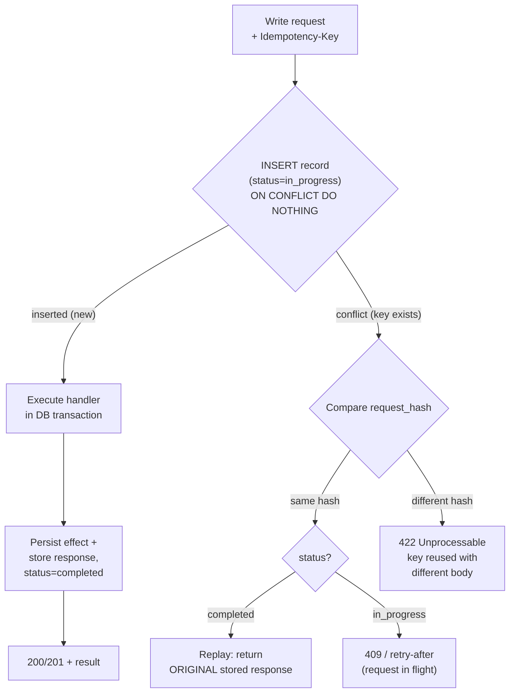
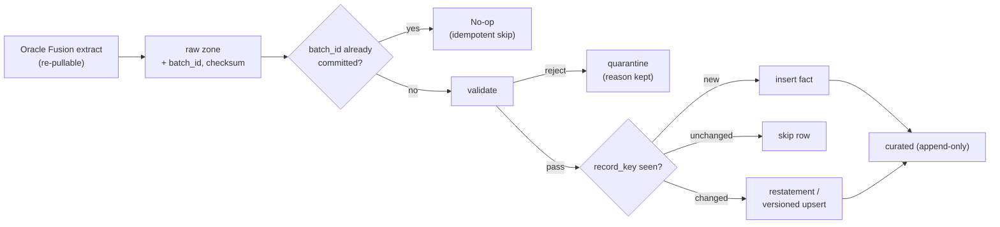
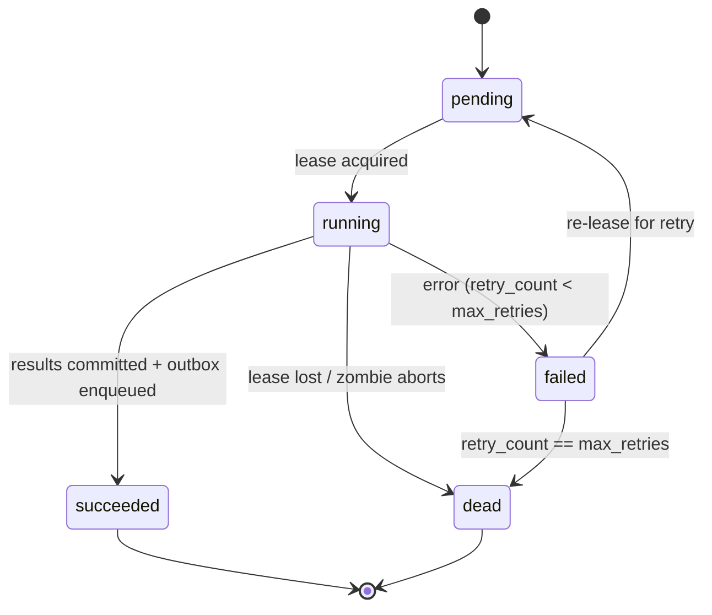
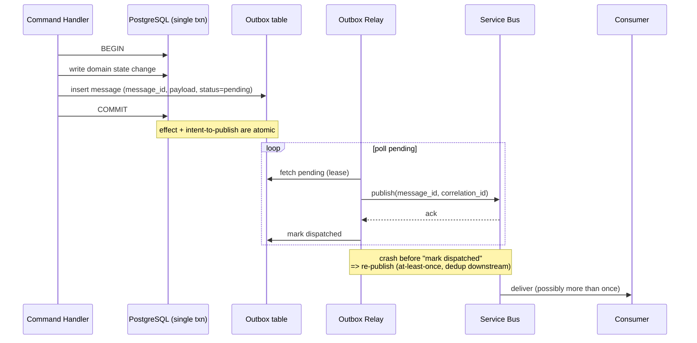

# Idempotency, Messaging & Reliability

> How BeeEye stays correct under retries, redeliveries and re-runs: never double-count a fact, double-post a decision, double-fire a notification, or double-execute a job — across the API, data ingestion, ML jobs, and the message bus.

BeeEye is a distributed system built on **at-least-once** primitives. HTTP clients retry on timeouts,
Oracle Fusion extracts are re-pulled after a failed load, Container Apps Jobs restart, and Azure
Service Bus can redeliver a message that was already processed. Correctness therefore cannot rest on
"each thing happens exactly once" — it must rest on **each thing being safe to happen more than once**.
This document defines the four idempotency layers that make that true, and the reliability patterns
(outbox/inbox, leasing, dead-lettering, poison handling) that hold them together.

The overriding platform guardrail applies here too: the deterministic engines own every number, and
derived records (`Prediction`, `RiskScore`, `Recommendation`, `AiNarrative`) are **immutable** once
written (see [canonical-data-model.md](./canonical-data-model.md)). Idempotency is what lets us honour
that immutability while still retrying freely.

---

## 1. Principles (read first)

| Principle | Consequence for design |
|-----------|------------------------|
| Assume **at-least-once** everywhere | Every consumer, job and unsafe endpoint must deduplicate; nothing relies on "it only arrives once". |
| **Exactly-once is a local illusion, not a transport guarantee** | We never depend on Service Bus exactly-once. We achieve effectively-once with transport at-least-once **+** an idempotent, deduplicating consumer. |
| **Deterministic identity** | Every retryable unit (request, batch, message, job run) carries a stable, content-derived or caller-supplied key so a replay is recognisably the *same* unit. |
| **Facts are append-only; derived records are immutable** | Reprocessing corrects via versioning/restatement/upsert — never blind delete-and-reload in production. |
| **Commit the effect and the dedupe marker atomically** | The "I did this" record and the effect live in the same transaction, so a crash can't leave one without the other. |
| **Retry is safe, replay is auditable** | A retried operation returns the original outcome; every dedupe/skip is observable via `correlation_id` in telemetry. |

The four layers, and what each protects against:

| Layer | Retryable unit | Identity | Primary risk neutralised |
|-------|----------------|----------|--------------------------|
| API | HTTP write request | `Idempotency-Key` (client) scoped to tenant/caller/endpoint/op | Double-posted decision, duplicate approval, duplicate export trigger |
| Ingestion | Source extract batch / record | Deterministic batch + record identity from source lineage | Double-counted sales/inventory facts |
| Jobs | ML / export job run | `run_id` + input `dataset_version` + `config_version` | Duplicate predictions, recs, notifications, exports, audit rows |
| Messaging | Domain event / command | `message_id` + outbox/inbox dedupe | Redelivered message processed twice |

---

## 2. Layer 1 — API idempotency

### 2.1 Which endpoints require it

Idempotency is mandatory for every **unsafe, effectful** write — the operations that a naive client
retry could duplicate. Safe reads (GET) and naturally-idempotent replacements (PUT of a full resource
by id) do not require a key.

| Endpoint class | Example | Key required |
|----------------|---------|:---:|
| Command that creates a record / side effect | Approve a `Recommendation`, submit a monthly order plan (UC1/UC4), trigger an export/report | **Yes** |
| Command that emits an event / notification | Dispatch an executive alert, queue a forecast refit | **Yes** |
| Full-resource replace by id (PUT) | Update settings profile | No (idempotent by definition) |
| Read (GET) | Fetch cockpit metrics | No |

### 2.2 The key and its scope

Clients send a header:

```
Idempotency-Key: 8b1f0e2c-9a44-4d1e-9c3e-3f0d2a5b7c61
```

The key is **not** globally unique on its own — it is unique **within a scope**, so one caller's key
cannot collide with another's, and the same key on a different endpoint is a different operation:

```
scope = (tenant_id, caller_subject, http_method, route_template, operation_name)
```

- `tenant_id` — ADMC is single-tenant today, but scoping keeps multi-tenant safe.
- `caller_subject` — the Entra ID `sub` / service principal object id (see [security-and-identity.md](./security-and-identity.md)).
- `route_template` + `operation_name` — the logical operation, not the raw URL (query strings excluded).

### 2.3 The idempotency record

The API host persists one row per `(scope, idempotency_key)` in PostgreSQL:

| Column | Purpose |
|--------|---------|
| `id` (uuid, PK) | Surrogate. |
| `tenant_id`, `caller_subject`, `method`, `route_template`, `operation_name` | The scope. |
| `idempotency_key` | Client-supplied key. |
| `request_hash` | SHA-256 of the canonicalised request body (+ significant headers). |
| `status` | `in_progress` \| `completed` \| `failed`. |
| `response_code`, `response_body`, `response_headers` | The **stored original response** for replay. |
| `created_at_utc`, `completed_at_utc`, `expires_at_utc` | Lifecycle + retention TTL. |
| `correlation_id` | Ties the request to traces/logs. |

**Uniqueness against races.** A `UNIQUE (tenant_id, caller_subject, method, route_template, operation_name, idempotency_key)`
constraint is the concurrency backstop. Two simultaneous retries race to `INSERT ... ON CONFLICT DO
NOTHING`; the loser detects the conflict and waits/polls for the winner's result rather than executing
the effect twice. The database — not application locking — is the source of truth for "who owns this
key".

### 2.4 Request flow



Behavioural contract:

| Situation | Response |
|-----------|----------|
| New key, handler succeeds | Execute once, store and return the result. |
| Same key, **same** body, original completed | **Replay** — return the byte-identical stored response; do **not** re-execute. |
| Same key, **same** body, original still `in_progress` | `409 Conflict` with `Retry-After`; the client polls. |
| Same key, **different** body (`request_hash` mismatch) | `422` — key reuse with a different payload is a client bug; reject, never execute. |
| Original `failed` (non-retryable business error) | Return the stored failure; the client must mint a new key to genuinely retry. |

### 2.5 Retention

Idempotency records are operational, not a business ledger. `expires_at_utc` defaults to **24 hours**
(comfortably beyond any client retry window); a scheduled cleanup job purges expired rows. The
underlying business effect (the approved decision, the export) is permanent and lives in its owning
context; only the dedupe envelope is transient.

---

## 3. Layer 2 — Data-ingestion idempotency

Sales (3,120 monthly rows) and inventory (291 units) arrive from Oracle Fusion via the versioned ACL
(see [integration-oracle-fusion.md](./integration-oracle-fusion.md)) and land through the ADLS Gen2
zones (`raw → validated → curated`, with `quarantine`). Re-pulling a failed extract, or replaying a
day, must **never** inflate a fact.

### 3.1 Deterministic batch and record identity

Every extract is stamped with a **batch identity** derived from the source, not assigned randomly, so
the same extract computes the same identity on every attempt:

```
batch_id = hash(source_system, source_object, extract_ts, checkpoint_watermark, content_checksum)
```

| Component | Meaning |
|-----------|---------|
| `source_system` | e.g. `oracle_fusion` (which system of record). |
| `source_object` | e.g. `sales_fact`, `inventory_unit`. |
| `extract_ts` | When the source produced the extract (source clock). |
| `checkpoint_watermark` | The incremental cursor / high-water mark the extract covers (e.g. max `updated_ts`). |
| `content_checksum` | Checksum over the file/payload bytes — detects silent content drift for the "same" logical batch. |

Within a batch, each fact carries a **record identity** used for deduplication and upsert:

```
record_key = (source_system, source_object, source_record_id, source_updated_ts)
```

- `source_record_id` — the natural key (e.g. `stock_id`, or the composite sales grain `location+model+variant+period`).
- `source_updated_ts` — the source row version; a re-extract of an unchanged row has the same
  `source_updated_ts` and is a no-op on load.

The canonical model already mandates that these source natural keys and lineage columns are **never
discarded** (see [canonical-data-model.md](./canonical-data-model.md)) — ingestion idempotency is what
consumes them.

### 3.2 Reprocessing must not duplicate facts

Load is an **idempotent upsert**, not an append:

- **First sight** of a `record_key` → insert the fact.
- **Re-sight, unchanged** (`source_updated_ts` unchanged) → detected as already-loaded; skip. The
  `batch_id` + checksum let the loader short-circuit an entire re-pulled batch it has already committed.
- **Re-sight, changed** (`source_updated_ts` advanced) → a **correction**, handled by versioning below.

Loading a `raw` batch records `batch_id` and a `loaded` marker transactionally with the curated rows;
a crash mid-load leaves the batch marked `in_progress`, and the restart resumes from the last committed
offset rather than reloading from zero.

### 3.3 Corrections via versioning / upsert — never blind delete-reload

Production **prohibits** the "truncate and reload" pattern, because it destroys lineage and makes prior
reports irreproducible. Corrections follow the canonical model's append-only rules:

| Change | Mechanism |
|--------|-----------|
| Restated sales period | A `SalesRestatement` row carrying the delta, reason and `effective_at_utc`; the original posted fact is preserved. |
| Reversal + re-post | Reversal entry then a fresh post — both retained, both explainable. |
| Inventory status change | Append to `StockUnitStatusHistory`; the unit's history is never overwritten. |
| Attribute correction on a source row | Upsert keyed on `record_key`; the superseded version is retained with its lineage, `is_current=false`. |

Malformed or unresolvable records are routed to the **`quarantine`** zone with the rejection reason —
never silently dropped and never blindly re-inserted on the next run.



---

## 4. Layer 3 — Job idempotency

Forecast refits, risk scoring, recommendation generation, executive-insight builds and export
generation run as Container Apps Jobs (scheduled or event-triggered — see
[ml-platform.md](./ml-platform.md) and [deployment-topology.md](./deployment-topology.md)). Jobs get
killed and restarted; a retry must **not** produce a second set of predictions, a duplicate export
file, a repeat notification, or a duplicated audit trail.

### 4.1 The run record

Each job execution owns exactly one `JobRun` row, created before any work:

| Field | Purpose |
|-------|---------|
| `run_id` (uuid, PK) | Stable identity for this execution; survives process restarts. |
| `job_type` | `forecast_refit` \| `risk_score` \| `recommendation` \| `exec_insight` \| `export` \| … |
| `input_dataset_version` | The exact curated dataset snapshot consumed. |
| `config_version` | Risk weights / thresholds / ruleset version in force (from Settings). |
| `lease_owner`, `lease_expires_at_utc` | Distributed lock/lease (see §4.2). |
| `status` | `pending` → `running` → `succeeded` \| `failed` \| `dead`. |
| `started_at_utc`, `finished_at_utc` | Timing. |
| `retry_count`, `max_retries` | Attempt accounting. |
| `output_location`, `output_checksum` | Where results landed + a checksum for verification/dedupe. |
| `failure_reason` | Structured error on failure. |
| `correlation_id` | Threads the run through logs, traces, messages and downstream records. |

### 4.2 Lease, not just lock

A job claims work by acquiring a **lease** (`lease_owner` + `lease_expires_at_utc`) via a conditional
update — only one runner can hold it. If a runner dies, the lease **expires** and another may reclaim
the `run_id`; a zombie that wakes up finds its lease gone and aborts before writing. This prevents two
live instances producing rival outputs for the same logical work.

### 4.3 Effectively-once outputs

The pattern is **compute → stage → atomically commit results + mark run succeeded + enqueue downstream
via outbox**, in that order:

- **Predictions / risk scores / recommendations** are stamped with `run_id`, `input_dataset_version`,
  `model_version`/`ruleset_version`. A unique constraint on `(entity_key, run_id)` makes re-insertion on
  retry a no-op. Because these records are immutable, a *genuine* re-run inserts a **new** version and
  sets the prior `superseded_by` / `is_current=false` — it never mutates in place.
- **Exports** write to a deterministic `output_location` derived from `run_id`; re-running overwrites
  the same object (idempotent) rather than creating `report(2).xlsx`. `output_checksum` confirms
  identical content.
- **Notifications** are emitted through the outbox keyed by `run_id` + notification type, so a retried
  run cannot fire the alert twice (see §5).
- **Audit** rows are keyed to `run_id`; the audit trail records one logical run, not one row per
  crash-retry.

### 4.4 Job state machine



A retry re-enters `pending` with the **same** `run_id`, `input_dataset_version` and `config_version`, so
it recomputes deterministically and its unique-constrained writes collapse onto the first successful
attempt's rows.

---

## 5. Layer 4 — Message idempotency

Bounded contexts communicate over Azure Service Bus. We treat delivery as **at-least-once** and do
**not** enable or depend on Service Bus "exactly-once" semantics — a message can be redelivered after a
lock renewal lapse, a consumer crash between effect and settlement, or a manual replay. Effectively-once
is achieved with the **transactional outbox** (reliable publish) and the **inbox / dedupe store**
(reliable consume).

### 5.1 Transactional outbox (produce side)

A context that changes state and wants to publish an event must not do two separate commits (DB then
broker) — a crash between them loses or duplicates the event. Instead, the domain change **and** the
outgoing message are written in **one** database transaction; a relay publishes the message afterwards
and marks it dispatched.



Because the relay may crash after publishing but before marking the row dispatched, the **same
`message_id` can be published more than once**. That is expected and safe — the consumer deduplicates.

### 5.2 Inbox / consumer dedupe (consume side)

Every consumer records processed `message_id`s in an **inbox** table and processes each message's effect
in the **same transaction** that records the id:

```
BEGIN
  INSERT INTO inbox(message_id, consumer, processed_at_utc)   -- UNIQUE(message_id, consumer)
  -- if conflict -> already processed -> skip effect, settle message
  apply effect (idempotent)
COMMIT
settle / complete the message
```

- A redelivered message hits the `UNIQUE(message_id, consumer)` constraint → the effect is skipped and
  the message is completed. **Effectively-once.**
- Effect and dedupe marker commit together, so a crash cannot apply the effect without recording it (or
  vice-versa).
- Business handlers are additionally written to be idempotent on their own natural keys (belt and
  braces), so even a dedupe-store gap cannot double-apply.

### 5.3 Dead-letter and poison handling

| Situation | Handling |
|-----------|----------|
| Transient failure (downstream timeout) | Abandon → redeliver with backoff; `delivery_count` increments. |
| `delivery_count` exceeds threshold ("poison" message) | Move to the **dead-letter queue (DLQ)** with the failure reason; never blocks the main queue. |
| Malformed / unparseable message | Dead-letter immediately (no retry can fix bad content). |
| Operator remediation | Inspect DLQ, fix root cause, **replay** to the source queue. Replay is safe precisely because the inbox dedupes any message that had already taken effect before failing. |

Poison messages are isolated, not silently discarded; every dead-letter carries `correlation_id`,
`delivery_count` and `failure_reason` for triage and is surfaced to operations telemetry.

### 5.4 Why not Service Bus "exactly-once"

Even with sessions and duplicate-detection windows, exactly-once across the broker **and** our database
**and** side effects is not something the transport can guarantee end-to-end (the classic dual-write /
consume-then-crash problem). The outbox + inbox pattern moves the guarantee into our own transactional
store, where it actually holds, and degrades gracefully to at-least-once + dedupe. Service Bus
duplicate-detection may be enabled as a cheap first-line filter, but correctness never depends on it.

---

## 6. Cross-cutting reliability

| Concern | Approach |
|---------|----------|
| **Correlation** | A single `correlation_id` flows request → outbox message → job run → derived records → audit, so any replay or dedupe is traceable end-to-end via OpenTelemetry / App Insights (see [non-functional-requirements.md](./non-functional-requirements.md)). |
| **Retention & cleanup** | Idempotency records TTL ~24h; inbox/outbox rows are pruned after their dedupe/replay window closes; `JobRun` history is retained for audit. Cleanup runs as its own idempotent scheduled job. |
| **Analysis Date, not wall-clock** | Time-sensitive recomputation (aging, holding cost, risk) uses the explicit configurable Analysis Date, so a re-run on a different day yields the *same* result for the same inputs — a precondition for job idempotency. Inherited from the POC assumption model ([ASSUMPTIONS_LIMITATIONS](../wireframes/docs/ASSUMPTIONS_LIMITATIONS.md)). |
| **GenAI narration** | Narratives are derived, immutable records keyed to their run; a retried insight build re-narrates deterministically and supersedes rather than appends duplicates. GenAI still never computes numbers ([overview.md](./overview.md) §8). |
| **Testing** | Every unsafe endpoint, consumer and job carries a "double-fire" test: invoke twice with the same identity and assert a single effect, one stored/replayed response, and no duplicate downstream event. |

---

## Traceability

| Related document | Relationship |
|------------------|--------------|
| [overview.md](./overview.md) | Container view, cross-cutting guardrails, and the at-least-once messaging posture this document operationalises. |
| [canonical-data-model.md](./canonical-data-model.md) | Append-only facts, `SalesRestatement`, `StockUnitStatusHistory`, immutable derived records with `superseded_by` — the write rules ingestion and job idempotency enforce. |
| [integration-oracle-fusion.md](./integration-oracle-fusion.md) | The versioned ACL and extract mechanics that supply source lineage for batch/record identity. |
| [data-architecture.md](./data-architecture.md) | ADLS Gen2 zones (raw/validated/curated/quarantine) referenced by ingestion idempotency. |
| [ml-platform.md](./ml-platform.md) | Job orchestration, dataset/model/ruleset versioning consumed by `JobRun`. |
| [security-and-identity.md](./security-and-identity.md) | Entra ID caller identity that scopes the API `Idempotency-Key`. |
| [non-functional-requirements.md](./non-functional-requirements.md) | Availability, observability and correlation targets this reliability model serves. |
| [ASSUMPTIONS_LIMITATIONS](../wireframes/docs/ASSUMPTIONS_LIMITATIONS.md) | The explicit Analysis-Date assumption that makes recomputation deterministic. |
