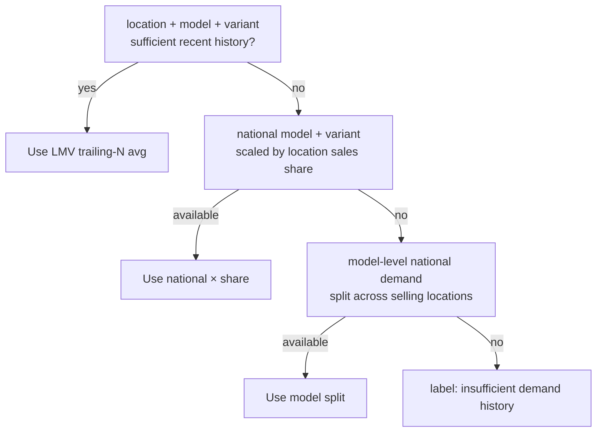
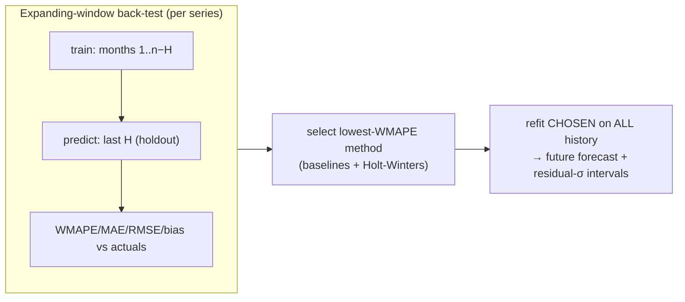
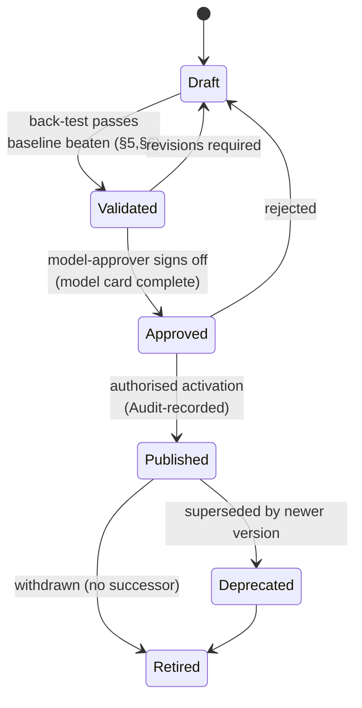

# MLOps & Predictive Models

> How BeeEye specifies, trains, back-tests, versions, approves, publishes, and monitors every predictive model — with mandatory transparent baselines, time-based validation, and a determinism-first guardrail so generative AI never computes a number.

BeeEye's analytics were proven in the POC ("Meridian BI") as framework-free JavaScript (`window.BIEngine`
in [`../wireframes/engine.js`](../wireframes/engine.js)): monthly metrics, Holt-Winters + baseline
forecasting with holdout back-testing, and an explainable additive inventory-risk score. This document
productionises that logic as a governed model portfolio running on the Python 3.12 ML tier
(Container Apps Jobs, statsmodels / scikit-learn / XGBoost / LightGBM, MLflow, SHAP) described in
[overview.md](./overview.md). It defines the model-requirement contract each use case must satisfy
before a model can be published, and the lifecycle, reproducibility, and monitoring discipline around it.

---

## 1. Principles

1. **Determinism first.** Forecasts, risk scores, quantities, values, and decisions come only from the
   deterministic engines and registered models. The generative-AI layer may *narrate* validated outputs;
   it must never compute or alter a number (see [overview.md §8](./overview.md#8-cross-cutting-guardrails)).
2. **Transparent baselines are mandatory.** No model ships unless it beats — on a time-based back-test —
   the naive / seasonal-naive / moving-average / current business-rule baseline for its task (§6). A
   baseline that wins is published; the POC already reports seasonal-naive winning honestly on the sample data.
3. **Never random-split a time series.** All temporal models are validated by rolling-origin / expanding-window
   back-testing on chronologically held-out periods (§5). Random k-fold on time series is prohibited.
4. **No silent "now".** Time-sensitive features (inventory age, holding cost, cover, aging bands) use the
   explicit, configurable **Analysis Date** (POC default 30 Jun 2026), never the wall-clock date.
5. **Explainability by construction.** Additive risk breakdown and SHAP for ML models; every prediction
   carries the basis/contributions that produced it.
6. **Human-in-the-loop.** Model outputs are decision-support. Recommendations require approval before any
   action; publication of a model version is itself an authorised, audited act (§8).

---

## 2. Model portfolio

The eight ADMC use cases map to the model families below. Provenance cites the POC `engine.js` function
that is the acceptance oracle; phase follows the delivery sequence in
[traceability-matrix.md §5](./wireframe-analysis/traceability-matrix.md).

| UC | Use case | Model class | POC provenance | Phase | POC data |
|----|----------|-------------|----------------|:-----:|----------|
| **UC2** | Sales Forecast Accuracy | Univariate time-series (Holt-Winters vs baselines, per series) | `forecast`, `metrics`, `holtWinters` | P1 | Wireframed |
| **UC5** | Inventory Aging & Overstock Risk | Explainable additive risk score (0–100) + rules | `computeInventory`, `recommend` | P1 | Wireframed |
| **UC8** | Executive Decision Cockpit | No new model — aggregation/narration over UC2/UC5 outputs | `execInsights`, `ctxBuild` | P2 | Built |
| **UC1** | Monthly Vehicle Order Optimisation | Forecast → demand-vs-cover order quantity (optimisation over UC2) | `recommend`, `demandVelocity` | P2 | Partial |
| **UC4** | Procurement Quantity Optimisation | Demand + lead-time model → order quantity / reorder point | `demandVelocity`, `computeInventory` | P3 | Partial |
| **UC3** | Configuration-Level Demand Insights | Segment demand model (location×model×variant×colour/interior) | `breakdown`, `demandTrend` | P3 | Partial |
| **UC6** | Sales vs After-Sales Correlation | Statistical association (no predictive model yet) | new (no data) | P4 | New |
| **UC7** | Spare Parts Demand Prediction | Intermittent-demand forecast (Croston/SBA, GBM) | new (no data) | P5 | New |

UC6 and UC8 register **no** predictive model: UC8 aggregates and narrates already-validated UC2/UC5
outputs; UC6 (until after-sales data lands) reports associations with explicit "association, not causation"
language, consistent with the POC's forecast explanations.

---

## 3. Model-requirement specification (the contract)

Every registered model version MUST document all eighteen fields below in its **model card** (§8) before
reaching `Validated`. The template is fixed so every model is reviewed on the same axes.

| # | Field | What it must state |
|---|-------|--------------------|
| 1 | **Business definition** | The decision the model supports and the persona who consumes it. |
| 2 | **Prediction target** | The exact quantity predicted, its unit, and grain. |
| 3 | **Horizon** | Forecast/scoring horizon and cadence. |
| 4 | **Eligible population** | Which entities are in scope; explicit exclusions. |
| 5 | **Train / validation windows** | Chronological split; back-test scheme (never random). |
| 6 | **Features** | Inputs, all as-of the Analysis Date. |
| 7 | **Leakage analysis** | Fields deliberately excluded to prevent target/temporal leakage. |
| 8 | **Baseline(s)** | The mandatory transparent baseline(s) the model must beat. |
| 9 | **Candidate models** | Model families evaluated. |
| 10 | **Evaluation metrics** | Primary + secondary, with pass thresholds. |
| 11 | **Calibration** | How interval coverage / score reliability is checked. |
| 12 | **Explainability** | Per-prediction explanation mechanism. |
| 13 | **Limitations** | Known weaknesses; assumptions carried from the POC. |
| 14 | **Cold-start** | Behaviour with sparse/absent history. |
| 15 | **Monitoring** | Signals watched in production (§9). |
| 16 | **Retraining trigger** | What causes a refit. |
| 17 | **Approval** | Who authorises publication. |
| 18 | **Model card** | The living record carrying 1–17 + reproducibility (§7). |

---

## 4. Per-use-case model requirements

### 4.1 UC2 — Sales Forecast (wireframed, full spec)

| Field | Specification |
|-------|---------------|
| Business definition | Give Analysts/Executives a monthly volume forecast per series with a transparent method comparison so ordering and planning are grounded in demonstrated accuracy. |
| Target | `units_sold` per calendar month, per series (default series = total business; selectable by location / model / variant). |
| Horizon | 3–12 months ahead (POC default H=6); refit monthly as new actuals arrive. |
| Eligible population | Any series with ≥ 12 months of history; sparser series fall back per §14 cold-start. 52 months available (Jan 2022–Apr 2026). |
| Train / validation | Expanding-window back-test: train on all-but-last-*holdout*, predict the holdout, compare to actuals. Holdout selectable 3/6/12 (default 6), capped at `min(holdout, n−12)`. **Future** forecast refits on all history. |
| Features | The demand series itself (level/trend/seasonal, period 12); Ramadan flag `is_ramadan` as a *known-in-advance* calendar covariate; discount level `discount_pct` (0/5/10/15/20) only as a labelled **scenario** input, not an autoregressive feature. |
| Leakage analysis | **`revenue`, `unit_price` excluded** — `revenue = units × price × (1−discount%)`, so using them to predict `units_sold` is target leakage. No future months in the training slice. Discount is a business decision lever, so it enters only via the clearly-labelled scenario simulator, never the accuracy back-test. |
| Baselines (mandatory) | Naive (last month), 3-month moving average, seasonal-naive (same month last year, period 12). |
| Candidates | Holt-Winters additive (statsmodels; POC params α=0.35, β=0.08, γ=0.3) as the primary uplift candidate; the three baselines. Selection = **lowest WMAPE** on the holdout, full comparison surfaced. |
| Eval metrics | **WMAPE (primary, robust to zeros)**; MAE, RMSE; forecast bias `Σ(f−a)/Σa`; over/under-forecast frequency; MAPE where actuals ≠ 0. Pass = beats the best baseline's WMAPE on the holdout. |
| Calibration | Prediction intervals (80/90/95) from back-test residual σ, widened `√(1+0.15·i)` per step; monitored for **coverage** (does the 80% band contain ~80% of holdout actuals) and bias. |
| Explainability | Deterministic `explainForecast`: recent-3-vs-prior-12 trend, seasonality, Ramadan **association** (never cause), chosen method + its WMAPE-derived confidence. |
| Limitations | Prototype estimates; customer's original forecasts were never supplied, so accuracy is *demonstrated by back-test*, not compared to their baseline. Seasonal-naive is frequently competitive on sample data — reported honestly. |
| Cold-start | < 12 months: seasonal-naive degrades to naive automatically; sparse series use the demand-fallback hierarchy (§4.2). Flagged low-confidence. |
| Monitoring | WMAPE/bias drift vs back-test, interval coverage, input schema/missingness, inference duration & cost (§9). |
| Retraining trigger | Monthly on new actuals; ad-hoc on accuracy-degradation or input-drift alerts. |
| Approval | Analyst proposes; model-approver role approves publication; recorded in Audit. |
| Model card | `forecast:{series}` card versioned in MLflow with params/seed/metrics/checksums (§7). |

### 4.2 UC5 — Inventory Overstock Risk (wireframed, full spec)

The production score preserves the POC's **explainable additive** model — the breakdown is a first-class
output, never a black box.

| Field | Specification |
|-------|---------------|
| Business definition | Rank the 291 inventory units by overstock/aging risk so capital and holding cost are actively managed; drive Retain/Transfer/Promote/Discount/Pause/Liquidate/Investigate recommendations. |
| Target | Risk score 0–100 (heuristic, weighted) → band Low 0–34 / Medium 35–59 / High 60–79 / Critical 80–100. (Outcome label for later validation: whether a unit is later transferred / discounted / liquidated.) |
| Horizon | As-of the Analysis Date (default 30 Jun 2026); recomputed on every config or data change. |
| Eligible population | All in-stock units at the 14 stocking locations (Mecca sells but holds no inventory and is handled gracefully). |
| Train / validation | Weights are **methodology-fixed**, not fitted (cover 30 / aging 25 / demand 20 / holding 15 / lead 10). Validation is *outcome back-testing*: once DecisionsAndOutcomes accrues, confirm high-risk units realise more holding cost / markdown than low-risk units. |
| Features | Sub-scores (0–100): stock-cover (group stock ÷ trailing-N-month avg demand), holding age (vs 120-day critical band), demand trend (recent-3 vs prior-3), holding-cost exposure (percentile of accrued cost), lead-time (percentile). |
| Leakage analysis | **`service_date` excluded** (meaning unconfirmed — flagged for business clarification). Cover uses group-wide current stock, not the unit's own future sale. No post-Analysis-Date information used. |
| Baselines (mandatory) | Current **business-rule aging band** (New/Healthy/Watch/High attention/Critical by days) and **stock-to-sales (months of cover)** — the score must add ranking value over these simple rules. |
| Candidates | Additive weighted score (primary, matches POC); optional supervised overstock classifier (LightGBM) once labelled outcomes exist, kept SHAP-explainable and benchmarked against the additive score. |
| Eval metrics | Ranking quality (does the ordering concentrate realised holding cost / markdown in High+Critical); band stability; agreement with the POC engine on the sample within tolerance. |
| Calibration | Monotonic reliability: higher band ⇒ higher realised overstock rate. Any fitted classifier is probability-calibrated (isotonic/Platt) and coverage-checked. |
| Explainability | Additive per-unit breakdown (each factor's points + human detail, sorted by contribution); SHAP for any ML variant, aligned to the same factor taxonomy. |
| Limitations | Configurable POC model, **not** production-validated against outcomes yet; recommendations are suggestions requiring review; transfer logistics cost not modelled. |
| Cold-start | Units whose series has no reliable recent demand → cover sub-score defaults conservatively; recommendation becomes *Investigate demand data* rather than assuming zero demand. |
| Monitoring | Distribution of scores/bands over time, factor-contribution drift, share of *Investigate* (data-gap proxy), config-change audit. |
| Retraining trigger | Recompute on Analysis-Date / weights / threshold change (POC "recompute live"); classifier refit when labelled outcomes cross a volume threshold. |
| Approval | Weight/threshold changes are PlatformAdministration config changes (audited); a fitted classifier follows the full lifecycle gate. |
| Model card | `risk:inventory` card records weights, thresholds, Analysis Date, dataset version, checksums. |

#### Demand fallback hierarchy (shared by UC1–UC5)

Sparse `location + model + variant` demand is resolved transparently, and the **basis actually used is
surfaced per calculation** — a missing cell is never silently treated as zero:

### 4.3 UC1 / UC4 — Order & Procurement Quantity (condensed)

| Field | UC1 Monthly Order Optimisation | UC4 Procurement Quantity Optimisation |
|-------|-------------------------------|----------------------------------------|
| Target | Recommended order units per model/variant/location next cycle | Reorder point + economic order quantity per SKU/location |
| Horizon | 1 month (next order cycle) | Lead-time horizon (uses observed `lead_time_days`) |
| Inputs | UC2 forecast, current cover, aging, demand trend | UC2/UC3 demand, lead-time distribution, holding cost, current stock |
| Baseline | Current rule: order to a target months-of-cover | Fixed reorder point / current manual policy |
| Candidates | Deterministic gap = target cover − projected cover, bounded by demand confidence | Newsvendor / (s,S) policy over the demand+lead-time distribution |
| Metrics | Would-be stockout vs overstock avoided on back-test; realised cover vs target | Fill rate, holding-cost reduction, order-frequency stability |
| Leakage | No future sales; discount is scenario-only (as UC2) | Lead time is historical, not future-dated |
| Cold-start | Falls back to national/model demand; low-confidence flagged | Same fallback; wide safety stock when lead-time variance high |
| Explainability | Rationale + evidence + expected outcome + confidence (as POC `recommend`) | Policy parameters shown with the demand/lead-time basis |

Both are **optimisation layers over UC2/UC5 outputs**, not independent statistical learners; they inherit
those models' back-tests and the fallback hierarchy, and their outputs remain human-approved suggestions.

### 4.4 UC3 / UC7 — Segment & Spare-Parts Demand (condensed)

| Field | UC3 Configuration-Level Demand | UC7 Spare Parts Demand |
|-------|-------------------------------|-------------------------|
| Target | Demand by fine segment (location×model×variant×colour/interior) | Monthly demand per part (intermittent, many zeros) |
| Horizon | 3–6 months | 1–3 months |
| Population | Segments with adequate history; else fallback | Parts with any movement history (no POC data yet) |
| Baseline | Seasonal-naive per segment; segment share of national | Croston / SBA (intermittent-demand baselines) |
| Candidates | Hierarchical/pooled model; GBM (LightGBM) with segment features | Croston/SBA vs LightGBM with intermittency features |
| Metrics | WMAPE per segment; coverage of aggregated forecast vs total | MASE / WMAPE tolerant of zeros; service-level attainment |
| Leakage | Revenue/price excluded (as UC2); no future periods | No after-sales→sales reverse leakage; time-ordered only |
| Cold-start | Sparse segments roll up via the fallback hierarchy | New parts use category priors; flagged low-confidence |
| Limitations | Sample data has 5 models / VX-ZX-MX only | **No POC data** — model requirements are provisional until after-sales/parts feeds land |

---

## 5. Time-based backtesting (never random split)

Time-series validation uses **rolling-origin (expanding-window)** back-testing exclusively. The training
slice always ends strictly before the evaluation slice; no future observation ever informs a past prediction.

Rules:

- **Holdout is chronological and selectable** (3/6/12 months, default 6), bounded by `min(holdout, n−12)`
  so at least 12 months remain for training.
- **Model selection** happens on the holdout, then the winner is **refit on all history** for the live
  forecast (the back-test estimates accuracy; it never contaminates the deployed fit).
- **Per-series** back-tests — total business, and any location/model/variant drill — each carry their own
  WMAPE, so accuracy claims are always scoped.
- **Prohibited:** random k-fold, shuffled splits, leave-one-out on time, or any split that places a later
  period in training and an earlier period in test.
- Where richer models warrant it, multiple rolling origins are averaged; the single-origin holdout above is
  the POC-faithful minimum.

---

## 6. Mandatory transparent baselines

No model version reaches `Validated` unless it beats the relevant baseline(s) on the §5 back-test. Baselines
are cheap, explainable, and often competitive — the platform reports honestly when a baseline wins.

| Task | Baseline(s) | Beat criterion |
|------|-------------|----------------|
| Demand / sales forecast (UC2, UC3) | Naive (last month), 3-month moving average, seasonal-naive (period 12) | Lower holdout **WMAPE** than the best baseline |
| Spare-parts intermittent demand (UC7) | Croston / SBA | Lower MASE/WMAPE, tolerant of zero-inflated demand |
| Inventory overstock risk (UC5) | Current **business-rule aging band**; **stock-to-sales** (months of cover) | Ranking concentrates realised holding cost/markdown better than the rule |
| Order/procurement quantity (UC1, UC4) | Order-to-target-cover; fixed reorder point | Fewer projected stockout+overstock unit-months |

---

## 7. Reproducibility artifacts

Every training run and every registered version captures the full provenance needed to regenerate it
bit-for-bit and to audit any number the platform ever showed.

| Artifact | Captured |
|----------|----------|
| Dataset version | Curated-zone snapshot id / ADLS path + row counts (e.g. 3,120 sales rows, 291 units) |
| Feature version | Feature-set definition hash (transforms, windows, encodings) |
| Code version | Git commit SHA of the ML job + module contract version |
| Parameters | All hyper-parameters (e.g. Holt-Winters α/β/γ, holdout, horizon, CI level, risk weights/thresholds, Analysis Date) |
| Random seed | Fixed seed(s) for any stochastic step |
| Environment | Python 3.12 + pinned package versions (lockfile hash) |
| Timestamps | Train start/end (UTC), data cut-off |
| Metrics | Back-test WMAPE/MAE/RMSE/bias, interval coverage, baseline comparison |
| Artifact checksum | SHA-256 of the serialised model + prediction outputs (model-output zone) |

Artifacts are written to the ADLS `model-input` / `model-output` zones and indexed in the MLflow registry
(§10); lineage traces every curated figure back through the data zones to a source Oracle Fusion extract.

---

## 8. Model lifecycle & authorised publication

A model version moves through six states. Only an **Approved** version may be **Published** (activated for
serving), and publication is an authorised, audited act — never an automatic side effect of training.

| State | Meaning | Gate to enter |
|-------|---------|---------------|
| **Draft** | Trained, experiment logged, not review-ready | Run completes with reproducibility artifacts (§7) |
| **Validated** | Passed time-based back-test **and** beat baseline | §5 back-test + §6 baseline comparison recorded |
| **Approved** | Signed off for release | Model-approver review; model card fields 1–18 complete |
| **Published** | Active for serving | **Authorised** activation, recorded in Audit; exactly one Published version per model alias |
| **Deprecated** | Replaced but still traceable | A newer version Published |
| **Retired** | Withdrawn from service | Explicit retirement decision |

**Authorisation.** Analysts propose and validate; a distinct **model-approver** role (IT/Admin or a
designated approver) approves and publishes — separation of duties enforced by AuthZ policy. Config-only
changes (risk weights, band thresholds, Analysis Date, holdout, CI level) are PlatformAdministration changes,
still audited, and preserve the POC's "recompute live" behaviour. GenAI has **no** role in any transition.

---

## 9. Monitoring

Published models are monitored continuously; breaches raise Notifications and can trigger retraining (§4).

| Category | Signals |
|----------|---------|
| **Input integrity** | Schema conformance, missingness/null rates, category-set drift (new location/model/variant), revenue & lead-time reconciliation (as POC `dataQuality`), sparse-segment count |
| **Distribution drift** | Feature drift, target drift, and prediction drift vs the training/back-test reference (PSI / population comparison) |
| **Concept drift** | Relationship shift detected via rising back-test error on recent windows |
| **Accuracy degradation** | Rolling WMAPE/MAE/bias vs the validated back-test; alert on threshold breach |
| **Calibration** | Prediction-interval coverage (80/90/95 bands vs realised); risk-band monotonicity vs outcomes |
| **Operational** | Inference failures, job success rate, run **duration**, and **cost** per run |
| **Decision quality** | Recommendation acceptance rate; realised **business outcomes** (holding cost avoided, sell-through, stockouts) from DecisionsAndOutcomes |

Data-quality checks ported from the POC (`dataQuality`) — duplicate stock/chassis IDs, negative
quantities, invalid dates, revenue/lead-time reconciliation, Mecca sales-without-inventory, and the
`service_date`-clarification flag — run as gating monitors on every ingest.

---

## 10. Model registry

BeeEye uses an **MLflow-compatible registry** (self-hosted alongside the ML tier), with **Azure Machine
Learning optional** as a managed alternative in ADMC's tenant.

| Concern | Approach |
|---------|----------|
| Experiment tracking | Every run logs params, metrics, artifacts, and reproducibility fields (§7) to MLflow. |
| Versioning & aliases | Registered models carry versions; a stable alias (e.g. `forecast:total-business`, `risk:inventory`) points to the current **Published** version. |
| Stage mapping | The six lifecycle states (§8) map to registry stages/tags; only one Published version per alias. |
| Serving | The .NET host reads **validated outputs as data** (predictions/scores/intervals from the `model-output` zone / PostgreSQL); it does not fit models on the request path. |
| Portability | MLflow's open format keeps models portable; Azure ML can host the registry, managed endpoints, and pipelines without changing the model cards. |
| Governance | Publication, deprecation, and retirement are recorded in the Audit context; every served number is traceable to a registry version and dataset snapshot. |

---

## Traceability

- Architecture map & guardrails → [overview.md](./overview.md)
- Canonical entities, join keys & feature grains → [canonical-data-model.md](./canonical-data-model.md)
- Screen/metric → module/model provenance → [wireframe-analysis/traceability-matrix.md](./wireframe-analysis/traceability-matrix.md)

POC provenance (the acceptance oracle for every model above):

- Forecasting & risk methodology → [../wireframes/docs/METHODOLOGY.md](../wireframes/docs/METHODOLOGY.md)
- Derived metric definitions → [../wireframes/docs/DERIVED_METRICS.md](../wireframes/docs/DERIVED_METRICS.md)
- Data dictionary & join keys → [../wireframes/docs/DATA_DICTIONARY.md](../wireframes/docs/DATA_DICTIONARY.md)
- Assumptions & limitations → [../wireframes/docs/ASSUMPTIONS_LIMITATIONS.md](../wireframes/docs/ASSUMPTIONS_LIMITATIONS.md)
- Reference engine (`window.BIEngine`) → [../wireframes/engine.js](../wireframes/engine.js)
