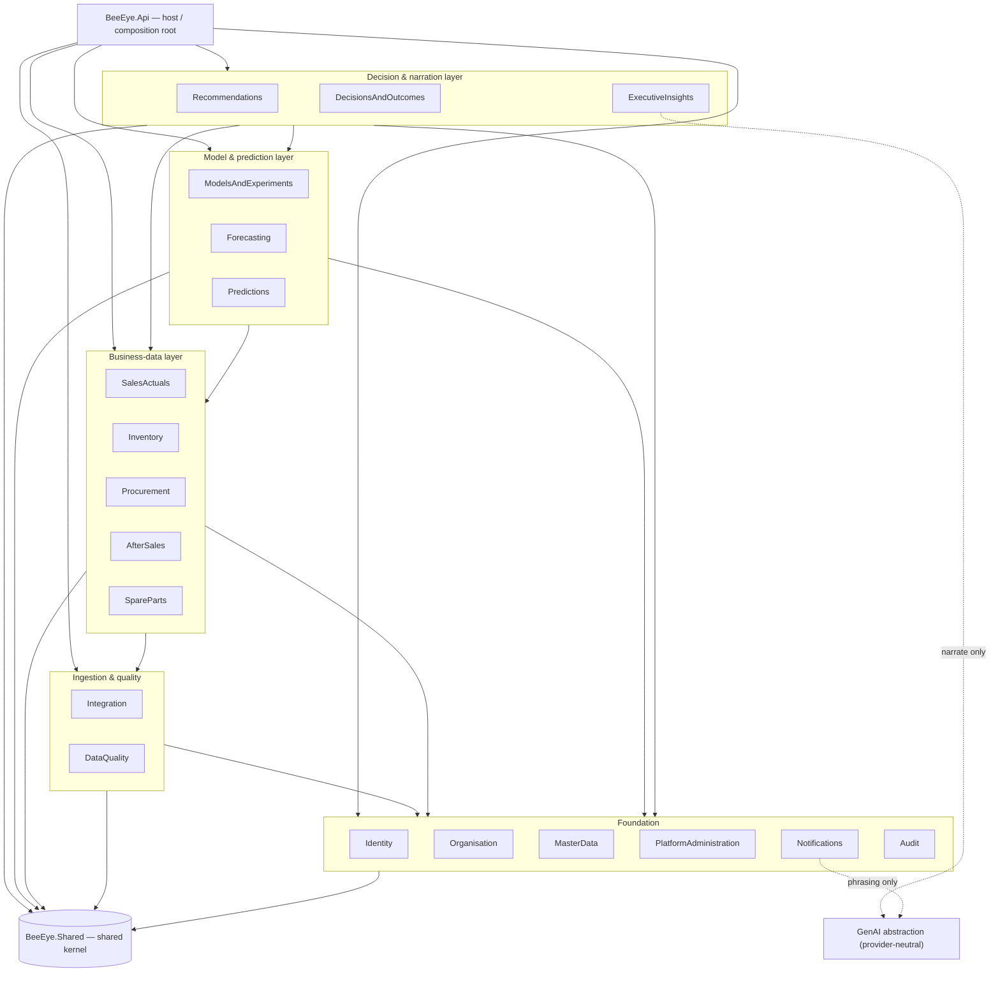

# Module Boundaries & Bounded Contexts

> The authoritative decomposition of the BeeEye modular monolith into 19 bounded contexts — what each owns, the contract it exposes, whom it may depend on, what it may never touch, and the architecture tests that keep those rules true in CI.

BeeEye ships as a single deployable **.NET 10 modular monolith** (an ASP.NET Core Web API host plus
~19 bounded-context module libraries), sitting alongside an out-of-process Python 3.12 ML tier and a
provider-neutral generative-AI abstraction. This document is the *contract map*: it makes the internal
seams explicit so the monolith stays modular under change and so any context could later be extracted to
its own service without a rewrite. It productionises the framework-free POC engine
(`window.BIEngine`, see [../wireframes/engine.js](../wireframes/engine.js)) by re-homing its functions
into the contexts below while keeping every number deterministic. For the container/system view see
[overview.md](./overview.md).

---

## 1. Modelling principles

These principles are non-negotiable; Section 8 encodes them as executable tests.

1. **A context = two projects.** Every bounded context `X` is realised as a public *contract* assembly
   `BeeEye.X.Contracts` and an *implementation* assembly `BeeEye.X`. The Contracts assembly holds DTOs,
   application-service **interfaces**, enums, and immutable **integration-event** records. The
   implementation assembly holds the domain model, aggregates, EF Core `DbContext`, and handlers — all
   `internal`.
2. **Depend on abstractions, never implementations.** A module references only `BeeEye.Shared` and the
   `*.Contracts` of the contexts it collaborates with — **never** another context's implementation
   assembly. This is a compile-time, project-reference-level rule.
3. **Two communication channels, nothing else.**
   - *Synchronous* — inject another context's application-service interface (from its Contracts) and call
     it. Request/response, in-process, transactional only within the callee's own store.
   - *Asynchronous* — publish an **integration event** (defined in the publisher's Contracts) onto Azure
     Service Bus; subscribers react in their own transaction. Used for cross-context state propagation.
4. **Database-per-context.** Each context owns a PostgreSQL **schema** and its own `DbContext`. No table,
   view, or foreign key crosses a context boundary. Cross-context reads happen in the application/read-model
   layer by composing contract calls — **never** by SQL joining another context's tables.
5. **Aggregates are internal.** Domain entities and aggregate roots are `internal` to their module. Only
   Contracts DTOs cross the seam; a caller can never hold a reference to another context's aggregate.
6. **The host is the only composition root.** `BeeEye.Api` references every implementation assembly to
   register DI, run migrations, and map endpoints. No module references the host, and no module references
   another module's implementation. Dependency edges therefore form a DAG that terminates at `BeeEye.Shared`.
7. **GenAI narrates, never computes.** The generative-AI abstraction is referenced by exactly one
   quantitative-consumer context (ExecutiveInsights) plus Notifications for message phrasing. No forecasting,
   risk, procurement, or recommendation context may reference it. Numbers are produced by deterministic code
   and the Python ML tier only.

### `BeeEye.Shared` — the shared kernel (base of the graph)

Deliberately thin. Holds only what is genuinely universal and stable: primitive value objects
(`Money` fixed to **SAR**, `Percentage`, `DateRange`, strongly-typed IDs), `Result`/`Error`, the
`IClock` abstraction (so the configurable **Analysis Date** is never the silent system clock — see
[ASSUMPTIONS_LIMITATIONS.md](../wireframes/docs/ASSUMPTIONS_LIMITATIONS.md)), pagination primitives,
the `IntegrationEvent` base record, and cross-cutting enums shared by many contexts (`RiskBand`,
`AgingBand`). It contains **no** business logic and **no** persistence. Everything depends on it; it
depends on nothing.

---

## 2. Physical project layout & naming

```text
BeeEye.sln
├─ src/
│  ├─ BeeEye.Shared/                     # shared kernel (no deps)
│  ├─ BeeEye.Api/                        # host + composition root (refs every BeeEye.<X>)
│  ├─ BeeEye.<Context>.Contracts/        # public surface: DTOs, service interfaces, events, enums
│  └─ BeeEye.<Context>/                  # implementation: aggregates, DbContext, handlers (all internal)
└─ tests/
   └─ BeeEye.ArchitectureTests/          # NetArchTest rules — fails the build on any violation
```

Rule of thumb for a reference: **allowed** targets are `BeeEye.Shared` and any `BeeEye.*.Contracts`;
**forbidden** targets are any `BeeEye.*` implementation assembly and `BeeEye.Api`.

---

## 3. Dependency diagram

Dependencies point **downward** (a box depends on the boxes below it). The Api host composes all modules;
every module ultimately rests on the shared kernel. Edges are drawn between layers for readability — each
edge means "may reference the target layer's `*.Contracts`". Selected notable cross-context contract
dependencies are called out in Sections 4–7.



> The dashed GenAI edges originate **only** from ExecutiveInsights and Notifications — enforced by an
> architecture test. See [ai-provider-abstraction.md](./ai-provider-abstraction.md).

---

## 4. Foundation contexts

Low-level, widely depended upon, stable. They depend on little and are referenced by many.

### 1. Identity
- **Responsibility:** authenticate principals via Entra ID (OIDC/OAuth2 + PKCE), resolve the Executive /
  Analyst / IT-Admin personas, and issue org-scoped authorization claims.
- **Owned aggregates:** `Principal`, `RoleAssignment`, `SessionGrant`.
- **Public contract surface (`BeeEye.Identity.Contracts`):** `ICurrentUser`, `IAuthorizationQuery`;
  `PrincipalDto`, `PersonaDto`; events `UserSignedIn`, `RoleAssigned`.
- **Allowed dependencies:** `Shared`, `Organisation.Contracts` (to attach org-unit scope to claims).
- **Forbidden couplings:** must not read any business-data schema; personas are the only authorization
  vocabulary other contexts consume — no context inspects raw tokens.

### 2. Organisation
- **Responsibility:** own the org/branch hierarchy — the **15 sales locations** (incl. Mecca) and
  **14 inventory locations** (no Mecca) — and the data-scoping tree used for row-level authorization.
- **Owned aggregates:** `OrgUnit`, `Location`, `ScopeTree`.
- **Public contract surface:** `IOrgDirectory`, `ILocationResolver`; `LocationDto`, `OrgUnitDto`; event
  `OrgStructureChanged`.
- **Allowed dependencies:** `Shared`.
- **Forbidden couplings:** does not classify vehicles (that is MasterData) and does not store sales or
  stock. "Mecca has no inventory" is expressed here as a location capability flag, not hard-coded elsewhere.

### 3. MasterData
- **Responsibility:** canonical reference taxonomy — models (Patrol, Corolla, Haval H9, Camry, ES 350),
  variants (VX/ZX/MX), brands, types, colours, interiors — and the **`location + model + variant` join key**
  plus the demand-fallback hierarchy definition (see [METHODOLOGY.md](../wireframes/docs/METHODOLOGY.md)).
- **Owned aggregates:** `VehicleModel`, `Variant`, `ProductAttribute`, `JoinKeyDefinition`.
- **Public contract surface:** `IMasterDataCatalog`, `IJoinKeyResolver`; `ModelDto`, `VariantDto`,
  `JoinKeyDto`; events `TaxonomyPublished`, `JoinKeyRevised`.
- **Allowed dependencies:** `Shared`.
- **Forbidden couplings:** holds no transactional facts; every other context references *its* codes rather
  than duplicating string literals like `"Patrol"`.

### 4. PlatformAdministration
- **Responsibility:** own all tunable configuration the POC exposed on **POC Settings** — risk-model
  weights (stock-cover 30 / holding-age 25 / declining-demand 20 / holding-cost 15 / lead-time 10),
  risk bands (Low 0–34 · Med 35–59 · High 60–79 · Crit 80–100), aging bands (New ≤30 … Critical >120),
  the **Analysis Date**, holdout length (3/6/12), confidence level (80/90/95), and feature flags.
- **Owned aggregates:** `ConfigProfile`, `RiskWeightSet`, `BandThresholds`, `FeatureFlag`.
- **Public contract surface:** `IPlatformConfig`, `IRiskParameters`, `IForecastParameters`;
  `ConfigProfileDto`; event `ConfigChanged`.
- **Allowed dependencies:** `Shared`, `Identity.Contracts` (admin authz), `MasterData.Contracts`.
- **Forbidden couplings:** stores parameters only — never *applies* them. Inventory, Forecasting and
  Predictions read them and recompute; changing a weight here never mutates a stored score directly.

### 5. Notifications
- **Responsibility:** deliver alerts (critical-risk breaches, forecast-drift, approval requests) to the
  right recipients via the channels ADMC enables.
- **Owned aggregates:** `NotificationRule`, `Delivery`, `Subscription`.
- **Public contract surface:** `INotificationDispatcher`; `NotificationDto`; event `NotificationDispatched`.
- **Allowed dependencies:** `Shared`, `Identity.Contracts`, `Organisation.Contracts`, and (subscribe-only)
  the event contracts of Predictions, Inventory, DataQuality, DecisionsAndOutcomes.
- **Forbidden couplings:** never computes the metric it announces — it quotes numbers carried on the event
  payload. May use the GenAI abstraction for **phrasing only**.

### 6. Audit
- **Responsibility:** immutable, append-only audit and data-lineage record — who saw/changed what, which
  source rows and fallback basis fed a computation, and every approval.
- **Owned aggregates:** `AuditEntry`, `LineageRecord`.
- **Public contract surface:** `IAuditWriter`, `IAuditQuery`; `AuditEntryDto`.
- **Allowed dependencies:** `Shared`, and (subscribe-only) the event contracts of every publishing context.
- **Forbidden couplings:** write-once — no other context may update or delete an entry; Audit never calls
  back into business contexts (one-way sink).

---

## 5. Ingestion & quality contexts

### 7. Integration
- **Responsibility:** the **versioned anti-corruption layer** to Oracle Fusion (read-only system of record)
  via REST/BICC/approved extracts, landing raw records in ADLS Gen2 and preserving source-row references
  for lineage. See [data-integration-and-quality.md](./data-integration-and-quality.md).
- **Owned aggregates:** `ExtractRun`, `SourceContractVersion`, `RawLanding`.
- **Public contract surface:** `IIngestionTrigger`, `IExtractStatus`; `ExtractRunDto`; events
  `RawExtractLanded`, `SourceContractDrifted`.
- **Allowed dependencies:** `Shared`, `MasterData.Contracts`, `Organisation.Contracts`, `DataQuality.Contracts`.
- **Forbidden couplings:** **Oracle DTOs and connection concerns never leak past this context** — downstream
  contexts see only normalised BeeEye contracts. BeeEye never writes back to Fusion.

### 8. DataQuality
- **Responsibility:** validation gates on load — reconciliation checks (revenue = units × price ×
  (1 − discount%/100); lead_time_days = purchase − manufacture), completeness/uniqueness, and routing of
  failures to the **quarantine** zone. Productionises the POC `dataQuality()` checks.
- **Owned aggregates:** `ValidationRun`, `RuleResult`, `QuarantineItem`.
- **Public contract surface:** `IValidationGate`, `IQualityReport`; `ValidationRunDto`; events
  `DataValidated`, `DataQuarantined`.
- **Allowed dependencies:** `Shared`, `MasterData.Contracts`.
- **Forbidden couplings:** does not own the curated business data — it certifies batches and emits
  `DataValidated`; SalesActuals/Inventory promote only validated batches. `service_date` is flagged as
  *unconfirmed* here and passed through, never silently used.

---

## 6. Business-data contexts

### 9. SalesActuals
- **Responsibility:** curated monthly sales facts (3,120 rows, Jan 2022–Apr 2026) and all derived sales
  metrics — KPIs, monthly series, breakdowns, YoY/MoM/YTD, rolling sums, Ramadan and discount-band
  comparisons. Productionises `salesKpis`, `monthlySeries`, `breakdown`, `growth`, `ramadanCompare`,
  `discountBands`.
- **Owned aggregates:** `SalesFact`, `SalesPeriodAggregate`.
- **Public contract surface:** `ISalesQuery`, `IDemandHistory` (trailing series for the fallback hierarchy);
  `SalesKpiDto`, `MonthlyPointDto`, `BreakdownDto`; event `SalesBatchPublished`.
- **Allowed dependencies:** `Shared`, `MasterData.Contracts`, `Organisation.Contracts`, `DataQuality.Contracts`.
- **Forbidden couplings:** performs no forecasting and no risk scoring — it is the historical truth other
  contexts read via `IDemandHistory`.

### 10. Inventory
- **Responsibility:** physical stock (291 units, 14 locations) and its deterministic carrying metrics —
  inventory/manufacturing age, accumulated holding cost, aging bands — as pure functions of stock + the
  Analysis Date. Owns the domain half of the POC `computeInventory` (physical state; the **risk score**
  itself is a Prediction, see §12).
- **Owned aggregates:** `StockUnit` (PK `stock_id`), `InventoryPositionAggregate`.
- **Public contract surface:** `IInventoryQuery`, `IStockPosition`; `StockUnitDto`, `AgingBandSummaryDto`;
  event `InventoryPositionChanged`.
- **Allowed dependencies:** `Shared`, `MasterData.Contracts`, `Organisation.Contracts`,
  `DataQuality.Contracts`, `PlatformAdministration.Contracts` (aging thresholds, Analysis Date).
- **Forbidden couplings:** does **not** compute the overstock-risk score or demand trend (those need
  demand/forecast inputs and belong to Predictions); does not join to SalesActuals tables — demand velocity
  is obtained from Predictions/SalesActuals contracts. `service_date` excluded from any scoring.

### 11. Procurement
- **Responsibility:** UC4 (Procurement Quantity Optimisation): recommend order/pause quantities from
  forecast demand, current stock, lead time and risk. (The related UC1 Monthly Vehicle Order
  Optimisation recommendations are emitted by the Recommendations context — see §17.)
- **Owned aggregates:** `PurchasePlan`, `OrderProposal`, `ReplenishmentPolicy`.
- **Public contract surface:** `IProcurementPlanning`; `OrderProposalDto`; event `OrderPlanProposed`.
- **Allowed dependencies:** `Shared`, `MasterData.Contracts`, `Organisation.Contracts`,
  `Inventory.Contracts`, `Predictions.Contracts`, `SalesActuals.Contracts`,
  `PlatformAdministration.Contracts`.
- **Forbidden couplings:** proposes only — never executes an order or writes to Fusion; approval lives in
  DecisionsAndOutcomes.

### 12. AfterSales
- **Responsibility:** after-sales/service demand facts and the UC6 correlation of sales vs after-sales
  demand.
- **Owned aggregates:** `ServiceEvent`, `AfterSalesPeriodAggregate`.
- **Public contract surface:** `IAfterSalesQuery`, `ICorrelationView`; `AfterSalesKpiDto`,
  `CorrelationDto`; event `AfterSalesBatchPublished`.
- **Allowed dependencies:** `Shared`, `MasterData.Contracts`, `Organisation.Contracts`,
  `DataQuality.Contracts`, `SalesActuals.Contracts`.
- **Forbidden couplings:** correlation is reported as *association*, never causation; does not forecast
  (that is Forecasting/Predictions).

### 13. SpareParts
- **Responsibility:** UC7 spare-parts demand prediction and parts stocking signals derived from after-sales
  activity.
- **Owned aggregates:** `Part`, `PartsDemandSignal`, `PartsStockPolicy`.
- **Public contract surface:** `ISparePartsQuery`, `IPartsDemand`; `PartsDemandDto`; event
  `PartsDemandUpdated`.
- **Allowed dependencies:** `Shared`, `MasterData.Contracts`, `Organisation.Contracts`,
  `AfterSales.Contracts`, `Predictions.Contracts`.
- **Forbidden couplings:** consumes served predictions; does not train models or reach into AfterSales tables.

---

## 7. Model, prediction, decision & narration contexts

### 14. ModelsAndExperiments
- **Responsibility:** the ML lifecycle spine — experiment tracking, the model registry, and holdout
  back-test governance (train-on-all-but-last-N, WMAPE-based selection) backed by **MLflow** and the Python
  tier. Registers both the forecasting models and the explainable additive risk model as versioned artifacts.
  See [mlops-and-models.md](./mlops-and-models.md).
- **Owned aggregates:** `Experiment`, `ModelVersion`, `BackTestRun`, `PromotionRecord`.
- **Public contract surface:** `IModelRegistry`, `IExperimentTracker`; `ModelVersionDto`, `BackTestResultDto`;
  events `ModelPromoted`, `BackTestCompleted`.
- **Allowed dependencies:** `Shared`, `MasterData.Contracts`, `PlatformAdministration.Contracts`.
- **Forbidden couplings:** owns *which model version is live*, never the *served values* (that is
  Predictions). The Python runtime is out-of-process (Container Apps Jobs via Service Bus) — this context
  owns the contract, not the Python code.

### 15. Forecasting
- **Responsibility:** demand forecasting and accuracy back-testing — the four baselines (naive, 3-mo MA,
  seasonal-naive, Holt-Winters additive p=12), WMAPE/MAE/RMSE/bias metrics, confidence intervals from
  back-test residuals, and honest transparent model selection. Productionises `forecast`, `metrics`,
  `holtWinters`, `explainForecast` (UC2).
- **Owned aggregates:** `ForecastRun`, `ModelComparison`, `AccuracyScorecard`.
- **Public contract surface:** `IForecastingService`; `ForecastResultDto`, `AccuracyScorecardDto`,
  `ModelComparisonDto`; event `ForecastProduced`.
- **Allowed dependencies:** `Shared`, `MasterData.Contracts`, `SalesActuals.Contracts`,
  `ModelsAndExperiments.Contracts`, `PlatformAdministration.Contracts`.
- **Forbidden couplings:** reads history via `IDemandHistory`, not SalesActuals tables; explanations state
  *association* only. No GenAI reference — narration happens downstream.

### 16. Predictions
- **Responsibility:** the served-prediction store — persists and serves the current forecast per join key
  **and** the explainable additive **overstock-risk score** (0–100, additive breakdown) and demand
  velocity/trend that the Inventory Intelligence screen renders. It orchestrates Forecasting + the registered
  risk model over Inventory and demand features.
- **Owned aggregates:** `Prediction`, `RiskScore` (with factor breakdown), `DemandVelocity`.
- **Public contract surface:** `IPredictionQuery`, `IRiskScores`, `IDemandVelocity`; `PredictionDto`,
  `RiskScoreDto` (carries the five weighted factors), `DemandTrendDto`; event `PredictionServed`.
- **Allowed dependencies:** `Shared`, `MasterData.Contracts`, `Forecasting.Contracts`,
  `Inventory.Contracts`, `SalesActuals.Contracts`, `ModelsAndExperiments.Contracts`,
  `PlatformAdministration.Contracts`.
- **Forbidden couplings:** the risk score is always an **explainable additive breakdown**, never a black
  box; every served value records the demand-fallback basis used. No GenAI reference.

### 17. Recommendations
- **Responsibility:** UC1 (Monthly Vehicle Order Optimisation) — the transparent rules engine emitting Retain · Transfer · Targeted promotion ·
  Controlled discount (0–20% observed range) · Pause/reduce procurement · Prioritise liquidation ·
  Investigate demand data — each with rationale, evidence, expected outcome, confidence and assumptions
  (Management Actions). Productionises `recommend`, `transferOpportunities`.
- **Owned aggregates:** `Recommendation`, `TransferOpportunity`.
- **Public contract surface:** `IRecommendationEngine`; `RecommendationDto` (rationale + evidence +
  confidence); event `RecommendationRaised`.
- **Allowed dependencies:** `Shared`, `MasterData.Contracts`, `Inventory.Contracts`,
  `Predictions.Contracts`, `SalesActuals.Contracts`, `Procurement.Contracts`,
  `PlatformAdministration.Contracts`.
- **Forbidden couplings:** deterministic rules only — **no GenAI reference**; recommendations are
  decision-support, never auto-executed.

### 18. DecisionsAndOutcomes
- **Responsibility:** the human-in-the-loop ledger — capture which recommendations were accepted, deferred
  or rejected, by whom, with **mandatory approval before any downstream action**, and track realised
  outcomes for later model validation.
- **Owned aggregates:** `ManagementDecision`, `ApprovalStep`, `ActionOutcome` (implemented per
  [ADR 0006](../adr/0006-recommendation-decision-workflow.md)), with `RecommendationStatusEvent` as the
  append-only status log. (`Decision` / `Approval` / `OutcomeObservation` were the original design names.)
- **Public contract surface:** `IDecisionLedger`, `IOutcomeQuery`; `DecisionDto`; events `DecisionRecorded`,
  `OutcomeObserved` — *design surface*. **Implemented today:** `RecommendationTransitionService` (the sole
  writer of lifecycle state) and `DecisionService`, exposed over `/api/v1/decisions`; cross-context reads
  reach the cockpit via the `IDecisionSignalProvider` contract in `BeeEye.Analytics`.
- **Allowed dependencies:** `Shared`, `Identity.Contracts`, `Organisation.Contracts`,
  `Recommendations.Contracts`.
- **Forbidden couplings:** never mutates the recommendation it references (links by id); the only place an
  approval can be granted. Emits events that Audit and Notifications consume.

### 19. ExecutiveInsights
- **Responsibility:** the Executive Cockpit and grounded **AI Business Analyst** — assemble a compact
  aggregated context from *already-validated* metrics and narrate it in natural language. Productionises
  `ctxBuild`, `execInsights`, `answer`.
- **Owned aggregates:** `InsightNarrative`, `AnalystConversation` (transcript/grounding trace).
- **Public contract surface:** `IExecutiveInsights`, `IAnalystChat`; `InsightDto`, `NarrativeDto`.
- **Allowed dependencies:** `Shared`, `Organisation.Contracts`, `MasterData.Contracts`,
  `SalesActuals.Contracts`, `Inventory.Contracts`, `Forecasting.Contracts`, `Predictions.Contracts`,
  `Recommendations.Contracts`, `DecisionsAndOutcomes.Contracts`, **and the GenAI abstraction**.
- **Forbidden couplings:** **the only quantitative-consumer permitted to reference GenAI.** It may
  *narrate* validated numbers but must never compute forecasts, risk probabilities, values, quantities or
  decisions; it must state when data is unavailable or a fallback was used and must preserve the engine's
  numbers verbatim. See [ai-provider-abstraction.md](./ai-provider-abstraction.md).

---

## 8. Architecture-test rules (enforced in CI)

`tests/BeeEye.ArchitectureTests` uses **NetArchTest** (Roslyn/assembly reflection) and fails the build on
any violation. Every rule below maps to a principle in Section 1.

| # | Rule | Enforces |
|---|------|----------|
| AT-1 | Every project may reference `BeeEye.Shared`. | Shared kernel is the common base. |
| AT-2 | No `BeeEye.<X>` implementation assembly is referenced by any other `BeeEye.<Y>` (impl or Contracts). Modules reach peers only via `BeeEye.<X>.Contracts`. | No Module→Module implementation refs. |
| AT-3 | No `BeeEye.<X>.Contracts` references any implementation assembly (including its own) or EF Core / persistence packages. | Contracts stay POCO/DTO-only. |
| AT-4 | Only `BeeEye.Api` references `BeeEye.<X>` implementation assemblies; no `BeeEye.<X>` references `BeeEye.Api`. | Single composition root; acyclic graph. |
| AT-5 | Types under a module's `Domain`/aggregate namespace are `internal`; only `*.Contracts` types are `public`. | Aggregates never leak across seams. |
| AT-6 | Each implementation assembly declares exactly one `DbContext`, and no `DbContext`/entity references a type from another module's persistence namespace. | Database-per-context; no cross-context tables/FKs. |
| AT-7 | Integration-event records live in `*.Contracts`, are `sealed`, immutable (init-only), and derive from `Shared.IntegrationEvent`. | Async contracts are stable and versionable. |
| AT-8 | The GenAI abstraction assembly is referenced **only** by `BeeEye.ExecutiveInsights` and `BeeEye.Notifications`. | GenAI never computes numbers. |
| AT-9 | No context except `BeeEye.Integration` references Oracle client packages or `Oracle`-namespaced types. | Oracle stays behind the ACL. |
| AT-10 | The full project-reference graph is a DAG (no cycles) terminating at `BeeEye.Shared`. | Extractability; clean layering. |

Complementary guards live outside NetArchTest: a Roslyn analyzer forbids `internal` types from appearing in
public Contracts signatures, and a startup DI validation (`ValidateOnBuild`/`ValidateScopes`) ensures every
module's registrations resolve so the composition root stays honest.

### Integration-event catalogue (async seam summary)

| Event | Published by | Typical subscribers |
|-------|--------------|---------------------|
| `RawExtractLanded` / `SourceContractDrifted` | Integration | DataQuality, Notifications, Audit |
| `DataValidated` / `DataQuarantined` | DataQuality | SalesActuals, Inventory, AfterSales, Notifications, Audit |
| `SalesBatchPublished` | SalesActuals | Forecasting, Predictions, AfterSales, Audit |
| `InventoryPositionChanged` | Inventory | Predictions, Recommendations, Audit |
| `ForecastProduced` | Forecasting | Predictions, Audit |
| `PredictionServed` | Predictions | Procurement, Recommendations, SpareParts, ExecutiveInsights, Audit |
| `RecommendationRaised` | Recommendations | DecisionsAndOutcomes, Notifications, ExecutiveInsights, Audit |
| `DecisionRecorded` / `OutcomeObserved` | DecisionsAndOutcomes | Notifications, ModelsAndExperiments, Audit |
| `ConfigChanged` | PlatformAdministration | Inventory, Forecasting, Predictions, Recommendations, Audit |

---

## Traceability

This document is part of the BeeEye planning & architecture package. It refines the container view into
context-level contracts and enforcement rules.

- Parent index & C4 container view → [overview.md](./overview.md)
- Data architecture & ADLS zones → [data-integration-and-quality.md](./data-integration-and-quality.md)
- Oracle Fusion integration & ACL → [data-integration-and-quality.md](./data-integration-and-quality.md)
- ML platform & model lifecycle → [mlops-and-models.md](./mlops-and-models.md)
- Provider-neutral GenAI & grounding → [ai-provider-abstraction.md](./ai-provider-abstraction.md)
- Security & identity → [security-threat-model.md](./security-threat-model.md)

POC provenance (the analytics and data model these contexts productionise):

- Forecasting & risk methodology → [../wireframes/docs/METHODOLOGY.md](../wireframes/docs/METHODOLOGY.md)
- Derived metric definitions → [../wireframes/docs/DERIVED_METRICS.md](../wireframes/docs/DERIVED_METRICS.md)
- Data dictionary → [../wireframes/docs/DATA_DICTIONARY.md](../wireframes/docs/DATA_DICTIONARY.md)
- Assumptions & limitations → [../wireframes/docs/ASSUMPTIONS_LIMITATIONS.md](../wireframes/docs/ASSUMPTIONS_LIMITATIONS.md)
- Framework-free engine (source of the functions mapped above) → [../wireframes/engine.js](../wireframes/engine.js)
