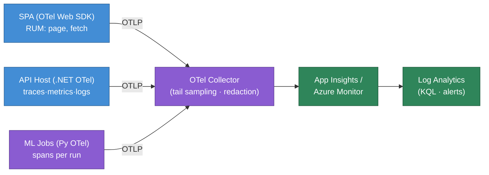
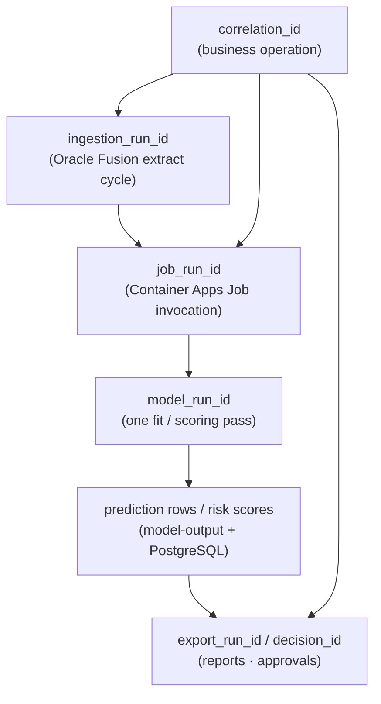
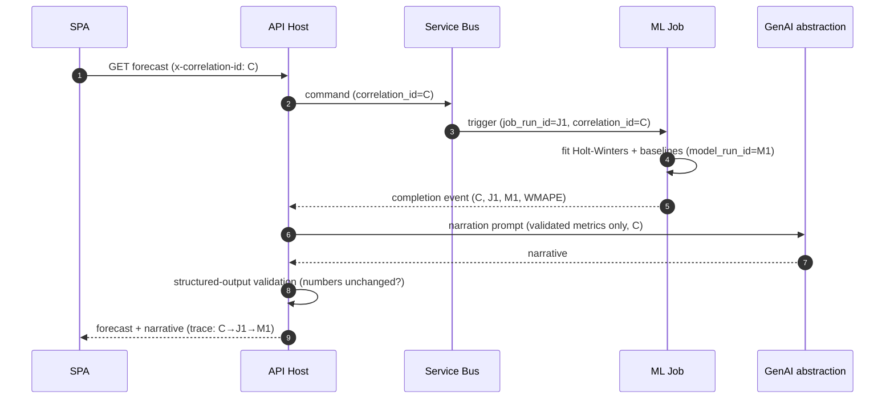
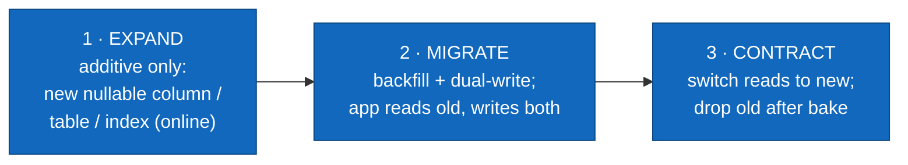

# Observability & Operations

> How BeeEye is instrumented, watched, alerted on, backed up, and recovered — so ADMC can run the platform with confidence that every number stays traceable and no secret ever leaks through telemetry.

BeeEye is a decision-intelligence platform: its value depends on being *trusted*, which means every
forecast, risk score, and recommendation must be traceable back through the compute that produced it,
and every operational fault must be visible before it reaches a business user. This document defines the
telemetry model (OpenTelemetry logs/traces/metrics), the correlation and run-identity scheme that ties
a browser click to an ML job run, the health-check surface, the monitor and alert catalogue, the
operational dashboards, and the backup / recovery / business-continuity posture — including
expand-and-contract schema migrations. It is the operations companion to
[overview.md](./overview.md) and [non-functional-requirements.md](./non-functional-requirements.md).

---

## 1. Principles

1. **One correlation identity, end to end.** A request entering the API host carries a `correlation_id`
   that propagates across Service Bus, Python ML jobs, PostgreSQL, ADLS, and the GenAI abstraction, so
   any figure on screen can be reconstructed from a single trace.
2. **Signals, not print statements.** All telemetry is emitted through OpenTelemetry (OTel) SDKs and
   exported to Azure Monitor / Application Insights. No ad-hoc logging sinks; no secrets in stdout.
3. **Determinism is observable.** Because forecasts, risk scores, values and quantities are computed by
   deterministic engines (ported from the POC `engine.js`) and GenAI only narrates, telemetry treats
   *"did the model alter a validated number?"* as a first-class, alertable event — never a silent pass.
4. **Redaction by construction.** Sensitive fields (secrets, tokens, PII, raw prompts, source row
   payloads) are scrubbed at the instrumentation boundary, not hopefully filtered downstream.
5. **No silent "now".** Operational clocks (job scheduling, freshness) use wall-clock time; but the
   *business* Analysis Date remains an explicit, configurable input (POC assumption model) and is
   stamped onto every model run so results are reproducible regardless of when the job actually ran.

---

## 2. Telemetry Model (OpenTelemetry)

BeeEye emits the three OTel signal types from every tier. The .NET host uses the OpenTelemetry .NET
SDK + `Azure.Monitor.OpenTelemetry.AspNetCore`; Python ML jobs use the OpenTelemetry Python SDK; the
SPA uses the OTel Web SDK for real-user monitoring (RUM). All exporters target Application Insights via
OTLP, with a collector sidecar available in Container Apps for tail-sampling.

| Signal | Emitters | What it carries | Retention (default) |
|--------|----------|-----------------|---------------------|
| **Traces** | SPA, API host, ML jobs, GenAI client, EF Core, Service Bus, HTTP clients | Distributed spans with `correlation_id`, `run` ids, module/bounded-context, use-case tag; tail-sampled (100% of errors + slow, ~10% of baseline). | 30 days hot |
| **Metrics** | All tiers | RED (Rate/Errors/Duration) + USE (Utilisation/Saturation/Errors) + domain counters/histograms. Pre-aggregated, low cardinality. | 90 days |
| **Logs** | All tiers | Structured JSON events correlated to the active trace/span; leveled; redacted. | 30 days hot, 1 year archived (Log Analytics → storage) |

### Resource attributes (every signal)

Every emitted signal is stamped with a common OTel resource so it can be sliced by deployment and
domain: `service.name` (e.g. `beeeye.api`, `beeeye.job.forecasting`, `beeeye.web`),
`service.version` (build SHA), `deployment.environment` (`dev`/`test`/`prod`),
`beeeye.bounded_context` (one of the nineteen contexts), and `beeeye.use_case` (UC1–UC8 where
applicable). Metric names follow a `beeeye.<area>.<name>` convention (e.g.
`beeeye.forecast.wmape`, `beeeye.risk.score`, `beeeye.ingestion.lag_seconds`).

---

## 3. Correlation & Run Identity

The heart of BeeEye traceability is a small, disciplined set of identifiers that flow with the work
rather than with the request only. They let an operator (or an auditor) answer *"which ingestion, which
model fit, which prompt produced the number this executive is looking at?"*

| Identifier | Created by | Scope / lifetime | Propagated via | Persisted where |
|-----------|-----------|-------------------|----------------|-----------------|
| `correlation_id` | API host (or SPA, honoured if present) | One logical business operation, spanning sync + async hops | HTTP header `x-correlation-id`; W3C `traceparent`; Service Bus message app-property | Every log line; Audit context |
| `ingestion_run_id` | Integration context (per Oracle Fusion extract cycle) | One ingestion run across raw→validated→curated | Service Bus event; ADLS zone folder path; row lineage column | ADLS zone metadata; PostgreSQL lineage; Audit |
| `job_run_id` | Container Apps Job invocation | One job execution (forecast batch, risk recompute, export) | Job env var; span attribute; completion event | ModelsAndExperiments / job-run table |
| `model_run_id` | ML job when it fits/scores a model | One model fit or scoring pass (finer than `job_run_id`) | MLflow run tag; model-output blob path; prediction rows | PostgreSQL predictions; MLflow; ADLS model-output |
| `export_run_id` | Reports & Exports flow | One report/export generation | Span attribute; export blob path | Export zone metadata; Audit |
| `decision_id` | DecisionsAndOutcomes context | One recommendation → approval → outcome chain | Span attribute | Audit (immutable) |

A single `correlation_id` fans out into potentially many run ids (one ingestion feeds many model runs,
each producing many predictions). The hierarchy below is what an operator navigates when chasing a
figure from the Executive Cockpit back to its source extract.

### Propagation example — forecast to narrated insight

Every span in that sequence shares `correlation_id=C`; the job and model spans additionally carry
`job_run_id`/`model_run_id`, so the trace in App Insights is a single navigable tree.

---

## 4. Never Expose Secrets or Sensitive Data via Telemetry

Telemetry is the widest-fan-out data path in the platform, so redaction is enforced at the SDK boundary
and verified in CI. Rules:

- **Secrets never enter telemetry.** Connection strings, Key Vault references, bearer/OIDC tokens,
  GenAI provider keys, and Oracle Fusion credentials are resolved via managed identity and never logged,
  never placed on spans, never in exception messages. A processor drops any attribute matching
  secret-like key patterns (`*password*`, `*secret*`, `*token*`, `*apikey*`, `authorization`, `cookie`).
- **No raw source payloads.** Oracle Fusion extract rows, curated business data, and monetary values
  (SAR) are not logged verbatim. Lineage is carried as *references* (`ingestion_run_id` + row key), not
  as the row contents.
- **Prompts and completions are redacted.** For the GenAI path, only the *shape* is telemetered — token
  counts, latency, provider/alias, validation outcome — never the full grounded prompt or narrative
  text. If a prompt sample is needed for debugging, it is captured behind a break-glass flag, hashed
  user identity, and short retention.
- **PII minimisation.** User identity appears as an opaque subject id (Entra `oid`), not name/email.
  IP addresses in RUM are truncated. Log Analytics access is RBAC-scoped.
- **HTTP hygiene.** `Authorization`, `Cookie`, and `x-api-*` headers are stripped from HTTP client
  spans; query strings are allow-listed (no tokens in URLs).
- **Verification.** A redaction unit-test suite and a startup self-check assert the scrubbing
  processors are registered; a synthetic "canary secret" is emitted in test environments and an alert
  fires if it ever appears in Log Analytics.

See [security-and-identity.md](./security-and-identity.md) for the identity and secrets model these
rules depend on.

---

## 5. Health, Readiness, Liveness & Dependency Checks

The API host and each ML job expose ASP.NET Core / lightweight health endpoints consumed by Container
Apps probes, deployment gates, and the operations dashboard.

| Endpoint | Question it answers | Used by | Semantics |
|----------|---------------------|---------|-----------|
| `GET /health/live` | Is the process alive and not deadlocked? | Container Apps liveness probe | Cheap, no dependencies. Failure ⇒ restart. |
| `GET /health/ready` | Can this instance serve traffic *now*? | Container Apps readiness probe; ingress | Checks critical dependencies (PostgreSQL, Key Vault, config). Failure ⇒ removed from rotation, not restarted. |
| `GET /health/startup` | Has one-time init (migrations checked, config loaded) completed? | Startup probe | Gates readiness until warm. |
| `GET /health/deps` | What is each dependency's status and latency? | Ops dashboard; on-call triage | Detailed JSON: per-dependency `Healthy`/`Degraded`/`Unhealthy` + last check + latency. Not on the hot path. |

### Dependency check catalogue

| Dependency | Check | Failure classification |
|-----------|-------|------------------------|
| PostgreSQL Flexible Server | `SELECT 1` + pool acquire under timeout | **Critical** → `ready` fails |
| Key Vault | Cached secret refresh reachable via managed identity | **Critical** → `ready` fails |
| ADLS Gen2 | Head/list on a probe blob per zone | **Degraded** (reads may serve from cache) |
| Service Bus | Namespace reachable; queue depth query | **Degraded** (async work delayed, sync reads unaffected) |
| Oracle Fusion (ACL) | Lightweight ACL heartbeat (read-only) | **Degraded** → serve last curated snapshot; ingestion freshness alerts |
| GenAI provider(s) | Provider health/alias resolution via abstraction | **Degraded** → deterministic results served **without** narrative |
| Entra ID (OIDC) | OIDC metadata/JWKS reachable | **Critical** for new auth; cached keys cover transient blips |

**Degradation philosophy:** BeeEye is designed so that non-critical dependency loss narrows
functionality rather than failing the platform. If GenAI is down, users still get every deterministic
number — just without narration. If Oracle Fusion is unreachable, the last curated snapshot is served
and clearly marked stale via the freshness monitor. This is the operational expression of the
determinism-first guardrail.

---

## 6. Monitor Catalogue

The metrics BeeEye watches, with the signal source and the SLO/threshold that turns a metric into an
alert. Thresholds align with the performance budgets in [overview.md](./overview.md) §7.

| # | Monitor | Metric / source | Warning | Critical (page) |
|---|---------|-----------------|---------|-----------------|
| 1 | **API latency** | `http.server.duration` p95 per route class | cached read > 300 ms; aggregate > 800 ms | 2× budget sustained 5 min |
| 2 | **API error rate** | 5xx / total requests | > 1% over 5 min | > 5% over 5 min |
| 3 | **DB latency** | `beeeye.db.query.duration` p95; pool wait | p95 > 150 ms; pool saturation > 70% | p95 > 500 ms; pool exhausted |
| 4 | **Queue depth / age** | Service Bus active + dead-letter count; oldest message age | depth rising 15 min; DLQ > 0 | oldest message age > 15 min; DLQ growing |
| 5 | **Job failures** | `beeeye.job.runs{status=failed}` (Container Apps Jobs) | any single failure | > 1 failure or nightly batch missed window |
| 6 | **Ingestion freshness** | `beeeye.ingestion.lag_seconds` (now − last successful curated run) | lag > 1× expected cadence | lag > 2× cadence (stale data on screen) |
| 7 | **Data-quality failures** | `beeeye.dq.rule_failures` (DataQuality context); quarantine-zone writes | any rows quarantined | validation gate blocks a curated publish |
| 8 | **Model-run duration** | `beeeye.model.run.duration` per series | > 45 s/series | > 60 s/series (breaches refit budget) |
| 9 | **AI provider latency** | `beeeye.genai.request.duration` p95 per alias | p95 > 4 s | p95 > 10 s or timeouts |
| 10 | **AI provider errors** | `beeeye.genai.errors` incl. fallback activations & structured-output validation rejects | fallback rate > 5% | primary+fallback both failing; **any** number-altering rejection spike |
| 11 | **AI token usage & cost** | `beeeye.genai.tokens{in,out}`, `beeeye.genai.cost_sar` | daily spend > 80% of budget | > 100% of budget or anomalous spike |
| 12 | **Export failures** | `beeeye.export.runs{status=failed}` | any failure | recurring failures / export SLA breach |
| 13 | **Auth failures** | Failed OIDC validations, token errors | elevated failure rate | spike (possible outage or attack) |
| 14 | **AuthZ denials** | `beeeye.authz.denied` per policy/persona | unusual denial rate for a user/policy | broad denial spike (misconfig or probing) |
| 15 | **Resource consumption** | CPU/memory/replica count (Container Apps); PostgreSQL CPU/IOPS/storage; ADLS capacity | > 70% sustained; storage > 75% | > 90% sustained; scaling ceiling; storage > 90% |

Domain-specific signals worth watching beyond infra: `beeeye.forecast.wmape` drift (chosen model's
back-test error rising over time), `beeeye.risk.recompute.lag` (Analysis-Date recompute staleness), and
demand-fallback usage rate (share of risk scores relying on a fallback tier rather than
location+model+variant history — a data-coverage signal, not an error).

---

## 7. Alert Definitions

Alerts are defined in Azure Monitor (metric + Log Analytics KQL rules), version-controlled as IaC, and
routed by severity. Each carries an owner, a runbook link, and a suppression window to avoid storms.

| Severity | Meaning | Response target | Routing |
|----------|---------|-----------------|---------|
| **P1** | Business-facing outage or wrong-number risk (e.g. structured-output validation failing open, prod API > 5% 5xx, PostgreSQL unavailable) | Ack ≤ 15 min, 24×7 | Page on-call (PagerDuty/Teams) |
| **P2** | Degraded but serving (GenAI down → no narration, ingestion stale, job batch missed window) | Ack ≤ 1 h, business hours + on-call after hours | On-call + owning team channel |
| **P3** | Elevated / trending (queue depth rising, WMAPE drift, cost > 80% budget) | Next business day | Team channel |
| **P4** | Informational / capacity (storage 75%, fallback-tier usage up) | Backlog | Dashboard + weekly review |

Representative alert rules (each with a linked runbook):

- **AI altered a validated number** (P1): any spike in structured-output validation rejections where the
  narrative changed a metric. The narrative is already suppressed automatically (deterministic result
  returned alone); the alert exists so engineering investigates prompt/provider drift immediately.
- **Ingestion stale** (P2): `beeeye.ingestion.lag_seconds` > 2× cadence → screens may show yesterday's
  world; runbook covers Oracle Fusion ACL heartbeat and last-good-snapshot confirmation.
- **Forecast batch breached window** (P2): nightly refit didn't complete before business open → cached
  forecasts served; runbook covers per-series duration triage and reflow.
- **GenAI budget breach** (P3): `beeeye.genai.cost_sar` daily > budget → routing/alias review, rate caps.
- **Data-quality gate blocked publish** (P2): quarantine write blocked a curated promotion → DataQuality
  runbook; no partial/dirty data reaches the curated model.
- **AuthZ denial spike** (P2/P1): broad denials → misconfiguration vs. probing triage; ties to Audit.

Every P1/P2 alert links to a runbook in the ops wiki: symptom → dashboards to open → correlation-id to
pull → decision tree → escalation. Runbooks are exercised in the restore/game-day drills (§9).

---

## 8. Operational Dashboards

Dashboards are Azure Monitor Workbooks (KQL-backed), organised by audience. They reuse the POC OKLCH
design language where embedded in the SPA admin views — risk/aging colour scales, IBM Plex Mono for
numerals — so operators read the same visual vocabulary as analysts.

| Dashboard | Audience | Key panels |
|-----------|----------|-----------|
| **Platform Health** | On-call / IT | Service map, API RED metrics, error budget burn, dependency `/health/deps` matrix, replica/CPU/memory |
| **Data & Ingestion** | Data ops | Ingestion freshness per source, ADLS zone throughput, data-quality pass/fail + quarantine volume, lineage lookup by `ingestion_run_id` |
| **ML & Forecasting** | ML / analytics eng | Job-run success/duration, per-series model-run duration vs. 60 s budget, WMAPE trend, demand-fallback usage, MLflow run links by `model_run_id` |
| **GenAI** | Platform / FinOps | Latency & error per alias, fallback activations, structured-output rejection rate, tokens & SAR cost vs. budget |
| **Security & Access** | Security / IT | Auth failure trend, authz denials per policy/persona, Key Vault access, audit-event volume |
| **Cost & Capacity** | FinOps / IT | Container Apps + PostgreSQL + ADLS + Service Bus + GenAI spend (SAR), storage headroom, scaling ceilings |

A "figure provenance" workbook accepts a `correlation_id` (or any run id) and reconstructs the full
chain — request → ingestion → job → model run → prediction → narration → export — which is the primary
tool for answering "where did this number come from?".

---

## 9. Backup, Recovery & Business Continuity

Recovery objectives are tiered by how much each store's loss would hurt. Curated business data and
predictions are reproducible from raw extracts + deterministic engines, which meaningfully relaxes RPO
for derived tiers.

| Asset | Mechanism | RPO | RTO | Notes |
|-------|-----------|-----|-----|-------|
| PostgreSQL (curated model, metrics, predictions, audit) | Flexible Server automated backups + **PITR**; geo-redundant backup storage | ≤ 5 min (PITR) | ≤ 1 h | Retention 7–35 days; audit tables are append-only |
| ADLS **raw** zone (source of truth for lineage) | Blob soft-delete + versioning + immutable/WORM snapshots; GRS | ~0 (immutable) | ≤ 2 h | Never overwritten; enables full recompute |
| ADLS validated/curated/model-out/export | Soft-delete + versioning | ≤ 1 h | ≤ 4 h (or recompute) | Derived; reproducible from raw + engines |
| Key Vault | Soft-delete + **purge protection** | n/a | ≤ 1 h | Secrets re-issued via managed identity if needed |
| Service Bus | Dead-letter + duplicate detection; messages transient | n/a | n/a | Reprocessed from source on recovery, not backed up |
| IaC / config / migrations | Git + pipeline | ~0 | ≤ 30 min | Environment rebuildable from code |

### Business continuity

- **High availability:** PostgreSQL Flexible Server zone-redundant HA; Container Apps run ≥ 2 replicas
  across availability zones; stateless API scales horizontally.
- **Region strategy:** primary in the ADMC-chosen Azure region with geo-redundant backups; documented
  cross-region restore procedure for a regional outage (data residency respected — restore stays within
  approved geography).
- **Graceful degradation** (from §5): GenAI loss → deterministic-only; Oracle Fusion loss → last curated
  snapshot, flagged stale; ADLS derived-zone loss → recompute from raw. The platform never fabricates or
  guesses to fill a gap.
- **Restore testing:** PITR restore and cross-region restore are rehearsed on a **quarterly game-day**
  against a scratch environment; success criteria: data integrity checks pass, a known figure
  reconstructs bit-for-bit from raw via the deterministic engines, and RTO is met. Results feed the
  runbooks in §7. Untested backups are treated as no backups.

---

## 10. Expand-and-Contract Migrations

Schema evolution across the per-module EF Core `DbContext`s uses **expand-and-contract** (a.k.a.
parallel-change) so deployments are zero-downtime and always roll-back-safe — essential for a modular
monolith where one deployable hosts nineteen contexts.

Rules that make it safe:

1. **Expand is always backward-compatible.** New columns are nullable or defaulted; renames are done as
   add-new + backfill + drop-old, never in place. The currently-running version keeps working against
   the expanded schema.
2. **Backfill runs online**, in batches, as an idempotent job (its own `job_run_id` for observability),
   never as a blocking migration step.
3. **Dual-write / dual-read window** brackets the change: the new deployment writes both shapes and can
   read either, so a rollback to the previous version finds data it understands.
4. **Contract is a separate, later deployment** — old columns/tables are dropped only after a bake
   period during which telemetry confirms nothing reads them (a metric counts legacy-path reads; the
   drop is gated on it reaching zero).
5. **Every migration is forward-and-back tested** in CI against a production-shaped database; migrations
   are versioned in Git alongside the code that depends on them, and applied via the deployment pipeline
   (never by hand). The `/health/startup` probe verifies the expected migration version before an
   instance reports ready.

This lets ADMC deploy schema changes during business hours with no downtime and a guaranteed rollback
path — consistent with the availability goals in [non-functional-requirements.md](./non-functional-requirements.md).

---

## Traceability

- Architecture map & NFRs → [overview.md](./overview.md) · [non-functional-requirements.md](./non-functional-requirements.md)
- Deployment topology (Container Apps, probes, HA) → [deployment-topology.md](./deployment-topology.md)
- Identity, secrets & redaction basis → [security-and-identity.md](./security-and-identity.md)
- Data zones, lineage & data-quality gates → [data-architecture.md](./data-architecture.md)
- ML lifecycle, MLflow & model runs → [ml-platform.md](./ml-platform.md)
- Provider-neutral GenAI & structured-output validation → [genai-architecture.md](./genai-architecture.md)
- Oracle Fusion ACL & ingestion cadence → [integration-oracle-fusion.md](./integration-oracle-fusion.md)
- POC provenance: methodology (WMAPE, risk weights) → [../wireframes/docs/METHODOLOGY.md](../wireframes/docs/METHODOLOGY.md) · assumptions (Analysis Date) → [../wireframes/docs/ASSUMPTIONS_LIMITATIONS.md](../wireframes/docs/ASSUMPTIONS_LIMITATIONS.md)
