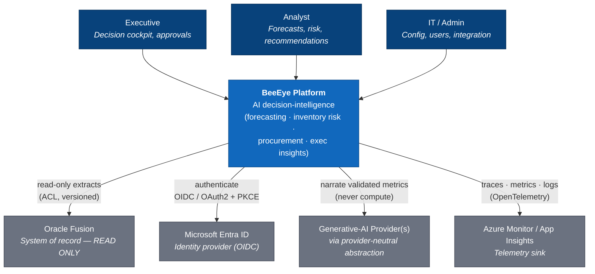
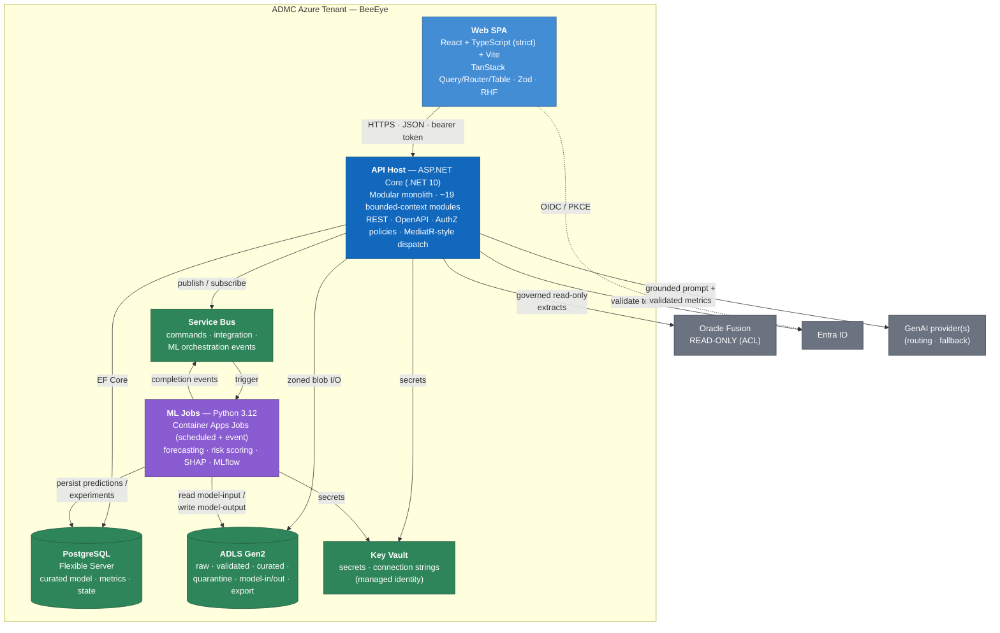
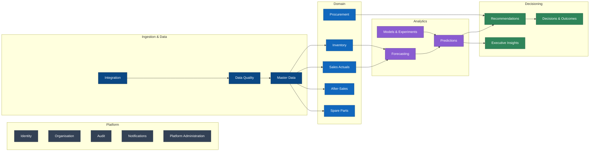
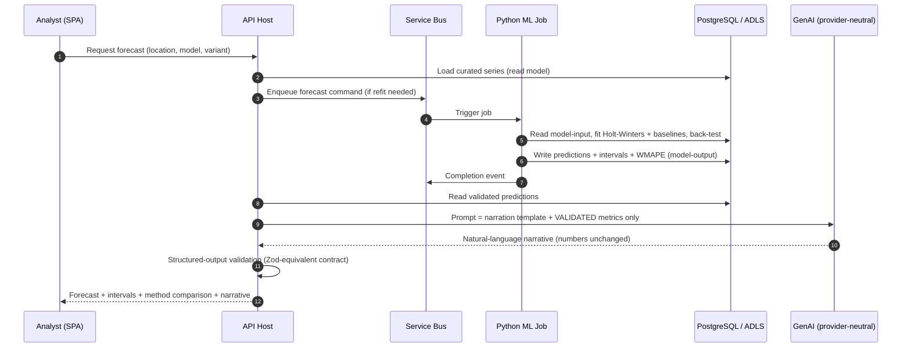

# Architecture Overview (C4 + Tech Stack)

> The single entry point for BeeEye's target production architecture: how the vendor product is packaged, deployed into ADMC's Azure tenant, and wired to Oracle Fusion, Azure data services, and a provider-neutral generative-AI layer.

BeeEye is a production-grade AI decision-intelligence platform. This document establishes the
system-context and container views (C4 levels 1–2), the technology stack with versions and rationale,
and the platform-wide non-functional goals. It is deliberately the *map*: deeper concerns (bounded
contexts, data zones, ML lifecycle, GenAI grounding, security, Oracle integration) live in the sibling
documents linked under [Traceability](#traceability).

The POC ("Meridian BI") validated the analytics — metrics, Holt-Winters + baseline forecasting with
holdout back-testing, an explainable additive risk model, a rules-based recommendation engine, and a
deterministic grounded AI insight layer — as framework-free JavaScript in a single-page prototype. The
production build ("BeeEye", .NET namespace root `BeeEye`) re-homes that logic into a .NET 10 modular
monolith with a Python ML tier, keeping the numbers deterministic and the AI strictly narrative.

---

## 1. Scope & Deployment Model

| Aspect | Decision |
|--------|----------|
| Delivery model | Vendor product (BeeEye), deployed **into ADMC's own Azure tenant** and subscription. |
| Data residency | ADMC-controlled Azure region; SAR currency throughout; no customer data leaves the tenant. |
| System of record | Oracle Fusion (ERP, sales, inventory, finance, after-sales) — **read-only**, reached only through a versioned anti-corruption layer (ACL). |
| Write-back | BeeEye never writes to enterprise systems; recommendations require **human approval** before any downstream action. |
| Compute shape | ASP.NET Core Web API host (modular monolith) + Python ML jobs (Container Apps Jobs), all on Azure Container Apps. |
| Identity | Microsoft Entra ID (OIDC / OAuth2 + PKCE); personas Executive, Analyst, IT/Admin. |

---

## 2. C4 Level 1 — System Context

Who and what BeeEye interacts with. ADMC business users consume the platform through a browser; BeeEye
reads from Oracle Fusion and calls out to Azure platform services and a generative-AI provider.

**Guardrail (context level):** the generative-AI provider may *narrate* metrics already computed and
validated by the platform. It must **never** compute forecasts, risk probabilities, monetary values,
quantities, or decisions. See [ai-provider-abstraction.md](./ai-provider-abstraction.md).

---

## 3. C4 Level 2 — Container View

Inside the platform boundary. A React SPA talks to one ASP.NET Core API host (the modular monolith);
the host owns the transactional store and orchestrates asynchronous ML work; Python jobs run
out-of-band and publish results back through the data plane.

### Container responsibilities

| Container | Role | Notes |
|-----------|------|-------|
| Web SPA | Presentation & interaction | React 19 + TypeScript strict; TanStack Query for server state, Router for routing, Table for grids; Zod + React Hook Form for validated forms. Carries the POC's OKLCH design tokens (IBM Plex Sans/Mono, radius 12px, risk/aging colour scales). |
| API Host | Application & domain | Single deployable ASP.NET Core process; ~19 bounded-context module libraries linked in-process with explicit contracts. Owns authorization, request validation, transactional consistency, and orchestration of async ML work. |
| ML Jobs | Analytics compute | Python jobs run as Container Apps Jobs (cron + Service-Bus-triggered). Deterministic numeric engines port the POC's `engine.js` logic; MLflow tracks experiments; SHAP produces explainability. Results are data, not API calls. |
| PostgreSQL | Curated model + state | Azure Database for PostgreSQL Flexible Server — the curated business model, computed metrics, predictions, decisions and audit state. |
| ADLS Gen2 | Lakehouse zones | Zoned storage (raw → validated → curated → model-input → model-output → export, plus quarantine) providing lineage and reproducibility. |
| Service Bus | Async backbone | Decouples ingestion, ML orchestration, and notifications; enables retry, dead-lettering, and back-pressure. |
| Key Vault | Secrets | All secrets and connection strings; accessed via managed identity — **no secrets in client code or images**. |

---

## 4. Modular Monolith & Bounded Contexts

BeeEye ships as **one deployable** (the API host) composed of independently-owned bounded-context
modules. This keeps deployment and transactions simple while preserving strong internal boundaries and
a clean seam to extract services later if load demands it. Modules communicate through explicit
in-process contracts and domain events (carried on Service Bus when they cross async boundaries);
direct reach-through into another module's tables is prohibited.

The nineteen contexts: **Identity, Organisation, MasterData, Integration, DataQuality, SalesActuals,
Forecasting, Inventory, Procurement, AfterSales, SpareParts, ModelsAndExperiments, Predictions,
Recommendations, DecisionsAndOutcomes, ExecutiveInsights, Notifications, Audit, PlatformAdministration.**
Their contracts, ownership, and events are catalogued in
[module-boundaries.md](./module-boundaries.md); each maps to one or more of the eight ADMC business use
cases (UC1 order optimisation → UC8 executive cockpit).

---

## 5. Representative Flow — Forecast to Narrated Insight

Illustrates the strict separation between deterministic computation and AI narration.

If structured-output validation detects the model altering or inventing a number, the narrative is
rejected and the deterministic result is returned on its own. AI is additive, never authoritative.

---

## 6. Technology Stack

Versions reflect the July 2026 target baseline; exact patch levels are pinned per environment.

### Front-end

| Technology | Version | Rationale |
|-----------|---------|-----------|
| React | 19.x | Mature component model; concurrent rendering for responsive grids/charts. |
| TypeScript | 5.8 (`strict`) | Compile-time safety end-to-end; strict mode is mandatory, not optional. |
| Vite | 7.x | Fast dev server + optimised production bundles; first-class TS/React support. |
| TanStack Query | v5 | Server-state caching, background refresh, and request de-duplication for metric-heavy screens. |
| TanStack Router | v1 | Type-safe routing with typed search params for shareable dashboard state. |
| TanStack Table | v8 | Headless, virtualised tables for inventory/detail grids (291+ rows, expandable). |
| Zod | 4.x | Runtime schema validation of API payloads and forms; single source of truth for shapes. |
| React Hook Form | 7.x | Performant forms (POC Settings equivalents: weights, thresholds, analysis date). |
| Design tokens | POC-derived | OKLCH light/dark themes, IBM Plex Sans/Mono + Material Symbols, risk & aging colour scales. |

### Back-end

| Technology | Version | Rationale |
|-----------|---------|-----------|
| .NET | 10 (LTS) | Long-term-support runtime for the modular-monolith host. |
| C# | 14 | Modern language features; namespace root `BeeEye`. |
| ASP.NET Core | 10 | Web API host, minimal-API + controllers, OpenAPI, auth policies. |
| Entity Framework Core | 10 | Data access to PostgreSQL with migrations and per-module `DbContext`. |
| OpenAPI / Swagger | 3.1 | Contract-first API surface consumed by the typed SPA client. |

### ML & data science

| Technology | Version | Rationale |
|-----------|---------|-----------|
| Python | 3.12 | ML runtime for Container Apps Jobs. |
| pandas / Polars | 2.x / 1.x | Tabular transforms; Polars for larger curated extracts. |
| scikit-learn | 1.5+ | Baseline models, preprocessing, evaluation utilities. |
| statsmodels | 0.14+ | Holt-Winters (level/trend/seasonal, period 12) and classical baselines. |
| XGBoost / LightGBM | 2.x / 4.x | Gradient-boosted models for demand/spare-parts use cases. |
| MLflow | 2.x | Experiment tracking, model registry, reproducibility. |
| SHAP | 0.4x | Explainability aligned with the POC's transparent, additive philosophy. |

### Platform & Azure

| Technology | Version / SKU | Rationale |
|-----------|---------------|-----------|
| Azure Database for PostgreSQL | Flexible Server, PG 17 | Curated model, metrics, predictions, state; HA + PITR. |
| Azure Data Lake Storage Gen2 | Standard, HNS on | Zoned lakehouse (raw/validated/curated/quarantine/model-in/model-out/export). |
| Azure Service Bus | Standard/Premium | Reliable async messaging for ingestion and ML orchestration. |
| Azure Container Apps | Consumption + Dedicated | Hosts the API; jobs run as Container Apps Jobs (cron + event). |
| Azure Key Vault | Standard | Secrets/keys via managed identity. |
| Microsoft Entra ID | — | OIDC / OAuth2 + PKCE; RBAC personas. |
| OpenTelemetry + Application Insights | OTel 1.x | Distributed tracing, metrics, and structured logs. |
| GenAI abstraction | Provider-neutral | Aliases, routing, fallback, structured-output validation over one or more providers. |

Rationale for the shape: a **modular monolith** minimises operational complexity and cross-service
transactions for a data-and-analytics workload, while the **out-of-band Python job tier** keeps
long-running statistical compute off the request path and independently scalable. See
[deployment-and-ip-protection.md](./deployment-and-ip-protection.md) and [mlops-and-models.md](./mlops-and-models.md).

---

## 7. Non-Functional Goals

### Performance budgets

| Concern | Target |
|---------|--------|
| SPA initial load (cold, p75) | ≤ 2.5 s LCP on ADMC office network; JS payload budget ≤ 300 KB gzip for the shell. |
| Interactive dashboard render | ≤ 1 s to first meaningful metric using cached server state. |
| API read (cached metrics), p95 | ≤ 300 ms. |
| API read (curated aggregate), p95 | ≤ 800 ms. |
| Forecast refit job (per series) | ≤ 60 s; batch nightly refresh completes within the maintenance window. |
| Availability | 99.5% for the interactive tier (business-hours weighted). |

Numbers are served from precomputed, cached results; the request path does **not** fit models
synchronously.

### Accessibility

Target **WCAG 2.2 AA**. Concretely: full keyboard operability and visible focus, ≥ 4.5:1 text contrast
(the OKLCH tokens are tuned for both themes), semantic landmarks and ARIA on grids/charts, respect for
`prefers-reduced-motion`, and no colour-only signalling — risk and aging bands always pair colour with
text/iconography.

### Security

| Control | Approach |
|---------|----------|
| AuthN | Entra ID, OIDC / OAuth2 + PKCE; short-lived tokens validated at the API. |
| AuthZ | Role/policy-based per bounded context; least privilege; Executive/Analyst/IT personas. |
| Secrets | Key Vault + managed identity only; nothing in client code, images, or config files. |
| Data protection | TLS 1.2+ in transit; encryption at rest (PostgreSQL + ADLS); tenant-resident data. |
| Oracle Fusion | Read-only via versioned ACL; source row references preserved for lineage. |
| Auditability | Immutable audit trail (Audit context); decisions and approvals recorded. |
| Human-in-the-loop | Recommendations require explicit approval before any action; no automated write-back. |
| Observability | OpenTelemetry traces/metrics/logs to App Insights; PII-aware logging. |
| Environments | Separate dev / test / prod with isolated identities, secrets, and data. |

Details in [security-threat-model.md](./security-threat-model.md) and
[overview.md#7-non-functional-goals](./overview.md#7-non-functional-goals).

---

## 8. Cross-Cutting Guardrails

1. **Determinism first.** All forecasts, risk scores, values, quantities, and decisions come from the
   deterministic engines (ported from the POC's `engine.js`). GenAI narrates only.
2. **Oracle Fusion is read-only.** Reached exclusively through the versioned ACL; BeeEye never mutates
   the system of record.
3. **No silent "now".** Time-sensitive computations (inventory age, holding cost, aging bands, risk)
   use an explicit, configurable Analysis Date — never the wall-clock date silently — inherited from
   the POC assumption model.
4. **Explainability by construction.** Additive risk breakdown (stock-cover 30%, holding age 25%,
   declining demand 20%, holding-cost 15%, lead-time 10%), transparent demand-fallback hierarchy, and
   SHAP for ML models.
5. **Lineage preserved.** Every curated figure traces back through ADLS zones to a source extract.

---

## Traceability

This overview is the index; the following sibling documents carry the detail and are kept consistent
with the facts here.

- Bounded contexts & module contracts → [module-boundaries.md](./module-boundaries.md)
- Data architecture & ADLS zones → [data-integration-and-quality.md](./data-integration-and-quality.md)
- Oracle Fusion integration & ACL → [data-integration-and-quality.md](./data-integration-and-quality.md)
- ML platform & model lifecycle → [mlops-and-models.md](./mlops-and-models.md)
- Provider-neutral GenAI & grounding → [ai-provider-abstraction.md](./ai-provider-abstraction.md)
- Security & identity → [security-threat-model.md](./security-threat-model.md)
- Deployment topology (Azure) → [deployment-and-ip-protection.md](./deployment-and-ip-protection.md)
- Non-functional requirements → [overview.md#7-non-functional-goals](./overview.md#7-non-functional-goals)

POC provenance (source of the analytics and data model this architecture productionises):

- Forecasting & risk methodology → [../wireframes/docs/METHODOLOGY.md](../wireframes/docs/METHODOLOGY.md)
- Data dictionary → [../wireframes/docs/DATA_DICTIONARY.md](../wireframes/docs/DATA_DICTIONARY.md)
- Integration blueprint (POC future-state) → [../wireframes/docs/INTEGRATION_AZURE_ORACLE.md](../wireframes/docs/INTEGRATION_AZURE_ORACLE.md)
- Assumptions & limitations → [../wireframes/docs/ASSUMPTIONS_LIMITATIONS.md](../wireframes/docs/ASSUMPTIONS_LIMITATIONS.md)
