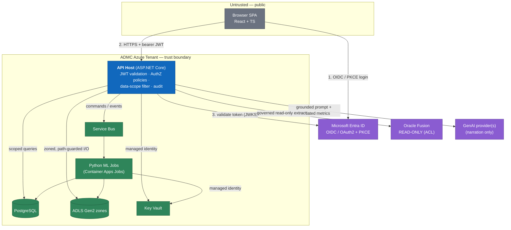
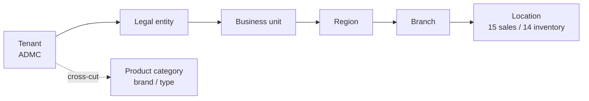
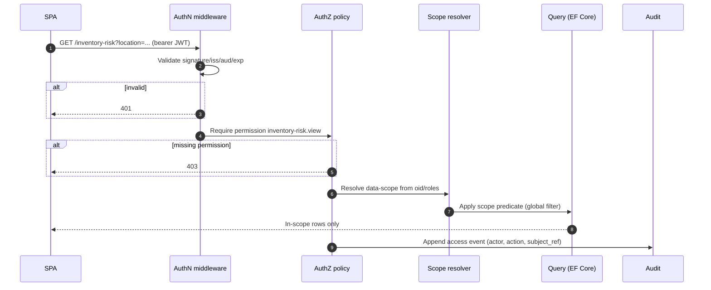

# Security & Threat Model

> How BeeEye authenticates callers, authorises every request down to the data-scope, and defends the platform against a concrete, enumerated threat list — with the mitigations and the security tests that hold each control honest.

BeeEye is deployed **into ADMC's own Azure tenant**, reads Oracle Fusion **read-only**, and never
writes back to enterprise systems (see [overview.md](./overview.md)). That posture shrinks the attack
surface but does not remove it: the platform still ingests external data, exposes an authenticated API
and SPA, orchestrates ML jobs, and calls out to a generative-AI provider. This document is the security
contract for the modular monolith and its Python job tier — the authentication and authorisation model,
a STRIDE-style threat register, the secrets/logging rules, the append-only audit guarantee, and the
`tests/security` suite that verifies them.

---

## 1. Trust Boundaries

Every arrow that crosses a boundary is a place where identity is asserted and re-checked. BeeEye trusts
no caller by network position alone.



**Boundary rules.**
1. The browser is untrusted; all authority is re-derived server-side from a validated token — never
   from client-supplied role, scope, or id fields.
2. Service-to-service calls **inside** the tenant use **managed identities**, not secrets in code.
3. Oracle Fusion and the GenAI provider are external systems reached through hardened, single-purpose
   adapters (the versioned anti-corruption layer, and the provider-neutral GenAI abstraction).

---

## 2. Authentication (AuthN)

### 2.1 Interactive users — Entra ID

| Aspect | Decision |
|--------|----------|
| Identity provider | Microsoft Entra ID (the ADMC tenant); no local user store in production. |
| Protocol | OpenID Connect over OAuth2 with **Authorization Code + PKCE**; no implicit flow, no client secret in the SPA. |
| Token | Short-lived access JWT (target ≤ 60 min) + refresh handled by the identity library; SPA stores tokens in memory, not `localStorage`. |
| Claims consumed | `oid` (stable user id → `User.user_id`), `tid` (tenant), `roles`/group claims, `scp`, `iss`, `aud`, `exp`, `nbf`. |
| MFA / conditional access | Enforced by Entra ID policy (owned by ADMC IT), not re-implemented by BeeEye. |

### 2.2 Backend JWT validation

The API host validates **every** bearer token on every request before any handler runs. Validation is
non-negotiable and centralised in the authentication middleware:

- **Signature** verified against Entra ID's published JWKS (keys cached, rotated on `kid` change).
- **Issuer** (`iss`) must match the configured tenant authority exactly.
- **Audience** (`aud`) must equal BeeEye's registered API app-id URI.
- **Lifetime** (`exp`/`nbf`) enforced with a minimal clock-skew allowance (≤ 2 min).
- **Algorithm** pinned to the expected asymmetric family; `alg: none` and symmetric downgrades are rejected.
- Failures return `401`; a valid token with insufficient authority returns `403` (never `200` with empty data — see excessive-exposure threats).

### 2.3 Dev-only local auth — guarded OFF in deployed environments

A lightweight local auth stub exists **only** to let developers run the stack without an Entra tenant.
It is fenced by three independent guards, all of which must permit it, and it is designed to be
impossible to switch on in a deployed environment:

1. Compilation/registration gated on `Environment == Development`;
2. An explicit opt-in flag (`Auth:AllowLocalDevAuth`) that defaults to `false`;
3. A **startup assertion** that throws and aborts boot if local auth is active while the environment is
   `Staging`/`Production` **or** the process is running under a managed identity.

A dedicated security test (§7) asserts that a Production configuration cannot resolve the local-auth
handler. This closes the classic "debug endpoint shipped to prod" hole.

### 2.4 Service-to-service — managed identities

- The API host and Python jobs authenticate to **PostgreSQL, ADLS Gen2, Key Vault, and Service Bus**
  using **Azure managed identities** — no connection-string passwords, no shared keys in images or config.
- The Oracle Fusion adapter and GenAI providers use credentials **retrieved from Key Vault at runtime**
  via managed identity; nothing sensitive is baked into a container.
- Job identities are least-privilege: an ML job can read `model-input` and write `model-output`, but has
  no rights to the `export` zone or to user tables it does not need.

---

## 3. Authorization (AuthZ)

BeeEye uses **permission-based** authorization, not raw role checks. Roles are a convenience for
assigning permissions; **handlers and policies always test a fine-grained permission**, so the model
stays stable as roles are re-cut for ADMC.

### 3.1 Permission catalogue (representative)

Permissions are `resource.action`. Each maps to an ASP.NET Core authorization policy and is enforced at
the API boundary; the SPA uses the same permission set only to *hide* controls (never to *grant* access).

| Permission | Guards | Bounded context |
|------------|--------|-----------------|
| `forecast.view` | Read forecasts, intervals, back-test accuracy | Forecasting / Predictions |
| `forecast.run` | Trigger a forecast refit job | Forecasting |
| `forecast.manage` | Change forecast parameters (holdout, confidence, method policy) | Forecasting |
| `forecast.approve` | Sign off a forecast as basis for procurement | Forecasting / DecisionsAndOutcomes |
| `inventory-risk.view` | View risk scores, bands, component breakdown | Inventory |
| `inventory-risk.configure` | Edit risk weights / aging thresholds (new `weights_version`) | Inventory / PlatformAdministration |
| `recommendation.review` | View and comment on recommendations | Recommendations |
| `recommendation.approve` | Approve / reject / modify a recommended action | DecisionsAndOutcomes |
| `procurement.propose` | Generate order proposals | Procurement |
| `procurement.approve` | Approve an order proposal for hand-off | Procurement / DecisionsAndOutcomes |
| `model.view` | View model versions / experiments | ModelsAndExperiments |
| `model.publish` | Register/promote a model version | ModelsAndExperiments |
| `data-quality.view` | View DQ results and quarantine | DataQuality |
| `data-quality.resolve` | Resolve/override a DQ failure | DataQuality |
| `integration.manage` | Configure Oracle Fusion extracts / ACL version | Integration |
| `executive-cockpit.view` | View the executive decision cockpit | ExecutiveInsights |
| `audit.view` | Read the append-only audit trail | Audit |
| `report.export` | Export reports (CSV/XLSX/PDF) within scope | ExecutiveInsights / Reports |
| `settings.manage` | Change platform settings (analysis date, weights) | PlatformAdministration |
| `platform.administer` | User/role/scope administration | Identity / PlatformAdministration |

### 3.2 Role → permission mapping

Personas are Executive, Analyst, IT/Admin (extensible). Approval-bearing permissions are deliberately
separated from authoring permissions so that no single role can both invent and approve an action.

| Permission | Executive | Analyst | IT / Admin |
|------------|:---:|:---:|:---:|
| `executive-cockpit.view` | ✔ | ✔ | – |
| `forecast.view` | ✔ | ✔ | – |
| `forecast.run` / `forecast.manage` | – | ✔ | – |
| `forecast.approve` | ✔ | – | – |
| `inventory-risk.view` | ✔ | ✔ | – |
| `inventory-risk.configure` | – | ✔ | ✔ |
| `recommendation.review` | ✔ | ✔ | – |
| `recommendation.approve` / `procurement.approve` | ✔ | – | – |
| `procurement.propose` | – | ✔ | – |
| `model.view` | – | ✔ | ✔ |
| `model.publish` | – | ✔¹ | – |
| `data-quality.view` | – | ✔ | ✔ |
| `data-quality.resolve` | – | ✔ | ✔ |
| `integration.manage` / `settings.manage` / `platform.administer` | – | – | ✔ |
| `audit.view` | ✔² | – | ✔ |
| `report.export` | ✔ | ✔ | – |

¹ `model.publish` may be gated behind a second approver in ADMC's final policy.
² Executive audit access is read-only and scoped to their own data-scope.

### 3.3 Data-scope enforcement (server-side, always)

Authorization answers *"may this user perform this action?"*; **data-scope** answers *"over which rows?"*.
Every user (and service principal) carries a scope assignment across a hierarchy, and **the server
narrows every query, count, aggregate, dashboard tile, and export to that scope** before returning data.



Rules that make scope non-bypassable:

- **Enforced in the data layer, not the controller.** Scope predicates are appended by a query filter
  (EF Core global query filter + a scope-resolving service) so a handler *cannot forget* to apply them,
  and no endpoint returns unscoped rows.
- **Applies to counts and aggregates too.** A KPI tile, a risk-band count, or a revenue roll-up is
  computed only over in-scope rows — otherwise totals leak the existence and magnitude of out-of-scope data.
- **Exports inherit scope.** `report.export` produces only in-scope rows; the export path re-derives
  scope from the token, never from a client-supplied filter.
- **Location nuance honoured.** Mecca appears in sales but holds no inventory; scope resolution respects
  the 15-sales / 14-inventory-location split from the [data dictionary](../wireframes/docs/DATA_DICTIONARY.md)
  so an inventory query scoped to Mecca correctly returns empty, not an error that reveals schema shape.
- **Deny by default.** A subject with no scope assignment sees nothing, not everything.

### 3.4 Enforcement sequence



---

## 4. STRIDE Threat Register

Each threat below is mapped to STRIDE (**S**poofing, **T**ampering, **R**epudiation, **I**nformation
disclosure, **D**enial of service, **E**levation of privilege), described in BeeEye's concrete terms,
and paired with mitigations and the verifying test area (§7). Ordered roughly by severity for a
read-only, tenant-resident analytics platform.

| # | Threat | STRIDE | Vector in BeeEye | Mitigations | Tests |
|---|--------|:---:|------------------|-------------|-------|
| T1 | **Broken access control** | E/I | Endpoint missing a permission policy; SPA-only guard trusted | Deny-by-default policies on every route; server-side permission tests; SPA guards are cosmetic; automated route-vs-policy coverage check | `authz/` |
| T2 | **Horizontal privilege escalation** | E/I | User A reads User B's branch/region data by changing a filter | Data-scope predicate applied in the data layer from token, not query params; scope tests per persona | `authz/scope/` |
| T3 | **Vertical privilege escalation** | E | Analyst calls an approve/admin endpoint | Approval and admin permissions separated from authoring; role→permission tests; `platform.administer` isolated | `authz/` |
| T4 | **IDOR** | E/I | Direct GUID/`stock_id`/`chassis_no` access bypassing scope | Every by-id read re-checks permission **and** scope; opaque surrogate `uuid` PKs; no trust in source natural keys for authorization | `authz/idor/` |
| T5 | **SQL injection** | T/I | Malicious input in filters, search, export params | EF Core parameterised queries only; no string-built SQL; input validation (Zod at edge, model binding + validators server-side); static analysis gate | `injection/` |
| T6 | **Prompt injection** | T/I/E | Poisoned data or user text steers the GenAI narration to exfiltrate or fabricate | GenAI **never** computes numbers (hard boundary, see [ai-provider-abstraction.md](./ai-provider-abstraction.md)); prompts carry only *validated* metrics; structured-output validation rejects any altered/invented figure; no tools/secrets exposed to the model; untrusted text is data, not instructions | `genai/` |
| T7 | **XSS** | T/I | Stored strings (rationale, notes, source text) rendered in SPA | React auto-escaping; no `dangerouslySetInnerHTML`; strict CSP (no inline/eval, allow-list origins); output encoding; sanitise any rich text | `web/xss/` |
| T8 | **CSRF** | S/T | Forged state-changing request from a logged-in browser | Bearer-token (not cookie) auth for the API removes ambient credentials; `SameSite` on any auxiliary cookie; state changes require the token in the `Authorization` header | `web/csrf/` |
| T9 | **SSRF** | I/E | Integration/GenAI config coerces the server to call internal endpoints | Outbound calls restricted to an **allow-list** of Oracle Fusion + approved GenAI hosts; no user-supplied URLs fetched; egress controls; metadata endpoint blocked | `ssrf/` |
| T10 | **CSV / formula injection** | T | Exported cell starting `= + - @` executes in Excel | Export layer prefixes/escapes risky leading characters, quotes fields, and sets safe content types; applies to all CSV/XLSX exports | `export/` |
| T11 | **Path traversal** | T/I | `../` in a zone key or export filename escapes the ADLS zone | Zone I/O uses canonicalised, allow-listed keys; no user string concatenated into a path; filenames server-generated; reject `..`, absolute, and UNC paths | `storage/path/` |
| T12 | **Insecure deserialization** | T/E | Malicious payload on API or Service Bus message | Strict typed contracts (System.Text.Json, no polymorphic type-name binding); message schema validation; reject unknown types; no BinaryFormatter | `deserialize/` |
| T13 | **Secret / token leakage** | I | Secrets in logs, images, source, error responses | Key Vault + managed identity only; never-log rules (§5); secret scanning in CI; generic error messages to clients; tokens redacted in telemetry | `secrets/` |
| T14 | **Excessive data exposure** | I | API returns full entities / out-of-scope fields; verbose errors | Response DTOs (not entities) with explicit field allow-lists; scope-filtered results; no stack traces to clients; pagination caps | `contracts/` |
| T15 | **Audit tampering** | R/T | Actor edits/deletes audit rows to hide an action | Append-only audit store; no UPDATE/DELETE grants on `AuditEvent`; `before_hash`/`after_hash` chaining; audit writes in the same transaction as the change | `audit/` |
| T16 | **Supply-chain compromise** | T | Malicious/ vulnerable NuGet/npm/PyPI package or base image | Pinned, lock-filed dependencies; SBOM; vulnerability scanning (dependencies + images); signed/verified base images; restricted feeds | `supplychain/` (CI) |
| T17 | **Model endpoint abuse** | D/I/E | ML/GenAI endpoints hit outside intended flow to extract data or drive cost | ML endpoints are internal-only (Service Bus triggered, not public); GenAI reached only via server-side abstraction with auth; per-caller rate limits | `genai/`, `authz/` |
| T18 | **Data poisoning** | T | Tampered Oracle extract or quarantine bypass skews forecasts/risk | Data-quality gates route failing rows to **quarantine**; checksums + row counts per `DatasetVersion`; ACL-validated read-only extracts; immutable, versioned datasets; anomaly checks before promotion | `dataquality/` |
| T19 | **Denial of service** | D | Expensive queries / unbounded requests exhaust the API or DB | Request size limits; pagination + max page size; query timeouts; heavy compute pushed to async jobs (never on the request path); rate limiting; Container Apps autoscale + limits | `dos/` |
| T20 | **Cost exhaustion** | D | Runaway GenAI/token or job spend (financial DoS) | Per-tenant/per-user GenAI token budgets and rate caps; job concurrency limits; provider-side quotas; spend alerts; forecasts served from cache, not recomputed per request | `genai/`, `dos/` |
| T21 | **Spoofed identity / token replay** | S | Forged or replayed JWT | Full JWT validation (§2.2); short lifetimes; HTTPS/TLS 1.2+ everywhere; JWKS key rotation; audience pinning | `authn/` |
| T22 | **Repudiation of a decision** | R | User denies approving a recommendation/order | Every `ManagementDecision`/`ApprovalStep` records `decided_by` + `*_at_utc`, links the exact immutable `Recommendation`, and emits an audit event | `audit/` |

---

## 5. Secrets & Logging Rules

### 5.1 Secrets

- **Single source:** Azure Key Vault, accessed via managed identity. No secret appears in source, config
  files, container images, environment templates, or client code.
- **No secrets to the browser:** the SPA uses PKCE (no client secret) and holds only short-lived tokens in memory.
- **Rotation:** connection secrets and provider keys are rotatable in Key Vault without redeploying code;
  the app reads them at runtime.
- **CI enforcement:** secret scanning blocks commits that introduce credential-shaped strings.

### 5.2 Never-log rules

Structured logs and OpenTelemetry traces flow to Application Insights. The following are **never**
written to logs, traces, metrics, or error responses:

| Never log | Instead |
|-----------|---------|
| Bearer tokens, refresh tokens, `Authorization` headers | Redact; log a correlation id and `oid` hash only |
| Key Vault secrets, connection strings, provider API keys | Never emitted; reference by name only |
| Raw prompts/responses containing customer data sent to GenAI | Log model alias, token counts, grounding refs — not the payload |
| Full PII / personal identifiers | Log stable pseudonymous ids (`user_id`/`oid`) |
| Full request/response bodies with business data | Log shape + counts, not contents |
| Stack traces / internal exception detail to clients | Generic message + server-side correlation id |

Logging is **PII-aware by construction**: fields are allow-listed for logging rather than the log
pipeline trying to scrub everything after the fact.

---

## 6. Auditability (Append-Only)

Auditability is a first-class security control, not an afterthought — it underwrites the human-approval
workflow and non-repudiation.

- **Append-only audit trail.** *Today* the append-only trail is the recommendation **status-event log**
  (every lifecycle transition, attributed to an actor and subject) plus the **idempotency records**. A
  cross-cutting **`AuditEvent`** — every consequential action (permission-guarded read of sensitive data,
  setting change, decision, approval, DQ override, model publish, integration change) writing an audit
  row with `actor`, `action`, `subject_ref`, `at_utc`, `before_hash`, `after_hash` — is the **target**,
  tracked as TD-4 (V3-API-004, deferred).
- **No mutation grants.** The audit table has **no UPDATE/DELETE** permissions for any application role;
  attempts fail at the database, not just in code (mitigates T15).
- **Transactional.** Audit writes commit in the **same transaction** as the change they record, so a
  change can never exist without its audit trail.
- **Derived records are immutable.** `Prediction`, `RiskScore`, `Recommendation`, `AiNarrative`,
  `SalesFact` and stock status are append-only/superseded, never edited in place — the platform's history
  of *what it said, when, and on what basis* is permanent (see cross-cutting rules in
  [canonical-data-model.md](./canonical-data-model.md)).
- **Lineage preserved.** Source natural keys (`stock_id`, `chassis_no`, `source_row_ref`) and
  `DatasetVersion` stamps make every figure traceable to a source extract for forensic review.

---

## 7. Security Testing — `tests/security`

Security controls should be executable, not aspirational. The `tests/security/` suite is **planned
(S12)**: it will be a first-class CI gate mirroring the threat register, so that a control without a test
is treated as unverified. Authentication and authorization controls are, however, already exercised —
today by the auth **integration tests** (401/403 paths, start-up assertions) rather than a dedicated
`tests/security` project. The structure below is the intended layout.

```
tests/security/
├── authn/          # JWT validation, token replay, dev-auth-off-in-prod assertion   (T21, §2.3)
├── authz/          # permission policy coverage, vertical escalation                (T1, T3)
│   ├── scope/      # data-scope narrowing on queries/counts/exports                 (T2)
│   └── idor/       # by-id access re-checks permission + scope                       (T4)
├── injection/      # SQLi / parameterisation                                        (T5)
├── genai/          # prompt-injection resistance, structured-output validation,
│                   # numeric-immutability, token-budget caps                        (T6, T17, T20)
├── web/            # CSP, XSS escaping, CSRF (bearer-only) checks                    (T7, T8)
├── ssrf/           # outbound host allow-list                                       (T9)
├── export/         # CSV/formula-injection escaping                                 (T10)
├── storage/path/   # ADLS zone path-traversal guards                                (T11)
├── deserialize/    # typed-contract / message-schema enforcement                    (T12)
├── secrets/        # never-log redaction, no-secrets-in-config                      (T13)
├── contracts/      # DTO field allow-lists, no over-exposure, error hygiene         (T14)
├── audit/          # append-only invariants, no-UPDATE/DELETE, hash chaining        (T15, T22)
├── dataquality/    # quarantine routing, checksum/rowcount gates                    (T18)
└── dos/            # request limits, pagination caps, rate limiting                 (T19, T20)
```

Supply-chain checks (T16) run as CI stages (dependency + image scanning, SBOM, lockfile verification)
rather than unit tests. Once in place, the suite will run on every pull request; a failing security test
will block merge.

---

## Traceability

| Related document | Relationship |
|------------------|--------------|
| [overview.md](./overview.md) | Deployment model, trust context, and the security summary this document expands. |
| [security-threat-model.md](./security-threat-model.md) | Identity provider configuration, personas, and RBAC detail that this threat model builds on. |
| [ai-provider-abstraction.md](./ai-provider-abstraction.md) | The hard "narrate, never compute" boundary and structured-output validation behind T6/T17/T20. |
| [data-integration-and-quality.md](./data-integration-and-quality.md) | Read-only anti-corruption layer and governed extracts behind T18. |
| [canonical-data-model.md](./canonical-data-model.md) | `AuditEvent`, immutability, lineage and data-scope fields (`location_scope[]`) enforced here. |
| [data-integration-and-quality.md](./data-integration-and-quality.md) | ADLS zone layout and quarantine backing T11/T18. |
| [overview.md#7-non-functional-goals](./overview.md#7-non-functional-goals) | Availability, rate-limit and cost budgets behind T19/T20. |
| [module-boundaries.md](./module-boundaries.md) | Which context owns each permission and enforcement point. |
| [../wireframes/docs/INTEGRATION_AZURE_ORACLE.md](../wireframes/docs/INTEGRATION_AZURE_ORACLE.md) | POC-era security/RBAC intent (Entra ID, Key Vault, human approval) productionised here. |
| [../wireframes/docs/ASSUMPTIONS_LIMITATIONS.md](../wireframes/docs/ASSUMPTIONS_LIMITATIONS.md) | POC note that full security design is completed at implementation — this is that design. |
