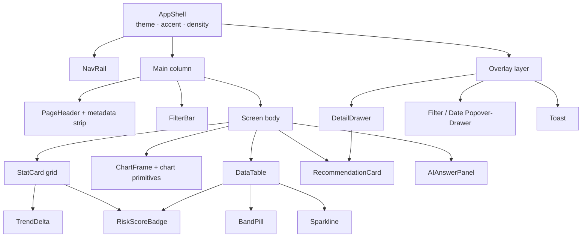

# Component Inventory

_Reusable UI components implied by the Meridian BI POC wireframe, specified for the BeeEye React + TypeScript front-end — responsibilities, props, states, WCAG 2.2 AA notes, and design tokens each consumes._

## Purpose & method

The POC (`docs/wireframes/Meridian BI.dc.html`, rendered by `docs/wireframes/support.js`) is a
single-file Vue-via-CDN prototype. Every screen is hand-authored with inline styles rather than a
component library, so the same visual object is re-implemented in several places with small
divergences. This document extracts the **canonical component set** those repetitions imply, so the
production front-end (React + TypeScript strict, Vite, TanStack Query/Router/Table, Zod + React Hook
Form) can build each object **once** and consume the OKLCH design tokens defined in the wireframe
`:root` / `[data-theme="dark"]` blocks.

Conventions used below:

- **Name** — proposed PascalCase React component name.
- **Key props** — the minimum typed surface; all components are theme-agnostic (never read a raw
  colour, only tokens) and density-aware (`--gap`, `--card-pad` shrink under `[data-density="compact"]`).
- **States** — every data-bound component must render `loading | ready | empty | error` explicitly;
  see [§15 Empty / Loading / Error states](#15-empty--loading--error-states).
- **Accessibility** — cites the specific WCAG 2.2 AA success criteria that the current wireframe
  markup fails or must uphold. The wireframe builds nearly all interactive elements as
  `<button style="all:unset">` or clickable `<tr>`/`
`, which strips native focus, role and
  keyboard semantics — so **2.1.1 Keyboard**, **2.4.7 Focus Visible** and **4.1.2 Name, Role, Value**
  are a cross-cutting obligation for the whole set and are not repeated on every entry.

## Catalogue at a glance

| # | Component | Role | Appears on |
|---|-----------|------|-----------|
| 1 | `AppShell` | Two-column layout, theme/density data-attributes, overlay layer host | All screens |
| 2 | `NavRail` | Primary navigation, badges, persona switcher | All screens |
| 3 | `PageHeader` | Title + subtitle, metadata strip, global action buttons | All screens |
| 4 | `FilterBar` | Active-filter chip row (summary of global filter state) | Data screens |
| 5 | `StatCard` (KPI) | Single metric + delta, optional drill-through | Exec, Inventory, Forecasting, Data |
| 6 | `RiskScoreBadge` | 0–100 numeric risk score, band-coloured | Table, exceptions, drawer |
| 7 | `BandPill` / `Chip` | Named risk / aging band as label+colour | Tables, legends, filters |
| 8 | `TrendDelta` | Directional change indicator (± value, icon, tone) | StatCards, drawer metrics |
| 9 | `Sparkline` | Inline 12-month micro-trend | Table cells, drawer |
| 10 | `DataTable` | Sortable, sticky-header, searchable, paginated grid | Inventory, Reports |
| 11 | `ChartFrame` + chart primitives | Titled card wrapping a chart; click-to-drill | Exec, Inventory, Forecasting |
| 12 | `DetailDrawer` (drill-down) | Right-side unit deep-dive with risk breakdown | Inventory |
| 13 | `RecommendationCard` | Grounded recommended action with evidence + CTA | Exec, drawer, Actions, AI |
| 14 | `AIAnswerPanel` | Composer + grounded answer bubbles | AI Analyst, Exec summary strip |
| 15 | Empty / Loading / Error states | Skeletons, spinner, empty, error surfaces | All screens |
| 16 | `SegmentedControl` / `ToggleGroup` | Mutually-exclusive option rows | Forecasting, Settings, NavRail |
| 17 | `Select`, `TextInput`, `RangeSlider`, `DateField` | Form primitives (RHF + Zod) | Forecasting, Actions, Settings |
| 18 | `Overlay` / `Drawer` / `Popover` | Modal scaffolding + z-index ladder | Filters, date, detail |
| 19 | `IconButton` | Icon-only affordance (close, theme, paginate) | Everywhere |
| 20 | `Toast` | Transient confirmation | Global |

### Composition

---

## 1. AppShell

The `flex` container (`docs/wireframes/Meridian BI.dc.html` L60) carrying
`data-theme` / `data-accent` / `data-density`, a sticky 250 px `NavRail`, a scrolling main column,
and the fixed overlay layer.

- **Responsibilities:** own theme/density context; provide the CSS-variable scope; host the portal
  layer for drawers/popovers/toasts; enforce `min-width:0` on the content column so tables can scroll.
- **Key props:** `theme: 'light' | 'dark'`, `accent: 'blue' | 'teal' | 'indigo'`, `density: 'comfortable' | 'compact'`, `children`.
- **States:** persistent; never loading. Persists preferences (Settings screen writes these).
- **Accessibility:** provide skip-to-content link (**2.4.1 Bypass Blocks**); ensure the sticky header
  does not obscure focused elements on scroll (**2.4.11 Focus Not Obscured (Minimum)** — new in 2.2);
  content must reflow to a single column ≤320 px without horizontal scroll (**1.4.10 Reflow**).
- **Tokens:** `--bg`, `--text`, base font `IBM Plex Sans`; delegates all colour to descendants.

## 2. NavRail

Sidebar (L62–92): gradient `--nav-*` surface, primary + "more" grouped nav lists, per-item icon,
active mark (3 px left border), optional count **badge**, and a footer **persona switcher**.

- **Responsibilities:** route between the ten screens; show unread/exception badge counts; switch the
  active persona (Exec / Analyst / IT), which re-scopes several screens.
- **Key props:** `items: NavItem[]` (`{ id, label, icon, badge?, active }`), `groups`, `persona`, `onNavigate`, `onPersonaChange`.
- **States:** item `active | idle | hover`; badge present/absent; collapsed (mobile) vs expanded.
- **Accessibility:** wrap in `<nav aria-label="Primary">`; use a real list; mark current item with
  `aria-current="page"` — the border-colour cue alone fails **1.4.1 Use of Color**. Badge count needs
  an accessible name ("3 critical exceptions"), not just a red pill. Persona switcher is a **radio
  group** (`role="radiogroup"`), not three loose buttons. Nav targets are ≥24 px (**2.5.8 Target Size**).
- **Tokens:** `--nav-bg`, `--nav-bg-2`, `--nav-fg`, `--nav-muted`, `--nav-active-bg`, `--nav-border`,
  `--primary`/`--primary-2` (logo gradient), `--risk-crit` (badge), `--radius`.

## 3. PageHeader (with metadata strip)

Sticky, blurred header (L95–108): screen icon + title + subtitle on the left; a right-aligned
**metadata strip** — `POC ENVIRONMENT` pill, `SAMPLE DATA` pill, `As of {date}` button, `Filters`
button (with count), `Ask AI` gradient button, theme toggle.

- **Responsibilities:** identify the current screen; surface environment provenance; expose the three
  global actions (analysis date, filters, AI) and the theme toggle in one consistent bar.
- **Key props:** `title`, `subtitle`, `icon`, `badges: MetaBadge[]`, `asOfDate`, `filterCount`,
  `onOpenDate`, `onOpenFilters`, `onAskAI`, `onToggleTheme`.
- **States:** filter button `active`/`idle` (border + count pill); date button default; theme icon reflects mode.
- **Accessibility:** header is a landmark (`role="banner"`); each icon-only control needs an
  `aria-label` (the theme toggle uses `title` today — acceptable but expose `aria-pressed`). The
  blurred sticky bar must not cover the focused control (**2.4.11**). The "SAMPLE DATA"/"POC" badges
  convey status that must be text, not colour-only (**1.4.1**). Contrast of `--primary-ink` on
  `--primary-weak` must meet **1.4.3** (verify in both themes).
- **Tokens:** `--surface` (via `color-mix` for translucency), `--border`, `--primary-weak`,
  `--primary-ink`, `--primary`, `--surface-3`, `--text-muted`, `--ai-1`/`--ai-2` (Ask AI gradient),
  `--shadow-sm`.

## 4. FilterBar

Conditional strip below the header (L110–118) summarising active global filters as removable **chips**
plus a "Clear all" link. Distinct from the filter **drawer** (§18) that edits the set.

- **Responsibilities:** make the current global filter scope visible and individually reversible;
  echo the same filter model consumed by every data screen and by the AI grounding context.
- **Key props:** `chips: FilterChip[]` (`{ dimension, value, onRemove }`), `summary`, `onClearAll`.
- **States:** hidden (no filters) / visible; each chip removable.
- **Accessibility:** each remove control needs `aria-label="Remove {dimension}: {value}"`. **The chip
  close target is 16 px in the wireframe — below the 24 px minimum (2.5.8 Target Size); enlarge.**
  Announce chip additions/removals via a polite live region so the table update is perceivable.
- **Tokens:** `--surface-2` (bar), `--surface`, `--border`, `--text-muted`, `--surface-3` (remove
  hover), `--primary` (clear-all).

## 5. StatCard (KPI card)

The single most duplicated object. Two divergent implementations exist:

| Trait | Exec variant (L204–211) | Compact variant (L279–286, L358–366) |
|-------|-------------------------|--------------------------------------|
| Element | `<button>` (drill-through) | `
` (static) |
| Grid | 5 columns | 8 columns |
| Value size | 21 px mono | 17 px mono |
| Sub-line | `TrendDelta` (icon + tone) | plain faint text |
| Tone accent | 3 px left bar | 3 px left bar |

- **Responsibilities:** present one metric — label, tone icon, mono value, and a delta/sub-line — with
  an optional drill-through target and a left tone bar encoding good/warn/bad.
- **Key props:** `label`, `value` (pre-formatted, e.g. `E.fmtSAR`), `icon`, `tone: SemanticTone`,
  `delta?: TrendDeltaProps`, `sub?`, `onDrill?`.
- **States:** `static | interactive` (hover lift `--shadow-md`, `translateY(-1px)`); `loading`
  (skeleton, L124); `error` (dashed placeholder).
- **Accessibility:** if interactive, render as one focusable control with an accessible name that
  includes label + value + delta direction (a hover lift is not a focus indicator — **2.4.7**). Tone
  bar + icon colour must be paired with text/aria so meaning is not colour-only (**1.4.1**); mono
  numerals must clear **1.4.3** contrast. Card min target ≥24 px is satisfied.
- **Tokens:** `--surface`, `--border`, `--radius`, `--shadow-sm`/`--shadow-md`, `--text-muted`,
  tone from `--pos`/`--neg`/`--warn`/`--risk-*`; value font `IBM Plex Mono`.
- **Unify:** one `StatCard` with `onDrill?` (interactive when present), `size: 'lg' | 'sm'`, and a
  slotted `delta` — deleting the two forks.

## 6. RiskScoreBadge

Numeric 0–100 score on a band-coloured fill. Rendered ≥3 ways today: table cell badge (L333,
`min-width:30px`), exec exception chip (L252, `min-width:34px`), and detail-drawer header (L788,
15 px). Band thresholds: **Low 0–34, Medium 35–59, High 60–79, Critical 80–100**.

- **Responsibilities:** show the additive risk score and its band via a single mono numeral on fill;
  map score → band → colour through **one** shared function (today the mapping is re-derived inline).
- **Key props:** `score: number`, `size: 'sm' | 'md' | 'lg'`, `showBandLabel?: boolean`.
- **States:** four bands; `unknown`/`n-a` (e.g. Mecca no-inventory, or `service_date` excluded).
- **Accessibility:** colour alone must not carry the band — include the band word in the accessible
  name ("Risk 82, Critical") to satisfy **1.4.1**; the badge fill vs white numeral must meet **1.4.3**,
  and the badge edge vs card must meet **1.4.11 Non-text Contrast**.
- **Tokens:** `--risk-low` (green 152), `--risk-med` (yellow 84), `--risk-high` (orange 52),
  `--risk-crit` (red 27); mono font; `--radius` (6 px pill corners).

## 7. BandPill / Chip

A named band or category as a bordered pill with a 10 %-tint fill (`color-mix`). Used for cell pills
(L334), aging **band chips** in the table toolbar (L320), quadrant/aging legend swatches (L292), and
filter-drawer option toggles (L776). Aging bands: **New ≤30, Healthy ≤60, Watch ≤90,
High attention ≤120, Critical >120 days**.

- **Responsibilities:** label a categorical value (band, brand, type, colour) with an optional colour
  swatch; optionally act as a toggle (filter selection) or a filter trigger (click aging chip → filter table).
- **Key props:** `label`, `tone?`, `count?`, `selected?`, `onToggle?`, `swatchShape?: 'dot' | 'square'`.
- **States:** `static | selectable`; `selected`/`unselected`; with/without count.
- **Accessibility:** selectable pills are toggle buttons (`aria-pressed`); a swatch alone fails
  **1.4.1** — keep the text label. Selected state must be conveyed by more than border colour.
- **Tokens:** `--surface-2`, `--border`, band/semantic tone colour, `--text-muted`; mono for counts.

## 8. TrendDelta

The KPI sub-line and drawer deltas: a small directional indicator — optional icon, signed value,
and a `tone` (`--pos`/`--neg`/`--warn`). Inconsistent today: exec KPIs use icon+tone, compact KPIs use
plain faint text for the same semantic (change vs prior period).

- **Responsibilities:** encode magnitude **and** direction of change with redundant icon + sign + colour.
- **Key props:** `value` (formatted), `direction: 'up' | 'down' | 'flat'`, `tone`, `icon?`, `goodDirection?`.
- **States:** positive / negative / neutral; note that "up" is not always "good" (holding cost up = bad).
- **Accessibility:** never rely on red/green alone — pair with arrow icon and sign (**1.4.1**); the
  accessible name must state direction and whether it is favourable.
- **Tokens:** `--pos`, `--neg`, `--warn`, `--text-muted`; icon font Material Symbols.

## 9. Sparkline

Inline SVG micro-trend (trailing 12 months) in table cells (L335) and the drawer demand-evidence
block (L805).

- **Responsibilities:** show shape of recent demand at a glance beside the numeric value.
- **Key props:** `series: number[]`, `width`, `height`, `tone?`, `ariaLabel`.
- **States:** normal; sparse/`fallback` (demand-fallback hierarchy per DATA_DICTIONARY join rules);
  empty (no history).
- **Accessibility:** decorative-plus-data: provide a text alternative summarising trend
  ("12-month demand, rising") — an SVG with no name is invisible to AT (**1.1.1**). Line contrast vs
  card must meet **1.4.11**.
- **Tokens:** `--primary`/tone, `--chart-grid`.

## 10. DataTable (sticky header)

The inventory grid (L311–351) is the richest instance; Reports (L582–588) is a read-only subset. It
composes a header toolbar (title, **search** input, range label, Export CSV), a **filter toolbar**
(aging band chips + column toggles), a scrolling `<table>` with a sticky `<thead>`, sortable headers,
typed cell renderers (`badge` / `pill` / `spark` / `plain`), row-click drill-through, an empty state,
and a pagination footer.

- **Responsibilities:** virtualised/paginated tabular display over Inventory (291 units) and report
  datasets; client sort, search, column visibility, band quick-filter, CSV export, and row → drawer.
- **Key props:** `columns: Column[]` (`{ id, label, align, sortable, render }`), `rows`, `sort`,
  `onSort`, `search`, `onSearch`, `bandChips`, `columnToggles`, `page`, `pageCount`, `onPage`,
  `onRowClick`, `onExport`. Backed by **TanStack Table**; server or client model.
- **States:** `loading` (skeleton rows), `ready`, `empty` (inbox, L344), `no-match` (filtered to zero),
  `error`; per-column sort asc/desc/none; row hover.
- **Accessibility:** real `<th scope="col">` with `aria-sort` on the active column (**1.3.1**,
  **4.1.2**); sortable headers must be keyboard-operable buttons, not click-only `<th>` (**2.1.1**).
  Row drill-through must be reachable by keyboard and not depend solely on `<tr onClick>`; expose a
  focusable control per row. Sticky header must not obscure a focused row on scroll (**2.4.11**).
  Search input needs a programmatic label (**3.3.2**); pagination buttons are ≥24 px (30 px — passes
  **2.5.8**) but need `aria-label` ("Go to page 3") and a live-region row-count announcement.
- **Tokens:** `--surface`, `--surface-2` (thead/hover), `--border`, `--text-muted`, `--radius`,
  `--shadow-sm`, `--primary` (export/active page); mono for numeric cells; cell badge/pill reuse §6/§7.

## 11. ChartFrame + chart primitives

Every chart is a titled card (`--surface` + border + `--shadow-sm`) with a heading, a caption, an
optional inline **legend**, and a chart slot (L215–233, L289–309, L381–421). `support.js` provides the
primitives — `cDonut`, `cBars`, `cHBars`, `cBubble` (quadrant), `cHeatmap`, plus the trend line,
scatter, and ramadan/discount comparison charts — all wired with an `onClick` that calls
`drilldown({ screen, filter })`.

- **Responsibilities:** `ChartFrame` standardises the card chrome, title/caption, legend, loading and
  empty treatments; primitives render the mark and emit a typed drill event.
- **Key props (`ChartFrame`):** `title`, `caption`, `legend?: LegendItem[]`, `state`, `children`,
  `onDrill?`. **Chart primitive props:** `data`, `formatter`, `onClick(datum)`, band/tone colour map.

| Primitive | Wireframe fn | Encodes | Drill target |
|-----------|--------------|---------|--------------|
| Trend line + CI band | `execTrend`/`fcChart` | actual · back-test · forecast, shaded interval | Forecasting scope |
| Donut | `cDonut` | value by risk band | Inventory |
| Vertical bars | `cBars` | units by aging band | Inventory (band) |
| Horizontal bars | `cHBars` | value by location / model, WMAPE by model | Inventory / Forecasting filter |
| Bubble quadrant | `cBubble` | demand × stock-cover, size = value | Inventory (loc·model·variant) |
| Heatmap | `cHeatmap` | location × model unit counts | Inventory (cell) |
| Scatter | `fcScatter` | actual vs predicted (holdout) | — |

- **States:** `loading` (skeleton block, 200–300 px), `ready`, `empty` ("no data for this scope"), `error`.
- **Accessibility:** each chart needs a text alternative / data-table fallback (**1.1.1**); series must
  be distinguishable without colour (pattern, direct label, or shape) — the trend line uses solid vs
  dashed which is good, donuts/heatmaps need labels (**1.4.1**). Non-text marks vs background meet
  **1.4.11**. Click-to-drill must have a keyboard equivalent — chart segments/bars/cells are
  interactive controls (**2.1.1**, **4.1.2**). Follow the project **dataviz** palette/contrast rules.
- **Tokens:** `--surface`, `--border`, `--radius`, `--shadow-sm`, `--chart-grid`, `--primary`/`--primary-2`,
  `--risk-*` band map, `--text-muted`; mono for axis/value labels.
- **Unify:** legends are re-built per chart with different swatch shapes (14×3 line, dashed line, 9 px
  dot) — extract one `Legend` fed a `LegendItem[]` with a `mark` type.

## 12. DetailDrawer (drill-down modal)

The vehicle detail drawer (L783–836): a 440 px right panel over a 0.4-opacity scrim. Sections: header
with `RiskScoreBadge` + identity, **risk score breakdown** (weighted contributions), a metrics grid,
demand evidence with `Sparkline`, potential transfer destinations, a `RecommendationCard`, full
attribute list, and a footer with "Ask AI" + "Create action".

- **Responsibilities:** explain one stock unit end-to-end — why it scored, the evidence, and the
  recommended action — as the terminal node of nearly every drill path.
- **Key props:** `unit: InventoryUnit`, `contributions: RiskContribution[]`, `metrics`, `demandSeries`,
  `transferDestinations`, `recommendation`, `attributes`, `onAskAI`, `onCreateAction`, `onClose`.
- **States:** open/closed; `loading` (unit fetch), `ready`, `error`; conditional
  transfer-destinations block (`duHasDests`).
- **Accessibility:** true modal semantics — `role="dialog"`, `aria-modal="true"`, labelled by the
  unit title; **focus trap** and restore focus to the invoking row on close; `Esc` closes;
  scrim click closes but must not be the only mechanism (**2.1.1**, **2.4.3**). Ensure the panel does
  not clip focused controls (**2.4.11**). Risk-breakdown weights must be readable as text, not bar-only.
- **Tokens:** `--surface`, `--border`, `--surface-2`, `--shadow-lg`, `--radius`, `--primary`/`--primary-weak`/`--primary-ink`,
  `--risk-*`, `--risk-low` (savings), `--primary-2` (transfer icon); scrim `rgba(15,23,42,.4)`.

## 13. RecommendationCard

The grounded action object, appearing as: exec "Recommended actions" rows (L260–266), the AI
"Recommended" block (L493–495), the drawer recommendation (L815–822), and the **Management Actions**
card (L540–558) — each with slightly different chrome for the same concept (title, evidence, expected
impact, confidence, CTA).

- **Responsibilities:** present a recommendation with its **evidence, expected outcome, confidence,
  and assumptions**, plus a primary CTA (usually "Create action"). Must render only values computed by
  the analytics engine — narration may come from GenAI but numbers/decisions never do.
- **Key props:** `title`, `category`, `priority`, `evidence[]`, `expectedImpact`, `confidence`,
  `assumptions[]`, `tags[]`, `source`, `onCreateAction`, `onOpenSource`; Actions variant adds editable
  `status`, `owner`, `dueDate`.
- **States:** `suggested` (not yet actioned) vs `tracked` (Management Action with lifecycle status);
  priority-coloured left border; with/without evidence/impact.
- **Accessibility:** priority conveyed by border colour must also be textual (**1.4.1**); the card is a
  group with a heading (**1.3.1**, **2.4.6**); inline `status`/`priority`/`owner`/`due` controls need
  labels (**3.3.2**) and must announce persistence. Confidence badge needs an accessible name.
- **Tokens:** `--surface`, `--border`, `--radius`, `--shadow-sm`, priority via `--risk-*`,
  `--primary`/`--primary-weak`/`--primary-ink`, `--surface-2` (tags), `--text-muted`.
- **Unify:** one `RecommendationCard` with `variant: 'suggested' | 'tracked'` and slotted footer,
  replacing four bespoke layouts.

## 14. AIAnswerPanel

The AI Business Analyst (L446–505) plus the Exec **AI summary strip** (L136–156). Composed of a
**composer** (auto-growing textarea + send), a **suggestion grid** (empty state), and **message
bubbles**: user bubble (right, primary fill) and AI bubble (left) carrying a source label, a
**confidence badge**, optional metric chips, an **Evidence** list, a **Recommended** block, drill
**target** buttons, and an assumptions/period footer.

- **Responsibilities:** conversational, grounded Q&A over the computed inventory/sales/forecast data;
  render structured, validated answer parts (never free-form fabricated metrics); route users to the
  relevant screen via target buttons.
- **Key props:** `messages: ChatMessage[]`, `suggestions[]`, `input`, `busy`, `mode`, `onSend`,
  `onClear`, `onAsk`. `ChatMessage` (AI) = `{ answer, confidence, source, metrics?, evidence?, actions?, targets?, assumptions?, period }`.
- **States:** `empty` (suggestions shown), `busy` ("Analysing calculated data…" spinner, L463),
  streaming, `ready`; per-message conditional blocks (`hasMetrics/hasFindings/hasActions/hasTargets/hasAssume`).
- **Accessibility:** the message list is a `role="log"` polite live region so new answers are
  announced; the composer textarea needs a visible/`aria` label and an accessible send button
  (**3.3.2**, **4.1.2**); `Enter`-to-send must not trap keyboard users needing newlines; confidence and
  source badges need text names (**1.4.1**). Streaming updates must not steal focus.
- **Tokens:** `--ai-1` (purple 285) / `--ai-2` (blue 224) gradients, `--surface`, `--surface-2`,
  `--border`/`--border-strong`, `--primary` (user bubble), `--radius`, `--shadow-sm`/`--shadow-md`,
  confidence via `--risk-*`; mono for metric chips.

## 15. Empty / Loading / Error states

The wireframe uses **four different empty treatments** — table inbox (L344), Actions dashed-border
`task_alt` (L528–535), AI suggestion grid (L465–477), and plain "no match" text (L537) — plus a global
skeleton (L121–128), inline spinners (`progress_activity` + `spin`), and a full-page error (L130).

- **Responsibilities:** give every data surface a deterministic non-happy-path rendering.
- **Key props (`EmptyState`):** `icon`, `title`, `body`, `action?`; (`Skeleton`) `shape`, `count`;
  (`ErrorState`) `message`, `onRetry`.
- **States:** the canonical quartet `loading | ready | empty | error`, plus `no-match` (filtered-to-zero,
  distinct from truly empty).
- **Accessibility:** skeletons are decorative (`aria-hidden`) with a polite "Loading…" announcement
  (**4.1.3 Status Messages**); spinners need `role="status"`; error text must not be colour-only and
  should offer a labelled retry (**1.4.1**, **3.3.1**).
- **Tokens:** `--surface-2`/`--surface-3` (shimmer gradient), `--border-strong` (dashed), `--primary`
  (spinner/CTA), `--risk-crit` (error icon), `--text-muted`.
- **Unify:** collapse the four empty layouts into one `EmptyState` with variants; standardise `no-match` copy.

## 16. SegmentedControl / ToggleGroup

Rows of mutually-exclusive buttons re-implemented ≥8 times: forecast **LEVEL / HOLDOUT / HORIZON /
MODEL / metric** (L370–378), scenario horizon (L431), and Settings **theme / accent / density**
(L742–744), plus the NavRail persona switcher (§2) and table aging/column toggles.

- **Responsibilities:** single-select (segmented) or multi-select (toggle) option rows with an active
  state; the canonical control for forecast configuration and display preferences.
- **Key props:** `options`, `value` / `values`, `onChange`, `mode: 'single' | 'multi'`, `size`.
- **States:** `active`/`idle`, `disabled`, hover.
- **Accessibility:** single-select is a `role="radiogroup"`; multi-select uses `aria-pressed` toggles;
  active state must not be border-colour-only (**1.4.1**); full keyboard arrow navigation (**2.1.1**);
  targets ≥24 px (**2.5.8**).
- **Tokens:** `--surface-2`, `--border`, `--primary`/`--primary-weak`, `--text`/`--text-muted`, `--radius`.

## 17. Form primitives — Select, TextInput, RangeSlider, DateField

Identically-styled `<select>` (Forecasting, Actions filters, Settings), search/owner `TextInput`
(L314, L554), analysis-date & due-date `DateField` (L555, L712, L762), and growth/weight
`RangeSlider` (L430, L716). Target: **React Hook Form + Zod** with a shared field wrapper.

- **Responsibilities:** typed, validated inputs that drive live recalculation (Settings note L708:
  "these settings change POC calculations live across all screens").
- **Key props:** `name`, `label`, `value`, `onChange`, `options?`, `min`/`max`/`step?`, `error?`,
  `hint?`; validated by a Zod schema.
- **States:** default, focus, `disabled`, `invalid` (Zod error), `dirty`.
- **Accessibility:** every field needs an associated `<label>` (several use placeholder-only today —
  fails **3.3.2 Labels or Instructions**); errors announced and tied via `aria-describedby`
  (**3.3.1**); range sliders need value text (**4.1.2**); changing a control must not auto-navigate
  without warning (**3.2.2 On Input**). Support **3.3.7 Redundant Entry** (new in 2.2) — don't force
  re-selecting filters already applied globally.
- **Tokens:** `--surface-2`, `--border`/`--border-strong`, `--text`, `--primary` (`accent-color`),
  `--radius`; mono for numeric/date fields.

## 18. Overlay / Drawer / Popover scaffolding

Three overlay patterns re-implemented independently: **date popover** (centred, L757–766), **filter
drawer** (340 px right, L768–781), **detail drawer** (440 px right, §12). Each hand-rolls a
`position:fixed; inset:0` scrim + panel + close, with an **ad-hoc z-index ladder** (60/61, 70/71, 80
for toast) and duplicated open/close/scrim logic.

- **Responsibilities:** provide the portal, scrim, focus management, scroll-lock, `Esc`-to-close, and a
  documented z-index scale for all transient surfaces.
- **Key props:** `open`, `onClose`, `side?: 'right' | 'center'`, `width`, `dismissable`, `children`.
- **States:** opening/closing (`fadeUp .25s`), open, closed.
- **Accessibility:** shared modal contract — focus trap + restore, `aria-modal`, `Esc`, background
  `inert` (**2.4.3**, **2.1.2 No Keyboard Trap** done correctly). Do not rely on scrim click alone
  (**2.1.1**). Panels must not obscure focused content (**2.4.11**).
- **Tokens:** `--surface`, `--border`, `--shadow-lg`, `--radius`; scrim `rgba(15,23,42,.32–.4)`.
- **Unify:** one `Overlay` primitive + a **z-index token scale** (`--z-drawer`, `--z-modal`, `--z-toast`)
  replacing the hard-coded 60/61/70/71/80.

## 19. IconButton

Icon-only affordances everywhere — header theme toggle (L106), chip/close (×) in every drawer,
pagination chevrons (L346–348), AI clear (L454), action delete (L549). Currently `<button
style="all:unset">` with no consistent focus ring and inconsistent labelling (some `title`, most none).

- **Responsibilities:** the single accessible icon-button primitive; enforces a name, a focus ring,
  and a minimum hit area.
- **Key props:** `icon`, `label` (required, becomes `aria-label`), `onClick`, `size`, `variant`, `pressed?`.
- **States:** idle, hover, focus-visible, `disabled`, `pressed` (toggle e.g. theme).
- **Accessibility:** **`aria-label` mandatory** (**4.1.2**); visible focus ring (**2.4.7**); hit area
  ≥24×24 px (**2.5.8** — several current close/× buttons are 16 px and fail). Toggle buttons expose
  `aria-pressed`.
- **Tokens:** `--surface`, `--border`/`--border-strong`, `--text-muted`, `--surface-2`/`--surface-3` (hover), `--radius`.

## 20. Toast

Global transient confirmation (L838): bottom-centre pill on `--nav-bg`, `fadeUp` in, auto-dismiss.

- **Responsibilities:** confirm fire-and-forget actions ("Action created", "Filters cleared").
- **Key props:** `message`, `tone?`, `duration?`, `action?`.
- **States:** entering / visible / leaving.
- **Accessibility:** render in an `aria-live="polite"` (or `role="status"`) region so it is announced
  without stealing focus (**4.1.3**); never use toast for critical/error-only feedback that needs
  action; ensure it is dismissible and not the sole channel.
- **Tokens:** `--nav-bg`, `--nav-fg`, `--shadow-lg`, `--radius`, `--risk-low` (success icon).

---

## Cross-cutting inconsistencies to unify

Consolidated backlog of the divergences found above — each is a place where the wireframe re-solves the
same problem differently and the production library should collapse to one component:

| Theme | Symptom in wireframe | Resolution |
|-------|----------------------|-----------|
| KPI card | Two forks: clickable `<button>` 5-col vs static `
` 8-col, different value sizes and sub-lines | One `StatCard`, `onDrill?` + `size` |
| Risk score | Inline score→band→colour re-derived in table, exceptions, drawer with different sizes | `RiskScoreBadge` + one band-mapping util |
| Bands | Aging/risk bands drawn as pill, cell pill, legend dot, filter toggle with different swatch shapes | `BandPill` + shared band token map |
| Trend/delta | Exec KPI uses icon+tone; compact KPI uses plain text for the same change | `TrendDelta` always (icon + sign + tone) |
| Legends | Rebuilt per chart (line / dashed / dot swatches) | One `Legend` fed `LegendItem[]` |
| Recommendations | Four layouts (exec, AI, drawer, Actions) for one concept | `RecommendationCard` variants |
| Empty states | Four treatments + separate `no-match` text | One `EmptyState` + standard `no-match` |
| Overlays | Three scrim+panel re-implementations, ad-hoc z-index 60/61/70/71/80 | `Overlay` primitive + z-index token scale |
| Icon buttons | `all:unset` buttons, missing `aria-label`, 16 px hit areas | `IconButton` (label required, ≥24 px, focus ring) |
| Toggle rows | ≥8 bespoke "row of active-border buttons" | `SegmentedControl` / `ToggleGroup` |
| Interaction model | Clickable `<tr>`/`
`, `<button style="all:unset">` strip native focus/role/keyboard | All interactive elements are real controls with visible focus (**2.1.1**, **2.4.7**, **4.1.2**) |
| Colour-only encoding | Risk/aging/priority/confidence conveyed by colour alone | Always pair colour with text/icon (**1.4.1**) |

---

## Traceability

- Design tokens, bands, and weights consumed here are defined in the wireframe `:root` /
  `[data-theme="dark"]` blocks of [`Meridian BI.dc.html`](../../wireframes/Meridian%20BI.dc.html) and
  rendered by [`support.js`](../../wireframes/support.js).
- Metric formatting, risk-score contributions, forecasting and recommendation logic surfaced by these
  components originate in the analytics engine — see
  [METHODOLOGY](../../wireframes/docs/METHODOLOGY.md),
  [DERIVED_METRICS](../../wireframes/docs/DERIVED_METRICS.md), and
  [ASSUMPTIONS_LIMITATIONS](../../wireframes/docs/ASSUMPTIONS_LIMITATIONS.md).
- Field names, join keys, and the demand-fallback hierarchy the `DataTable`, `DetailDrawer` and charts
  bind to are defined in [DATA_DICTIONARY](../../wireframes/docs/DATA_DICTIONARY.md).
- The read-only Oracle Fusion system-of-record and Azure zones behind these views are described in
  [INTEGRATION_AZURE_ORACLE](../../wireframes/docs/INTEGRATION_AZURE_ORACLE.md).
- Companion analyses in this package: the screen catalogue, information architecture, and interaction /
  navigation-flow documents under `docs/architecture/wireframe-analysis/`.
