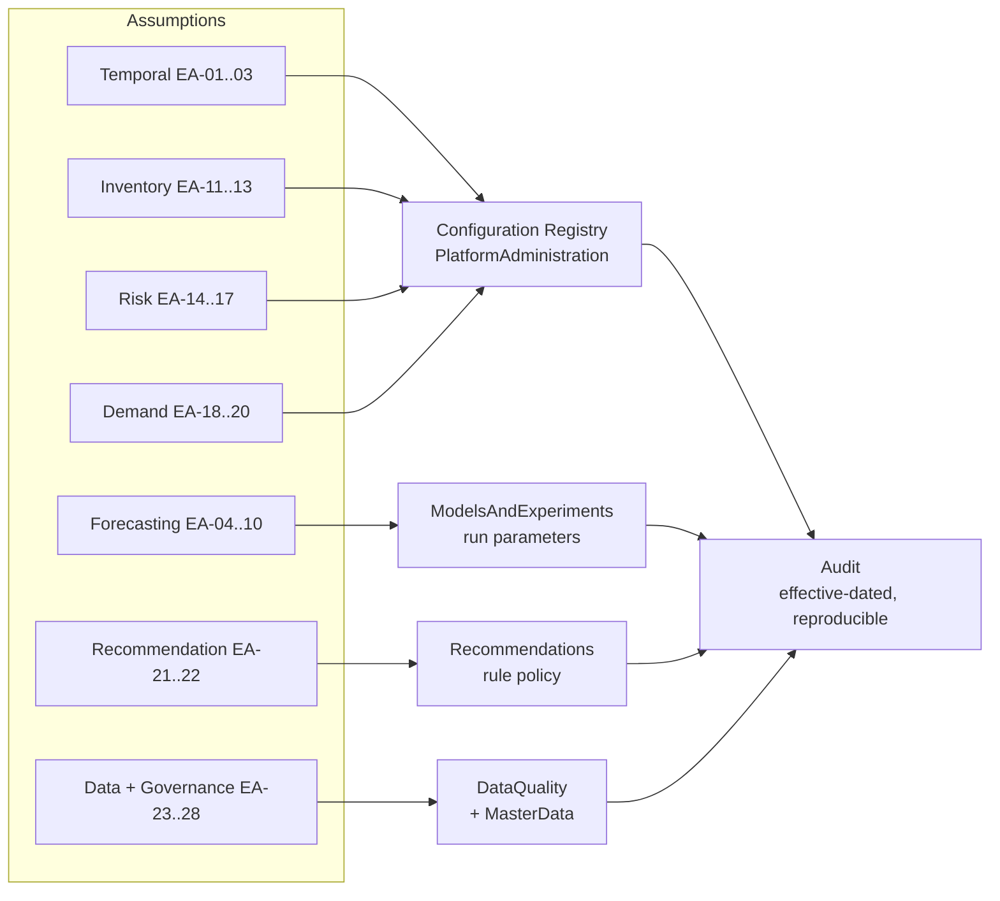
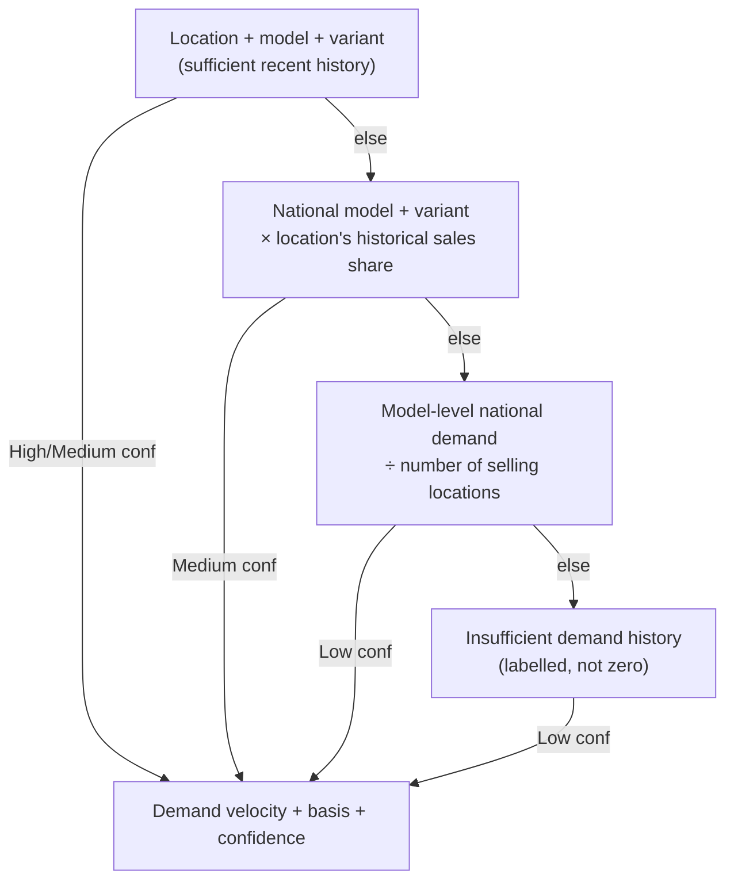
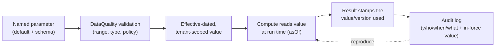

# Business Assumptions Embedded in Wireframes

_Purpose: catalogue every business assumption and business rule baked into the Meridian BI POC so the BeeEye production platform can make each one explicit, configurable, versioned and auditable rather than hard-coded._

---

## How to read this document

The POC deliberately trades production rigour for a working, explainable demonstration. To do that it
bakes in a set of **business assumptions** (things believed true about ADMC's world) and **business
rules** (decisions the engine makes on the operator's behalf). Left implicit, each one is a latent
correctness, trust or audit risk when the platform runs against live Oracle Fusion data.

Every assumption below is recorded with the same five facets:

| Facet | Meaning |
|-------|---------|
| **Assumption / rule** | What the POC takes to be true or decides automatically. |
| **Where it appears** | Screen, engine function, or source doc that embeds it. |
| **Default / values** | The concrete value(s) hard-coded or defaulted in the POC. |
| **Risk if wrong** | Business/analytical consequence if the assumption does not hold for ADMC. |
| **Production handling** | How BeeEye must make it explicit, configurable and auditable. |

Source of truth for the POC behaviour: [`engine.js`](../../wireframes/engine.js) (the `window.BIEngine`
default settings object and calculation functions), the ten screens in
[`Meridian BI.dc.html`](../../wireframes/Meridian%20BI.dc.html), and the four POC methodology docs
([ASSUMPTIONS_LIMITATIONS](../../wireframes/docs/ASSUMPTIONS_LIMITATIONS.md),
[METHODOLOGY](../../wireframes/docs/METHODOLOGY.md),
[DERIVED_METRICS](../../wireframes/docs/DERIVED_METRICS.md),
[DATA_DICTIONARY](../../wireframes/docs/DATA_DICTIONARY.md)).

> **The single most important production principle:** none of these values may live as a hard-coded
> constant in application code. Each becomes a named, effective-dated, tenant-scoped **parameter** in a
> configuration registry (owned by `PlatformAdministration`), validated by `DataQuality`, and every
> change and every _value in force at compute time_ is written to the `Audit` context so any number the
> platform shows can be reproduced from the exact assumptions that produced it.

---

## Assumption catalogue (index)

| ID | Group | Assumption / rule | POC default |
|----|-------|-------------------|-------------|
| EA-01 | Temporal | Configurable Analysis Date; never the silent system date | `2026-06-30` |
| EA-02 | Temporal | Trailing demand window length | `3` months |
| EA-03 | Temporal | Missing calendar months filled as zero at aggregate levels | fill = 0 |
| EA-04 | Forecasting | No supplied forecasts → accuracy shown via back-testing | holdout, refit-on-all |
| EA-05 | Forecasting | Holdout window length | `6` months (3/6/12 selectable) |
| EA-06 | Forecasting | Candidate method set + auto-selection rule | 4 methods, min-WMAPE |
| EA-07 | Forecasting | Minimum history to back-test | needs ≥ 12 months |
| EA-08 | Forecasting | WMAPE is the primary accuracy metric | WMAPE |
| EA-09 | Forecasting | Confidence intervals from back-test residual spread | 80% (90/95 selectable) |
| EA-10 | Forecasting | Explanations are associative, never causal | "associated with" |
| EA-11 | Inventory | Inventory age = Analysis Date − date_of_purchase | days |
| EA-12 | Inventory | Accumulated holding cost clamps negative age to 0 | `max(0, age)` |
| EA-13 | Inventory | Aging bands (days) | New/Healthy/Watch/High/Critical |
| EA-14 | Risk | Explainable additive risk weights | 30/25/20/15/10 |
| EA-15 | Risk | Risk bands (0–100) | 34 / 59 / 79 cut points |
| EA-16 | Risk | Stock-cover targets driving cover risk | target 2 / max 6 months |
| EA-17 | Risk | `service_date` excluded from risk (meaning unconfirmed) | excluded |
| EA-18 | Demand | Demand fallback hierarchy for sparse cells | 4 levels, provenance shown |
| EA-19 | Demand | Missing combination ≠ zero demand | labelled "insufficient" |
| EA-20 | Demand | Demand trend = recent 3m avg vs prior 3m avg | increasing/stable/declining |
| EA-21 | Recommendation | Rule-based recommendations are decision-support only | human review required |
| EA-22 | Recommendation | Controlled discount capped to observed range | 0–20% |
| EA-23 | Data | Join key is location + model + variant | composite key |
| EA-24 | Data | Currency is SAR throughout; no FX | SAR |
| EA-25 | Data | Revenue & lead-time reconciliation identities hold | row-level identities |
| EA-26 | Data | Mecca sells but holds no inventory (handled gracefully) | 15 sales / 14 stock locations |
| EA-27 | Governance | GenAI narrates validated metrics; never computes | grounded, structured |
| EA-28 | Governance | Recommendations/actions are POC-local (localStorage) | no write-back |

Groups map onto production configuration surfaces and bounded contexts as follows.

---

## Group A — Temporal & analysis-window assumptions

### EA-01 · Configurable Analysis Date, never the silent system date
- **Assumption / rule:** All inventory metrics (age, holding cost, aging band, risk, recommendations)
  are computed "as of" an explicit Analysis Date. The current wall-clock date is **never** used
  silently; changing the Analysis Date recomputes everything downstream.
- **Where it appears:** [`ASSUMPTIONS_LIMITATIONS.md`](../../wireframes/docs/ASSUMPTIONS_LIMITATIONS.md);
  `engine.js` default settings `analysisDate: "2026-06-30"`; surfaced and editable on **POC Settings**
  and echoed on Inventory Intelligence and in AI answer assumptions.
- **Default / values:** `30 June 2026`.
- **Risk if wrong:** A stale or wrong "as-of" date silently mis-states every age-derived figure — a
  vehicle can flip aging/risk band, holding cost can be understated, and procurement/liquidation
  decisions can be made against the wrong reference point. Silently defaulting to "today" would make
  historical reports irreproducible.
- **Production handling:** Model the analysis reference as a **first-class, explicit parameter** on
  every inventory query and scheduled job — an `asOfDate` that flows from the request or the job
  schedule, never an ambient `DateTime.Now`. Persist the value used with each computed snapshot
  (`Inventory`/`Predictions` contexts) so any report reproduces exactly. Default policy (e.g. latest
  validated data date) is tenant-configurable and audited; UI always shows the effective as-of date.

### EA-02 · Trailing demand window length
- **Assumption / rule:** Demand velocity and stock-cover use a **trailing-N-month average** of monthly
  units; N is a single global knob.
- **Where it appears:** `engine.js` `trailingMonths: 3`, `demandVelocity()`, `trailingMonths()`;
  [`DERIVED_METRICS.md`](../../wireframes/docs/DERIVED_METRICS.md); POC Settings.
- **Default / values:** `3` months.
- **Risk if wrong:** Too short → velocity whipsaws on noise/seasonality (e.g. a Ramadan spike);
  too long → slow to react to genuine demand decline, understating overstock risk.
- **Production handling:** Expose per-tenant (optionally per-model/segment) window length in the
  `Forecasting`/`Inventory` configuration, with the value stamped onto each demand-velocity result.
  Allow seasonality-aware alternatives to a flat average as a versioned method choice.

### EA-03 · Missing calendar months filled as zero at aggregate levels
- **Assumption / rule:** When aggregating monthly volume/revenue, absent months are treated as `0`, not
  as "no data".
- **Where it appears:** [`DERIVED_METRICS.md`](../../wireframes/docs/DERIVED_METRICS.md) ("missing
  months filled as 0 at aggregated levels"); `engine.js` aggregation maps.
- **Default / values:** fill value = `0`.
- **Risk if wrong:** Conflates "sold nothing" with "not yet reporting / data late". A reporting-lag gap
  filled as zero drags down averages, forecasts and demand velocity — inflating overstock risk on
  segments that are merely late to load.
- **Production handling:** `DataQuality` must distinguish **structural zero** (location/model existed and
  genuinely sold zero) from **missing/late data** (quarantine zone, not yet validated). Zero-fill policy
  becomes explicit and per-purpose; late-arriving data triggers recompute. Coverage/completeness is a
  published data-quality metric rather than a silent fill.

---

## Group B — Forecasting assumptions

### EA-04 · No supplied forecasts → accuracy demonstrated by back-testing
- **Assumption / rule:** Because ADMC's original historical forecasts were not supplied, forecast
  quality is evidenced by **back-testing** (train on earlier periods, predict a known holdout, compare
  to actuals). The future forecast then refits on all history.
- **Where it appears:** [`METHODOLOGY.md`](../../wireframes/docs/METHODOLOGY.md);
  [`ASSUMPTIONS_LIMITATIONS.md`](../../wireframes/docs/ASSUMPTIONS_LIMITATIONS.md); `engine.js`
  `forecast()`; **Sales Forecasting** screen.
- **Default / values:** train = all-but-last-6-months; refit-on-all for the live forecast.
- **Risk if wrong:** Back-test accuracy on a single holdout can flatter or unfairly penalise a method
  relative to how the customer's real (unseen) forecast process performs; stakeholders may over-trust a
  single WMAPE number.
- **Production handling:** In `ModelsAndExperiments`, treat back-testing as one validation strategy among
  several (rolling-origin / walk-forward cross-validation), track every run in MLflow, and — once ADMC's
  own forecasts are integrated via Oracle Fusion — benchmark **against the incumbent forecast**, not only
  against a holdout. Distinguish "back-test accuracy" from "expected live accuracy" in the UI.

### EA-05 · Holdout window length
- **Assumption / rule:** The back-test holds out the final N months.
- **Where it appears:** `engine.js` `forecast(opts.holdout)`; **Sales Forecasting** selector.
- **Default / values:** `6` months (selectable `3 / 6 / 12`).
- **Risk if wrong:** A holdout that straddles an unusual window (Ramadan-heavy, promo period) skews the
  method-selection outcome; a longer holdout on limited history starves training.
- **Production handling:** Configurable per experiment and reported alongside every accuracy figure;
  prefer multi-fold evaluation so a single window cannot dominate the method choice.

### EA-06 · Candidate method set and auto-selection rule
- **Assumption / rule:** Four methods are compared — previous-month naive, 3-month moving average,
  seasonal naive (same month last year) and Holt-Winters additive (level/trend/seasonal, period 12) —
  and the one with the **lowest WMAPE** wins. On the sample data seasonal-naive is often competitive and
  the tool reports that honestly rather than forcing a fancier model.
- **Where it appears:** [`METHODOLOGY.md`](../../wireframes/docs/METHODOLOGY.md); `engine.js` method
  implementations + selection; **Sales Forecasting** comparison table.
- **Default / values:** 4 methods; seasonal period = `12`; selection = `argmin(WMAPE)`.
- **Risk if wrong:** The candidate set may be too small for some series (no external drivers, no
  intermittent-demand model); pure min-WMAPE selection can pick an overfit or unstable method, or one
  that is barely better than a naive baseline.
- **Production handling:** The Python 3.12 ML stack (statsmodels / scikit-learn / XGBoost/LightGBM)
  registers a richer, versioned model catalogue; selection policy (metric, tie-breaks, minimum uplift
  over naive baseline, stability guards) is explicit configuration in `ModelsAndExperiments`, and the
  chosen model + full comparison is persisted per forecast so the choice stays transparent.

### EA-07 · Minimum history required to back-test
- **Assumption / rule:** A series needs enough months before a holdout is carved out; the engine keeps a
  training floor (`holdout = min(requested, n − 12)` when `n − 12 > 0`, else 6), i.e. it wants **≥ 12
  months** to train meaningfully.
- **Where it appears:** `engine.js` `forecast()` holdout clamp.
- **Default / values:** ~`12`-month training floor.
- **Risk if wrong:** New models/locations (short history) get unreliable forecasts or silently fall back
  to a shorter holdout, giving a misleadingly "confident" number on thin data.
- **Production handling:** Codify an explicit **minimum-history policy** in `Forecasting`; below the
  threshold, mark the forecast low-confidence or route to a cold-start / analog method, and surface a
  `DataQuality` completeness flag rather than degrading silently.

### EA-08 · WMAPE is the primary accuracy metric
- **Assumption / rule:** Weighted MAPE = Σ|actual − forecast| / Σ(actual) is the headline metric
  (chosen because it is robust to zero-demand months); MAE, RMSE, bias, over/under-forecast frequency
  and (zero-safe) MAPE are secondary.
- **Where it appears:** [`DERIVED_METRICS.md`](../../wireframes/docs/DERIVED_METRICS.md);
  [`METHODOLOGY.md`](../../wireframes/docs/METHODOLOGY.md); `engine.js` accuracy block; Sales Forecasting.
- **Default / values:** WMAPE primary.
- **Risk if wrong:** WMAPE weights high-volume periods most; a metric choice that ignores bias or tail
  error could green-light a model that is systematically over- or under-forecasting for procurement.
- **Production handling:** Keep WMAPE as default but make the **objective/selection metric configurable**
  and always report the full metric panel (including bias) so procurement risk from directional error is
  visible. Persist all metrics per run in MLflow.

### EA-09 · Confidence intervals from back-test residual spread
- **Assumption / rule:** Prediction intervals are derived from the spread of back-test residuals, not
  from a parametric model variance.
- **Where it appears:** [`METHODOLOGY.md`](../../wireframes/docs/METHODOLOGY.md); `engine.js` `sigma`
  from holdout residuals; Sales Forecasting CI selector.
- **Default / values:** `80%` default (`90 / 95` selectable).
- **Risk if wrong:** Empirical intervals from a single short holdout can be too narrow (overconfident) or
  ignore heteroscedasticity/seasonality, so safety-stock or order-buffer decisions inherit false
  precision.
- **Production handling:** Offer method-appropriate intervals (empirical, conformal, or model-based),
  validate coverage (do 80% intervals really contain 80%?) as a tracked metric, and record the interval
  method + level with each `Predictions` record.

### EA-10 · Explanations are associative, never causal
- **Assumption / rule:** Narrative explanations describe recent-vs-prior trend, seasonality and
  Ramadan/discount **association** — phrased "associated with", never "caused by".
- **Where it appears:** [`METHODOLOGY.md`](../../wireframes/docs/METHODOLOGY.md); `engine.js` explanation
  strings; AI Business Analyst.
- **Default / values:** associative language only.
- **Risk if wrong:** Causal phrasing ("the discount caused +12%") invites over-aggressive discounting or
  wrong attribution; `is_ramadan` and `discount_pct` are correlated with volume, not proven drivers.
- **Production handling:** Enforce associative language as a hard rule in the GenAI grounding contract
  (structured-output validation rejects causal claims), and reserve causal statements for explicit
  experiment/uplift analysis in `ModelsAndExperiments`.

---

## Group C — Inventory aging & holding-cost assumptions

### EA-11 · Inventory age is measured from date_of_purchase
- **Assumption / rule:** Inventory age (the holding clock) = Analysis Date − `date_of_purchase`;
  manufacturing age = Analysis Date − `date_of_manufacture`. The **purchase** date starts the holding
  cost, not manufacture.
- **Where it appears:** [`DERIVED_METRICS.md`](../../wireframes/docs/DERIVED_METRICS.md); `engine.js`
  inventory computation; Inventory Intelligence.
- **Default / values:** age basis = `date_of_purchase`.
- **Risk if wrong:** If ADMC's carrying cost actually accrues from receipt/manufacture or another
  milestone, holding-cost and aging bands are systematically off, mis-ranking liquidation candidates.
- **Production handling:** Make the **holding-clock start event** an explicit, documented business rule in
  `Inventory` (confirmed with ADMC finance), versioned, with the basis recorded on each aging record.

### EA-12 · Accumulated holding cost clamps negative age to zero
- **Assumption / rule:** Accumulated holding cost = `max(0, inventory age) × holding_cost_per_day` — a
  purchase date **after** the Analysis Date yields zero, not negative, cost.
- **Where it appears:** [`DERIVED_METRICS.md`](../../wireframes/docs/DERIVED_METRICS.md); `engine.js`
  `max(0, age)`.
- **Default / values:** floor at `0`. (POC purchase dates Feb–May 2026 vs default 30 Jun 2026 are all
  positive; the clamp matters when the Analysis Date is moved earlier.)
- **Risk if wrong:** Silently hides future-dated or data-entry-error purchase dates; such rows contribute
  zero holding cost and near-zero age, dropping out of risk unnoticed.
- **Production handling:** Keep the non-negative floor for the metric, but have `DataQuality` **flag**
  any `date_of_purchase > asOfDate` as an anomaly (quarantine) rather than absorbing it silently.

### EA-13 · Aging bands (days)
- **Assumption / rule:** Fixed day thresholds bucket every unit: New ≤30, Healthy ≤60, Watch ≤90,
  High attention ≤120, Critical >120.
- **Where it appears:** [`METHODOLOGY.md`](../../wireframes/docs/METHODOLOGY.md); `engine.js`
  `agingBands: [30, 60, 90, 120]`; Inventory Intelligence; POC Settings (editable, recompute live).
- **Default / values:** `30 / 60 / 90 / 120` days.
- **Risk if wrong:** Bands are generic; ADMC's true "overstock" thresholds differ by model class (a
  Luxury Sedan may tolerate longer aging than a Hatchback). Wrong bands mis-flag urgency and skew the
  aging-band value/units aggregates.
- **Production handling:** Per-tenant and per-segment aging thresholds in the configuration registry,
  effective-dated and audited; the band definition version is stamped on each snapshot.

---

## Group D — Risk model assumptions

### EA-14 · Explainable additive risk weights
- **Assumption / rule:** The 0–100 risk score is a **transparent additive** blend of five factors with
  fixed default weights — never a black box.

| Factor | Weight |
|--------|--------|
| Stock-cover risk | 30% |
| Inventory holding age | 25% |
| Declining demand trend | 20% |
| Holding-cost exposure | 15% |
| Lead-time risk | 10% |

- **Where it appears:** [`METHODOLOGY.md`](../../wireframes/docs/METHODOLOGY.md); `engine.js`
  `weights: { cover:30, aging:25, demand:20, holding:15, lead:10 }`; Inventory Intelligence breakdown;
  POC Settings (editable, live recompute).
- **Default / values:** `30 / 25 / 20 / 15 / 10` (normalised to sum 100).
- **Risk if wrong:** Weights are an unvalidated judgement (see EA also in
  [`ASSUMPTIONS_LIMITATIONS.md`](../../wireframes/docs/ASSUMPTIONS_LIMITATIONS.md): "configurable POC
  model, not production-validated"). Mis-weighting reorders the entire high/critical-risk list that drives
  liquidation spend.
- **Production handling:** Store the weight vector as a **versioned scoring policy** in
  `Recommendations`/`ModelsAndExperiments`; keep the additive breakdown for explainability; add a path to
  **calibrate/validate** weights against realised outcomes captured in `DecisionsAndOutcomes`. Every
  score persists the policy version and per-factor contributions.

### EA-15 · Risk bands (0–100)
- **Assumption / rule:** Score buckets: Low 0–34, Medium 35–59, High 60–79, Critical 80–100.
- **Where it appears:** [`METHODOLOGY.md`](../../wireframes/docs/METHODOLOGY.md); `engine.js`
  `riskBands: [34, 59, 79]`; risk colour tokens (`--risk-low/med/high/crit`); POC Settings.
- **Default / values:** cut points `34 / 59 / 79`.
- **Risk if wrong:** Band cut-points define how many units land in "Critical" and therefore attention and
  spend; arbitrary cuts can flood or starve the action queue.
- **Production handling:** Configurable, effective-dated thresholds tied to the scoring-policy version;
  colour semantics preserved from the design tokens; band membership counts audited over time to detect
  drift.

### EA-16 · Stock-cover targets driving cover risk
- **Assumption / rule:** Months of stock cover = current group stock units / trailing-N-month average
  monthly units; cover risk is shaped by a **target** and a **max** cover.
- **Where it appears:** `engine.js` `coverTarget: 2`, `coverMax: 6`;
  [`DERIVED_METRICS.md`](../../wireframes/docs/DERIVED_METRICS.md); Inventory Intelligence.
- **Default / values:** target = `2` months, max = `6` months.
- **Risk if wrong:** Target cover is a working-capital policy that varies by model velocity and lead
  time; a flat 2/6 mis-flags fast movers as overstocked or slow movers as healthy.
- **Production handling:** Per-segment cover targets in configuration, ideally derived from lead time and
  demand variability; recorded with each cover computation.

### EA-17 · service_date excluded from risk (meaning unconfirmed)
- **Assumption / rule:** `service_date` business meaning is **unconfirmed**; it is displayed in detail
  records but **excluded from risk scoring** and explicitly flagged for business clarification.
- **Where it appears:** [`ASSUMPTIONS_LIMITATIONS.md`](../../wireframes/docs/ASSUMPTIONS_LIMITATIONS.md);
  [`DATA_DICTIONARY.md`](../../wireframes/docs/DATA_DICTIONARY.md); Inventory detail records; Data
  Management.
- **Default / values:** excluded from scoring.
- **Risk if wrong:** If `service_date` actually encodes warranty/PDI/first-service timing, excluding it
  omits a real risk/liquidation signal; conversely, guessing its meaning and including it would inject a
  spurious factor.
- **Production handling:** Track as an open **MasterData/business-glossary** clarification item; do not
  score until ADMC confirms the semantics. When confirmed, promote it to a governed field with a
  documented definition and (if relevant) a new, versioned risk factor — never an undocumented guess.

---

## Group E — Demand & fallback assumptions

### EA-18 · Demand fallback hierarchy for sparse cells
- **Assumption / rule:** Where location-model-variant history is too sparse, demand is estimated through
  a **transparent four-level fallback**, and the basis actually used is shown per calculation.

- **Where it appears:** [`METHODOLOGY.md`](../../wireframes/docs/METHODOLOGY.md); `engine.js`
  `demandVelocity()` returning `{ v, basis, conf, detail }`; Inventory Intelligence per-row basis.
- **Default / values:** 4 levels; confidence High/Medium/Low by non-zero month count.
- **Risk if wrong:** National-share scaling assumes a location's future mix mirrors its historical share;
  for a new location or shifting mix, the fallback can badly mis-estimate demand, cascading into cover,
  risk and recommendations.
- **Production handling:** Make the hierarchy an explicit, versioned **demand-estimation policy** in
  `Forecasting`/`Predictions`; **stamp the basis + confidence onto every Prediction** so downstream risk
  and recommendations carry provenance; let the sparsity threshold and share-scaling be configurable and
  auditable.

### EA-19 · A missing combination is not automatically zero demand
- **Assumption / rule:** A location-model-variant combination absent from history is labelled
  "insufficient demand history", **not** treated as zero demand.
- **Where it appears:** [`ASSUMPTIONS_LIMITATIONS.md`](../../wireframes/docs/ASSUMPTIONS_LIMITATIONS.md);
  `engine.js` `basis: "Insufficient demand history"`; Data Management sparse-segment issue.
- **Default / values:** label, not `0`.
- **Risk if wrong:** Treating "no history" as "zero demand" would drive stock cover to infinity and
  wrongly flag brand-new or genuinely-stocked-first-time combinations as extreme overstock.
- **Production handling:** Preserve the explicit "insufficient" state as a distinct value (not zero) end
  to end; surface it as a `DataQuality` completeness signal and exclude such rows from decisions that
  require a demand denominator, rather than dividing by a fabricated zero.

### EA-20 · Demand trend from 3-month windows
- **Assumption / rule:** Demand trend = recent 3-month average vs prior 3-month average, classified
  increasing / stable / declining; "declining demand" carries 20% of the risk score.
- **Where it appears:** [`DERIVED_METRICS.md`](../../wireframes/docs/DERIVED_METRICS.md); `engine.js`
  recent-vs-prior 3-month comparison; risk factor.
- **Default / values:** 3m vs prior 3m.
- **Risk if wrong:** Short symmetric windows are seasonality-blind — a Ramadan trough vs peak reads as
  "declining" when it is seasonal, inflating risk right after a known seasonal event.
- **Production handling:** Make the comparison window and a **seasonality adjustment** configurable; where
  a seasonal model exists, compare against seasonal expectation rather than the raw prior window.

---

## Group F — Recommendation assumptions

### EA-21 · Rule-based recommendations are decision-support only
- **Assumption / rule:** The engine emits Retain · Transfer · Targeted promotion · Controlled discount ·
  Pause/reduce procurement · Prioritise liquidation · Investigate demand data — each with rationale,
  evidence, expected outcome, confidence and assumptions — as **suggestions requiring business review**,
  never automated actions.
- **Where it appears:** [`METHODOLOGY.md`](../../wireframes/docs/METHODOLOGY.md);
  [`ASSUMPTIONS_LIMITATIONS.md`](../../wireframes/docs/ASSUMPTIONS_LIMITATIONS.md); `engine.js`
  recommendation rules; Management Actions.
- **Default / values:** transparent rule thresholds; human-in-the-loop.
- **Risk if wrong:** The mapping from metrics to actions encodes commercial judgement; wrong thresholds
  produce plausible-looking but poor advice, and any move toward auto-execution without approval is a
  material business risk.
- **Production handling:** Keep **mandatory human approval** before any action (an explicit
  `INTEGRATION_AZURE_ORACLE` cross-cutting concern); model rules as a versioned policy in
  `Recommendations`, record every recommendation → decision → outcome in `DecisionsAndOutcomes` for later
  validation, and never write back to enterprise systems without an approval workflow.

### EA-22 · Controlled discount capped to the observed range
- **Assumption / rule:** "Controlled discount" recommendations stay **within the observed 0–20% range**,
  matching the discounts seen in history.
- **Where it appears:** [`METHODOLOGY.md`](../../wireframes/docs/METHODOLOGY.md);
  [`DATA_DICTIONARY.md`](../../wireframes/docs/DATA_DICTIONARY.md) (`discount_pct ∈ {0,5,10,15,20}`).
- **Default / values:** `0–20%`, in 5-point steps observed in data.
- **Risk if wrong:** The cap is data-driven, not policy-driven; ADMC's real approved discount ceiling may
  differ, and no evidence supports discounts beyond the observed range (extrapolation risk on price
  elasticity).
- **Production handling:** Replace the data-observed cap with an **explicit, governed discount policy**
  (approved ceilings by model/segment) in configuration; keep the "do not extrapolate beyond observed
  data" guard as an auditable rule.

---

## Group G — Data-semantics assumptions

### EA-23 · Join key is location + model + variant
- **Assumption / rule:** Sales and inventory relate on the composite **location + model + variant** key
  (with the EA-18 fallback where location history is sparse).
- **Where it appears:** [`DATA_DICTIONARY.md`](../../wireframes/docs/DATA_DICTIONARY.md); `engine.js`
  aggregation keys.
- **Default / values:** 3-part composite key.
- **Risk if wrong:** If real demand is better keyed at a finer grain (colour/interior) or coarser grain,
  cover and risk mis-aggregate; the taxonomy must match across both sources exactly.
- **Production handling:** Enforce the join grain in `MasterData` with referential validation in
  `DataQuality`; make the grain an explicit, documented modelling decision, and reconcile taxonomies from
  Oracle Fusion through the anti-corruption layer.

### EA-24 · Currency is SAR throughout; no FX conversion
- **Assumption / rule:** Every monetary value is in SAR; there is no multi-currency or FX handling.
- **Where it appears:** [`DATA_DICTIONARY.md`](../../wireframes/docs/DATA_DICTIONARY.md) ("Currency is SAR
  throughout"); `currency` columns; all money formatting.
- **Default / values:** `SAR`.
- **Risk if wrong:** Correct for ADMC today, but hard-coding SAR blocks any future imported-cost or
  cross-entity currency; it also means no rounding/precision policy is stated.
- **Production handling:** Carry currency as explicit data (never assumed), define a money type with
  documented precision/rounding, and keep FX out of scope only as an explicit, revisitable decision.

### EA-25 · Row-level reconciliation identities hold
- **Assumption / rule:** Two identities are assumed to hold on **every** row: `revenue = units × price ×
  (1 − discount%/100)` and `lead_time_days = date_of_purchase − date_of_manufacture`.
- **Where it appears:** [`DATA_DICTIONARY.md`](../../wireframes/docs/DATA_DICTIONARY.md) ("reconciles …
  on every row"); derived metrics rely on the identities.
- **Default / values:** exact reconciliation on prepared sample data.
- **Risk if wrong:** Live Oracle Fusion data will contain rounding, credits, returns, retro-discounts and
  lead-time edge cases that break the clean identity; silently trusting it corrupts derived revenue and
  age metrics.
- **Production handling:** Turn both identities into **explicit `DataQuality` validation rules** at
  ingestion (validated vs quarantine zones); tolerance thresholds are configurable; violations are
  quarantined and audited rather than silently consumed.

### EA-26 · Mecca sells but holds no inventory
- **Assumption / rule:** 15 sales locations include **Mecca**, which appears in sales but holds **no
  inventory** (14 inventory locations); this asymmetry is handled gracefully, not as an error.
- **Where it appears:** [`DATA_DICTIONARY.md`](../../wireframes/docs/DATA_DICTIONARY.md);
  [`ASSUMPTIONS_LIMITATIONS.md`](../../wireframes/docs/ASSUMPTIONS_LIMITATIONS.md) via graceful join
  handling; location breakdowns.
- **Default / values:** 15 sales / 14 inventory locations.
- **Risk if wrong:** Assuming every selling location also stocks inventory would drop Mecca demand or
  raise false "missing inventory" alarms; the demand-only location still contributes to national share
  used by the fallback (EA-18).
- **Production handling:** Model location capability (sells / stocks / both) explicitly in
  `Organisation`/`MasterData` so asymmetric locations are first-class, not exceptions; keep the graceful
  outer-join behaviour and validate it.

---

## Group H — Governance & GenAI assumptions

### EA-27 · GenAI narrates validated metrics; never computes
- **Assumption / rule:** The AI layer only uses metrics computed by the engine, states when data is
  unavailable or a fallback was used, avoids causal and production-validation claims, never implies the
  sample data is live Oracle Fusion data, and in live mode must **preserve the engine's numbers**.
- **Where it appears:** [`METHODOLOGY.md`](../../wireframes/docs/METHODOLOGY.md) ("AI grounding");
  `engine.js` deterministic grounded insight builder; AI Business Analyst answer/assumptions blocks.
- **Default / values:** grounded, deterministic, associative, with explicit assumptions per answer.
- **Risk if wrong:** A generative model that (re)computes forecasts, risk, values, quantities or
  decisions can hallucinate numbers, undermining trust and producing unauditable advice.
- **Production handling:** This is a hard platform invariant: the **provider-neutral GenAI abstraction**
  (aliases, routing, fallback, structured-output validation) may narrate validated metrics from
  `ExecutiveInsights`/`Predictions` but must **never** compute forecasts, risk probabilities, values,
  quantities or decisions. Structured-output validation rejects fabricated figures; prompts carry only
  validated, source-stamped context; every AI narration is auditable.

### EA-28 · Recommendations & actions are POC-local (no write-back)
- **Assumption / rule:** Management actions and captured recommendations are stored only in the browser
  (localStorage); the POC does not connect live to Oracle Fusion and does not write actions back to
  enterprise systems.
- **Where it appears:** [`ASSUMPTIONS_LIMITATIONS.md`](../../wireframes/docs/ASSUMPTIONS_LIMITATIONS.md);
  [`INTEGRATION_AZURE_ORACLE.md`](../../wireframes/docs/INTEGRATION_AZURE_ORACLE.md); Management Actions.
- **Default / values:** localStorage only; read-only relationship to source data.
- **Risk if wrong:** POC action state is non-durable, non-shared and non-auditable; treating it as a
  system of record would lose decisions and skip approvals.
- **Production handling:** Persist decisions/outcomes durably in `DecisionsAndOutcomes` with full audit;
  treat **Oracle Fusion as a read-only system of record** via the versioned anti-corruption layer; any
  write-back goes only through an approved, audited workflow (never silent automation).

---

## From "hard-coded constant" to "governed parameter"

Every value above should traverse the same lifecycle in BeeEye so an assumption can never again hide as a
literal in code:

Practical rules of thumb:

- **Explicit** — no ambient `DateTime.Now`, no magic numbers; every assumption is a named parameter with
  a documented default and owner (`PlatformAdministration`).
- **Configurable** — per-tenant, and where it matters per-segment (model/location/variant), with sane
  guardrails validated by `DataQuality`.
- **Auditable & reproducible** — the exact parameter values in force are persisted with each computed
  snapshot/prediction/score, and every change is recorded in `Audit`, so any historical number can be
  reproduced from the assumptions that produced it.
- **Not silent** — data gaps, fallbacks, unconfirmed fields (`service_date`) and "insufficient history"
  states stay visible end to end rather than collapsing into zero or a default.

---

## Traceability

- POC source of truth: [`Meridian BI.dc.html`](../../wireframes/Meridian%20BI.dc.html) (ten screens),
  [`engine.js`](../../wireframes/engine.js) (`window.BIEngine` defaults & calculations),
  [`support.js`](../../wireframes/support.js) (UI layer).
- POC methodology docs this catalogue is derived from:
  [ASSUMPTIONS_LIMITATIONS](../../wireframes/docs/ASSUMPTIONS_LIMITATIONS.md) ·
  [METHODOLOGY](../../wireframes/docs/METHODOLOGY.md) ·
  [DERIVED_METRICS](../../wireframes/docs/DERIVED_METRICS.md) ·
  [DATA_DICTIONARY](../../wireframes/docs/DATA_DICTIONARY.md) ·
  [INTEGRATION_AZURE_ORACLE](../../wireframes/docs/INTEGRATION_AZURE_ORACLE.md).
- Production mapping: each assumption's "Production handling" references the target bounded contexts
  (`PlatformAdministration`, `DataQuality`, `MasterData`, `Organisation`, `Forecasting`, `Inventory`,
  `Predictions`, `Recommendations`, `ModelsAndExperiments`, `DecisionsAndOutcomes`, `ExecutiveInsights`,
  `Audit`) defined in the platform architecture. Sibling wireframe-analysis docs (screen inventory,
  engine-capability mapping, data-model analysis) should cross-reference these EA-IDs when they describe
  the same behaviour.
