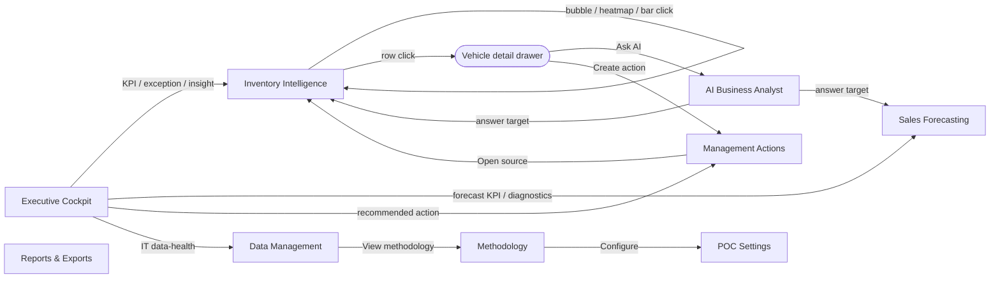

# Wireframe Screen Inventory

> A screen-by-screen catalogue of the ten POC surfaces in `Meridian BI.dc.html`, mapping each to its purpose, persona, components and the business use cases it serves — the source of truth for the React + TypeScript rebuild of BeeEye.

This document enumerates the ten screens implemented in the "Meridian BI" proof-of-concept
([`Meridian BI.dc.html`](../../wireframes/Meridian%20BI.dc.html), driven by
[`engine.js`](../../wireframes/engine.js) `window.BIEngine` and rendered through
[`support.js`](../../wireframes/support.js)). Every figure in the POC is computed client-side from the
two embedded sample workbooks (3,120 sales rows, 291 inventory units); nothing is fabricated and there
is no live Oracle Fusion connection. The production platform re-implements these surfaces on the
`.NET 10` + React target architecture, so this inventory is the functional contract each screen must honour.

Screen identifiers below are the internal route keys (`exec`, `inventory`, `forecast`, `ai`, `actions`,
`reports`, `data`, `methodology`, `integration`, `settings`) defined in `navMeta()` and `screenMeta()`.

---

## Shared application shell

Every screen renders inside a common chrome, so the per-screen sections below describe only what is
unique to each surface.

| Shell element | Behaviour |
| --- | --- |
| **Left navigation** | 10 items, re-ordered per persona into a *primary* group + a *More tools* group. The `Management Actions` item shows a red badge counting open High/Critical actions. |
| **Header** | Screen title + sub-title, `POC ENVIRONMENT` and `SAMPLE DATA` pills, an **As-of** analysis-date button, a **Filters** button (with active-filter count), an **Ask AI** button, and a theme toggle. |
| **Persona switcher** | Three personas — *Executive*, *Business Analyst*, *IT / Data Steward* — each with a default home screen and a tailored nav order + on-screen emphasis. |
| **Global filter drawer** | Right-side drawer of chip toggles across Brand, Model, Variant, Type, Location, Colour, Interior, plus Ramadan period and discount band. Filters are global state (`state.filters`) applied to every screen's computation. |
| **Analysis-date popover** | Sets the POC "as-of" date (default 30 Jun 2026) that drives inventory age, holding cost, aging bands, risk scores and recommendations. |
| **Toast + loading/error states** | Skeleton loaders while the engine boots; toast confirmations after recompute/export. |

### Persona → default surface

| Persona | Home screen | Primary nav order | On-screen emphasis |
| --- | --- | --- | --- |
| Executive | `exec` | exec · actions · reports · ai | KPIs, exposure, recommended actions |
| Business Analyst | `forecast` | forecast · inventory · ai · exec | Trends, diagnostics, forecast detail |
| IT / Data Steward | `data` | data · methodology · integration · settings | Data quality, refresh, configuration |

### Drill-down model

Navigation between screens is data-driven via `drilldown(target)`, which **merges a filter payload into
the global filter state and switches screen**. Cards, chart marks, exceptions, AI answers and the vehicle
drawer all emit these targets, so a click on (say) a heat-map cell lands on Inventory Intelligence
pre-filtered to that location × model. This graph is the backbone of the whole POC:

---

## Summary table

| # | Screen | Purpose | Primary persona | Serves UC | Key components |
| --- | --- | --- | --- | --- | --- |
| 1 | **Executive Cockpit** (`exec`) | What's happening, why it matters, what to do next | Executive | UC8 (primary); UC1, UC2, UC5 | Persona hero band, 10 KPI tiles, demand trend line, risk/aging/accuracy charts, exceptions + recommended-actions lists |
| 2 | **Inventory Intelligence** (`inventory`) | Aging, overstock risk, demand alignment, actions | Business Analyst | UC5 (primary); UC1, UC3, UC4 | 8 KPI tiles, risk quadrant bubble, risk/aging/mfg charts, location×model heat-map, detail table, vehicle drawer |
| 3 | **Sales Forecasting** (`forecast`) | Back-tested accuracy, bias, future demand | Business Analyst | UC2 (primary, wireframed); UC3, UC4 | 8 KPI tiles, control bar, actual/back-test/forecast chart, diagnostics, baseline table, Ramadan/discount charts, scenario simulator |
| 4 | **AI Business Analyst** (`ai`) | Ask questions grounded in calculated data | Any (cross-cutting) | UC3, UC5, UC8; narrates UC1/UC4 | Chat composer, 12 suggested questions, grounded answers with metrics/evidence/actions/targets |
| 5 | **Management Actions** (`actions`) | Turn recommendations into tracked decisions | Executive | UC1, UC4, UC5, UC8 | Status summary, generate/new/export toolbar, filters, editable action cards |
| 6 | **Reports & Exports** (`reports`) | Preview, filter, export analytical reports | Executive | UC2, UC4, UC5, UC8 | 10-report left rail, preview table, CSV + Print/PDF export |
| 7 | **Data Management** (`data`) | Sources, data quality, self-service refresh | IT / Data Steward | Foundational (DataQuality) | 4 source cards, xlsx upload + revalidate, data-quality report |
| 8 | **Methodology & Assumptions** (`methodology`) | How every metric/forecast/risk score is derived | IT / Data Steward | Governance (all UCs) | Coverage, assumptions, forecast & risk methodology, limitations |
| 9 | **Integration Blueprint** (`integration`) | Future-state Oracle Fusion & Azure architecture | IT / Data Steward | Roadmap for UC6, UC7 | Data/AI flow layers, candidate Azure services, implementation considerations |
| 10 | **POC Settings** (`settings`) | Tune thresholds, weights, forecasting, AI | IT / Data Steward | Config for UC2, UC5 | Risk model + aging inputs, weight sliders, forecasting defaults, AI + display options |

---

## 1 · Executive Cockpit (`exec`)

**Purpose.** The one-glance decision surface — headline exposure, forecast health and the shortest path
from an exception to a tracked action. The layout adapts to the active persona.

**Primary persona.** Executive (also the analyst/IT landing when they open it).

**Key KPIs / cards.** A five-column KPI grid, persona-dependent:

- *Executive (10 tiles):* Total inventory units · Inventory value · High/critical-risk value · Daily
  holding cost · Accumulated holding · Forecast accuracy (WMAPE-derived) · Forecast bias ·
  Next-quarter forecast · Transfer opportunities · Critical actions.
- *Business Analyst (5 tiles):* Forecast accuracy · Forecast bias · Next-quarter forecast · Best-fit
  model · Transfer opportunities.
- *IT / Data Steward (5 tiles):* Sales records · Inventory units · Data quality (/100) · Open data
  issues · History coverage.

Above the KPIs, a **persona hero band**: Executive sees an *Executive AI Summary* (up to 5 grounded,
click-through insights); Analyst sees a *Forecast diagnostics* strip (best-fit model, back-test WMAPE,
bias, next-quarter units); IT sees a *Data health* card (quality gauge, row counts, coverage, validation
checks).

**Tables.** None as such; the **Priority exceptions** and **Recommended actions** lists (Executive only)
are row-based list widgets rather than data tables.

**Charts.** *Total demand — actuals, back-test & forecast* (line with CI band); *Inventory value by risk
band* (donut); *Inventory units by aging band* (bars); *Forecast accuracy by model* (WMAPE bars). Charts
are hidden for the IT persona. Executive additionally sees *Top high-risk model·variant* and
*Holding-cost exposure by location* bar charts.

**Filters.** Global filter drawer + analysis date (shared shell).

**Modals / drawers.** None opened directly; recommended-action **Create** buttons write to Management Actions.

**Drill-down paths.** Every KPI tile navigates (mostly to `inventory` or `forecast`); AI-summary insights,
priority exceptions and recommended actions each carry a `drilldown` target; the IT card links to Data
Management / Methodology.

**Use cases served.** **UC8 Executive Decision Cockpit** (primary). Surfaces UC1 (order/transfer
recommendations), UC2 (forecast accuracy & bias diagnostics) and UC5 (aging/overstock exposure).

---

## 2 · Inventory Intelligence (`inventory`)

**Purpose.** Deep inventory analytics — where stock is aging, which units are overstocked relative to
demand, and what to do (transfer, promote, discount) — down to the individual chassis.

**Primary persona.** Business Analyst.

**Key KPIs / cards.** Eight compact tiles: Total stock (with avg age) · Inventory value (at purchase
cost) · High-risk value · Critical units · Daily holding · Avg mfg age · Transfer options · Promotion
candidates.

**Tables.** **Inventory detail** — the primary work surface. Free-text search (stock ID / chassis /
model / location), sortable columns, aging-band filter chips, toggleable columns (Chassis, Colour,
Interior, Purch date, Mfg date, Cover, Demand basis), risk-score badges + recommendation pills,
demand sparklines, pagination (12/page) and **Export CSV**. Row click opens the vehicle drawer.

**Charts.** *Demand vs stock-cover risk quadrant* (bubble; size = inventory value, colour = risk band);
*Risk distribution* (donut, units by band); *Inventory aging distribution* (bars — clicking a bar filters
the table); *Inventory value by location* (h-bars); *Manufacturing age distribution* (bars);
*Holding-cost exposure by model* (h-bars); *Location × model imbalance matrix* (heat-map of stock units).

**Filters.** Global filters + in-screen aging-band chips + table search/column toggles.

**Modals / drawers.** **Vehicle detail drawer** — risk-score breakdown (explainable additive
contributions), metrics grid, trailing-12-month demand sparkline + demand basis, potential transfer
destinations (with avoided holding cost/month), the recommended action (why, evidence, expected outcome,
confidence, assumptions), full vehicle attributes, and **Ask AI** / **Create action** footers.

**Drill-down paths.** Quadrant bubbles, heat-map cells and the value-by-location bars each `drilldown`
into this screen filtered by model/variant/location; aging bars set the table band filter; the drawer
routes onward to AI or Management Actions.

**Use cases served.** **UC5 Inventory Aging & Overstock Risk** (primary, wireframed). Directly powers
UC1 (monthly order/transfer optimisation), UC4 (procurement quantity via stock-cover) and UC3
(configuration-level demand through variant/colour/interior breakdowns).

---

## 3 · Sales Forecasting (`forecast`)

**Purpose.** Explain and quantify future demand with an honest, back-tested accuracy story — accuracy,
bias, model choice and scenario sensitivity — at any aggregation level.

**Primary persona.** Business Analyst.

**Key KPIs / cards.** Eight tiles: Historical units · Historical revenue · Forecast accuracy · Forecast
bias · Best model · Next-quarter · Expected trend · Confidence.

**Tables.** **Baseline model comparison** — WMAPE / MAE / Bias per method (Naïve, Seasonal naïve, 3-mo
MA, Holt-Winters) with a `BEST` marker and count of low-confidence model-variant combinations.

**Charts.** Main *actual · back-test · forecast* line (amber holdout band, shaded CI); *WMAPE by model*
(bars); *Forecast bias by model* (bars); *Actual vs predicted* (holdout scatter); *Ramadan vs
non-Ramadan demand* (with lift/units/discount-frequency callouts); *Sales response by discount band* (bars).

**Filters / controls.** A dedicated control bar: **Level** (Total / Brand / Model / Model+variant /
Location / Loc+model) with dependent model/variant/brand/location selects; **Holdout** (3/6/12-mo);
**Horizon** (3/6/12-mo); **Model** algorithm (Auto-best / Holt-Winters / Seasonal naïve / 3-mo MA /
Naïve); **Metric** (Units / Revenue). Plus the global filter drawer.

**Modals / drawers.** None; the **Forecast scenario simulator** is an inline "what-if" panel (assumed
discount, Ramadan toggle, growth slider, horizon → baseline vs scenario units and revenue with the
discount trade-off). Marked clearly as hypothetical.

**Drill-down paths.** Control changes recompute in place; the *best-fit model* KPI links to Methodology.
This screen is a common `drilldown` **target** from Executive Cockpit and AI answers.

**Use cases served.** **UC2 Sales Forecast Accuracy Improvement** (primary, wireframed). Serves UC3
(configuration-level demand via the Level selector) and UC4 (procurement quantity via next-quarter and
scenario outputs).

---

## 4 · AI Business Analyst (`ai`)

**Purpose.** A conversational entry point that answers questions **strictly grounded in the calculated
inventory, sales and forecast data** — it narrates validated metrics and never fabricates numbers. This
is the POC embodiment of the production rule that generative AI may narrate but must never compute
forecasts, risks, quantities or decisions.

**Primary persona.** Cross-cutting (reachable from every screen via **Ask AI** and the vehicle drawer).

**Key KPIs / cards.** No KPI tiles. Each AI answer is a structured card: answer text, a
confidence badge (High/Medium/Low), optional metric chips, an **Evidence** list, a **Recommended**
actions block, drill-down **target** buttons, and an assumptions + analysed-period footer.

**Tables.** None (metric chips instead).

**Charts.** None inline (answers link out to the relevant analytical screen).

**Filters.** Inherits global filters as answer scope; mode label shows *POC Insight Engine* or *Live AI +
POC engine*.

**Modals / drawers.** None; the composer is the primary control.

**Drill-down paths.** The 12 **suggested questions** seed common analyses (exposure, stock cover,
transfers, promotions, sales trend, next-quarter forecast, bias, Ramadan, discounts, location mismatch,
top actions, data-quality). Answer target buttons `drilldown` into Inventory or Forecasting with the
relevant filters.

**Use cases served.** A discovery layer across **UC3, UC5, UC8**, and narrates recommendations for UC1
and UC4. Never a system of record — answers are decision-support only.

---

## 5 · Management Actions (`actions`)

**Purpose.** Convert AI/analytical recommendations into tracked, owned decisions with status and due
dates — the POC stand-in for the production DecisionsAndOutcomes context. Actions are stored locally in
the POC and are **not** written back to Oracle Fusion.

**Primary persona.** Executive.

**Key KPIs / cards.** A status summary strip (counts by status). Each action is a card: title, category,
priority, tags (model/variant/location), source, created date, **Evidence** and **Expected impact**,
with inline editors for status, priority, owner and due date, plus delete and **Open source**.

**Tables.** None; the register is card-based (and exportable / mirrored as the *Management action
register* report on screen 6).

**Charts.** None.

**Filters.** Status, priority and category selectors; count of shown vs total.

**Modals / drawers.** None; **New action** and **Generate from recommendations** create records inline;
an empty state offers to seed a starter set.

**Drill-down paths.** **Open source** returns to the originating analytical context; **Create action**
buttons across the platform (Executive Cockpit, vehicle drawer, AI answers) land here.

**Use cases served.** The decision-tracking capstone for **UC1, UC4, UC5, UC8** — where recommendations
become accountable actions.

---

## 6 · Reports & Exports (`reports`)

**Purpose.** Preview and export the analytical outputs for offline review, board packs and hand-off.

**Primary persona.** Executive.

**Key KPIs / cards.** None; a left rail of **ten reports**: Executive management report · Inventory risk
report · Aging inventory report · Transfer-opportunity report · Promotion-candidate report · Forecast
performance report · Forecast-bias report · Sales trend report · Data-quality report · Management action
register.

**Tables.** The selected report's preview table (headers + up to 14 preview rows; full set on export),
with a row-count and an explanatory note per report.

**Charts.** None (tabular by design).

**Filters.** Inherits the global filter + analysis date; report selection via the left rail.

**Modals / drawers.** None; **Export CSV** and **Print / PDF** actions per report.

**Drill-down paths.** Selecting a report re-renders the right pane; reports reflect the current global
filter scope.

**Use cases served.** The reporting/export layer for **UC2** (forecast performance/bias), **UC4**
(transfer & promotion), **UC5** (inventory risk/aging) and **UC8** (executive report), plus governance
(data-quality, action register).

---

## 7 · Data Management (`data`)

**Purpose.** Show what data is loaded, how healthy it is, and let a steward replace it and recompute —
the POC face of the Integration + DataQuality contexts.

**Primary persona.** IT / Data Steward.

**Key KPIs / cards.** Four **source cards**: `sales_history_final_prepared.xlsx` (validated) and
`inventory_stock_final_prepared.xlsx` (validated, flagged *service_date unconfirmed*), plus two
*Not connected* placeholders — **Oracle Fusion** (future enterprise source) and **Other enterprise
sources** (CRM / finance / after-sales).

**Tables.** The **Data-quality report** — a checklist of validation issues (label, note, severity, count)
contributing to the /100 score, with download.

**Charts.** None.

**Filters.** N/A (operates on the full dataset).

**Modals / drawers.** Inline **upload** panel for replacement `.xlsx` (parsed and validated in-browser),
with schema-mismatch reporting and an **Ingest & recalculate** action; plus **Refresh & recalculate**.

**Drill-down paths.** Links to Integration Blueprint (for the planned ingestion path) and Methodology.

**Use cases served.** Foundational **DataQuality** capability underpinning every use case; the join-key
and demand-fallback rules it validates come from the
[data dictionary](../../wireframes/docs/DATA_DICTIONARY.md).

---

## 8 · Methodology & Assumptions (`methodology`)

**Purpose.** Full transparency on how every metric, forecast and risk score is derived — the trust
surface for a decision-intelligence platform.

**Primary persona.** IT / Data Steward.

**Key KPIs / cards.** *Data coverage* summary; *POC assumptions*; *Forecast methodology*;
*Inventory-risk methodology* (the five risk-factor weights — stock-cover 30%, holding age 25%, declining
demand 20%, holding-cost 15%, lead-time 10% — aging bands, risk bands, demand-fallback hierarchy and
stock-cover definition); *POC limitations*.

**Tables.** None; structured key/value and list layouts.

**Charts.** None.

**Filters.** N/A.

**Modals / drawers.** None; a **Configure in Settings →** link to screen 10.

**Drill-down paths.** Links forward to POC Settings for live tuning.

**Use cases served.** Cross-cutting governance for all eight use cases; mirrors the source docs
[`METHODOLOGY.md`](../../wireframes/docs/METHODOLOGY.md),
[`DERIVED_METRICS.md`](../../wireframes/docs/DERIVED_METRICS.md) and
[`ASSUMPTIONS_LIMITATIONS.md`](../../wireframes/docs/ASSUMPTIONS_LIMITATIONS.md).

---

## 9 · Integration Blueprint (`integration`)

**Purpose.** Present the future-state architecture — how Oracle Fusion and Azure would feed the platform
— explicitly labelled *Not Connected in the POC*.

**Primary persona.** IT / Data Steward.

**Key KPIs / cards.** *Target data & AI flow* (layered pipeline), *Candidate Azure services* (key/value
mapping), *Implementation considerations* (tiles).

**Tables.** None.

**Charts.** A layered flow diagram (arrows between pipeline stages).

**Filters.** N/A.

**Modals / drawers.** None.

**Drill-down paths.** Referenced from Data Management as the planned ingestion path.

**Use cases served.** The roadmap surface for **UC6 Sales vs After-Sales Demand Correlation** and
**UC7 Spare Parts Demand Prediction**, which require after-sales/parts feeds absent from the POC data.
It aligns with [`INTEGRATION_AZURE_ORACLE.md`](../../wireframes/docs/INTEGRATION_AZURE_ORACLE.md) and the
target architecture (Oracle Fusion read-only system of record via a versioned anti-corruption layer;
ADLS Gen2 zones; Service Bus; Container Apps; provider-neutral generative-AI abstraction).

---

## 10 · POC Settings (`settings`)

**Purpose.** Let a steward tune the calculations live — every change recomputes across all screens.

**Primary persona.** IT / Data Steward.

**Key KPIs / cards.** *Inventory risk model* (analysis date, aging thresholds, five weight sliders with
a normalise-to-100% control, trailing-demand window, healthy-cover cap); *Forecasting* (holdout,
horizon, confidence interval, default algorithm, Ramadan & discount feature toggles); *AI assistant*
(mode, response detail, confidence display, allow action creation); *Display* (theme, accent, density,
SAR currency).

**Tables.** None; forms and sliders.

**Charts.** None.

**Filters.** N/A.

**Modals / drawers.** None; **Reset to POC defaults** restores the baseline settings.

**Drill-down paths.** Reached from Methodology's *Configure* link; changes propagate globally on recompute.

**Use cases served.** Configuration governance for **UC5** (risk weights, aging, cover) and **UC2**
(holdout, horizon, algorithm, seasonality features).

---

## Use-case coverage matrix

Legend: **P** = primary surface · **S** = supporting/contributing · **R** = future-state roadmap only ·
**G** = governance/foundational.

| Screen | UC1 Order Opt. | UC2 Forecast Acc. | UC3 Config Demand | UC4 Procure Qty | UC5 Aging/Overstock | UC6 After-Sales | UC7 Spare Parts | UC8 Exec Cockpit |
| --- | :---: | :---: | :---: | :---: | :---: | :---: | :---: | :---: |
| Executive Cockpit | S | S | | | S | | | **P** |
| Inventory Intelligence | S | | S | S | **P** | | | S |
| Sales Forecasting | | **P** | S | S | | | | S |
| AI Business Analyst | S | S | S | S | S | | | S |
| Management Actions | S | | | S | S | | | S |
| Reports & Exports | | S | | S | S | | | S |
| Data Management | G | G | G | G | G | G | G | G |
| Methodology | G | G | G | G | G | G | G | G |
| Integration Blueprint | | | | | | R | R | |
| POC Settings | | S | | | S | | | |

UC6 and UC7 are intentionally not implemented as live analytics in the POC because the sample data
carries no confirmed after-sales/service or spare-parts demand (the `service_date` field is explicitly
excluded from scoring). They appear only as future-state roadmap items, consistent with the POC's stated
limitations.

---

## Traceability

- **POC source** — [`Meridian BI.dc.html`](../../wireframes/Meridian%20BI.dc.html) (screen templates +
  component logic), [`engine.js`](../../wireframes/engine.js) (`window.BIEngine` analytics),
  [`support.js`](../../wireframes/support.js) (render layer).
- **Data & derivations** — [`DATA_DICTIONARY.md`](../../wireframes/docs/DATA_DICTIONARY.md),
  [`DERIVED_METRICS.md`](../../wireframes/docs/DERIVED_METRICS.md),
  [`METHODOLOGY.md`](../../wireframes/docs/METHODOLOGY.md),
  [`ASSUMPTIONS_LIMITATIONS.md`](../../wireframes/docs/ASSUMPTIONS_LIMITATIONS.md).
- **Target integration** — [`INTEGRATION_AZURE_ORACLE.md`](../../wireframes/docs/INTEGRATION_AZURE_ORACLE.md).
- **Sibling analysis docs** (this package, `docs/architecture/wireframe-analysis/`) — component catalogue,
  persona journeys, use-case traceability and the design-token inventory build on this screen enumeration
  as their shared reference.
