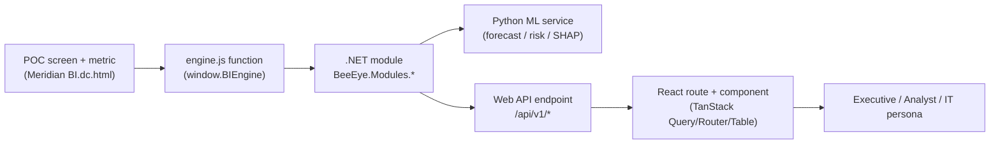
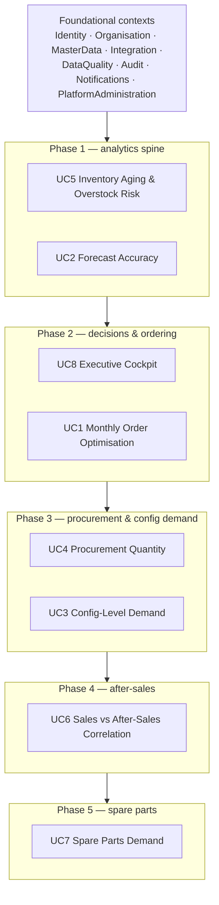

# Wireframe-to-Implementation Traceability Matrix

Purpose: trace every Meridian BI POC screen, component and metric to the BeeEye production module(s), API endpoint(s) and React route/component that will realise it, and map the eight business use cases to bounded contexts and delivery phases.

---

## How to read this document

The Meridian BI POC (`docs/wireframes/Meridian BI.dc.html` + `engine.js`) is the **behavioural specification** for BeeEye. Every KPI, chart, forecast and risk score in the POC is computed at runtime by the framework-free `window.BIEngine`; the production build re-homes those exact calculations into .NET modules and a Python ML service, exposes them over versioned HTTP APIs, and renders them in a React + TypeScript front-end. This matrix is the bridge between the two.

**Provenance columns.** Each functional row cites the POC `engine.js` function it derives from, so the calculation is never reinvented from memory — it is ported. Numbers, weights and thresholds are fixed by the POC and its methodology docs; see [METHODOLOGY](../../wireframes/docs/METHODOLOGY.md), [DERIVED_METRICS](../../wireframes/docs/DERIVED_METRICS.md) and [DATA_DICTIONARY](../../wireframes/docs/DATA_DICTIONARY.md).

**Status vocabulary** (target implementation, not the POC):

| Status | Meaning |
|--------|---------|
| **Planned** | Design agreed; contracts drafted; no production code yet. |
| **Scaffolded** | Module library, endpoint stub and/or React route shell exist and compile; behaviour not wired. |
| **Implemented** | Feature complete against the POC behaviour and covered by tests. |

At the time of writing there is no `src/` tree, so **every production row below is `Planned`**; the POC provenance column records what already works in the reference implementation. As modules land, statuses advance here.

**Conventions.** Module names are .NET library roots under namespace `BeeEye.Modules.*`. API endpoints are host-relative under `/api/v1`. React routes are TanStack Router paths; component names are PascalCase feature components. GenAI may **narrate** validated metrics but must never compute forecasts, risk scores, values, quantities or decisions.

---

## 1. Screen inventory → routes

The ten POC screens (internal ids from `screenMeta()` in the POC) map to production routes as follows. Cross-cutting contexts — **Identity** (Entra ID OIDC/PKCE), **Organisation** (15 sales locations, 14 stocking, Mecca sales-only), **MasterData** (5 models, VX/ZX/MX variants, colour/interior/brand/type taxonomy), **Audit** (every mutation), **Notifications** and **PlatformAdministration** — underpin all screens and are not repeated per row.

| POC id | Screen | Primary module(s) | React route | Root component | Status |
|--------|--------|-------------------|-------------|----------------|--------|
| `exec` | Executive Cockpit | ExecutiveInsights | `/executive` | `ExecutiveCockpit` | Planned |
| `inventory` | Inventory Intelligence | Inventory, Predictions, Recommendations | `/inventory` | `InventoryIntelligence` | Planned |
| `forecast` | Sales Forecasting | Forecasting, ModelsAndExperiments | `/forecasting` | `SalesForecasting` | Planned |
| `ai` | AI Business Analyst | ExecutiveInsights (+ GenAI abstraction) | `/analyst` | `AiBusinessAnalyst` | Planned |
| `actions` | Management Actions | DecisionsAndOutcomes | `/actions` | `ManagementActions` | Planned |
| `reports` | Reports & Exports | ExecutiveInsights, Integration (export zone) | `/reports` | `ReportsExports` | Planned |
| `data` | Data Management | DataQuality, Integration | `/data` | `DataManagement` | Planned |
| `methodology` | Methodology & Assumptions | (static + PlatformAdministration config) | `/methodology` | `MethodologyAssumptions` | Planned |
| `integration` | Integration Blueprint | Integration, PlatformAdministration | `/integration` | `IntegrationBlueprint` | Planned |
| `settings` | POC Settings | PlatformAdministration | `/admin/settings` | `PlatformSettings` | Planned |

---

## 2. Component & metric traceability (all screens)

### 2.1 Executive Cockpit (`/executive`) — supports **UC8**

| Component / metric | POC provenance | Target module(s) | API endpoint | React component | Status |
|--------------------|----------------|------------------|--------------|-----------------|--------|
| KPI tiles: revenue, units, ASP, YoY/MoM | `salesKpis`, `growth` | SalesActuals | `GET /api/v1/executive/kpis` | `KpiTileRow` | Planned |
| Inventory value + high/critical-risk value tiles | `computeInventory` (`agg`) | Inventory, Predictions | `GET /api/v1/executive/kpis` | `KpiTileRow` | Planned |
| Executive AI Summary | `execInsights`, `answer`, `ctxBuild` | ExecutiveInsights (GenAI narration) | `GET /api/v1/executive/summary` | `ExecutiveSummaryCard` | Planned |
| Actual vs Forecast chart | `monthlySeries`, `forecast` | Forecasting | `GET /api/v1/forecasting/overview` | `ActualVsForecastChart` | Planned |
| Inventory value by risk band (donut) | `computeInventory`, `riskBandOf` | Inventory, Predictions | `GET /api/v1/inventory/risk-summary` | `RiskBandDonut` | Planned |
| Inventory units by aging band | `computeInventory`, `agingBandOf` | Inventory | `GET /api/v1/inventory/aging-summary` | `AgingBandBars` | Planned |
| Forecast accuracy by model (WMAPE) | `forecast`, `metrics` | Forecasting, ModelsAndExperiments | `GET /api/v1/forecasting/accuracy` | `AccuracyByModelChart` | Planned |
| Data health / IT panel | `dataQuality` | DataQuality | `GET /api/v1/data-quality/summary` | `DataHealthPanel` | Planned |

### 2.2 AI Business Analyst (`/analyst`)

| Component / metric | POC provenance | Target module(s) | API endpoint | React component | Status |
|--------------------|----------------|------------------|--------------|-----------------|--------|
| Deterministic "POC Insight Engine" answers | `answer`, `ctxBuild`, `execInsights` | ExecutiveInsights | `POST /api/v1/analyst/ask` | `AnalystChat` | Planned |
| Live AI refinement (grounded, numbers preserved) | Live-mode context + system prompt | GenAI abstraction (routing/fallback/structured-output validation) | `POST /api/v1/analyst/ask?mode=live` | `AnalystChat` | Planned |
| Cited metrics / findings / target links | `answer` (`metrics`, `findings`, `targets`) | ExecutiveInsights | `POST /api/v1/analyst/ask` | `AnalystCitations` | Planned |
| Assumptions & confidence disclosures | `resp` defaults (sample-data, analysis-date notes) | ExecutiveInsights | `POST /api/v1/analyst/ask` | `AnalystDisclosure` | Planned |

> Grounding contract: the GenAI layer receives a pre-aggregated context plus a deterministic draft and may only rephrase; it must never invent metrics, claim causation, or imply the sample data is live Oracle Fusion data. Enforced by structured-output validation in the provider-neutral abstraction.

### 2.3 Management Actions (`/actions`)

| Component / metric | POC provenance | Target module(s) | API endpoint | React component | Status |
|--------------------|----------------|------------------|--------------|-----------------|--------|
| Recommendation → tracked decision | `recommend` output persisted (POC: `localStorage`) | DecisionsAndOutcomes, Recommendations | `POST /api/v1/decisions` | `ActionBoard` | Planned |
| Human-approval gate before execution | Assumption: decision-support only | DecisionsAndOutcomes | `POST /api/v1/decisions/{id}/approve` | `ApprovalDialog` | Planned |
| Decision status / outcome tracking | (new — not in POC) | DecisionsAndOutcomes, Audit | `PATCH /api/v1/decisions/{id}` | `DecisionRow` | Planned |

### 2.4 Reports & Exports (`/reports`)

| Component / metric | POC provenance | Target module(s) | API endpoint | React component | Status |
|--------------------|----------------|------------------|--------------|-----------------|--------|
| Report preview + filter | POC report renderers | ExecutiveInsights | `GET /api/v1/reports/{key}` | `ReportPreview` | Planned |
| Export (CSV/XLSX) to `export` zone | POC client export | ExecutiveInsights, Integration | `POST /api/v1/reports/{key}/export` | `ExportButton` | Planned |

### 2.5 Data Management (`/data`)

| Component / metric | POC provenance | Target module(s) | API endpoint | React component | Status |
|--------------------|----------------|------------------|--------------|-----------------|--------|
| Source coverage / row counts / refresh time | POC `itHealth`, `dataQuality` | DataQuality, Integration | `GET /api/v1/data-quality/summary` | `SourceCoverageCard` | Planned |
| Data-quality score & issue list | `dataQuality` (`score`, `issues`) | DataQuality | `GET /api/v1/data-quality/issues` | `DataQualityIssues` | Planned |
| Self-service refresh trigger | POC refresh button | Integration (ADF/Function ingestion), DataQuality gates | `POST /api/v1/ingestion/refresh` | `RefreshControl` | Planned |
| Quarantine / validation-gate view | (new — raw→validated→curated zones) | DataQuality, Integration | `GET /api/v1/data-quality/quarantine` | `QuarantinePanel` | Planned |

### 2.6 Methodology, Integration Blueprint, POC Settings

| Component / metric | POC provenance | Target module(s) | API endpoint | React component | Status |
|--------------------|----------------|------------------|--------------|-----------------|--------|
| Methodology & assumptions content | Static (mirrors methodology docs) | — (static) + PlatformAdministration | `GET /api/v1/config/methodology` | `MethodologyDoc` | Planned |
| Integration blueprint diagram | Static (mirrors integration doc) | Integration | `GET /api/v1/config/integration` | `IntegrationDoc` | Planned |
| Risk weights / bands editor | POC Settings sliders (recompute live) | PlatformAdministration → Predictions, Inventory | `PUT /api/v1/config/risk-model` | `RiskModelSettings` | Planned |
| Forecast config (holdout, CI level) | POC Settings | PlatformAdministration → Forecasting | `PUT /api/v1/config/forecasting` | `ForecastSettings` | Planned |
| Analysis Date (default 30 Jun 2026) | POC assumption (never silent system date) | PlatformAdministration | `PUT /api/v1/config/analysis-date` | `AnalysisDateSetting` | Planned |
| AI behaviour toggles | POC Settings | PlatformAdministration → GenAI abstraction | `PUT /api/v1/config/ai` | `AiBehaviourSettings` | Planned |

---

## 3. UC5 — Inventory Aging & Overstock Risk (wireframed, detailed trace)

Screen: **Inventory Intelligence** (`/inventory`). This is one of the two fully wireframed use cases; every element below has a working POC reference. The production risk score is an **explainable additive** model — the breakdown is a first-class API field, never a black box.

### 3.1 Metrics & aggregates

| Element | POC provenance | Target module(s) | API endpoint | React component | Status |
|---------|----------------|------------------|--------------|-----------------|--------|
| Inventory KPIs (value, daily/accrued holding cost, avg age) | `computeInventory` (`agg`) | Inventory | `GET /api/v1/inventory/summary` | `InventoryKpiRow` | Planned |
| Inventory age = analysis date − date_of_purchase | `computeInventory` | Inventory | `GET /api/v1/inventory/units` | `InventoryTable` | Planned |
| Accumulated holding cost = max(0, age) × holding_cost_per_day | `computeInventory` | Inventory | `GET /api/v1/inventory/units` | `InventoryTable` | Planned |
| Aging distribution (New/Healthy/Watch/High attention/Critical) | `agingBandOf` `[30,60,90,120]` | Inventory | `GET /api/v1/inventory/aging-summary` | `AgingBandBars` | Planned |
| Inventory value by location (14, no Mecca) | `dimAgg('location')` | Inventory, Organisation | `GET /api/v1/inventory/by-location` | `InventoryByLocationChart` | Planned |
| Value by risk band (Low/Med/High/Critical) | `riskBandOf` `[34,59,79]` | Inventory, Predictions | `GET /api/v1/inventory/risk-summary` | `RiskBandDonut` | Planned |
| `service_date` shown but **excluded** from risk | Assumption (meaning unconfirmed) | Inventory | `GET /api/v1/inventory/units` | `InventoryTable` | Planned |

### 3.2 Explainable risk model (additive, weights fixed by methodology)

| Risk factor | Weight | POC provenance | Target module(s) | Status |
|-------------|:------:|----------------|------------------|--------|
| Stock-cover risk | 30% | `computeInventory` (cover = group stock ÷ trailing-N avg units) | Predictions (score) ← Inventory + Forecasting | Planned |
| Inventory holding age | 25% | `computeInventory` (age vs aging bands) | Predictions ← Inventory | Planned |
| Declining demand trend | 20% | `demandTrend` (recent 3-mo vs prior 3-mo) | Predictions ← SalesActuals | Planned |
| Holding-cost exposure | 15% | `computeInventory` (accrued holding cost) | Predictions ← Inventory | Planned |
| Lead-time risk | 10% | `computeInventory` (lead_time_days) | Predictions ← Inventory | Planned |
| **Score 0–100 + additive breakdown** | — | `computeInventory` (`risk`), `topRiskUnits` | Predictions (SHAP-backed explanation) | `RiskBreakdownPanel` — Planned |

- **API:** `GET /api/v1/inventory/units/{stockId}/risk` returns `{ score, band, contributions[] }`.
- **ML:** Python service recomputes contributions; weights and band thresholds are supplied by PlatformAdministration config so the POC Settings "recompute live" behaviour is preserved.

### 3.3 Demand velocity, fallback hierarchy & recommendations

| Element | POC provenance | Target module(s) | API endpoint | Status |
|---------|----------------|------------------|--------------|--------|
| Demand velocity (trailing-N-month avg units) | `demandVelocity` | Predictions ← SalesActuals | `GET /api/v1/demand/velocity` | Planned |
| Fallback hierarchy (LMV → national+share → model-split → insufficient) | `demandVelocity`, `demandTrend` (`useNational`) | Predictions, MasterData, Organisation | `GET /api/v1/demand/velocity` (`basis` field) | Planned |
| Months of stock cover | `computeInventory` | Inventory ← Predictions | `GET /api/v1/inventory/units` | Planned |
| Recommendation engine (Retain / Transfer / Targeted promotion / Controlled discount 0–20% / Pause procurement / Liquidate / Investigate) | `recommend` | Recommendations | `GET /api/v1/inventory/units/{stockId}/recommendation` | Planned |
| Rationale + evidence + expected outcome + confidence | `recommend` (structured output) | Recommendations | same | Planned |
| Transfer opportunities (source → best destination) | `transferOpportunities`, `bestTransfer` | Recommendations, Organisation | `GET /api/v1/recommendations/transfers` | Planned |

> The **join key** `location + model + variant` and the documented demand-fallback hierarchy are load-bearing: the API surfaces the `basis` actually used per calculation, matching the POC's per-row transparency. A missing combination is never silently treated as zero demand.

---

## 4. UC2 — Sales Forecast Accuracy Improvement (wireframed, detailed trace)

Screen: **Sales Forecasting** (`/forecasting`). The second fully wireframed use case. Accuracy is demonstrated by **holdout back-testing** (the customer's original forecasts were not supplied); the future forecast refits on all history.

### 4.1 Forecast methods (compared transparently)

| Method | POC provenance | Target module(s) | Status |
|--------|----------------|------------------|--------|
| Naïve (last month) | `naive` | Forecasting (baseline) | Planned |
| 3-month moving average | `movingAvg` | Forecasting (baseline) | Planned |
| Seasonal naïve (same month last year, period 12) | `seasonalNaive` | Forecasting (baseline) | Planned |
| Holt-Winters additive (level/trend/seasonal) | `holtWinters`, `holtLinear`, `seasonalAt` | Forecasting → Python ML (statsmodels) | Planned |
| Selection = lowest WMAPE (full comparison shown) | `forecast` | Forecasting, ModelsAndExperiments (MLflow) | Planned |

### 4.2 Accuracy, diagnostics & explanations

| Element | POC provenance | Target module(s) | API endpoint | React component | Status |
|---------|----------------|------------------|--------------|-----------------|--------|
| Holdout selector (3 / 6 / 12 months) | `forecast` opts | Forecasting | `GET /api/v1/forecasting/backtest?holdout=` | `HoldoutSelector` | Planned |
| WMAPE (primary), MAE, RMSE, bias | `metrics` | Forecasting | `GET /api/v1/forecasting/accuracy` | `AccuracyPanel` | Planned |
| Over/under-forecast frequency | `metrics` | Forecasting | `GET /api/v1/forecasting/accuracy` | `BiasPanel` | Planned |
| Forecast bias by model | `metrics`, `forecast` | Forecasting, ModelsAndExperiments | `GET /api/v1/forecasting/bias` | `BiasByModelChart` | Planned |
| Confidence intervals (80 / 90 / 95) from residual spread | `forecast` (CI derivation) | Forecasting | `GET /api/v1/forecasting/overview?ci=` | `ForecastBand` | Planned |
| Actual vs forecast series | `monthlySeries`, `buildSeries`, `forecast` | Forecasting ← SalesActuals | `GET /api/v1/forecasting/overview` | `ActualVsForecastChart` | Planned |
| Explanations (trend / seasonality / Ramadan & discount **association only**) | `explainForecast` | Forecasting, ExecutiveInsights (narration) | `GET /api/v1/forecasting/explanation` | `ForecastExplanation` | Planned |
| Scenario simulator (hypothetical, clearly labelled) | POC scenario simulator | Forecasting (what-if, non-persisted) | `POST /api/v1/forecasting/scenario` | `ScenarioSimulator` | Planned |

> Explanations use associative language ("associated with", never "caused by"). `is_ramadan` and `discount_pct` (0/5/10/15/20) are association features, not causal levers. Model runs, parameters and back-test metrics are versioned in **ModelsAndExperiments** (MLflow) so a chosen model is auditable and reproducible; periodic re-training is gated on back-test validation.

---

## 5. Use case → bounded context → delivery phase

The eight use cases are sequenced across five delivery phases (P1 = highest priority / earliest). The two wireframed use cases (**UC2, UC5**) anchor Phase 1 because they are proven in the POC and establish the analytics spine (SalesActuals, Forecasting, Inventory, Predictions, Recommendations, DataQuality). Later phases extend into after-sales and spare parts, which have no POC data yet.

| # | Use case | Primary contexts | Supporting contexts | Phase | POC status |
|---|----------|------------------|---------------------|:-----:|------------|
| **UC5** | Inventory Aging & Overstock Risk | Inventory, Predictions, Recommendations | SalesActuals, MasterData, DataQuality | **P1** | Wireframed |
| **UC2** | Sales Forecast Accuracy Improvement | Forecasting, ModelsAndExperiments, Predictions | SalesActuals, MasterData | **P1** | Wireframed |
| **UC8** | Executive Decision Cockpit | ExecutiveInsights | Forecasting, Inventory, Predictions, Recommendations, Notifications | **P2** | Built (aggregates P1) |
| **UC1** | Monthly Vehicle Order Optimisation | Procurement, Forecasting | Inventory, Predictions, Recommendations, DecisionsAndOutcomes | **P2** | Partial (recs engine) |
| **UC4** | Procurement Quantity Optimisation | Procurement | Forecasting, Inventory, Predictions | **P3** | Partial |
| **UC3** | Configuration-Level Demand Insights | SalesActuals, MasterData | Forecasting, Predictions | **P3** | Partial (breakdowns) |
| **UC6** | Sales vs After-Sales Demand Correlation | AfterSales, SalesActuals | Predictions, ExecutiveInsights | **P4** | New (no data) |
| **UC7** | Spare Parts Demand Prediction | SpareParts, Forecasting | AfterSales, ModelsAndExperiments, Predictions | **P5** | New (no data) |

**Foundational contexts (Phase 0/1, prerequisite to every UC):** Identity, Organisation, MasterData, Integration (Oracle Fusion read-only anti-corruption layer), DataQuality, Audit, Notifications, PlatformAdministration. These deliver auth, the location/model taxonomy, ingestion + validation zones (raw/validated/curated/quarantine/model-input/model-output/export), configuration and observability that all use cases consume.

---

## 6. Notes on status governance

- No `src/` tree exists yet, so all production rows are **Planned**. Statuses advance to **Scaffolded** when the module library + endpoint stub + route shell compile, and to **Implemented** when behaviour matches the cited POC function and is covered by tests.
- The POC provenance column is the acceptance oracle: a production metric is "done" when it reproduces the corresponding `engine.js` output for the sample dataset (3,120 sales rows, 291 inventory units) within tolerance, and the additive risk / accuracy breakdowns match.
- Any endpoint that returns a computed number is owned by a .NET module or the Python ML service — **never** by the GenAI layer, which is restricted to narration of already-validated values.

---

## Traceability

- POC behavioural spec: [`docs/wireframes/Meridian BI.dc.html`](../../wireframes/Meridian%20BI.dc.html), [`engine.js`](../../wireframes/engine.js)
- Methodology & grounding: [METHODOLOGY](../../wireframes/docs/METHODOLOGY.md)
- Metric definitions: [DERIVED_METRICS](../../wireframes/docs/DERIVED_METRICS.md)
- Data model & join keys: [DATA_DICTIONARY](../../wireframes/docs/DATA_DICTIONARY.md)
- Assumptions & limitations: [ASSUMPTIONS_LIMITATIONS](../../wireframes/docs/ASSUMPTIONS_LIMITATIONS.md)
- Target integration architecture: [INTEGRATION_AZURE_ORACLE](../../wireframes/docs/INTEGRATION_AZURE_ORACLE.md)
