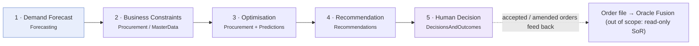
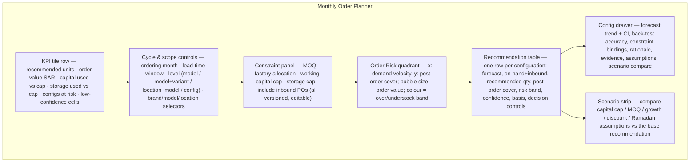
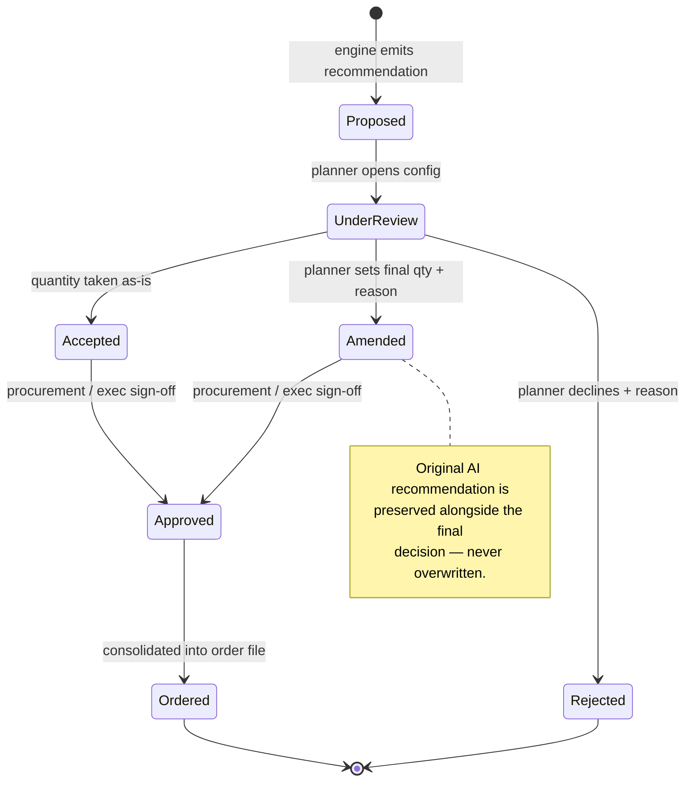
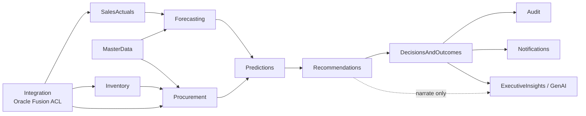

# UC1 — Monthly Vehicle Order Optimisation

> Turn a validated demand forecast into a **constrained, reviewable order recommendation** per vehicle configuration — never an unconstrained forecast masquerading as an order.

UC1 is the flagship planning use case for ADMC. Each monthly ordering cycle, supply planners must decide **how many of each vehicle configuration to order** — by model, variant, colour, interior and destination location — under real procurement limits (minimum order quantities, factory allocation, working capital, storage). BeeEye supports that decision by chaining four machine steps and one human step, keeping every number traceable back to the sales history and inventory position it came from.

This document is a product specification. It builds directly on the POC forecasting engine (see [UC2](./uc2-sales-forecast-accuracy.md)) and the POC inventory-risk engine (see [UC5](./uc5-inventory-aging-overstock-risk.md)), and reuses their visual language.

> **Current build — Implemented (live).** UC1 is operational as the **Recommendations** module
> (`Status => "operational"`), with the order-optimisation logic in `BeeEye.Analytics`
> (`Optimisation/OrderOptimiser.cs`). Live routes: `GET /api/v1/recommendations/order-optimisation` and
> `/recommendations/order-optimisation/filter-options`, rendered by the `/order-optimisation` React screen.
> The endpoint shapes elsewhere in this spec are the target design.

---

## 1. Business question

> "Going into next month's factory order, **how many units of each configuration should we commit to, and where should they land**, so that we cover expected demand without over-committing capital or filling yards with slow-moving stock — and can we defend every number to Finance and the OEM?"

Concretely, for the ADMC portfolio (Nissan Patrol, Toyota Corolla, HAVAL H9, Toyota Camry, Lexus ES 350 across VX/ZX/MX variants, five colours, four interiors, and up to 15 selling locations including Mecca which holds no local stock), UC1 answers three linked questions per configuration:

1. **How much demand** is expected over the ordering + lead-time window? (forecast — from UC2)
2. **What is feasible** given MOQ, factory allocation, capital and storage caps? (constraints)
3. **What is the recommended order quantity**, its over/understock risk and confidence, and what is the human decision? (optimisation → recommendation → decision)

---

## 2. Personas

| Persona | Role in UC1 | Primary need | POC persona lineage |
|---|---|---|---|
| **Supply / Order Planner** | Primary user. Runs the monthly cycle, reviews recommendations, accepts / amends / rejects per configuration. | Trustworthy quantities with the reasoning attached; fast bulk review. | Analyst |
| **Procurement Manager** | Owns MOQ, factory-allocation ceilings, working-capital and storage limits; approves the consolidated order. | Guarantee the order respects every hard constraint before it goes to the OEM. | Analyst / Exec |
| **Demand / BI Analyst** | Validates the forecast basis and back-test accuracy feeding each configuration; investigates low-confidence cells. | Transparency of method, holdout accuracy and demand-fallback basis. | Analyst |
| **Brand / Model Manager** | Sanity-checks configuration mix (colour/interior/variant split) against market intent and campaigns. | Configuration-level demand insight (ties to [UC3](./uc3-configuration-demand-insights.md)). | Analyst |
| **Regional Sales Manager** | Reviews the destination allocation for their locations; flags local knowledge the data can't see. | Location-level allocation they can defend to their showrooms. | Exec |
| **Executive Sponsor** | Approves total commitment value and capital exposure. | One-line defensible summary of total units, SAR value and risk. | Exec (ties to [UC8](./uc8-executive-decision-cockpit.md)) |

Access is enforced by Entra ID role mapping in the **Identity** bounded context; recommendation authoring, amendment and approval are distinct permissions.

---

## 3. The mandated separation (non-negotiable)

UC1's core discipline is that **demand forecasting, business constraints, optimisation, recommendation and human decision are five separate stages** — each owned by a distinct bounded context, each independently inspectable, and none allowed to collapse into another. A forecast is an estimate of demand; an order is a constrained business commitment. They must never be conflated.

| # | Stage | Owner context | Consumes | Produces | May **not** do |
|---|---|---|---|---|---|
| 1 | **Demand forecast** | Forecasting | Sales history, seasonality, regional splits | Per-configuration expected demand over horizon, with back-test accuracy + confidence interval | Know anything about MOQ, capital or stock. It forecasts *demand*, not *orders*. |
| 2 | **Business constraints** | Procurement + MasterData | MOQ, factory allocation, working-capital cap, storage cap, current + inbound stock, confirmed orders, lead times | A validated, versioned constraint set for the cycle | Alter the forecast. Constraints shape feasibility, not demand. |
| 3 | **Optimisation** | Procurement + Predictions | Forecast (1) + constraints (2) | A feasible recommended order quantity per configuration that respects every hard constraint | Invent demand. It can only allocate within the forecast envelope. |
| 4 | **Recommendation** | Recommendations | Optimised quantity + risk + confidence | A structured recommendation object: quantity, rationale, evidence, over/understock risk, confidence, assumptions | Present itself as a decision. It is a *proposal*. |
| 5 | **Human decision** | DecisionsAndOutcomes | The recommendation | Accept / Amend / Reject, with the **original AI recommendation preserved alongside the final decision** | Overwrite or discard the original AI recommendation. Both are retained for audit. |

The generative-AI layer may **narrate** any of these validated outputs in natural language, but must **never compute** a forecast, a risk probability, a value, a quantity or a decision. Numbers come only from the engine; the AI explains them (associative language only — "associated with", never "caused by"), consistent with the POC's [grounding methodology](../../wireframes/docs/METHODOLOGY.md).

---

## 4. Inputs

Every input is versioned per ordering cycle so a recommendation can be reproduced exactly. The "Source in POC" column distinguishes what the current sample data supports from what production supplies via the Oracle Fusion anti-corruption layer or business-maintained master data.

| Input | Grain | Feeds stage | Source in POC | Production source |
|---|---|---|---|---|
| Sales history (units, price, revenue, discount, Ramadan flag) | month × location × model × variant × colour × interior | 1 | `data/sales.json` — 3,120 rows, Jan 2022–Apr 2026 | SalesActuals (curated from Oracle Fusion) |
| Seasonality / calendar effects | monthly period 12; `is_ramadan` | 1 | Derived in `engine.js` (Holt-Winters period 12, seasonal-naïve) | Forecasting |
| Regional demand preferences | per location share | 1 | Sales breakdown by location | SalesActuals / MasterData |
| Current on-hand inventory | stock unit | 2 | `data/inventory.json` — 291 units, 14 locations | Inventory |
| **Inbound inventory / confirmed orders** | open PO line | 2 | *Not in POC* (`date_of_purchase` is historical) | Procurement (open POs) via Integration |
| Lead times (order → availability) | model / variant | 2 | Proxy: `lead_time_days` (manufacture→purchase) on inventory | Procurement / MasterData |
| **Minimum order quantity (MOQ)** | model / variant / factory | 2 | *Not in POC* | MasterData (business-maintained) |
| **Factory allocation ceiling** | model / period | 2 | *Not in POC* | Procurement (OEM allocation) |
| **Working-capital cap** | portfolio / brand | 2 | *Not in POC* | Organisation / Finance |
| **Storage capacity cap** | location | 2 | Inferable from location holdings; explicit cap *not in POC* | Organisation / Inventory |
| Demand-fallback basis | location-model-variant cell | 1→3 | Documented hierarchy in `engine.js` (see below) | Forecasting |

### Demand-fallback hierarchy (sparse cells)

Order quantities are often needed for configuration cells with thin local history. UC1 reuses the POC's transparent fallback, and **shows the basis used per configuration** — a missing cell is never silently treated as zero demand:

1. Location + model + variant, where sufficient recent history exists.
2. National model + variant, scaled by the location's historical sales share.
3. Model-level national demand divided across selling locations.
4. Otherwise labelled **"insufficient demand history"** — routed to human review, not auto-ordered.

See [`METHODOLOGY.md`](../../wireframes/docs/METHODOLOGY.md) and [`DERIVED_METRICS.md`](../../wireframes/docs/DERIVED_METRICS.md) for the demand-velocity and stock-cover definitions reused here.

---

## 5. Outputs

| Output | Definition | Basis / reuse |
|---|---|---|
| **Recommended order quantity** | Feasible units to order per configuration (model+variant+colour+interior+location), after constraints | Optimisation over the forecast envelope |
| **Post-order stock cover** | Projected months of cover once the recommended order + inbound stock lands | `cover = (on-hand + inbound + order) ÷ demand velocity` |
| **Over / understock risk** | Band showing whether the recommendation risks excess or shortfall | Reuses risk scale: **Low 0–34 · Medium 35–59 · High 60–79 · Critical 80–100** |
| **Confidence** | High / Medium / Low, from the configuration's back-test accuracy | High if WMAPE < 15%, Medium < 30%, else Low (as on the forecast screen) |
| **Demand basis** | Which fallback tier produced the demand figure | Shown per cell (tiers 1–4 above) |
| **Rationale + evidence + assumptions** | Why this quantity, with supporting numbers and stated caveats | Recommendation object `{ action, why, evidence[], outcome, confidence, assumptions[] }` |
| **Scenario comparison** | Side-by-side of quantity/value/risk under alternative assumptions | Reuses the UC2 scenario panel, extended with constraint levers |
| **Human decision record** | Accept / Amend / Reject + final quantity, **with the original AI recommendation preserved** | DecisionsAndOutcomes; exportable order file |

The over/understock risk deliberately reuses the same four-band scale and OKLCH colour tokens as UC5 (`--risk-low` green 152 · `--risk-med` yellow 84 · `--risk-high` orange 52 · `--risk-crit` red 27) so a planner reads risk identically across the platform.

---

## 6. Proposed screens & user flows

UC1 adds a **Monthly Order Planner** screen that sits between Sales Forecasting and Management Actions in the navigation. Its visual grammar is inherited wholesale from the two wireframed screens: the KPI tile row and confidence-banded trend chart from Forecasting, and the risk quadrant, aging/risk bands, sortable detail table and unit drawer from Inventory.

### 6.1 Screen layout

### 6.2 Component reuse map

| Component | Reused from | UC1 adaptation |
|---|---|---|
| KPI tile row (`label · value · icon · tone · sub`) | Forecasting + Inventory | Tiles for recommended units, order value, capital vs cap, storage vs cap, configs at risk |
| Confidence-banded trend chart (`cTrend`, history + `lo/hi`) | Forecasting | Shown in the config drawer; overlays the ordering + lead-time window |
| Level buttons (total / model / model+variant / location+model) | Forecasting | Adds a **configuration** level (colour+interior) |
| Holdout / horizon toggles | Forecasting | Horizon defaults to the lead-time window; holdout drives confidence |
| Baseline comparison table (naïve / MA3 / seasonal-naïve / Holt-Winters, WMAPE) | Forecasting | Read-only in the drawer to justify the chosen method per config |
| Back-test scatter (`cScatter`, actual vs forecast, diagonal) | Forecasting | Confidence evidence in the drawer |
| Risk quadrant bubble (`cBubble`, velocity × cover) | Inventory | Re-axed to **post-order** cover; bubble = order value; colour = over/understock band |
| Risk / aging band chips + donut | Inventory | Re-labelled to over/understock bands |
| Sortable, paginated, column-toggle detail table + band chips | Inventory | Rows become configurations with inline decision controls |
| Unit/detail drawer (`rvDrawer`) | Inventory | Becomes the **config drawer** with rationale + scenario compare |
| Scenario panel (discount / Ramadan / growth factors) | Forecasting | Extended with constraint levers (capital cap, MOQ, storage) |
| Action register (statuses, categories, priorities) | Management Actions | Accepted/amended orders post here as order actions |

### 6.3 Primary flow — monthly cycle

1. **Open cycle.** Planner selects the ordering month and lead-time window. BeeEye pins the forecast run, the constraint set version and the inventory snapshot so the run is reproducible.
2. **Confirm constraints.** Procurement reviews the constraint panel (MOQ, factory allocation, capital cap, storage cap, inbound POs). Edits are versioned; the panel shows capital and storage headroom live.
3. **Review recommendations.** The table lists every configuration with forecast, on-hand+inbound, recommended quantity, post-order cover, over/understock band, confidence and demand basis. Chips filter by risk band / confidence / low-basis cells.
4. **Drill in.** Clicking a row opens the config drawer: the trend + confidence band, the back-test accuracy and baseline comparison, the exact constraint bindings that shaped the quantity, and the plain-language rationale with evidence and assumptions.
5. **Decide.** Per configuration the planner **Accepts**, **Amends** (enters a final quantity + reason) or **Rejects** (with reason). The **original AI recommendation is preserved** next to the final decision.
6. **Compare scenarios.** Before committing, the scenario strip contrasts the base recommendation with alternative capital caps, MOQ assumptions or growth/discount/Ramadan assumptions — units, SAR value and risk side by side.
7. **Consolidate & approve.** Procurement/Executive approve the consolidated order; totals must sit within every hard cap. The order file is exported (and, in production, handed to Oracle Fusion — read-only system of record, out of scope for write-back here).

### 6.4 Secondary flows

- **Low-confidence triage.** A dedicated chip surfaces configurations at fallback tier 3–4 or WMAPE > 30%. These are never auto-ordered; they route to the analyst for a demand-data check (mirrors the POC's "Investigate demand data" recommendation).
- **Bulk accept.** Configurations at Low over/understock risk **and** High confidence can be bulk-accepted, leaving the planner's attention for the exceptions.
- **Amend cascade.** Amending a location's quantity re-checks storage and capital headroom and flags any cap breach before approval.

---

## 7. Decision workflow & auditability

The human decision stage is a first-class, audited state machine in the **DecisionsAndOutcomes** context. It reuses the Management Actions register statuses (`Proposed · Under review · Approved · In progress · Completed · Rejected`) and, critically, **stores the AI recommendation and the human decision as two separate, permanently linked records**.

| Field retained per configuration decision | Purpose |
|---|---|
| `ai_recommended_qty` | The untouched engine recommendation |
| `ai_rationale`, `ai_evidence[]`, `ai_confidence`, `ai_assumptions[]` | The reasoning as generated |
| `final_qty` | What the human committed to |
| `decision` (`Accept` / `Amend` / `Reject`) | The human action |
| `decision_reason` | Required on Amend and Reject |
| `decided_by`, `decided_at`, `approved_by`, `approved_at` | Accountability trail (Audit context) |
| `forecast_run_id`, `constraint_set_version`, `inventory_snapshot_id` | Reproducibility keys |

This lets ADMC later ask **"how often did we override the recommendation, and did the overrides help?"** — comparing `ai_recommended_qty` against `final_qty` and against realised sales closes the loop into forecast-accuracy improvement (UC2) and outcome tracking.

---

## 8. Guardrails

> **Primary guardrail:** BeeEye must **never present an unconstrained forecast as an order recommendation.** A demand forecast is not an order. An order only exists after constraints (stage 2) and optimisation (stage 3) have been applied and are visible.

| # | Guardrail | Enforcement |
|---|---|---|
| G1 | An unconstrained forecast is never labelled or exported as a "recommended order". | Recommendation objects are only minted by stage 4, which requires a validated constraint set and optimisation result as inputs. |
| G2 | Every hard constraint (MOQ, factory allocation, capital cap, storage cap) is respected before approval. | Optimiser rejects infeasible allocations; approval is blocked while any cap is breached. |
| G3 | Generative AI narrates but never computes. It may not produce a forecast, risk score, value, quantity or decision. | Provider-neutral GenAI abstraction receives only engine-computed metrics; structured-output validation rejects any fabricated number. |
| G4 | Sparse / low-confidence cells are surfaced, never silently zero-ordered. | Fallback tier and confidence shown per cell; tiers 3–4 and WMAPE > 30% routed to human review. |
| G5 | Causal language is disallowed; only associative claims ("associated with"). | Same grounding rules as the POC AI layer. |
| G6 | Recommendations are decision-support, not automation. Human approval precedes any order. | DecisionsAndOutcomes state machine; original recommendation preserved beside the human decision. |
| G7 | The sample data is never implied to be live Oracle Fusion data; analysis date and cycle inputs are explicit assumptions, never the silent system clock. | Cycle pins forecast run, constraint version and inventory snapshot; consistent with [`ASSUMPTIONS_LIMITATIONS.md`](../../wireframes/docs/ASSUMPTIONS_LIMITATIONS.md). |

---

## 9. Bounded-context mapping

| Context | UC1 responsibility |
|---|---|
| **Integration** | Read-only, versioned anti-corruption layer over Oracle Fusion (sales, inventory, open POs). System of record — no write-back. |
| **SalesActuals** | Curated monthly sales history feeding the forecast. |
| **MasterData** | Configuration taxonomy (model/variant/colour/interior), MOQ, lead-time reference, factory-allocation reference. |
| **Inventory** | Current on-hand position; source of stock-cover and demand-velocity inputs. |
| **Forecasting** | Per-configuration demand forecast + back-test accuracy + confidence (stage 1). |
| **Procurement** | Constraint set, inbound POs, optimisation of feasible quantities, consolidated order (stages 2–3). |
| **Predictions** | Persisted optimised quantities, over/understock risk, confidence per configuration. |
| **Recommendations** | Structured recommendation objects with rationale, evidence, assumptions (stage 4). |
| **DecisionsAndOutcomes** | Human accept/amend/reject; preserves original recommendation + final decision (stage 5). |
| **ExecutiveInsights** | GenAI narration of the consolidated order for [UC8](./uc8-executive-decision-cockpit.md) — narrate only. |
| **Notifications / Audit** | Cycle events, cap-breach alerts, immutable decision trail. |

---

## 10. Acceptance signals

| Signal | Target |
|---|---|
| Every recommended quantity is traceable to a forecast run, constraint version and inventory snapshot. | 100% |
| No configuration is exported as an order without passing stages 2–4. | 100% (G1) |
| Consolidated order never breaches a hard cap at approval. | 100% (G2) |
| Low-confidence / sparse cells shown, never auto-ordered. | 100% (G4) |
| Original AI recommendation retained beside every human decision. | 100% (G6) |
| Planner can bulk-accept Low-risk / High-confidence configs and focus on exceptions. | Qualitative |
| Override rate (`final_qty ≠ ai_recommended_qty`) is measurable and reviewable. | Reported per cycle |

---

## Traceability

- **Method & grounding:** [`METHODOLOGY.md`](../../wireframes/docs/METHODOLOGY.md) · [`DERIVED_METRICS.md`](../../wireframes/docs/DERIVED_METRICS.md)
- **Data model:** [`DATA_DICTIONARY.md`](../../wireframes/docs/DATA_DICTIONARY.md)
- **Assumptions & limits:** [`ASSUMPTIONS_LIMITATIONS.md`](../../wireframes/docs/ASSUMPTIONS_LIMITATIONS.md)
- **Integration target:** [`INTEGRATION_AZURE_ORACLE.md`](../../wireframes/docs/INTEGRATION_AZURE_ORACLE.md)
- **Related use cases:** [UC2 — Sales Forecast Accuracy](./uc2-sales-forecast-accuracy.md) · [UC3 — Configuration-Level Demand](./uc3-configuration-demand-insights.md) · [UC4 — Procurement Quantity Optimisation](./uc4-procurement-quantity-optimisation.md) · [UC5 — Inventory Aging & Overstock Risk](./uc5-inventory-aging-overstock-risk.md) · [UC8 — Executive Decision Cockpit](./uc8-executive-decision-cockpit.md)
