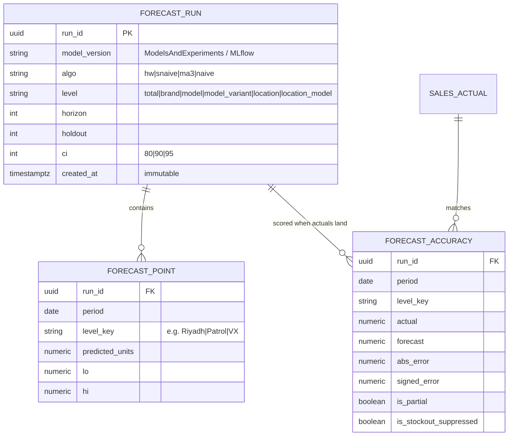
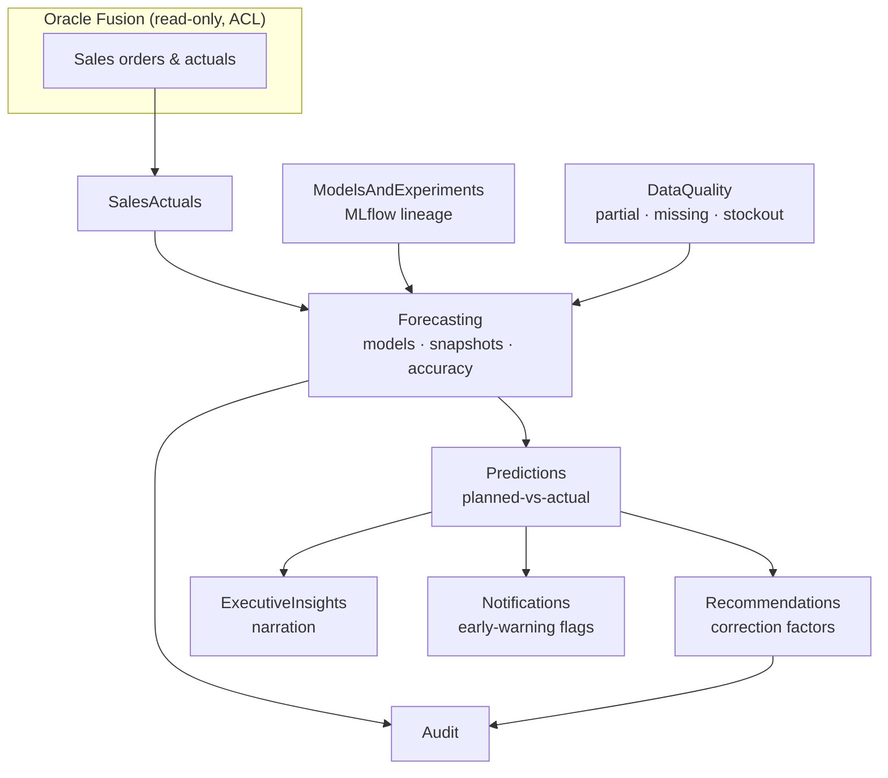

# UC2 — Sales Forecast Accuracy Improvement

> Turn BeeEye's demand forecasts into a self-auditing loop: measure planned-vs-actual, detect systematic bias, recommend explainable correction factors, and raise early-warning flags — all on validated numbers only.

---

## 1. Business framing

**Business question (verbatim from the ADMC AI Use Case Pack, UC2):**
> "Where are our forecasts consistently over- or under-performing?"

**AI expectation (pack):** compare planned vs actual sales · detect bias patterns (optimism / conservatism) · highlight SKUs with recurring forecast variance · recommend forecast adjustment factors.

**Expected output (pack):** a forecast-deviation dashboard · AI-suggested correction factors · early-warning flags.

### What the POC proves today vs. what production adds

The customer's original historical forecasts were **not supplied** ([METHODOLOGY.md](../../wireframes/docs/METHODOLOGY.md)). The POC therefore proves the *accuracy machinery* by **holdout back-testing** — train on earlier months, predict a known later window, compare to actuals — rather than by scoring a real planning submission. This is an honest substitute, not the end state.

| Capability | POC (Sales Forecasting screen) | Production (BeeEye) |
|---|---|---|
| Error metrics (WMAPE, MAE, RMSE, bias, over/under) | Computed live in `engine.js` `metrics()` | Same formulas, persisted per snapshot & dimension |
| Accuracy signal | Back-test on synthetic holdout | Back-test **plus** planned-vs-actual on stored forecast snapshots |
| Bias detection | Total & per-model bias %, over/under freq | + tracking signal, per-horizon / hierarchy / region bias |
| Correction factors | Scenario simulator (what-if multipliers) | Deterministic **bias-derived correction factor** recommendations |
| Version comparison | Baseline model comparison table | Snapshot-to-snapshot forecast-version diff over real time |
| Early warning | Low-confidence combo count | Persisted flags → Notifications + audit trail |

Everything in this spec is grounded in the existing wireframe, [METHODOLOGY.md](../../wireframes/docs/METHODOLOGY.md) and [DERIVED_METRICS.md](../../wireframes/docs/DERIVED_METRICS.md); production extensions are labelled as such.

---

## 2. Personas

| Persona | POC home | Goal in UC2 | Primary artefacts consumed |
|---|---|---|---|
| **Demand / Forecasting Analyst** (primary) | `Business Analyst` workspace → Sales Forecasting | Find where and why forecasts drift; tune models; apply correction factors | Deviation dashboard, diagnostics, baseline comparison, correction-factor recommendation |
| **S&OP Lead** | Sales Forecasting + Executive Cockpit | Consensus forecast quality across models/regions; sign-off on adjustments | Accuracy-by-hierarchy, bias by region, tracking-signal alerts |
| **Regional Sales Manager** | Executive Cockpit (scoped) | Trust the regional number; know when it is systematically off | Bias & WMAPE filtered to their locations |
| **Executive** | Executive Cockpit | One accuracy KPI + one bias KPI to gauge trust | `Forecast accuracy` and `Forecast bias` cockpit tiles |
| **Data Steward** | Data Management | Ensure actuals/snapshots are complete & clean before scoring | Missing-snapshot / partial-period / stockout flags |

---

## 3. Metrics catalogue

All formulas below are exactly those implemented in `engine.js` `metrics(actual, pred)` and documented in [DERIVED_METRICS.md](../../wireframes/docs/DERIVED_METRICS.md#forecast-accuracy-holdout-back-test). Error is defined **signed as `e = forecast − actual`** (positive ⇒ over-forecast).

| Metric | Formula | Notes / null behaviour |
|---|---|---|
| Forecast error (signed) | `e = f − a` | Basis for bias direction |
| Absolute error | `|e|` | Per period |
| WMAPE **(primary)** | `Σ|a − f| / Σa × 100` | Robust to zeros; **`null` when `Σa = 0`** (never ∞) |
| MAE | `mean(|e|)` | Same units as demand |
| RMSE | `sqrt(mean(e²))` | Penalises large misses |
| Bias % | `Σ(f − a) / Σa × 100` | `null` when `Σa = 0`; `>3` over, `<−3` under, else balanced |
| Bias (abs) | `mean(e)` | Mean signed error in units |
| MAPE | `mean(|e|/|a|)` over `a ≠ 0` only | Reported *only* where actuals are non-zero; **never primary** |
| Over-forecast freq | share of periods with `f > a` | Optimism indicator |
| Under-forecast freq | share of periods with `f < a` | Conservatism indicator |
| **Tracking signal** *(production)* | `Σ(f − a) / MAD` (running) | Flag when `|TS| > 4` — sustained drift |
| Confidence band | `WMAPE < 15 ⇒ High`, `< 30 ⇒ Medium`, else `Low` | Drives the `Confidence` KPI and colour tone |

**Accuracy dimensions** (production persists each; POC computes on demand per scope):

- **By horizon** `h = 1…H` — does month-1 beat month-6? (POC holds a fixed holdout window; production stores per-lead-time error.)
- **By product hierarchy** — brand › model › variant. POC renders *WMAPE by model* and *bias by model* h-bar charts; production rolls the same up/down the hierarchy.
- **By region** — the 15 sales locations (Mecca sells but holds no stock — [DATA_DICTIONARY.md](../../wireframes/docs/DATA_DICTIONARY.md)). POC scopes via the `location` / `location_model` forecast level.
- **By period** — actual vs predicted per calendar month (the back-test/scatter view).

---

## 4. Forecast models & selection (grounded)

The engine compares four baselines and selects the lowest-WMAPE model; the future forecast refits on all history. Selection is transparent — the full comparison is always shown.

| Key | Model | Definition | Params |
|---|---|---|---|
| `naive` | Naïve (last month) | carry forward last observed value | — |
| `ma3` | 3-month moving average | mean of trailing 3 | k = 3 |
| `snaive` | Seasonal naïve (last year) | same month, 12 months back | period 12 |
| `hw` | Holt-Winters additive | level / trend / seasonal | α 0.35, β 0.08, γ 0.30, period 12; falls back to Holt-linear when `n < 14` |

Selection: `Auto (best WMAPE)` or a manual override (`hw` / `snaive` / `ma3` / `naive`). Confidence intervals derive from **back-test residual spread**: `band = z·σ·√(1 + 0.15·i)` (widening with horizon `i`), `z = 1.28 / 1.645 / 1.96` for 80 / 90 / 95 %. On ADMC's sample data seasonal-naïve is frequently competitive; the tool reports that honestly rather than forcing a fancier model.

---

## 5. Versioned forecast snapshots (production)

A **forecast snapshot** freezes what the model predicted, when, at what grain — the foundation for real planned-vs-actual scoring that the POC's back-test stands in for.

Rules:

- Snapshots are **immutable** and **append-only**; a re-forecast creates a new `run_id`, never overwrites — this is what makes version comparison and audit possible.
- `level_key` uses the UC-wide join grammar `location + model + variant` ([DATA_DICTIONARY.md](../../wireframes/docs/DATA_DICTIONARY.md)); higher levels drop the finer keys.
- Accuracy rows are written **only after a period closes** and actuals are validated (see partial-period edge case).
- Owned by the **Forecasting** bounded context; actuals sourced from **SalesActuals**; model lineage from **ModelsAndExperiments**; scored deviations feed **Predictions** and **Recommendations**.

---

## 6. Bias detection & tracking signal

Bias answers the pack's "over- or under-performing" question directly.

- **Direction** (POC + prod): `bias% > +3` ⇒ *over-forecasting* (optimism); `< −3` ⇒ *under-forecasting* (conservatism); otherwise *broadly balanced*. Rendered as the Executive Cockpit `Forecast bias` tile and the per-model *Forecast bias by model* chart (`+` over / `−` under).
- **Frequency** (POC): over/under-forecast frequency exposes lopsidedness even when the net bias nets out.
- **Tracking signal** (production): running `Σ(f − a)/MAD`; sustained `|TS| > 4` fires a **systematic-drift** early-warning flag on the affected `level_key` — a drift that a single-period WMAPE would miss.
- **Scope**: bias is computed at every level the user selects (total → location+model), so ADMC can localise drift to, e.g., *Haval H9 ZX in Jeddah* rather than only "the total".

---

## 7. Correction-factor recommendation (explainable)

The pack asks BeeEye to "recommend forecast adjustment factors." BeeEye derives these **deterministically from measured bias**, then attaches a plain-language rationale — mirroring the transparent recommendation pattern in [METHODOLOGY.md](../../wireframes/docs/METHODOLOGY.md#recommendation-engine).

```mermaid
flowchart LR
    A[Closed-period actuals<br/>SalesActuals] --> B[Score snapshot<br/>WMAPE / bias / TS]
    B --> C{Bias significant<br/>& persistent?}
    C -- no --> D[No adjustment<br/>keep model as-is]
    C -- yes --> E[Correction factor<br/>k = a&#772; / f&#772; over trailing window]
    E --> F[Bound & guard<br/>clamp, min sample, exclude censored]
    F --> G[Recommendation<br/>+ rationale + evidence + confidence]
    G --> H[GenAI narration<br/>numbers unchanged]
```

- **Factor** = ratio of mean actual to mean forecast over a trailing, closed, non-censored window at the chosen `level_key`. `k > 1` ⇒ scale forecast **up** (was under-forecasting); `k < 1` ⇒ scale **down**.
- **Guards**: minimum sample size; **clamped** to a sane range (the POC scenario simulator already bounds its discount elasticity to `[0.85, 1.8]` — production applies the same discipline); stockout-suppressed and partial periods are **excluded** from the factor so censored demand never pulls the number.
- **Explanation** carries rationale, supporting evidence (which periods, what bias), expected outcome, confidence (from the WMAPE band) and assumptions — never a bare multiplier.
- **GenAI guardrail**: the generative layer may *narrate* the correction factor and its evidence but must **never compute** the factor, the forecast, the bias, or any quantity. It restates BeeEye's numbers verbatim, states when data is unavailable, and avoids causal claims ("associated with", not "caused by") — consistent with the POC AI-grounding rules.

---

## 8. Forecast-version comparison

Two comparison axes, both faithful to the screen:

1. **Model comparison (within a run)** — the POC *Baseline model comparison* table ranks `naive / ma3 / snaive / hw` by WMAPE with MAE and bias, badges the `BEST`, and flags how many model-variant combinations are low-confidence. This is rendered today.
2. **Snapshot comparison (across runs, production)** — diff two `run_id`s for the same `level_key`: forecast delta, which was closer to eventual actuals, and whether a model/version change improved or degraded WMAPE and bias. Backed by immutable snapshots (§5) and model lineage in ModelsAndExperiments; enables "did last month's re-tune actually help?"

---

## 9. Early-warning flags

| Flag | Trigger | POC surface | Production surface |
|---|---|---|---|
| Low-confidence forecast | `WMAPE = null` or `> 30` for a model-variant | *"N combinations flagged low-confidence"* on the baseline table | Notification + dashboard badge |
| Systematic drift | `|tracking signal| > 4` sustained | — | Notification on `level_key` |
| Directional bias | `|bias%| > 3` at a scoped level | Cockpit `Forecast bias` tile tone | Regional/hierarchy alert |
| Missing snapshot | no stored forecast for a closed period | — | Data-completeness flag (Data Steward) |
| Censored demand | stockout/no-inventory zero actuals | Sparse-segment note (Data Management) | Suppress + flag, do not score |

Production flags are persisted, routed through **Notifications**, and written to **Audit** so an accuracy story is reconstructable months later.

---

## 10. Zero-actual handling — no infinite MAPE

Zero-actual months are routine at ADMC: sparse location-model-variant cells, Mecca (no inventory), pre-launch months for new models, and stockouts. MAPE divides by the actual, so a single zero yields ∞/undefined and any average built on it is meaningless. BeeEye therefore:

- makes **WMAPE the primary metric** — its denominator is `Σ actuals` over the *window*, so one zero month cannot explode it. Only when the **entire window sums to zero** is WMAPE undefined, in which case `engine.js` returns **`null`** (surfaced as "—" / "insufficient demand history"), **never `Infinity`**;
- applies the same `Σa = 0 ⇒ null` rule to **bias %**;
- reports **MAPE only over non-zero-actual periods**, explicitly labelled, and never as the headline;
- routes truly sparse cells through the **demand fallback hierarchy** (location+variant → national share → national model split → "insufficient demand history") from [METHODOLOGY.md](../../wireframes/docs/METHODOLOGY.md#demand-fallback-hierarchy-for-sparse-location-model-variant-history) rather than scoring noise.

---

## 11. Faithful mapping to the Sales Forecasting wireframe

Every production element traces to an existing element of the `Sales Forecasting` screen (POC screen 3).

| Wireframe element | Behaviour in POC | Production feature | Owning context |
|---|---|---|---|
| 8 KPI tiles — Historical units/revenue, **Forecast accuracy** (`100 − WMAPE`), **Forecast bias**, **Best model**, **Next-quarter**, **Expected trend**, **Confidence** | Live from `forecast()` on the current scope | Persisted KPI series per snapshot | Forecasting |
| Control bar — **LEVEL** (total/brand/model/model+variant/location/loc+model), **HOLDOUT** 3/6/12, **HORIZON** 3/6/12, **MODEL** algo (auto/hw/snaive/ma3/naive), **metric** units/revenue | Recompute on change | Same controls; level ⇒ `level_key`, holdout/horizon/ci ⇒ run config | Forecasting |
| Main chart — actual · **amber holdout band** · forecast with shaded CI | `cTrend` over history + future | Snapshot overlay: predicted vs realised actuals | Forecasting / Predictions |
| **AI explanation** panel — "Why is *X* forecast this way?" | Deterministic `explainForecast()` points (recent-3 vs prior-12, Ramadan association, projected direction, WMAPE confidence) | Same deterministic points, then optional GenAI narration | ExecutiveInsights |
| **Forecast diagnostics** — training/holdout period, observations, selected model, WMAPE, MAE/RMSE, bias, over/under, Ramadan/discount feature flags | Rendered from `accuracy` + settings | Persisted per run for audit | Forecasting / Audit |
| **WMAPE by model** & **Forecast bias by model** h-bars | Per-model `forecast()` | Accuracy-by-hierarchy roll-up | Forecasting |
| **Actual vs predicted** scatter (diagonal = perfect) | Holdout points from `backtest` | Planned-vs-actual per closed period | Predictions |
| **Baseline model comparison** table + low-confidence count | `methods[]` ranked, `BEST` badge | Model + snapshot version comparison | ModelsAndExperiments |
| **Ramadan vs non-Ramadan** & **discount-band response** | `ramadanCompare` / `discountBands` (association only) | Explanatory features (associative, never causal) | SalesActuals |
| **Forecast scenario simulator** (discount / Ramadan / growth / horizon) | What-if multipliers, clamped `[0.85, 1.8]` | Basis for bounded correction factors | Recommendations |

---

## 12. Forecasting edge cases

| Case | Risk if naïve | BeeEye handling |
|---|---|---|
| **Missing snapshot** for a closed period | Cannot compute deviation; silent gap | Mark "no snapshot", exclude from accuracy aggregates, raise data-completeness flag |
| **Partial / open period** | Comparing full forecast to partial actual understates accuracy, fakes over-forecast bias | Score only after **period close**; open months excluded from WMAPE/bias, shown as "in progress" |
| **New model** (`< 14` months history) | Holt-Winters needs ≥ `m+2` points | Auto-fallback Holt-linear → naïve; label **low-confidence**; WMAPE may be `null` |
| **Discontinued model** | Actuals drop to 0 ⇒ looks like huge over-forecast | Detect discontinuation, suppress from bias/correction, flag; excluded from `Σa` |
| **Stockout / no-inventory suppression** (e.g. Mecca) | Censored demand scored as a forecast miss and learned as low demand | Flag `is_stockout_suppressed`, exclude from accuracy **and** from correction-factor windows |
| **Sparse LMV cell** | Division on tiny samples ⇒ unstable WMAPE | Demand fallback hierarchy; basis-used shown per calculation |
| **Holdout > available history** | Too few training months | `holdout = min(requested, n − 12)` — always ≥ 12 training months retained |
| **Ramadan lunar drift** | Fixed period-12 seasonality misaligns the moving month | Use the `is_ramadan` flag as an associative feature (never causal); seasonal-naïve caveated |
| **Aggregate vs bottom-up mismatch** | Sum of variant forecasts ≠ total forecast | Level chosen explicitly; production reconciles hierarchy; `level_key` recorded on every point |
| **Zero-actual window** | Infinite MAPE | WMAPE/bias return `null`, not ∞ (see §10) |
| **CI over-confidence at long horizon** | Flat band hides growing uncertainty | Band widens `√(1 + 0.15·i)` with horizon |

---

## Traceability

- **Methodology & selection:** [METHODOLOGY.md](../../wireframes/docs/METHODOLOGY.md) — back-testing, WMAPE selection, recommendation engine, AI grounding.
- **Metric definitions:** [DERIVED_METRICS.md](../../wireframes/docs/DERIVED_METRICS.md#forecast-accuracy-holdout-back-test).
- **Data model & join grammar:** [DATA_DICTIONARY.md](../../wireframes/docs/DATA_DICTIONARY.md).
- **Assumptions & limitations:** [ASSUMPTIONS_LIMITATIONS.md](../../wireframes/docs/ASSUMPTIONS_LIMITATIONS.md) — forecasts are prototype estimates; original business forecasts not supplied.
- **Integration & data zones:** [INTEGRATION_AZURE_ORACLE.md](../../wireframes/docs/INTEGRATION_AZURE_ORACLE.md) — Oracle Fusion read-only ACL, ADLS model-input/output zones.
- **Wireframe source:** `docs/wireframes/Meridian BI.dc.html` (Sales Forecasting screen) · `engine.js` (`forecast()`, `metrics()`, `explainForecast()`).
- **Related use cases:** [UC1 — Monthly Vehicle Order Optimisation](./uc1-monthly-order-optimisation.md) (consumes the corrected forecast) · [UC5 — Inventory Aging & Overstock Risk](./uc5-inventory-aging-overstock-risk.md) (demand velocity shares the forecast base) · [UC8 — Executive Decision Cockpit](./uc8-executive-decision-cockpit.md) (surfaces the accuracy & bias KPIs).
