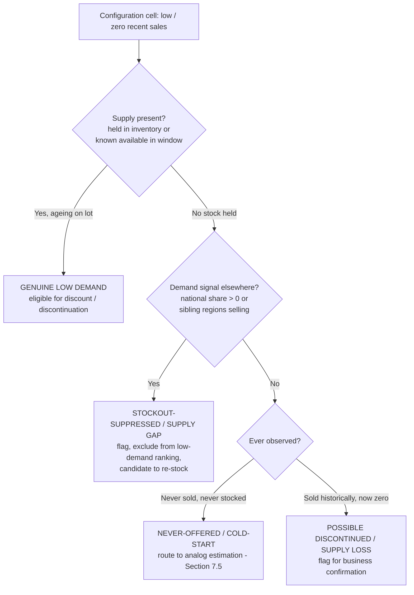
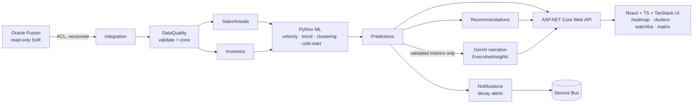

# UC3 — Configuration-Level Demand Insights

> Reveal which exact vehicle configurations (model × variant × colour × trim × options) actually sell,
> where they sell, and which are decaying — while never comparing two configurations whose availability differed.

---

## 1. Purpose & business context

ADMC plans, procures and markets vehicles at the **model** and **variant** level, but demand is realised at
the **configuration** level: a Patrol VX in *Pearl White* with *Beige Leather* is a different product decision
from the same Patrol VX in *Midnight Black* with *Black Leather*. Ordering, promotion and discontinuation
decisions made at the coarse level over- and under-supply specific configurations, silently accumulating slow
movers while starving proven winners.

UC3 turns the 3,120-row monthly sales history into **configuration-level demand intelligence**: heatmaps,
high-demand clusters, low-rotation and demand-decay detection, and regional demand differences — with a hard
guardrail that keeps every comparison honest by accounting for whether each configuration was actually
available to be sold.

**Related use cases:** feeds [UC1 — Monthly Order Optimisation](./uc1-monthly-order-optimisation.md) and
[UC4 — Procurement Quantity Optimisation](./uc4-procurement-quantity-optimisation.md) with configuration mix,
consumes availability context from [UC5 — Inventory Aging & Overstock Risk](./uc5-inventory-aging-overstock-risk.md),
and surfaces in [UC8 — Executive Decision Cockpit](./uc8-executive-decision-cockpit.md).

---

## 2. What "configuration" means

A configuration is the observable cross-product of the taxonomy dimensions shared by the sales and inventory
records (see [Data Dictionary](../../wireframes/docs/DATA_DICTIONARY.md)). `brand` and `type` are functionally
determined by `model` and are carried for roll-ups, not as independent axes.

| Dimension | Role in a configuration | Distinct values (POC data) |
|-----------|-------------------------|-----------------------------|
| `model` | Primary product | Patrol, Corolla, Haval H9, Camry, ES 350 (5) |
| `variant` | Trim grade | VX, ZX, MX (3) |
| `colour` | Exterior | Midnight Black, Pearl White, Fiesta Red, Sapphire Blue, Graphite Gray (5) |
| `interior` | Trim / upholstery | Beige / Grey / Brown / Black Leather (4) |
| `options` | Packs & accessories | **Not in POC data** — reserved axis, sourced from Oracle Fusion in production |
| `brand`, `type` | Derived roll-up | Nissan/Toyota/HAVAL/Lexus · SUV/Hatchback/Sedan/Luxury Sedan |

**Configuration space.** `model × variant × colour × interior` = **300 theoretical combinations**; only a
subset is ever ordered or sold, so the working universe is the set of *observed* configurations plus
*candidate* configurations proposed for new-configuration analysis. In production the addition of `options`
expands this space by an order of magnitude, which is precisely why availability-aware sparsity handling
(Section 6) is load-bearing rather than cosmetic.

**Configuration key.** `model | variant | colour | interior` (+ `options` in production). Demand and inventory
still **join on `location + model + variant`** (the documented join grain); colour/interior/options are
attributes carried through for finer slicing and are subject to the same
[demand fallback hierarchy](../../wireframes/docs/METHODOLOGY.md) when a cell is sparse.

---

## 3. Scope

**In scope**
- Demand heatmaps across any two configuration/regional axes.
- High-demand cluster detection and low-rotation / demand-decay detection.
- Regional demand differences and over/under-indexing.
- Distinguishing **genuine low demand** from **stockout-suppressed demand**.
- New-configuration **cold-start** demand estimation from analogs.
- Decision **support** for promotion, pricing and discontinuation (recommendations, never auto-execution).
- Drill-down from any cell to the contributing transactions.
- **Configurable decay alerts** with availability floors.

**Out of scope (owned elsewhere)**
- Order quantities and safety stock → UC1 / UC4.
- Unit-level aging and risk scoring → UC5.
- Forecast-accuracy back-testing → UC2.
- Any write-back to Oracle Fusion (system of record is read-only via the anti-corruption layer).

---

## 4. Personas & jobs-to-be-done

| Persona | Job-to-be-done |
|---------|----------------|
| Product / brand planner | "Which colour+trim mix should I order for each variant, per region?" |
| Regional sales manager | "Which configurations under-index in my region and why — demand or supply?" |
| Pricing / marketing | "Which slow configurations respond to discount, and at what depth?" |
| Executive | "Are we quietly building a tail of dead configurations? Which to discontinue?" |
| Data steward | "Which low-demand signals are actually data gaps or stockouts I must not trust?" |

---

## 5. Core analytics (grounded in `engine.js`)

All figures are computed deterministically by the analytics engine (POC: `window.BIEngine`; production: the
Python 3.12 ML services and the .NET Forecasting/Predictions modules). The generative-AI layer may **narrate**
these numbers but must **never compute** them — see Section 10.

### 5.1 Demand signal & velocity
Per configuration (and per region), **demand velocity** = trailing-N-month average monthly `units_sold`,
resolved through the documented four-step fallback hierarchy so a sparse or unobserved cell is *not* silently
treated as zero demand:

1. Location + model + variant (colour/interior filter applied) — sufficient recent history.
2. National model + variant, scaled by the location's historical sales share.
3. Model-level national demand divided across selling locations.
4. Otherwise labelled **"insufficient demand history"**.

The **basis actually used** and a confidence label (High/Medium/Low) travel with every velocity value.

### 5.2 Demand trend & decay
Trend = recent 3-month average vs prior 3-month average → *increasing / stable / declining* with a percentage
change (engine `demandTrend`). **Decay** is a sustained decline beyond a configurable threshold — the raw
signal behind the configurable alerts in Section 8.

### 5.3 High-demand clusters
Configurations are grouped by demand velocity, trend and average selling price into interpretable clusters.
- **POC:** transparent rule-based bins — *Rising winners*, *Stable core*, *Niche steady*, *Fading tail*.
- **Production:** k-means / hierarchical clustering on standardised features (velocity, trend slope,
  discount elasticity, seasonality, regional dispersion), with SHAP attributions so each cluster is
  explainable, not a black box.

### 5.4 Low-rotation detection
Rotation combines the demand signal with the **availability signal** (current stock presence + aging from the
inventory join). A configuration is *low-rotation* when demand velocity is low **and** supply is demonstrably
present (held in inventory, ageing) — i.e. the market has had the chance to buy and hasn't.

### 5.5 Regional demand differences
For each configuration, per-location share is compared to the location's share of overall volume to compute
**over/under-indexing**. Mecca (sales, no inventory) is handled gracefully. This drives the Regional Demand
Matrix (Section 7.4).

### 5.6 Promotion / pricing support
`discountResponsive(model, variant)` returns, per configuration group: a **responsive** flag (discounted
average units materially above non-discounted, with a minimum sample), the **observed discount range**
(bounded to the real 0–20% band), a suggested depth, and Ramadan lift context. All framed as **association,
not causation**.

### 5.7 Discontinuation support
A configuration is a *discontinuation candidate* only when it is **sustained low-rotation + decaying + supply
present (not stockout-suppressed) + weak discount response + high aging**. The platform emits a rationale,
supporting evidence, expected outcome, confidence and assumptions — a **decision-support suggestion requiring
business review, never an automated action**.

---

## 6. The availability guardrail (avoid misleading comparisons)

**The core rule of UC3:** *never rank or compare two configurations on raw sales when their availability
differed.* A configuration with zero sales because it was never in stock is not the same as one that sat on
the lot and nobody bought it — yet a naïve heatmap paints both dark.

### 6.1 Genuine low demand vs stockout-suppressed demand

### 6.2 Availability-adjusted metrics
Comparisons and heatmap intensity use **availability-normalised** measures, not raw counts:

| Metric | Definition | Purpose |
|--------|-----------|---------|
| Days available (DA) | Days the configuration was in stock / offered in the window | Denominator for fair rate |
| Sell-through rate | `units_sold / DA` (or units ÷ average stock in window) | Availability-fair demand |
| Availability coverage | Share of window with stock present | Confidence weight on the cell |
| Suppression flag | Set by the 6.1 decision tree | Excludes cell from face-value ranking |

### 6.3 POC honesty note
The POC inventory file is a **point-in-time snapshot** (291 units, purchase dates Feb–May 2026), so *historical*
day-level availability is not directly known. The POC therefore infers suppression using proxies — current
stock presence, national/sibling-region demand share, and sales continuity — and **labels every inference**.
In production, Oracle Fusion supplies historical stock-on-hand by configuration-location-day through the
versioned anti-corruption layer, upgrading these proxies to measured DA. This limitation is stated on-screen,
consistent with the POC's [assumptions & limitations](../../wireframes/docs/ASSUMPTIONS_LIMITATIONS.md).

**UI contract:** whenever two cells being compared have materially different availability coverage, the
interface renders a *"not comparable at face value"* affordance and offers either normalisation (rate view) or
exclusion — the comparison is never shown silently.

---

## 7. Screens & flows

New screens extend the established Meridian BI / BeeEye visual language: OKLCH light+dark themes,
`IBM Plex Sans` UI / `IBM Plex Mono` for numbers, `Material Symbols Outlined` icons, 12px radius, `--gap`
16/11, `--card-pad` 18/13. They slot beside the existing **Inventory Intelligence** and **Sales Forecasting**
screens. Demand intensity uses a single-hue **sequential green ramp anchored on `--pos` (hue 152)** for a
perceptually ordered scale; `--warn` (84) marks *watch/decay* and `--neg` (27) marks *suppressed / excluded*
cells — reusing the existing semantic tokens rather than inventing new hues. AI narration uses `--ai-1`
(purple 285) / `--ai-2` (blue 224) accents.

### 7.1 Configuration Demand Heatmap (primary)
- Matrix with **selectable axes** (e.g. rows = colour, cols = variant; or model × location). Cell = a
  sequential-green demand-intensity chip showing the availability-adjusted rate; hover reveals raw units, DA,
  velocity **basis** and confidence.
- Cells flagged suppressed/excluded render with a hatched `--neg` treatment and a filter icon — never a dark
  "low demand" green — so the eye is never misled.
- Global controls: analysis window, region scope, "raw vs availability-adjusted" toggle (adjusted is default),
  fallback-basis visibility, minimum-volume floor.

### 7.2 High-Demand Clusters
- Scatter/quadrant of configurations (x = demand velocity, y = trend %; size = ASP; colour = cluster) with a
  ranked side list. Selecting a cluster filters the heatmap and detail panel. Each cluster carries a plain-language,
  engine-grounded descriptor and (production) SHAP driver chips.

### 7.3 Low-Rotation & Decay Watchlist
- Table of configurations sorted by a composite of low sell-through, decay % and aging, with the **suppression
  flag column** front and centre. Columns: configuration, region, velocity + basis, trend %, DA / coverage,
  aging band, discount-responsiveness, recommended action (Retain / Promote / Controlled discount / Discontinue —
  candidate / Investigate data). Rows failing the availability floor are visually parked as
  *"insufficient availability to judge demand."*

### 7.4 Regional Demand Matrix
- Configuration × location grid showing over/under-index vs expected, with `--pos`/`--neg` diverging emphasis.
  Reveals, e.g., a configuration that is a winner nationally but under-indexes in one region **because it was
  never stocked there** (feeds transfer/order logic in UC1/UC4).

### 7.5 Configuration Detail & Transaction Drill-down
- Header: configuration identity + current cluster + suppression status.
- Trend chart (monthly units, Ramadan bands shaded, discount markers), velocity basis & confidence, discount-response
  panel (observed range, responsive flag, association caveat), regional split.
- **Drill-down to transactions:** the exact contributing sales rows (`sale_date, location, units_sold,
  unit_price, discount_pct, revenue, is_ramadan`) in a virtualised table, exportable — every headline number is
  traceable to source rows.
- **Cold-start panel** for a candidate never-observed configuration: shows the analog hierarchy used to estimate
  demand and an explicit **Low** confidence label.

**New-configuration cold-start analog hierarchy**

| Step | Analog basis | Confidence |
|------|--------------|-----------|
| 1 | Same `model + variant`, other colour/interior (colour/trim rarely drive volume) | Medium |
| 2 | Same colour/interior across sibling variants of the model | Low–Medium |
| 3 | Model-level national demand ÷ selling locations | Low |
| 4 | Type/segment prior (e.g. SUV baseline) | Low |
| — | None applicable → **"insufficient basis to estimate"** | — |

### 7.6 Decay Alert Configuration
- Form (React Hook Form + Zod) to define alert rules; live preview of how many current configurations would
  fire under the chosen thresholds. See Section 8.

---

## 8. Configurable decay alerts

Decay alerts must not fire on stockouts, so every rule carries an **availability floor**.

| Parameter | Meaning | Default |
|-----------|---------|---------|
| Decline threshold | Trend % below which a config is "decaying" | −15% |
| Window | Recent vs prior comparison length | 3 vs 3 months |
| Min volume floor | Minimum prior-window units to be eligible | ≥ 3 units |
| Availability floor | Minimum availability coverage to trust the signal | ≥ 60% |
| Scope | National / per-region / per-cluster | National |
| Cadence | Evaluation frequency | Monthly on data refresh |

A rule that passes the volume and availability floors and breaches the decline threshold raises a notification
(in-app + optional email/Service Bus fan-out) carrying the configuration, the decay figures, the demand basis,
the suppression check result, and a deep link to the Configuration Detail screen. Rules and thresholds are
stored server-side (production) rather than browser localStorage.

---

## 9. Derived metrics reference

Extends [Derived Metric Definitions](../../wireframes/docs/DERIVED_METRICS.md).

| Metric | Formula / source | Notes |
|--------|------------------|-------|
| Demand velocity | Trailing-N-month avg monthly units, fallback hierarchy | Carries basis + confidence |
| Sell-through rate | `units_sold / days_available` | Availability-fair; default heatmap measure |
| Availability coverage | Share of window with stock present | Confidence weight; POC inferred, prod measured |
| Demand trend % | (recent 3m avg − prior 3m avg) / prior | Decay signal |
| Over/under-index | config location share ÷ location overall share | Regional Demand Matrix |
| Discount responsiveness | discounted avg units vs non-discounted (min sample) | Association only, 0–20% band |
| Ramadan lift | Ramadan avg monthly vs non-Ramadan | Seasonal context |
| Suppression flag | Section 6.1 decision tree | Governs comparability |

---

## 10. Architecture mapping

### 10.1 Bounded contexts touched

| Context | Responsibility in UC3 |
|---------|------------------------|
| **MasterData** | Canonical configuration taxonomy (models, variants, colours, interiors, options) |
| **SalesActuals** | Demand history, velocity, trend, breakdowns, transaction drill-down source |
| **Inventory** | Availability signal (current stock presence, aging) for suppression detection |
| **Forecasting / Predictions** | Cold-start analog estimation; decay projection |
| **Recommendations** | Promotion / pricing / discontinuation-candidate suggestions |
| **DataQuality** | Sparse-cell / suppression / availability-coverage flags |
| **Notifications** | Configurable decay alerts (in-app + Service Bus) |
| **ExecutiveInsights** | GenAI narration of validated configuration metrics |
| **Audit** | Records alert-rule changes and recommendation acknowledgements |

### 10.2 Data & compute flow

### 10.3 GenAI guardrail
The provider-neutral generative-AI abstraction may **narrate** configuration insights (e.g. summarise why a
cluster is fading) strictly from engine-validated metrics, must **state when a fallback basis or suppression
flag applies**, must avoid causal language, and must **never compute** demand values, velocities, trends,
suppression decisions, quantities or discontinuation calls. Structured-output validation rejects any narration
whose numbers do not reconcile to the computed metrics.

### 10.4 API surface (sketch)

| Method + path | Returns |
|---------------|---------|
| `GET /configurations/demand/heatmap?rowAxis=&colAxis=&region=&adjusted=true` | Availability-adjusted cell matrix + flags |
| `GET /configurations/clusters?window=` | Cluster assignments + descriptors |
| `GET /configurations/watchlist?availabilityFloor=` | Low-rotation / decay rows |
| `GET /configurations/{key}` | Detail: trend, basis, discount response, regional split |
| `GET /configurations/{key}/transactions` | Contributing sales rows (drill-down / export) |
| `GET /configurations/{key}/cold-start` | Analog estimate + hierarchy + confidence |
| `POST /alerts/decay-rules` | Create/update a decay alert rule |

---

## 11. Assumptions, limitations & guardrails

- Historical availability is **inferred** in the POC (snapshot inventory) and **measured** in production
  (Oracle Fusion stock-position history); every inference is labelled.
- `options` is a production-only configuration axis; POC configurations are `model × variant × colour × interior`.
- A missing configuration cell is **never** auto-treated as zero demand — the fallback hierarchy and cold-start
  analogs apply, with basis and confidence shown.
- Discount and Ramadan effects are reported as **association, not causation**, within the observed 0–20% band.
- Discontinuation and promotion outputs are **decision-support suggestions requiring business review**, not
  automated actions; nothing writes back to Oracle Fusion.
- `service_date` remains excluded from any scoring pending business confirmation of its meaning.

---

## 12. Acceptance criteria

1. Heatmap defaults to **availability-adjusted** intensity; raw view is an explicit, labelled toggle.
2. Any cell whose demand is stockout-suppressed is visibly flagged and excluded from face-value ranking.
3. Comparing two cells with materially different availability coverage triggers the *"not comparable at face
   value"* affordance.
4. Every velocity/demand value displays its **basis** and **confidence**; sparse cells resolve via the fallback
   hierarchy, never silent zeros.
5. New-configuration analysis returns an analog estimate with an explicit Low confidence label, or
   *"insufficient basis to estimate."*
6. Decay alerts honour volume **and** availability floors and never fire on inferred stockouts.
7. Any headline metric drills down to the exact contributing transactions, exportable.
8. GenAI narration reconciles exactly to engine metrics and is blocked otherwise.

---

## Traceability

- Data grain & join key → [Data Dictionary](../../wireframes/docs/DATA_DICTIONARY.md)
- Demand fallback hierarchy, trend & recommendation rules → [Methodology](../../wireframes/docs/METHODOLOGY.md)
- Metric formulas → [Derived Metrics](../../wireframes/docs/DERIVED_METRICS.md)
- POC honesty constraints → [Assumptions & Limitations](../../wireframes/docs/ASSUMPTIONS_LIMITATIONS.md)
- Integration / Oracle Fusion availability history → [Integration & Azure/Oracle](../../wireframes/docs/INTEGRATION_AZURE_ORACLE.md)
- Consuming use cases → [UC1](./uc1-monthly-order-optimisation.md) ·
  [UC4](./uc4-procurement-quantity-optimisation.md) ·
  [UC5](./uc5-inventory-aging-overstock-risk.md) ·
  [UC8](./uc8-executive-decision-cockpit.md)
