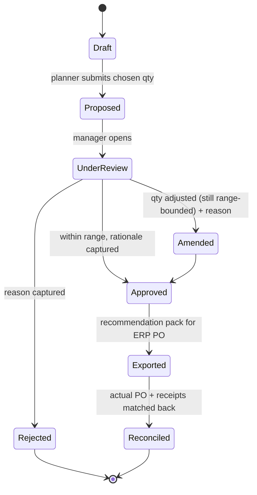
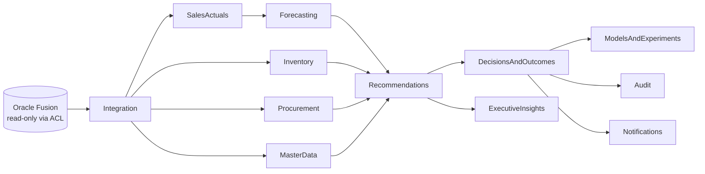

# UC4 — Procurement Quantity Optimisation

> Recommend defensible procurement **quantity ranges** per model-variant-location, grounded in demand, lead-time reality and the **current + inbound** stock position — never a false-precision single number, and never blind to what is already on order.

---

## 1. Purpose & business value

ADMC places replenishment orders (factory / supplier POs) for its five model lines
(**Patrol, Corolla, Haval H9, Camry, ES 350** in variants **VX / ZX / MX**) across up to 15
selling locations. Ordering too little risks lost sales during the manufacturing-to-delivery
lead time; ordering too much compounds the aging and holding-cost exposure that
[UC5 — Inventory Aging & Overstock Risk](./uc5-inventory-aging-overstock-risk.md) exists to
contain. Today that trade-off is made from spreadsheets that rarely reconcile the **open PO
pipeline** against fresh demand.

UC4 gives the procurement planner a **transparent, per-cell order recommendation** expressed as
a **range** (conservative → aggressive) with every input shown, the stockout and lead-time risk
made explicit, side-by-side scenario comparison, and a stored approve / reject decision that
feeds the platform's learning loop. It is the forward-looking twin of UC5: UC5 stops capital
building up in slow cells, UC4 stops it being ordered in the first place.

This is a **production capability**. The POC surfaces the seed of it — the
`Pause / reduce procurement` recommendation on the **Management Actions** screen and the
`estimated stock cover` factor on **Inventory Intelligence** (see
[Methodology](../../wireframes/docs/METHODOLOGY.md)) — but does **not** yet compute order
quantities, and the POC sample data carries no open-PO or MOQ feed. UC4 specifies the full
capability and the data it requires.

Related: this use case shares its demand engine with
[UC1 — Monthly Vehicle Order Optimisation](./uc1-monthly-vehicle-order-optimisation.md) and its
configuration-level demand signal with
[UC3 — Configuration-Level Demand Insights](./uc3-configuration-level-demand-insights.md).

## 2. Actors

| Actor | Role in UC4 |
|-------|-------------|
| **Procurement Planner** | Runs the planner, reviews per-cell ranges, picks a quantity within the range, submits for approval. |
| **Demand Planner / Analyst** | Validates the demand basis, adjusts service-level and lead-time assumptions, compares scenarios. |
| **Procurement Manager (Approver)** | Approves / rejects / amends a submitted order line; approval is mandatory before any PO is raised in the ERP. |
| **Executive** | Reviews aggregate order value and capital commitment via the [Executive Cockpit](./uc8-executive-decision-cockpit.md). |
| **Platform / GenAI narrator** | Explains the recommendation in natural language. **Computes nothing** (see §7). |

## 3. Scope

**In scope** — replenishment quantity recommendation per `location + model + variant`; safety-stock
sizing from configurable target service levels; lead-time and stockout risk; MOQ / order-multiple
rounding; open-PO / inbound reconciliation; scenario comparison; approve / reject / amend workflow
with durable decision storage; outcome reconciliation for learning.

**Out of scope** — supplier selection / sourcing strategy; price negotiation and landed-cost
modelling; logistics routing and transfer execution (that is the inventory-rebalancing path);
**writing POs into Oracle Fusion** (Fusion is a read-only system of record via the anti-corruption
layer — the platform exports an approved recommendation pack, authorised staff raise the PO in the
ERP); spare-parts ordering (see [UC7](./uc7-spare-parts-demand-prediction.md)).

## 4. Inputs & data sources

Honesty about provenance matters: several UC4 inputs are **net-new production feeds** from Oracle
Fusion Procurement and are **not** present in the POC sample workbooks described in the
[Data Dictionary](../../wireframes/docs/DATA_DICTIONARY.md).

| Input | Bounded context ← source | In POC sample? | Drives |
|-------|--------------------------|----------------|--------|
| Sales actuals (3,120 monthly rows, Jan 2022 – Apr 2026, SAR) | `SalesActuals` ← Oracle Fusion | Yes | Demand baseline & volatility |
| Demand forecast + confidence interval (per cell) | `Forecasting` | Yes (Holt-Winters / seasonal-naive back-tested) | Expected demand over lead time |
| Current on-hand inventory (291 units, 14 locations) | `Inventory` ← Oracle Fusion | Yes | Available stock position |
| **Open / inbound POs** (qty, expected receipt date, status) | `Procurement` ← Oracle Fusion | **No — net-new** | **Guardrail: available position (§7)** |
| Procurement history (past PO qty, order & receipt dates) | `Procurement` ← Oracle Fusion | Partial (`lead_time_days` proxy only) | Lead-time distribution, order cadence |
| Supplier / factory lead time + variability | `Procurement` / `MasterData` | Partial (`lead_time_days` = purchase − manufacture) | Lead-time mean & σ |
| Receipt reliability (cancelled / delayed / partial) | `Procurement` ← Oracle Fusion | **No — net-new** | Inbound haircut & lead-time risk |
| MOQ, order multiple, min order value | `MasterData` ← Oracle Fusion | **No — net-new** | Rounding constraints |
| Holding cost per day (~SAR 3,235/day aggregate) | `Inventory` | Yes | Over-order cost in scenarios |
| Target service level, planning horizon, weights | `PlatformAdministration` config | Config | Safety stock, range width |

> The POC's `lead_time_days` is **manufacture → purchase**, a proxy for factory build+transfer time,
> not full order-to-receipt lead time. UC4 replaces it with the true procurement lead-time
> distribution once the Fusion Procurement feed is connected. `service_date` remains excluded
> (meaning unconfirmed — see [Assumptions & Limitations](../../wireframes/docs/ASSUMPTIONS_LIMITATIONS.md)).

## 5. Method — how a recommendation is built

All quantities are **deterministic and explainable**; the engine reuses the POC demand machinery
(`demandVelocity`, `demandTrend`, the documented **fallback hierarchy**) and the forecasting
confidence intervals.

### 5.1 Notation

| Symbol | Meaning | Basis |
|--------|---------|-------|
| `D` | Mean monthly demand for the cell | Trailing-N velocity + [demand fallback hierarchy](../../wireframes/docs/METHODOLOGY.md) |
| `σ_D` | Demand standard deviation | Recent monthly history |
| `L` | Expected lead time (months) | Supplier/factory lead-time distribution |
| `σ_L` | Lead-time standard deviation | Same distribution + receipt-reliability record |
| `R` | Review / planning period | Monthly cycle = 1 month (aligns with UC1) |
| `SL`, `z` | Target service level and its z-factor | Config (see table below) |
| `OnHand` | Current units for the cell | `Inventory` |
| `Inbound_eff` | Effective inbound within `L+R` | Open POs, haircut for reliability (§6) |
| `Committed` | Units already allocated / backordered | `Inventory` / `SalesActuals` |

### 5.2 Safety stock (demand **and** lead-time variability)

```
SS = z × sqrt( L · σ_D²  +  D² · σ_L² )
```

Using the demand term **and** the lead-time term means an unreliable supplier (high `σ_L`) raises
the buffer even when demand is steady — the honest behaviour ADMC needs given variable factory
allocation.

| Target service level | z-factor |
|----------------------|----------|
| 90% | 1.28 |
| 95% | 1.65 |
| 97.5% | 1.96 |
| 99% | 2.33 |

### 5.3 Target position and **net** requirement

```
S            = D · (L + R) + SS                       (order-up-to position)
Available    = OnHand + Inbound_eff − Committed        (GUARDRAIL: Inbound_eff is never dropped)
Q_base       = max(0, roundToOrderRule( S − Available ))
```

`Q_base` is the **base** point. It is deliberately **not** the headline number — the headline is a
**range**.

### 5.4 The recommended **range** (not false precision)

The spread is generated from real uncertainty, not decoration:

| Endpoint | Demand basis | Lead-time basis | Meaning |
|----------|--------------|-----------------|---------|
| `Q_low` | Forecast lower CI bound | Short lead-time percentile (p25) | Lean order; relies on inbound + fast receipt |
| `Q_base` | Point forecast | Mean lead time | Central estimate |
| `Q_high` | Forecast upper CI bound | Long lead-time percentile (p75–p90) | Conservative buffer against slow supply |

Each endpoint is rounded **up to MOQ** and **to the nearest order multiple**. The wider the demand
volatility or supplier variability, the wider the range — the UI states *why* it is wide rather than
pretending to a single "correct" quantity. If `Q_high ≤ 0`, the recommendation is
**"No order needed — covered by on-hand + inbound"** with the covering arithmetic shown.

### 5.5 Risk read-outs

- **Stockout risk** — probability that lead-time demand exceeds `Available` before the next receipt,
  banded Low / Medium / High. Rendered with the semantic scale (`--neg` red at high risk,
  `--pos` green at low; see [design tokens](#11-visual-language)).
- **Lead-time risk** — from `σ_L` and the cancelled/delayed/partial receipt record for the
  supplier-model; a high value both widens the range and annotates the recommendation.
- **Over-order cost** — incremental accumulated holding cost implied by choosing `Q_high` over
  `Q_base`, priced at `holding_cost_per_day`, so the planner sees the cost of caution.

### 5.6 End-to-end flow

```mermaid
flowchart TD
  A[Sales actuals + Forecast<br/>D, sigma_D] --> E[Compute S = D*(L+R) + SS]
  B[Lead-time distribution<br/>L, sigma_L] --> S1[Safety stock<br/>SS = z*sqrt of L*sigmaD^2 + D^2*sigmaL^2]
  C[Service level SL -> z] --> S1
  S1 --> E
  D1[On-hand inventory] --> AV[Available = OnHand + Inbound_eff - Committed]
  P[Open / inbound POs] --> HC[Reliability haircut] --> AV
  AV --> N[Net requirement = S - Available]
  E --> N
  N --> RG[Range: Q_low .. Q_base .. Q_high]
  MOQ[MOQ + order multiple] --> RG
  RG --> RK[Stockout risk + Lead-time risk]
  RK --> UI[Procurement Planner UI]
  UI --> DEC[Approve / Reject / Amend -> DecisionsAndOutcomes]
```

## 6. Inbound reconciliation — the core guardrail

**A recommendation must never ignore inbound inventory.** Over-ordering because open POs were not
netted off is the single most expensive failure mode this use case exists to prevent.

Rules enforced by the `Procurement` and `Recommendations` contexts:

1. **Inbound is always subtracted.** `Available` includes `Inbound_eff` in every computation path;
   there is no branch that computes a quantity from `OnHand` alone. This is a **hard invariant**,
   asserted in code and covered by an acceptance test (§9).
2. **Missing inbound ≠ zero inbound.** If the open-PO feed is absent, stale beyond its freshness SLA,
   or fails validation, the engine **does not assume zero** and does **not** emit a quantity. It
   returns *"Inbound position unavailable — cannot recommend a quantity"* and routes the cell to
   review. This mirrors the POC's demand philosophy: a missing signal is flagged, not silently
   treated as nought (see [Assumptions & Limitations](../../wireframes/docs/ASSUMPTIONS_LIMITATIONS.md)).
3. **Only inbound that lands inside the horizon counts.** An open PO expected to receive after
   `L + R` provides no cover for this cycle and is excluded from `Inbound_eff` (but is shown for
   context so the planner understands the pipeline).
4. **Receipt-status handling:**

   | PO status | Treatment in `Inbound_eff` |
   |-----------|-----------------------------|
   | Confirmed, arriving within horizon | Full quantity, minus reliability haircut |
   | **Delayed** past the horizon | Excluded from cover; raises lead-time risk |
   | **Partial receipt** | Only the outstanding balance counts as inbound |
   | **Cancelled** | Excluded entirely |

5. **Reliability haircut.** Historical cancelled/delayed/partial rates for the supplier-model
   discount `Inbound_eff` so the buffer does not over-trust a shaky pipeline. The haircut is shown
   as an explicit line in the explanation.

## 7. Grounding & AI guardrails

Consistent with the platform-wide contract (see the Integration blueprint and
[Methodology](../../wireframes/docs/METHODOLOGY.md)):

- The **generative-AI layer may narrate** a recommendation — "Order 6–9 Patrol VX for Riyadh; the
  range is wide because supplier lead time has varied ±3 weeks this year" — but must **never compute**
  the forecast, safety stock, quantity, range, or any risk value. Every number it speaks is the
  engine's, validated against structured output before rendering.
- No causal language. Discount/Ramadan effects are **associations** ("moved more volume in
  discounted periods"), never proven causes.
- Recommendations are **decision support requiring human approval**, never automated orders.
- The engine never implies sample POC data is live Oracle Fusion data.

## 8. Screens & flows (proposed)

Four production surfaces; the first is net-new, the others extend existing POC screens.

### 8.1 Procurement Planner (new)

A per-cell worktable, one row per `location + model + variant` with an outstanding or forecast
requirement.

| Column group | Contents |
|--------------|----------|
| Cell | Location · Model · Variant · demand basis + confidence badge |
| Position | On-hand · Inbound (within horizon) · Committed · **Available** |
| Recommendation | **Range `Q_low → Q_high`** · base · MOQ/multiple applied |
| Risk | Stockout risk · Lead-time risk · over-order cost of `Q_high` |
| Decision | Chosen qty (slider bounded to the range) · Submit |

Filters mirror Inventory Intelligence (brand, model, variant, location, risk). A summary strip
totals proposed order value (SAR) and capital commitment.

### 8.2 Recommendation drawer — explainability

Opening a row reveals the full additive derivation: `D`, `σ_D`, `L`, `σ_L`, `z`, `SS`, `S`,
`Available` with its inbound breakdown, the range endpoints and *why* the range has its width, the
reliability haircut, and the fallback basis used for demand. Nothing is a black box — the same
transparency principle as the POC risk model.

### 8.3 Scenario compare

Compare 2–4 scenarios side by side before committing:

| Scenario | Service level | Lead-time assumption | Delayed PO included? | Q range | SS | Stockout risk | Δ holding cost |
|----------|---------------|----------------------|----------------------|---------|----|--------------|----------------|
| Balanced | 95% | Mean | Yes | 6 → 9 | … | Low | baseline |
| Defensive | 99% | p90 | No | 9 → 13 | … | Very low | +SAR … |
| Lean | 90% | p25 | Yes | 4 → 6 | … | Medium | −SAR … |

### 8.4 Approval workflow & decision storage

Approve / reject / amend, stored durably in `DecisionsAndOutcomes` (the POC stores actions only in
`localStorage`; production persists to PostgreSQL with full audit).



Every transition records **who, when, chosen quantity, rationale, and the engine inputs at
decision time** (a frozen snapshot). `Exported` produces the pack authorised staff use to raise the
PO in Oracle Fusion — the platform itself never writes to the ERP. `Reconciled` matches the eventual
PO and receipts back to the recommendation, producing the realised-vs-recommended variance that
feeds `ModelsAndExperiments`.

## 9. Acceptance criteria

| # | Criterion | Verification |
|---|-----------|--------------|
| AC1 | Every recommendation nets off `Inbound_eff`; no path computes a quantity from on-hand alone. | Unit test asserts `Available` includes inbound on all branches; property test: adding an inbound PO never *increases* `Q_base`. |
| AC2 | Missing/stale/invalid inbound feed yields "cannot recommend", never a zero-inbound number. | Feed-outage test returns the review state, not a quantity. |
| AC3 | Headline output is a **range**; `Q_low ≤ Q_base ≤ Q_high`; endpoints obey MOQ and order multiple. | Property tests across random cells. |
| AC4 | Range width increases monotonically with `σ_D` and `σ_L`. | Parameterised test. |
| AC5 | Safety stock rises with service level and with lead-time variability. | `z(99%) > z(95%)`; `∂SS/∂σ_L > 0`. |
| AC6 | Delayed-past-horizon, cancelled, and partial POs are treated per §6 table. | Fixture per status. |
| AC7 | Every number the GenAI narrator states equals the engine value (structured-output validation). | Contract test on the narration payload. |
| AC8 | Approve/reject/amend persists actor, timestamp, chosen qty, rationale, and input snapshot. | Integration test against `DecisionsAndOutcomes`. |
| AC9 | Amended quantity must stay within `[Q_low, Q_high]` or require an explicit override reason. | Validation test. |

## 10. Edge cases & data quality

| Case | Handling |
|------|----------|
| **Sparse cell demand** | Apply the demand fallback hierarchy; if "insufficient demand history", emit no quantity and flag *Investigate demand data* (mirrors POC `recommend()`). |
| **Mecca** | Sells but holds no inventory; requirement is routed to the fulfilling location, handled gracefully (as in the POC join). |
| **New model / cold start** | No usable history → national/segment analog, low-confidence badge, deliberately wide range. |
| **Zero or negative net requirement** | "No order needed — covered by on-hand + inbound", with the covering arithmetic shown. |
| **Conflicting units** | All monetary values SAR; quantities integer units; lead times normalised to a single unit before the formula. |
| **`service_date`** | Excluded — meaning unconfirmed. |
| **Stale demand vs fresh inbound** | Each input carries its own freshness stamp; the recommendation degrades (widened range or review state) if any input breaches its SLA rather than blending silently. |

## 11. Visual language

Reuses the Meridian BI / BeeEye design tokens: **IBM Plex Sans** for UI, **IBM Plex Mono** for
every quantity, range and SAR value; 12px radius cards. Stockout and lead-time risk use the
semantic scale (`--pos` green `oklch(0.68 0.14 152)` → `--warn` yellow `oklch(0.79 0.14 84)` →
`--neg` red `oklch(0.65 0.2 27)`); AI narration is marked with the `--ai-1` / `--ai-2` accents.
Light and dark themes both supported.

## 12. Bounded contexts touched



`Forecasting` and `Recommendations` own the computation; `Procurement` owns inbound/PO truth and the
guardrail data; `DecisionsAndOutcomes` owns the durable approve/reject record; `ModelsAndExperiments`
closes the loop with realised-vs-recommended learning; `Audit` records everything.

## 13. Success metrics (KPIs)

| KPI | Target direction |
|-----|------------------|
| Stockout rate on replenished cells | ↓ toward the configured service level |
| Overstock / aging value created by new orders | ↓ (fewer cells entering Watch/High-attention per [UC5](./uc5-inventory-aging-overstock-risk.md)) |
| Holding cost avoided vs prior ordering | ↑ (SAR) |
| Recommendation acceptance rate | ↑ (trust proxy) |
| Realised-vs-recommended quantity variance | → 0 within range |
| Approval cycle time | ↓ |
| Double-ordering incidents (inbound ignored) | **0** (guardrail) |

## 14. Assumptions & limitations

- Requires the **net-new** Oracle Fusion Procurement feeds (open POs, receipt status, MOQ) that the
  POC sample does not contain; until connected, UC4 runs in explain-only mode with demand and
  on-hand.
- Lead-time distribution is only as good as procurement history depth; thin history widens ranges by
  design.
- Ranges are decision support, not automated orders; a human approves before any PO is raised.
- Safety-stock formula assumes approximately normal demand/lead-time variability; heavy seasonality
  (e.g. Ramadan) is carried through the forecast, not a separate seasonal buffer, in v1.
- The platform does not write to Oracle Fusion; it exports an approved recommendation pack.

---

## Traceability

- Demand engine, fallback hierarchy, risk & recommendation rules — [Methodology](../../wireframes/docs/METHODOLOGY.md)
- Field-level provenance (sales / inventory / lead time) — [Data Dictionary](../../wireframes/docs/DATA_DICTIONARY.md)
- Derived metrics (velocity, cover, holding cost) — [Derived Metrics](../../wireframes/docs/DERIVED_METRICS.md)
- POC boundaries and the "missing ≠ zero" principle — [Assumptions & Limitations](../../wireframes/docs/ASSUMPTIONS_LIMITATIONS.md)
- Oracle Fusion ingestion & Azure target state — [Integration Blueprint](../../wireframes/docs/INTEGRATION_AZURE_ORACLE.md)
- Sibling use cases — [UC1 Monthly Vehicle Order Optimisation](./uc1-monthly-vehicle-order-optimisation.md) · [UC3 Configuration-Level Demand](./uc3-configuration-level-demand-insights.md) · [UC5 Inventory Aging & Overstock Risk](./uc5-inventory-aging-overstock-risk.md) · [UC8 Executive Decision Cockpit](./uc8-executive-decision-cockpit.md)
