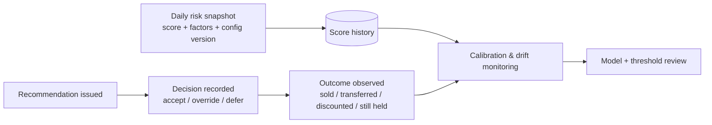

# UC5 — Inventory Aging & Overstock Risk

**Purpose:** Identify slow-moving and over-covered vehicle stock early, quantify each unit's overstock risk with a transparent, explainable score, and recommend the specific corrective action — so ADMC frees trapped capital and stops holding-cost accrual before a unit becomes unsellable.

---

## 1. At a glance

| Aspect | Detail |
|--------|--------|
| **Business question** | *Which units are aging, over-covered or slowing down, how much capital and daily holding cost are exposed, and what should we do about each?* |
| **Primary users** | Inventory / stock managers, regional heads, procurement, executive sponsors |
| **POC screen** | **Inventory Intelligence** (`Meridian BI.dc.html`), vehicle-detail drawer, **POC Settings** |
| **Engine surface** | `BIEngine.computeInventory(settings, filters)` in [`engine.js`](../../wireframes/engine.js) |
| **Status** | Wireframed end-to-end in the POC; deterministic additive risk model live |
| **Primary bounded context** | `Inventory` (score, bands, exposure) |
| **Collaborating contexts** | `SalesActuals` + `Forecasting` (demand velocity/trend), `Recommendations` (actions), `Predictions` (survival/censored extension), `DecisionsAndOutcomes` (score history + outcome tracking), `MasterData` (config/variant taxonomy), `PlatformAdministration` (per-BU thresholds), `ExecutiveInsights` (rollups) |
| **Currency** | SAR throughout |
| **Analysis date** | Configurable POC assumption, default **30 Jun 2026** — never the silent system clock |

UC5 is the risk-and-action counterpart to [UC1 — Monthly Vehicle Order Optimisation](./uc1-monthly-vehicle-order-optimisation.md) and feeds the [UC8 Executive Decision Cockpit](./uc8-executive-decision-cockpit.md). Where UC1 decides *what to buy*, UC5 decides *what to do with what we already hold*.

---

## 2. Scope

**In scope**
- Per-unit inventory age and manufacturing age against configurable aging bands.
- Slow-mover / overstock identification via demand velocity, stock cover and demand trend.
- Explainable additive 0–100 overstock **risk score** with a per-factor contribution breakdown.
- Low / Medium / High / Critical risk banding and **value exposed** at each band.
- Overstock aggregation by configuration (model · variant · colour · interior) and by location.
- Rule-based **action suggestions** (promotion, controlled discount, redistribution, procurement pause, liquidation priority, investigate, retain/monitor).
- Configurable thresholds and factor weights, per BU / category in production.
- Score history and post-action outcome tracking.

**Out of scope (handled elsewhere / deferred)**
- Forecast generation itself → [UC2 Sales Forecast Accuracy](./uc2-sales-forecast-accuracy.md).
- Procurement quantity computation → [UC4 Procurement Quantity Optimisation](./uc4-procurement-quantity-optimisation.md).
- Write-back of executed actions to Oracle Fusion (read-only system of record via anti-corruption layer).
- Any GenAI-computed number. GenAI **narrates** validated metrics only; it never computes a risk score, probability, value or quantity.

---

## 3. Faithful mapping to the wireframe

The **Inventory Intelligence** screen (`isInventory`) is the UC5 workbench. Every rendered element below is produced from `computeInventory(...)`; production preserves the same information architecture on React + TanStack Table.

| Wireframe element | Bound value | Meaning | Source |
|---|---|---|---|
| KPI row (8 tiles) | `invKpis` | Total stock, inventory value, high-risk value, critical units, daily/accrued holding, avg mfg age, transfer options, promotion candidates | `agg.*` |
| Demand vs stock-cover **quadrant** | `invQuadrant` | Bubble per `location·model·variant`; x = demand velocity, y = stock cover, size = value, colour = worst risk band | `inv.units` grouped |
| **Risk distribution** donut | `invRiskDonut` | Units by risk band (Low/Med/High/Critical) | `agg.byRisk` |
| **Inventory aging** bars | `invAgingChart` | Units by aging band; click filters the table | `agg.byAging` |
| Inventory value by location | `invByLocation` | Purchase value per location | `agg.byLocation` |
| Manufacturing age distribution | `invMfgChart` | Units by mfg-age band | `agg.byMfg` |
| Holding-cost exposure by model | `invHoldingByModel` | Accumulated holding per model | `agg.byModel` |
| Location × model imbalance **heatmap** | `invHeatmap` | Stock units held per cell; darker = more | `inv.units` |
| Inventory **detail table** | `invRows` | Sortable, searchable, column-toggle, aging-band chips, **Export CSV** (`meridian_inventory_risk.csv`) | `invTableRows()` |
| Vehicle **detail drawer** | `rvDrawer()` | Attributes, metrics, factor contribution bar, demand sparkline, transfer destinations, recommendation | `openUnit(u)` |
| **POC Settings** panel | `agingInputs`, `weightRows`, analysis date, trailing months, cover cap | Live recompute of every screen | `state.settings` |

### Vehicle-detail drawer content (faithful to `rvDrawer()`)

- **Attributes:** brand, model, variant, type, colour, interior, location, chassis, purchased, manufactured, **service date** (shown but *excluded from scoring*), lead time.
- **Metrics:** inventory age + aging band, manufacturing age + mfg band, purchase price, daily holding, accumulated holding, demand velocity + confidence, stock cover + group size, demand trend + % vs prior quarter.
- **Contribution bar** (`duContrib`): the five weighted risk factors, largest first.
- **Demand sparkline** (`duSpark`): trailing monthly units for the unit's `location·model·variant`.
- **Transfer destinations** (`duDests`): up to 3 candidate locations with post-move cover and avoided holding.
- **Recommendation:** action, why, evidence list, expected outcome, confidence, assumptions.

---

## 4. Core model

### 4.1 Inventory age and aging bands

All ages are computed **as of the configurable Analysis Date** (`ad`), never the silent system clock.

```
inventory_age_days   = analysis_date − date_of_purchase
manufacturing_age    = analysis_date − date_of_manufacture
accumulated_holding  = max(0, inventory_age_days) × holding_cost_per_day
```

Aging bands (days, editable on POC Settings — `agingBands = [30, 60, 90, 120]`):

| Band | Rule | Token |
|------|------|-------|
| New | ≤ 30 | `--risk-low` |
| Healthy | ≤ 60 | `--risk-low` |
| Watch | ≤ 90 | `--risk-med` |
| High attention | ≤ 120 | `--risk-high` |
| Critical aging | > 120 | `--risk-crit` |

### 4.2 Slow-mover identification — demand velocity, cover, trend

Slow-movers are units whose stock outweighs demonstrated demand. Three signals drive this, all joined on **location + model + variant**:

- **Demand velocity** = trailing-N-month average monthly units (`trailingMonths`, default 3), resolved through the **demand-fallback hierarchy** so a sparse cell is never silently treated as zero:

  ```mermaid
  flowchart TD
    A[Location + model + variant<br/>sufficient recent history?] -->|yes| U[Use directly]
    A -->|no| B[National model+variant<br/>scaled by location sales share]
    B -->|available| U
    B -->|no| C[Model-level national demand<br/>divided across selling locations]
    C -->|available| U
    C -->|no| D["insufficient demand history"<br/>flagged, not zero]
  ```

  The **basis actually used** is displayed per calculation (`demandBasis`) with a confidence label.

- **Stock cover** = `group stock units / average monthly units sold`. Computed against the **whole** location·model·variant group (not the filtered view) so cover stays accurate under table filters. No demand → cover is treated as effectively unbounded (999 sentinel) and surfaced as *"no reliable demand signal"*, not a hard number.

- **Demand trend** = recent 3-month average vs prior 3-month average → `increasing` (> +8%), `stable`, or `declining` (< −8%).

### 4.3 Explainable additive risk score

A transparent 0–100 score presented as an **additive breakdown, never a black box**. Default factor weights (editable, live-recomputed):

| Factor | Weight | Sub-score (0–100) derivation |
|--------|-------:|------------------------------|
| Estimated **stock cover** | **30%** | `clamp((cover − 1) / (coverMax − 1) × 100, 0, 100)`; if no demand → 90 |
| Inventory **holding age** | **25%** | `clamp(inventory_age / agingBands[3] × 100, 0, 100)` |
| Declining **demand trend** | **20%** | declining → `60 + min(40, |Δ%|)`; stable → 35; increasing → 10 |
| **Holding-cost** exposure | **15%** | percentile rank of accumulated holding across all inventory |
| **Lead-time** risk | **10%** | percentile rank of `lead_time_days` across all inventory |

```
factor.pts = (weight / 100) × sub_score
risk_score = round( Σ factor.pts × (100 / Σ weights) )   → clamp 0..100
```

The `× 100 / Σweights` term renormalises whenever the operator's weights do not sum to 100, so the score stays on a 0–100 scale. Factors are sorted **largest contribution first** for the contribution bar.

**Worked example** (a Critical unit):

| Factor | Sub-score | × weight | Points |
|--------|----------:|---------:|-------:|
| Stock cover (8.0m, cap 6) | 100 | 0.30 | 30.0 |
| Holding age (110 / 120 d) | 91.7 | 0.25 | 22.9 |
| Demand trend (declining −18%) | 78 | 0.20 | 15.6 |
| Holding-cost (P80) | 80 | 0.15 | 12.0 |
| Lead-time (P55) | 55 | 0.10 | 5.5 |
| **Total** | | | **≈ 86 → Critical** |

### 4.4 Risk bands and value exposed

Bands (editable — `riskBands = [34, 59, 79]`): **Low 0–34 · Medium 35–59 · High 60–79 · Critical 80–100**, mapped to `--risk-low/med/high/crit` (green→yellow→orange→red OKLCH tokens).

`computeInventory` returns aggregate **value exposed** — the capital at each risk band (`agg.byRisk[].value`), `highRiskValue` (High+Critical), `criticalValue`, declining-trend value, plus units/value per aging band and candidate counts (transfer / promotion / discount / pause). This is what powers the KPI row and the executive rollup.

---

## 5. Probability of crossing thresholds & remaining time (production extension)

The POC deliberately ships a **deterministic** explainable score — it does not yet estimate a probability. UC5 in production adds a calibrated layer on top **without removing** the transparent breakdown:

- **P(cross next aging threshold within horizon H)** — probability a unit reaches the next band (e.g. Watch → High attention) within H days.
- **Expected remaining time-to-sale** — median/expected days until the unit sells, where estimable.

These are computed by the **Python ML tier** (`ModelsAndExperiments` → `Predictions`), **not** by GenAI, using a **survival / censored** formulation because the core data limitation is intrinsic:

> Every unsold unit is **right-censored** — it has a `date_of_purchase` but **no sale date**. Naive "days since purchase" understates true dwell time. A Kaplan–Meier / Cox-style survival model treats the unsold units as censored observations and estimates the hazard of selling as a function of config, location, demand velocity, discount responsiveness and season (Ramadan flag).

| Property | Value |
|---|---|
| Model family | Survival (KM baseline, Cox / gradient-boosted survival for covariates) |
| Censoring | Right-censored on all currently-held units |
| Output | Hazard curve → P(threshold crossing @ H), expected remaining days, confidence |
| Fallback | Where a cell lacks history, degrade to the deterministic score and label *"probability unavailable — insufficient survival history"* (never a fabricated %) |
| Governance | Versioned in MLflow; SHAP surfaces per-unit drivers, aligned with the additive factor bar |

The deterministic additive score remains the **primary, always-available** signal; the survival probability is an enrichment shown when its confidence clears a threshold. Both are stored so the two can be back-tested against realised outcomes (see §7).

---

## 6. Action suggestions (recommendation engine)

Transparent rules produce one recommendation per unit, each carrying **why · evidence · expected outcome · confidence · assumptions** (faithful to `recommend(...)`). Evaluated in priority order:

| # | Action | Trigger (simplified) | Confidence |
|---|--------|----------------------|-----------|
| 1 | **Prioritise liquidation** | No reliable demand **and** age > critical band | Medium |
| 2 | **Investigate demand data** | No reliable demand signal for the cell | Low |
| 3 | **Transfer stock** | Cover > cap **and** a destination shows materially stronger relative demand | = transfer confidence |
| 4 | **Apply controlled discount** | Age > critical band **and** model·variant historically moved more volume when discounted (within observed 0–20% range) | Medium |
| 5 | **Start targeted promotion** | Age > Watch band **and** demand softening but not absent | Medium |
| 6 | **Pause / reduce procurement** | Cover > cap **and** demand flat/falling with no strong transfer destination | Medium |
| 7 | **Retain / monitor** | Cover healthy, demand holding, unit not aged | High |

Design guarantees carried from the POC into production:
- Discounts are only ever suggested **within the historically observed discount range** for that model·variant, and framed as **association, not causation** ("historically moved more volume in discounted periods").
- Transfers name the destination and show post-move cover; POC explicitly states logistics cost is **not** modelled.
- Every recommendation is **decision support requiring business review**, never an automated write-back.
- Actions map to `Recommendations` context; a **campaign-priority** ordering (highest exposure × responsiveness first) is derived for marketing hand-off.

---

## 7. Configurability, score history & outcome tracking

### 7.1 Configurable thresholds (POC Settings → per-BU in production)

The POC exposes on the **POC Settings** screen, recomputing live: analysis date, the four aging thresholds, the five factor-weight sliders (with **normalise-to-100%**), trailing-demand months, and healthy-cover cap. In production these become **versioned configuration per Business Unit / vehicle category**, owned by `PlatformAdministration`:

- A luxury sedan BU may set tighter aging bands and a lower cover cap than a volume hatchback BU.
- Weight profiles are named, versioned, and stamped onto every score so a historical score is always reproducible against the config that produced it.

### 7.2 Score history & outcome tracking (`DecisionsAndOutcomes`)



- Each unit's score is **snapshotted per analysis run**, enabling risk-trajectory charts (rising vs cooling units) rather than a single point-in-time view.
- Every recommendation and the human decision on it (accept / override + reason / defer) is recorded.
- Realised outcomes (sold, transferred, discounted, liquidated, still held) close the loop, feeding calibration of both the additive weights and the survival model, plus **drift** monitoring via OpenTelemetry / App Insights.

---

## 8. Inventory aging edge cases

The 291-unit sample is clean; production Oracle Fusion data is not. UC5 must handle these deterministically and visibly.

| Case | Handling |
|------|----------|
| **Reserved / allocated units** | Excluded from *overstock* exposure and slow-mover ranking (committed demand), but still aged and shown, flagged `Reserved`. Not eligible for transfer/liquidation actions. |
| **Blocked / on-hold** | Age continues to accrue; recommendation suppressed to `Blocked — under hold` with the underlying score still visible for review. |
| **Damaged / quality-hold** | Routed to an exception queue; risk score shown but standard sell-through actions withheld (repair/write-down path, not promotion). |
| **Demonstrator / courtesy fleet** | Tagged as non-saleable stock; aging tracked separately, not counted in overstock value; lifecycle (fleet → retail) transition re-bases inventory age. |
| **In-transit / not yet received** | Excluded from held-stock cover and holding-cost accrual until goods-received; shown as inbound so it informs procurement-pause logic (UC4) without inflating overstock. |
| **Duplicate / corrected VIN (chassis)** | `stock_id` is PK; `chassis_no` is unique. A duplicate chassis is quarantined by DataQuality (not double-counted); a **corrected** VIN keeps the same `stock_id` so age history and score trajectory are preserved. |
| **Censored data (unsold units)** | Core to the model — every held unit is right-censored (no sale date). The survival layer (§5) treats it as censored; the deterministic score always works regardless. |
| **Missing / skipped snapshots** | If an analysis run is missed, score history interpolates the gap as *unknown* (not zero) and trajectory charts show the break rather than a false straight line. |
| **`service_date`** | Meaning **unconfirmed** → displayed in detail but **excluded from risk scoring**, flagged for business clarification. |
| **Mecca** | Appears in *sales* but holds **no inventory** — no UC5 rows; used only as a demand contributor via the fallback hierarchy. Handled gracefully, never errors. |
| **No demand signal** | Never treated as zero demand; cover shows *"no reliable demand signal"* and the recommendation becomes *Investigate demand data* or *Prioritise liquidation* by age, with the demand basis stated. |

---

## 9. Data contract & GenAI boundary

**Inputs** (join key **location + model + variant**):
- Inventory: `stock_id, chassis_no, model, variant, colour, interior, brand, type, location, date_of_purchase, date_of_manufacture, service_date, lead_time_days, purchase_price, holding_cost_per_day, currency` — see [DATA_DICTIONARY.md](../../wireframes/docs/DATA_DICTIONARY.md).
- Sales history: monthly `units_sold`, `discount_pct`, `is_ramadan` for velocity/trend/discount-responsiveness.
- Config: analysis date, aging thresholds, factor weights, trailing months, cover cap (per BU/category).

**Outputs:** per-unit `{ invAge, mfgAge, agingBand, accHold, velocity, demandBasis, cover, trend, risk, riskBand, factors[], rec }`; aggregates for exposure; optional survival `P(threshold)` + expected remaining days; CSV export (`stock_id`, score, band, ages, exposure, demand basis, recommendation).

**GenAI boundary (hard rule):** the provider-neutral GenAI abstraction may **narrate** these already-validated numbers ("Riyadh holds the highest aging exposure at …") and must state when data is a fallback or unavailable. It must **never** compute a forecast, risk score, probability, value, quantity or the decision itself, and must never imply the sample is live Oracle data. See [METHODOLOGY.md → AI grounding](../../wireframes/docs/METHODOLOGY.md).

---

## 10. Acceptance criteria

1. Every held unit renders an inventory age, aging band, demand basis, stock cover, demand trend, 0–100 risk score, risk band and a single recommendation — as of the configured analysis date.
2. The risk score equals the additive sum of the five weighted factors (renormalised to 100), and the contribution bar reproduces it exactly.
3. Changing any aging threshold, factor weight, trailing-month or cover-cap setting recomputes all screens live and re-stamps the config version onto new scores.
4. Value exposed is reported per risk band and per aging band, and reconciles to total inventory value.
5. Sparse cells resolve through the four-level fallback hierarchy with the basis shown; a missing cell is never silently scored as zero demand.
6. `service_date` is excluded from scoring; Mecca produces no inventory rows; reserved/blocked/damaged/demo/in-transit units are classified and their actions gated per §8.
7. Discount suggestions never exceed the historically observed range and are phrased as association, not causation.
8. Score snapshots, issued recommendations, human decisions and realised outcomes are persisted and queryable for calibration.
9. GenAI output contains no number it did not receive from the engine.

---

## Traceability

- **Methodology & risk model:** [METHODOLOGY.md](../../wireframes/docs/METHODOLOGY.md) · **Derived metrics:** [DERIVED_METRICS.md](../../wireframes/docs/DERIVED_METRICS.md) · **Data model:** [DATA_DICTIONARY.md](../../wireframes/docs/DATA_DICTIONARY.md) · **Assumptions & limits:** [ASSUMPTIONS_LIMITATIONS.md](../../wireframes/docs/ASSUMPTIONS_LIMITATIONS.md) · **Integration:** [INTEGRATION_AZURE_ORACLE.md](../../wireframes/docs/INTEGRATION_AZURE_ORACLE.md)
- **Engine:** [`engine.js`](../../wireframes/engine.js) — `computeInventory`, `recommend`, `demandVelocity`, `transferOpportunities`. **Wireframe screen:** Inventory Intelligence + vehicle-detail drawer in [`Meridian BI.dc.html`](../../wireframes/Meridian%20BI.dc.html).
- **Related use cases:** [UC1 Order Optimisation](./uc1-monthly-vehicle-order-optimisation.md) · [UC4 Procurement Quantity](./uc4-procurement-quantity-optimisation.md) · [UC2 Forecast Accuracy](./uc2-sales-forecast-accuracy.md) · [UC8 Executive Cockpit](./uc8-executive-decision-cockpit.md).
