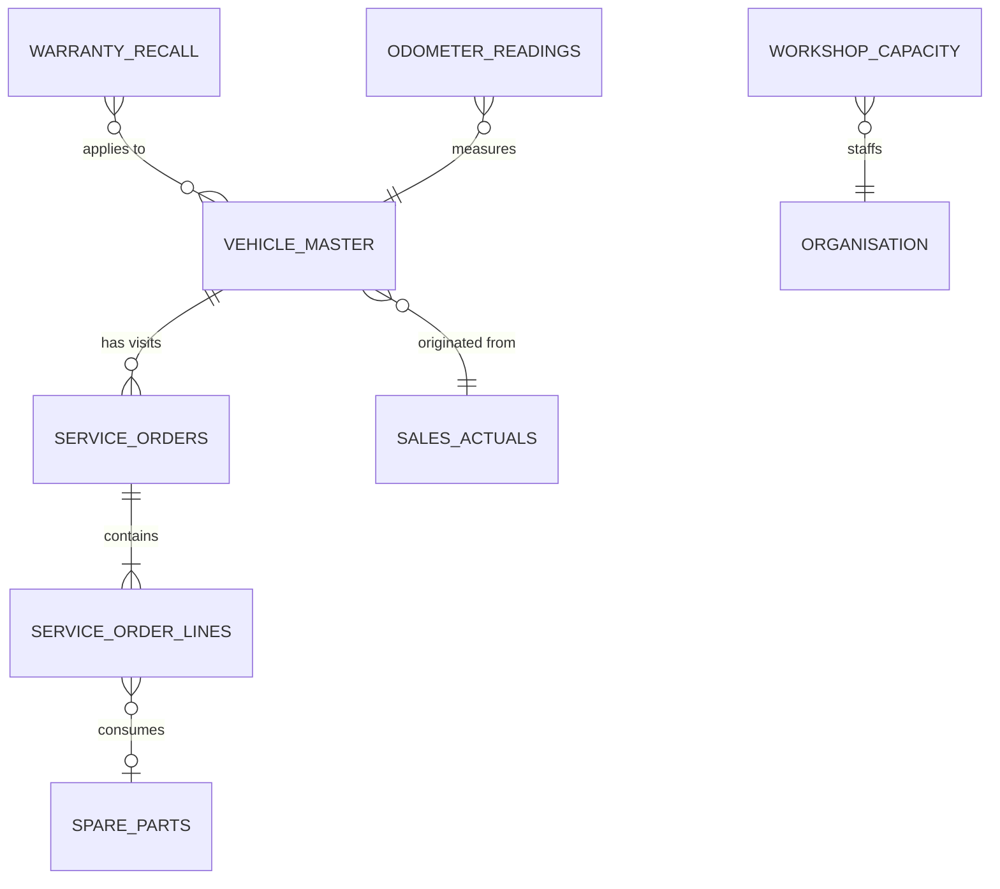
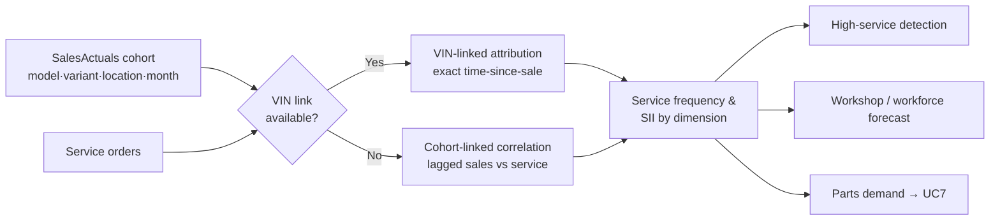
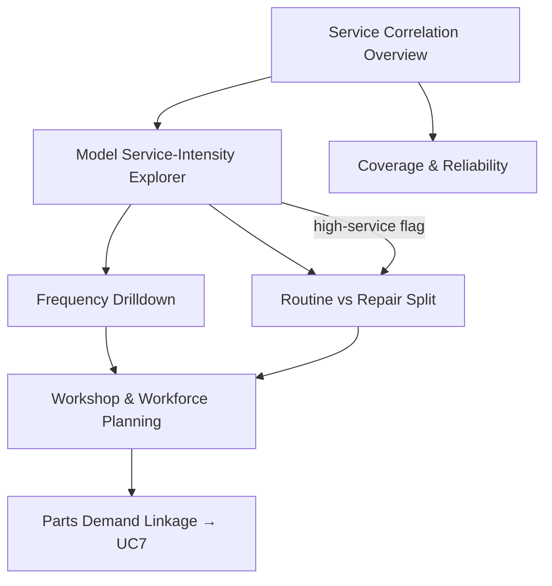

# UC6 — Sales vs After-Sales Demand Correlation

**Purpose:** Link each vehicle sale to its downstream service activity so ADMC can quantify how much workshop, workforce and parts demand a sale generates by model, mileage, age and service type — and plan capacity accordingly.

---

## 1. Status & scope

> **After-sales data is NOT present in the BeeEye POC sample.** The POC ships sales history (3,120 rows) and inventory stock (291 units) only — see [Data Dictionary](../../wireframes/docs/DATA_DICTIONARY.md). This use case is therefore specified as a **production capability** that depends on new source datasets being onboarded through the Integration and DataQuality bounded contexts. No screen for UC6 exists in the ten POC screens; this document defines the required data, metrics, methods and proposed screens for the target platform.

| Attribute | Value |
|-----------|-------|
| Use case | UC6 — Sales vs After-Sales Demand Correlation |
| Primary owner context | `AfterSales` (with `SalesActuals`, `SpareParts`, `Predictions`) |
| POC coverage | None — dataset not in sample |
| Production readiness | Requires new service, warranty and odometer feeds |
| Currency | SAR |
| Related use cases | UC1 (order optimisation), UC5 (inventory risk), UC7 (spare parts demand), UC8 (executive cockpit) |

---

## 2. Business problem & objectives

ADMC sells a small model line-up (Patrol, Corolla, Haval H9, Camry, ES 350) across 15 sales locations, but every sale creates a multi-year stream of service events at ADMC workshops. Today the sales and after-sales sides are planned separately, so workshop capacity, technician staffing and fast-moving parts are provisioned reactively rather than from the known shape of the installed fleet.

**Objectives**

1. Attribute service activity back to the originating sale (vehicle → cohort → model).
2. Measure **service frequency** by model, mileage band, time-since-sale and service type.
3. Compute a model-level **Service-Intensity Index (SII)** to compare how service-heavy each model is on a like-for-like basis.
4. **Detect high-service models** early — outliers versus the fleet benchmark and versus their own cohort history.
5. Feed **workshop, workforce and inventory (parts) planning** with forward service-demand signals.
6. Do all of the above with **PII minimisation**, honest **coverage/reliability disclosure**, and robust handling of **incomplete mileage and service records**.

**Primary questions answered**

| Persona | Question |
|---------|----------|
| After-sales director | Which models generate the most workshop load per vehicle, and where? |
| Workshop manager | How many labour-hours and bays will this location need in the next 1–6 months? |
| Parts / procurement | Which parts will the current fleet pull, and when (feeds UC7)? |
| Warranty manager | Which models have abnormal warranty/recall intensity for their age? |
| Executive (cockpit) | Is after-sales demand tracking the sales we booked 12–36 months ago? |

---

## 3. Required source datasets

Because UC6 is not covered by the POC sample, the following feeds must be onboarded from Oracle Fusion / the dealer management system (DMS) via the versioned anti-corruption layer (read-only system of record) into the ADLS Gen2 `raw → validated → curated` zones. Field lists are the **minimum viable** contract; ADMC's actual schema is confirmed during integration.

### 3.1 Service / repair orders (header) — `service_orders`
The event backbone. One row per workshop visit / repair order (RO).

| Field | Type | Notes |
|-------|------|-------|
| `service_order_id` | text | PK — RO number. |
| `vehicle_ref` | text | FK to vehicle master (VIN/chassis, pseudonymised — see §8). |
| `location` | text | Servicing workshop; map to org hierarchy (may differ from selling location). |
| `open_date`, `close_date` | date | Visit window; drives time buckets and throughput. |
| `service_type` | enum | Routine / Repair / Warranty / Recall / Body-accident / Diagnostic-other (see §5.4). |
| `odometer_km` | int | Mileage at visit — **frequently incomplete** (see §6.3). |
| `labour_hours` | number | Booked/actual technician hours — workforce planning input. |
| `total_amount` | number | SAR; service revenue (labour + parts + sublet). |
| `currency` | text | SAR. |
| `status` | enum | Open / In-progress / Closed / Cancelled. |

### 3.2 Service order lines — `service_order_lines`
Splits each RO into labour and parts, enabling routine-vs-repair separation and the UC7 parts linkage.

| Field | Type | Notes |
|-------|------|-------|
| `line_id` | text | PK. |
| `service_order_id` | text | FK. |
| `line_type` | enum | Labour / Part / Sublet. |
| `operation_code` | text | Standard operation (e.g. scheduled 10k service) — classifies routine vs repair. |
| `part_number`, `qty` | text/int | For `line_type = Part`; joins to `SpareParts`. |
| `amount` | number | SAR. |
| `warranty_flag` | bool | Line covered by warranty. |

### 3.3 Vehicle master / registry — `vehicle_master`
The join that connects a **sale** to its **service history**. Without this, sales↔after-sales correlation is impossible.

| Field | Type | Notes |
|-------|------|-------|
| `vehicle_ref` | text | PK — pseudonymised VIN/chassis. |
| `model`, `variant`, `brand`, `type`, `colour`, `interior` | text | Matches the sales taxonomy in the [Data Dictionary](../../wireframes/docs/DATA_DICTIONARY.md). |
| `sale_order_ref` | text | Link to the originating sale (SalesActuals). |
| `sale_date` | date | Delivery/registration date — origin of `time_since_sale`. |
| `sale_location` | text | Selling location (one of 15). |
| `warranty_start`, `warranty_months` | date/int | Warranty window bounds. |

> **Join to POC sales:** POC sales are aggregated monthly (no per-VIN grain), so `vehicle_master` is the new grain that makes attribution possible. Where VIN-level linkage is unavailable, UC6 degrades gracefully to **cohort-level correlation** on `model + variant + sale_location + sale_month` (see §4.2).

### 3.4 Warranty & recall campaigns — `warranty_recall`
| Field | Type | Notes |
|-------|------|-------|
| `campaign_id` | text | PK. |
| `campaign_type` | enum | Warranty-bulletin / Recall / Service-campaign. |
| `model`, `variant` | text | Affected population. |
| `open_date`, `expiry_date` | date | Eligibility window. |
| `expected_labour_hours` | number | Planning input per affected vehicle. |

### 3.5 Odometer readings — `odometer_readings` (optional but recommended)
Point-in-time mileage from any touchpoint (service, inspection, telematics). Improves mileage-band accuracy and enables imputation of missing `odometer_km`.

### 3.6 Workshop capacity reference — `workshop_capacity`
Bays, technician headcount, productive hours per location and shift. Not analytical demand — it is the **supply** side that planning screens compare demand against.

---

## 4. Correlation model

### 4.1 Grain & buckets
The analytical grain is **one service event**, rolled up along four dimensions:

| Dimension | Bands |
|-----------|-------|
| **Model / variant** | Patrol, Corolla, Haval H9, Camry, ES 350 × VX/ZX/MX |
| **Mileage band (km)** | New 0–10k · 10–30k · 30–50k · 50–80k · 80–120k · High >120k |
| **Time-since-sale** | 0–3m · 3–6m · 6–12m · 12–24m · 24–36m · 36–48m · 48m+ |
| **Service type** | Routine · Repair · Warranty · Recall · Body-accident · Diagnostic-other |

### 4.2 Two attribution modes
1. **VIN-linked (preferred):** `service_orders.vehicle_ref → vehicle_master.sale_date` gives exact `time_since_sale` and true per-vehicle frequency.
2. **Cohort-linked (fallback):** where VIN linkage is missing, correlate the **monthly sales cohort** against **subsequent monthly service volume** for the same `model + variant + location`, echoing the demand-fallback philosophy in [Methodology](../../wireframes/docs/METHODOLOGY.md). The mode actually used is shown per figure, never silently mixed.

---

## 5. Derived metrics

All metrics are computed deterministically in the backend analytics services (the framework-free engine philosophy of `engine.js` ported per the [Integration Blueprint](../../wireframes/docs/INTEGRATION_AZURE_ORACLE.md)). GenAI narrates them but never computes them.

### 5.1 Service frequency
- **Visits per vehicle-year** = service events ÷ vehicle-years exposed (exposure = Σ months a vehicle has been in the fleet ÷ 12). Exposure-normalised so young and old cohorts are comparable.
- **Visits per 10k km** = service events ÷ (Σ km travelled ÷ 10,000) — mileage-normalised alternative for fleets with poor sale-date linkage.
- **First-service latency** = median days from `sale_date` to first Routine visit.
- **Frequency matrix** = visits-per-vehicle-year cross-tabbed by mileage band × time-since-sale × model.

### 5.2 Service value & labour
- **Service revenue per vehicle-year** (SAR).
- **Labour-hours per vehicle-year** — the direct workforce-planning driver.
- **Parts SAR per vehicle-year** — feeds UC7 spare-parts prediction.

### 5.3 Service-Intensity Index (SII) — model level
A transparent, **explainable additive** index (0–100) in the same spirit as the POC risk model, so it can be defended and tuned rather than treated as a black box. Each component is min-max normalised against the fleet, then weighted:

| Component | Weight | Meaning |
|-----------|--------|---------|
| Visits per vehicle-year | 30% | How often the model is in a bay |
| Labour-hours per vehicle-year | 25% | Workforce load it creates |
| Repair-to-routine ratio | 20% | Unplanned vs planned burden |
| Warranty + recall rate | 15% | Quality/cost exposure |
| Parts SAR per vehicle-year | 10% | Parts pull it drives |

`SII = 100 × Σ(weightᵢ × normalisedᵢ)`, presented as a stacked additive breakdown per model. Weights are **configurable** (mirroring the POC Settings pattern) and recompute live. Age/mileage-adjusted variants are offered so a genuinely older cohort is not penalised as "high-service" purely for being old.

**Intensity bands** reuse the design-token risk scale for visual consistency (see [Methodology](../../wireframes/docs/METHODOLOGY.md) risk bands): Low 0–34 (`--risk-low`), Medium 35–59 (`--risk-med`), High 60–79 (`--risk-high`), Critical 80–100 (`--risk-crit`).

### 5.4 Routine vs repair vs warranty vs recall — kept separate
UC6 must **never blend planned and unplanned demand**, because they plan differently (scheduled maintenance is forecastable capacity; repairs and recalls are risk/quality signals). Classification precedence:

1. `campaign_id` present → **Recall** or **Warranty-campaign**.
2. Any line `warranty_flag = true` → **Warranty**.
3. `operation_code` ∈ scheduled-maintenance catalogue → **Routine**.
4. `service_type = Body-accident` → **Body-accident**.
5. Otherwise → **Repair** (or **Diagnostic-other** where no billable repair line exists).

Every metric can be filtered to, or split by, these classes, and the SII reports its repair-to-routine ratio explicitly.

---

## 6. Analytical methods

### 6.1 Cohort / survival analysis
Time-to-first-service and inter-visit intervals are modelled as cohort survival curves (Kaplan-Meier style, censoring vehicles still within a window). This yields defensible "by month N, X% of the model-cohort has had its first Repair" statements without over-fitting.

### 6.2 Sales→service lag correlation
For cohort-linked mode, cross-correlate monthly sales with lagged monthly service volume per model to estimate the **lag profile** (e.g. Routine peaks at the 10k/20k km service interval; warranty repairs cluster early). Reported as association only — "associated with", never "caused by" — consistent with the POC's AI-grounding rules.

### 6.3 Incomplete mileage & service handling
| Issue | Handling |
|-------|----------|
| Missing `odometer_km` | Impute from `odometer_readings` trend or cohort median km-per-month; **flag imputed rows**; offer a "measured mileage only" toggle. Never silently treat missing as 0. |
| No VIN linkage | Fall back to cohort mode (§4.2); disclose the mode used per figure. |
| Open/cancelled ROs | Excluded from completed-demand metrics; counted separately as pipeline. |
| Unknown `service_type` | Bucketed as Diagnostic-other, surfaced in coverage, never distributed across known types. |
| Sparse model-location cells | Roll up along the same fallback hierarchy used elsewhere (location → national-scaled → model-level), labelled "insufficient service history" when even that fails. |

### 6.4 High-service model detection
A model is flagged **high-service** when it is a statistical outlier on the SII or its components — e.g. above the fleet 75th percentile **and** ≥1 robust MAD above its age/mileage-adjusted peer benchmark, sustained across ≥2 recent periods (guards against one-off spikes). Detection is rule-transparent and pairs with a recommendation (investigate quality, pre-position parts, add capacity) carrying rationale, evidence and confidence — the recommendation pattern from [Methodology](../../wireframes/docs/METHODOLOGY.md).

### 6.5 Forward planning signals
Combining the installed-fleet size (from sales), survival curves and the SII yields **projected labour-hours, bay-hours and parts pulls** per location per month. These are surfaced to workshop/workforce planning (§7) and to UC7 for parts. Forecasts are prototype/planning estimates until validated against actual service throughput.

### 6.6 GenAI guardrail
The provider-neutral generative-AI layer may **narrate** validated metrics ("Patrol shows the fleet's highest labour-hours per vehicle-year, driven mainly by routine intervals"). It must **never** compute frequencies, the SII, forecasts, probabilities, SAR values, quantities or planning decisions, and must state when data is imputed or a fallback mode was used.

---

## 7. Data coverage & reliability

Every UC6 view carries an explicit reliability header so users never over-trust thin data.

| Coverage metric | Definition |
|-----------------|------------|
| **VIN link rate** | % of service orders resolvable to a `vehicle_master` sale. |
| **Mileage completeness** | % of service orders with measured (non-imputed) `odometer_km`. |
| **Service-type completeness** | % of orders with a resolved (non-"other") class. |
| **Fleet observation window** | Earliest → latest service date vs sale history span. |
| **Cohort density** | Vehicles-observed per model-location cell. |

**Reliability tiers** (badge on each figure): **High** (VIN-linked, ≥80% mileage, dense cohort) · **Medium** (cohort-linked or 50–80% mileage) · **Low** (sparse / heavy imputation — figure shown but visibly caveated). Tiers use the semantic tokens `--pos` / `--warn` / `--neg`.

---

## 8. PII minimisation

After-sales data is inherently more personal than aggregated sales (it can carry customer and vehicle identity). UC6 applies **data minimisation by design**, aligned with Saudi PDPL:

- **Pseudonymise at ingestion:** VIN/chassis and customer identifiers are replaced with a stable surrogate `vehicle_ref` in the DataQuality/Integration boundary; raw identifiers stay in the `quarantine`/`raw` zone under restricted access and are **not** propagated to curated analytics.
- **No customer PII in analytics:** UC6 needs the *vehicle*, not the *owner* — customer name, contact, address and plate are **excluded** from the model-input zone. Analytics operate on cohorts and vehicle references only.
- **Aggregation floors:** any breakdown below a minimum cell count (e.g. <5 vehicles) is suppressed or rolled up, preventing re-identification.
- **Access control & audit:** re-identification (surrogate → VIN) is a privileged, `Audit`-logged operation behind Entra ID roles; secrets and the mapping key live in Key Vault.
- **GenAI context is aggregate-only:** the narration layer receives metrics, never row-level or personal fields.

---

## 9. Proposed screens & flows

A new **After-Sales Intelligence** area (target React + TypeScript front-end) with these screens:

| # | Screen | Purpose | Key elements |
|---|--------|---------|--------------|
| 1 | **Service Correlation Overview** | Fleet-level answer to "does after-sales track our sales?" | Sales cohort vs lagged service volume chart; SII leaderboard; coverage/reliability header. |
| 2 | **Model Service-Intensity Explorer** | Compare models like-for-like | SII additive breakdown per model; band chips; age/mileage-adjusted toggle; high-service flags. |
| 3 | **Frequency Drilldown** | Frequency by dimension | Heatmap: mileage band × time-since-sale; filter by service type; measured-vs-imputed mileage toggle. |
| 4 | **Routine vs Repair Split** | Separate planned/unplanned burden | Stacked split by class; warranty/recall campaign overlay; repair-to-routine trend. |
| 5 | **Workshop & Workforce Planning** | Turn demand into capacity | Projected labour-hours & bay-hours per location vs `workshop_capacity`; staffing gap callouts. |
| 6 | **Parts Demand Linkage** | Bridge to spare parts | Parts SAR/qty per vehicle-year by model; hand-off to [UC7](./uc7-spare-parts-demand-prediction.md). |
| 7 | **Coverage & Reliability** | Honest data health | Link rate, mileage/type completeness, cohort density, tier badges; data-quality drilldown. |

**Design language:** IBM Plex Sans / Mono, 12px radius, OKLCH light+dark themes, and the shared risk/aging colour scale reused as the **intensity** scale — so UC6 reads as one system with the POC screens and UC5/UC8.

---

## 10. Architecture & bounded-context mapping

| Concern | Bounded context |
|---------|-----------------|
| Ingest service/warranty/odometer feeds from Oracle Fusion via ACL | `Integration` |
| Validate, pseudonymise, coverage scoring, imputation flags | `DataQuality` |
| Model/variant/location taxonomy, mileage/type reference | `MasterData` |
| Sales cohorts & installed-fleet size | `SalesActuals` |
| Service events, SII, frequency, correlation, high-service detection | `AfterSales` (owner) |
| Parts pull linkage | `SpareParts` |
| Forward service-demand forecasts | `Predictions` / `ModelsAndExperiments` |
| Capacity/staffing recommendations | `Recommendations` |
| Executive rollup for the cockpit | `ExecutiveInsights` |
| Re-identification & access events | `Audit` |

Runtime path: Oracle Fusion (read-only SoR) → ACL → ADLS Gen2 zones → Python 3.12 analytics (pandas/Polars, statsmodels, scikit-learn, MLflow-tracked) → PostgreSQL curated metrics → .NET 10 modular-monolith API → React front-end. Batch attribution runs as Container Apps Jobs; OpenTelemetry/App Insights throughout.

---

## 11. Assumptions & limitations

- UC6 is **not exercisable on POC sample data** — it is a target-state spec pending the §3 feeds.
- VIN-level linkage between sales and service is assumed available in Oracle Fusion / DMS; where absent, only cohort-mode correlation is possible.
- `service_date` in the POC inventory file is unrelated to after-sales and remains of unconfirmed meaning ([Assumptions & Limitations](../../wireframes/docs/ASSUMPTIONS_LIMITATIONS.md)); it is **not** used here.
- SII weights, mileage bands and time buckets are configurable POC-style assumptions, not production-validated constants.
- Forecasts and high-service flags are decision-support signals requiring human review; nothing is written back to enterprise systems automatically.

---

## 12. Acceptance criteria (definition of done)

1. Service events attribute to sales cohorts in both VIN-linked and cohort-linked modes, with the mode disclosed per figure.
2. Frequency is reported by model × mileage band × time-since-sale × service type, with routine/repair/warranty/recall kept separate.
3. SII is computed as a transparent additive breakdown with configurable weights and band colouring.
4. High-service models are detected against age/mileage-adjusted benchmarks with rationale and confidence.
5. Every view shows coverage and a reliability tier; imputed mileage is flagged and toggleable.
6. No customer PII reaches the analytics/model-input zone; re-identification is role-gated and audited.
7. Workshop/workforce and parts-planning outputs are produced and reconcilable to fleet size.

---

## Traceability

- Source data grain & taxonomy: [Data Dictionary](../../wireframes/docs/DATA_DICTIONARY.md) · [Derived Metrics](../../wireframes/docs/DERIVED_METRICS.md)
- Explainable-index, fallback-hierarchy & AI-grounding patterns reused here: [Methodology](../../wireframes/docs/METHODOLOGY.md)
- Target integration & Azure/Oracle topology: [Integration Blueprint](../../wireframes/docs/INTEGRATION_AZURE_ORACLE.md)
- POC scope boundaries and `service_date` caveat: [Assumptions & Limitations](../../wireframes/docs/ASSUMPTIONS_LIMITATIONS.md)
- Related use cases: [UC1 — Monthly Vehicle Order Optimisation](./uc1-monthly-vehicle-order-optimisation.md) · [UC5 — Inventory Aging & Overstock Risk](./uc5-inventory-aging-overstock-risk.md) · [UC7 — Spare Parts Demand Prediction](./uc7-spare-parts-demand-prediction.md) · [UC8 — Executive Decision Cockpit](./uc8-executive-decision-cockpit.md)
