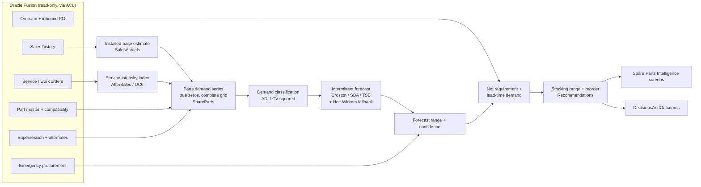
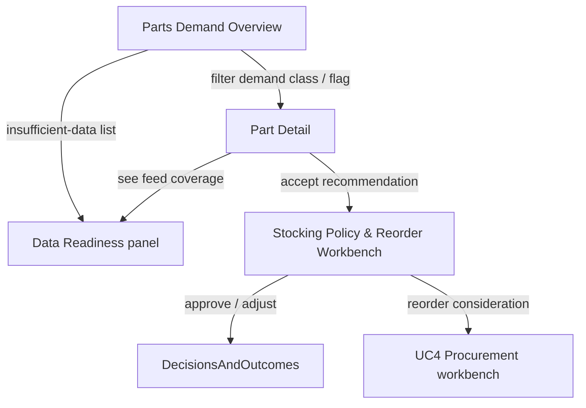

# UC7 — Spare Parts Demand Prediction

> Predict intermittent spare-parts demand from the vehicle installed base and after-sales service
> history, then recommend stocking ranges and reorder considerations that cut emergency procurement —
> with honest confidence, forecast ranges, and explicit insufficient-data flags.

---

## 1. Business context & question

From the ADMC use-case pack (Phase 3 — Cross-Functional & After-Sales Insights):

> **Business question:** *"Which parts should we stock more accurately based on sales mix?"*
>
> **AI expectation:** correlate vehicle sales mix with service history; predict parts demand trends;
> reduce emergency procurement.
> **Output:** parts demand forecast; stock-optimization suggestions.

UC7 is fundamentally different from vehicle-level forecasting (UC1 / UC2). Vehicle sales are a
relatively dense monthly series per model/variant; **spare-parts demand is intermittent and lumpy** —
many parts are consumed a handful of times per year, in irregular bursts driven by service events on
an ageing installed base, not by showroom sales. A part that sold zero units last month has usually
not "gone missing" — that zero is a genuine observation. Treating it as a gap is the single most
common way intermittent forecasts go wrong, so this spec makes the zero-vs-missing rule a first-class
constraint (see §4 and §10).

UC7 depends on and reuses:

| Related use case | Relationship |
|------------------|--------------|
| [UC6 — Sales vs After-Sales Demand Correlation](./uc6-sales-aftersales-demand-correlation.md) | Supplies the **model-wise service-intensity index** and service-frequency-by-mileage/age curves that convert the installed base into a parts-usage signal. |
| [UC4 — Procurement Quantity Optimisation](./uc4-procurement-quantity-optimisation.md) | UC7 emits parts reorder points / quantities that feed the same procurement-decision workbench pattern. |
| [UC5 — Inventory Aging & Overstock Risk](./uc5-inventory-aging-overstock-risk.md) | Shares the overstock/aging framing, now applied to parts rather than vehicles. |
| [UC1 — Monthly Vehicle Order Optimisation](./uc1-monthly-vehicle-order-optimisation.md) | The vehicle sales mix UC1 optimises is the leading indicator of future parts demand for those configurations. |

---

## 2. Scope & data honesty (POC vs target state)

**The current POC contains no parts or service-event data.** The embedded dataset is limited to
vehicle sales history (3,120 rows) and vehicle inventory (291 units). The inventory record carries a
`service_date` whose business meaning is **unconfirmed** and which is therefore excluded from risk
scoring and flagged for clarification (see [Data Dictionary](../../wireframes/docs/DATA_DICTIONARY.md)
and [Assumptions & Limitations](../../wireframes/docs/ASSUMPTIONS_LIMITATIONS.md)).

Consequently UC7 is **not wireframed** in the POC's ten screens; it is a target-state capability that
becomes possible once Oracle Fusion after-sales / parts feeds are integrated. This document specifies
that capability for the BeeEye platform and is explicit about every input that must be sourced, so
scoping and effort estimation are grounded rather than assumed.

> **Synthetic-demo implementation (current build).** So UC7 is exercisable end-to-end before the parts
> feeds land, BeeEye ships a **deterministic synthetic generator** (`SyntheticAfterSalesImporter`) that
> derives parts consumption from the synthetic service events (themselves derived from the real sales
> history). It emits a fixed `Part` catalogue (~43 parts, model compatibility, supersession chains,
> lead time / on-hand / inbound stock) and a `PartUsage` fact table. Forecasting runs at the
> **part × location** grain, where demand is genuinely intermittent, so Croston/SBA/TSB are the chosen
> methods; supersession rolls a predecessor's history onto its successor; and deliberately sparse/new
> parts exercise the insufficient-data flag. All of it is tagged `source_system = "synthetic-demo"` and
> surfaced as `provenance: "synthetic-demo"` — clearly labelled, never presented as real or as Oracle
> Fusion (see
> [data-integration-and-quality §4.1](../../architecture/data-integration-and-quality.md#41-synthetic-demo-data-uc6--uc7)).
> The inputs below are the **real** feeds that replace it.

### Required inputs (via the Oracle Fusion anti-corruption layer)

| Input | Source (Oracle Fusion / enterprise) | Used for |
|-------|-------------------------------------|----------|
| Vehicle sales history | Already available (POC `sales.json`) | Installed-base build-up by model/variant/location/age. |
| Part master | Fusion Inventory / Item master | Canonical part identity, unit of issue, category, criticality. |
| Model-to-part compatibility (applicability / BOM) | Fusion catalog / service applicability | Which parts fit which model/variant; demand attribution. |
| Supersession chains | Fusion item relationships | Roll superseded-part history onto the active successor. |
| Alternate / interchangeable groups | Fusion item relationships | Pool demand & stock across substitutes. |
| Service events / work-order lines | Fusion after-sales (service module) | Real parts-consumption signal, dated, by model & mileage/age. |
| Parts issues / consumption | Fusion Inventory transactions | Demand series construction (with true zeros). |
| Current stock position | Fusion Inventory on-hand | Net-requirement calculation per location. |
| Inbound purchase orders (open) | Fusion Procurement | Supply due within lead time. |
| Lead time (by part / supplier) | Fusion Procurement / supplier master | Lead-time demand horizon and safety stock. |
| Emergency / expedited procurement history | Fusion Procurement (expedite flags) | "Chronic expediter" signal → raise stocking level. |

Oracle Fusion remains a **read-only system of record** behind a versioned anti-corruption layer;
BeeEye computes and recommends but never writes transactions back (consistent with the
[Integration Blueprint](../../wireframes/docs/INTEGRATION_AZURE_ORACLE.md)).

---

## 3. Domain model & bounded contexts

UC7 spans several bounded contexts. The **SpareParts** context owns the parts demand model; it draws
service signal from **AfterSales**, installed base from **SalesActuals**, catalog relationships from
**MasterData**, supply from **Procurement**/**Inventory**, and shares the modelling / prediction /
recommendation machinery with the platform's ML contexts.

| Context | Responsibility in UC7 |
|---------|-----------------------|
| **MasterData** | Part master, model-to-part compatibility, supersession chains, alternate groups. |
| **SalesActuals** | Vehicle sales → installed-base estimation by model/variant/location and vehicle age. |
| **AfterSales** | Service events, work-order lines, service-intensity index (UC6). |
| **SpareParts** | Parts demand-series construction (with true zeros), demand classification, forecasts, stocking policy. |
| **Forecasting** | Reused for smooth/seasonal fast-moving parts (Holt-Winters / seasonal-naive family). |
| **ModelsAndExperiments** | Registers intermittent-demand models (Croston/SBA/TSB), back-test runs, MLflow tracking. |
| **Predictions** | Stores per-part forecasts, ranges, and confidence for serving. |
| **Recommendations** | Stocking-range and reorder recommendations with rationale/evidence/confidence. |
| **Procurement / Inventory** | Current + inbound stock, lead time, emergency-procurement history. |
| **DataQuality** | Zero-vs-missing enforcement, coverage of feeds, insufficient-data flagging. |
| **Integration** | Oracle Fusion ACL for all read-only extracts above. |
| **DecisionsAndOutcomes** | Captures approved stocking decisions for later outcome measurement. |



---

## 4. Building the demand signal

Two complementary paths produce a monthly demand series per **part × location** (with compatibility
and supersession resolved first):

1. **Direct consumption** — historical parts issues / work-order lines, aggregated to a complete
   monthly grid.
2. **Bottom-up (installed-base × usage)** — for parts with thin direct history but a clear
   applicability, estimate demand as *installed base of compatible vehicles × usage rate per 1,000
   vehicles per month*, where the usage rate comes from the UC6 service-intensity curves (by model,
   mileage band, and time-since-sale). This lets a newly stocked part inherit a defensible expectation
   from comparable vehicles rather than starting blind.

**Installed base** is estimated from cumulative `units_sold` by model/variant/location, aged forward
to the analysis date (retirements approximated by an age-decay assumption, surfaced explicitly — no
silent numbers). Because Mecca sells vehicles but holds no inventory, and location-level history can
be sparse, installed-base attribution reuses the POC's **demand fallback hierarchy** (location →
national-share-scaled → model-level national → *insufficient history*) from the
[Methodology](../../wireframes/docs/METHODOLOGY.md).

### The zero-vs-missing rule (mandatory)

The demand grid is **dense**: every part × location × month between first and last observation gets a
row. A month with no consumption is recorded as **demand = 0**, not omitted.

- Zeros are what define the **inter-demand intervals** that intermittent models depend on; dropping
  them inflates the apparent demand rate and understates variability.
- A genuinely missing feed (e.g. a location's service extract failed to load) is a **DataQuality
  incident**, quarantined and flagged — never silently interpreted as zero demand.
- The distinction (structural zero vs missing observation) is stored on every cell so the UI and the
  forecaster can treat them differently. This mirrors the POC principle that *"a missing combination
  is not automatically treated as zero demand."*

---

## 5. Forecasting methodology — intermittent demand

### 5.1 Classify each part first

Every part series is classified using the **Syntetos–Boylan–Croston (SBC)** scheme on two statistics
computed over the dense grid:

- **ADI** — Average inter-Demand Interval (mean months between non-zero demands).
- **CV²** — squared coefficient of variation of the **non-zero** demand sizes.

| Class | ADI | CV² | Character | Recommended method |
|-------|-----|-----|-----------|--------------------|
| **Smooth** | < 1.32 | < 0.49 | Regular, low variability | Reuse **Forecasting** context: SES / Holt-Winters / seasonal-naive. |
| **Erratic** | < 1.32 | ≥ 0.49 | Frequent but variable size | **SBA**; variance-aware intervals. |
| **Intermittent** | ≥ 1.32 | < 0.49 | Infrequent, stable size | **Croston** or **SBA**. |
| **Lumpy** | ≥ 1.32 | ≥ 0.49 | Infrequent and variable | **SBA / TSB**; widest ranges, low-confidence flag. |
| **Obsolescent / declining** | any | any (falling demand probability) | End-of-life, supersession pressure | **TSB** (Teunter–Sani–Babai) — updates demand *probability* every period, so it decays gracefully toward zero. |

The SBC thresholds (ADI ≈ 1.32, CV² ≈ 0.49) are configurable platform parameters, mirroring the POC's
"weights and thresholds are editable and recompute live" stance.

### 5.2 Method family

- **Croston's method** — decomposes the series into demand size and inter-demand interval, forecasts
  each with exponential smoothing, and divides. The baseline for intermittent series.
- **SBA (Syntetos–Boylan Approximation)** — Croston with the multiplicative bias correction
  (≈ 1 − α/2). Default for intermittent/lumpy because Croston is known to over-forecast.
- **TSB (Teunter–Sani–Babai)** — smooths **demand probability** instead of interval, so it responds
  to obsolescence and supersession without the ratio instability Croston shows near end-of-life.
- **Holt-Winters / seasonal-naive** — retained for *smooth* fast-moving parts (fluids, common wear
  items), reusing the exact engine already validated for vehicles.

### 5.3 Selection & back-testing (consistent with the POC philosophy)

As in [UC2](./uc2-sales-forecast-accuracy-improvement.md) and the POC methodology, the customer's
historical parts forecasts are not assumed available, so accuracy is demonstrated by **hold-out
back-testing**: train on earlier periods, predict a known later window, compare to actuals, and choose
transparently.

| Metric | Why for parts |
|--------|---------------|
| **WMAPE** | Primary, robust to the many zeros (Σ\|actual − forecast\| / Σ actual). |
| **MASE** | Scale-free vs a naive benchmark; comparable across sparse parts. |
| **Bias** | Σ(forecast − actual) / Σ actual — Croston over-forecast is the classic failure mode. |
| **Fill-rate / periods-in-stock proxy** | Ties forecast quality to the actual business goal (avoiding stockouts / emergency buys). |

The comparison table is shown per part — BeeEye reports honestly when a simple method wins rather than
forcing a fancier one, exactly as the POC does for vehicles.

### 5.4 Confidence & forecast range

Parts decisions are driven by **lead-time demand**, not a single-month point. For each part BeeEye
produces:

- **Point forecast** of demand per month over the horizon.
- **Lead-time demand distribution** across the relevant lead time, summarised as **P50 / P80 / P95**
  (and the full band), derived from back-test residual spread and/or bootstrap of the intermittent
  series — the same residual-driven interval philosophy the POC uses for vehicle forecasts.
- **Confidence label** reflecting demand class, history depth, and back-test error; lumpy/obsolescent
  parts are explicitly low-confidence with wide ranges.

### 5.5 Insufficient-data parts (explicit flag, no fabrication)

A part is flagged **"insufficient demand history"** — and receives **no fabricated point forecast** —
when it falls below configurable minimums (e.g. too few non-zero observations, or history shorter than
one seasonal cycle, and no usable compatibility fallback). This is the parts analogue of tier 4 of the
POC demand fallback hierarchy. Such parts are surfaced for stocking-by-judgement plus data-collection,
not hidden behind a confident-looking number.

---

## 6. Compatibility, supersession & alternates

Correct demand attribution and stocking require resolving the catalog relationships **before**
forecasting:

- **Model-to-part compatibility** attributes each service/consumption line to the vehicle
  configurations it applies to, so an installed-base-driven expectation can be built per part.
- **Supersession** — when part A is superseded by part B, A's historical demand is **rolled forward
  onto B** for forecasting (the market will buy the successor), while the chain is retained for audit
  and for reading legacy transactions. TSB handles the tail of the superseded part gracefully.
- **Alternates / interchangeables** — demand and stock are **pooled across an alternate group** for
  stocking decisions (risk-pooling reduces total safety stock), while individual part identity is
  preserved for issue.

### Net requirement

For a part (or alternate group) at a location:

```
Lead-time demand (P-level)            = forecast demand over lead time at chosen service level
Available within lead time            = on-hand + inbound PO due within lead time
Net requirement                       = max(0, Lead-time demand + safety stock − Available)
Reorder point (ROP)                   = lead-time demand at service level + safety stock
```

Safety stock is set from the lead-time demand distribution (§5.4) and a per-part **service-level
target** (criticality-weighted). Lead time and inbound supply come directly from Procurement, so
recommendations reflect what is already on its way — avoiding double-ordering.

---

## 7. Recommendations — stocking ranges & reorder

UC7 reuses the POC's **transparent recommendation engine** contract: every recommendation carries a
**rationale, supporting evidence, expected outcome, confidence, and assumptions** — never a black box.

| Recommendation | Trigger (illustrative) | Output |
|----------------|------------------------|--------|
| **Stock up / raise range** | Rising demand trend, or chronic emergency-procurement history | New min/max, ROP, reorder qty, service-level target. |
| **Maintain** | Stable demand, healthy fill rate | Confirm current range. |
| **Reduce / trim** | Declining demand (TSB probability falling), overstock vs lead-time demand | Lower min/max; flag overstock value. |
| **Consolidate to successor** | Active supersession | Move stock target to successor part. |
| **Pool with alternates** | Interchangeable group with fragmented stock | Group-level safety stock, per-part min. |
| **Insufficient data — investigate** | Below data minimums | No numeric target; data-collection action. |

**Emergency procurement history is a primary signal**, not a footnote: a part repeatedly expedited is
a "chronic expediter" whose stocking level is likely mis-set. BeeEye surfaces the expedite rate and
recommends raising the range or service level — directly serving the stated goal of *reducing emergency
procurement*.

**Recommendations are decision-support, not automated actions.** Human approval is required before any
procurement change, consistent with the Integration Blueprint. Approved decisions are written to
**DecisionsAndOutcomes** so realised demand can later be compared to the recommendation.

### GenAI guardrail

The generative-AI layer may **narrate** validated outputs ("demand for this part is intermittent and
rising; recommended reorder point 12, up from 8, because…") but must **never compute** forecasts,
ranges, safety stock, reorder points, or quantities. Those come only from the deterministic engine —
identical to the POC's AI-grounding rule that the model narrates numbers it did not compute and states
when data is unavailable or a fallback was used.

---

## 8. Proposed screens & flows

UC7 adds a **Spare Parts Intelligence** capability area (target-state, beyond the ten POC screens),
built on the existing OKLCH design tokens: risk scale for stockout/overstock severity, `--pos`/`--neg`
for trend, and the `--ai-1/--ai-2` accents for AI narration. Numbers use IBM Plex Mono.

| Screen | Purpose | Key elements |
|--------|---------|--------------|
| **Parts Demand Overview** | Portfolio triage | SBC demand-class quadrant (ADI vs CV²), fast/slow movers, insufficient-data list, emergency-procurement hotspots, coverage of Oracle feeds. |
| **Part Detail** | Single-part deep dive | Demand history **with visible true zeros**; forecast + P50/P80/P95 range; back-test comparison table; compatibility, supersession chain, alternate group; stock position + inbound; emergency-procurement timeline; the stocking recommendation with full rationale. |
| **Stocking Policy & Reorder Workbench** | Act on recommendations | Recommended min/max/ROP/qty per part or alternate group; adjust vs approve; sends approved decisions to DecisionsAndOutcomes (never writes to Oracle). |
| **Data Readiness panel** | Trust & scope | Which after-sales/parts feeds are present, freshness, quarantine/missing counts, and how many parts are insufficient-data — so users see the confidence basis before trusting any number. |



---

## 9. Key metrics & definitions

| Metric | Definition |
|--------|------------|
| **Installed base** | Cumulative compatible vehicles sold, aged to the analysis date (age-decay assumption shown, not silent). |
| **Usage rate** | Parts consumed per 1,000 compatible vehicles per month (from UC6 service-intensity curves). |
| **ADI** | Average inter-demand interval — mean months between non-zero demands. |
| **CV²** | Squared coefficient of variation of non-zero demand sizes. |
| **Lead-time demand** | Forecast demand summed over the part's lead time, at a chosen service level. |
| **Reorder point (ROP)** | Lead-time demand at service level + safety stock. |
| **Safety stock** | Buffer from the lead-time demand distribution and criticality-weighted service target. |
| **Fill rate** | Share of demand met from stock (service objective; back-test proxy). |
| **Emergency-procurement rate** | Share of a part's replenishments that were expedited — the chronic-expediter signal. |
| **Forecast range** | P50 / P80 / P95 lead-time demand from residual/bootstrap spread. |

---

## 10. Data quality, assumptions & guardrails

- **Zeros are data, gaps are incidents.** Dense demand grid; structural zero ≠ missing observation.
  Missing feeds are quarantined and flagged, never read as zero demand (§4).
- **Installed-base retirement** is an explicit, surfaced assumption — no silent survival curve.
- **`service_date` meaning is unconfirmed** in current data and must be clarified before it feeds any
  parts signal (carried over from the POC assumptions).
- **No fabricated forecasts** for insufficient-data parts; they are flagged, not filled.
- **Supersession/alternate resolution** happens before forecasting; audit trail retained.
- **Human approval required** before any procurement change; BeeEye never writes to Oracle Fusion.
- **GenAI narrates, never computes** decisions, values, quantities, or probabilities.
- Parts models are versioned in ModelsAndExperiments with periodic re-training and back-test
  validation, matching the platform's model-lifecycle discipline.

---

## 11. Acceptance criteria (target state)

1. Every part × location × month between first and last observation is present; zero-demand months are
   modelled as zeros and distinguishable from missing/quarantined data.
2. Each part is classified (Smooth/Erratic/Intermittent/Lumpy/Obsolescent) with ADI and CV² shown.
3. Intermittent/lumpy parts are forecast with Croston/SBA/TSB; smooth parts fall back to the existing
   Holt-Winters/seasonal family; the winning method is chosen by transparent back-testing.
4. Every forecast ships with a P50/P80/P95 lead-time-demand range and a confidence label.
5. Insufficient-data parts are flagged and receive no fabricated point forecast.
6. Supersession rolls history onto successors; alternates are pooled for stocking; compatibility drives
   attribution.
7. Recommendations output stocking ranges (min/max, ROP, reorder qty) net of on-hand and inbound stock,
   each with rationale, evidence, expected outcome, confidence, and assumptions.
8. Parts with chronic emergency procurement are surfaced with an explicit "raise stocking level" review.
9. GenAI narration never alters or computes any numeric output.
10. Approved stocking decisions are captured in DecisionsAndOutcomes for later accuracy measurement.

---

## Traceability

- POC grounding: [Methodology](../../wireframes/docs/METHODOLOGY.md) ·
  [Derived Metrics](../../wireframes/docs/DERIVED_METRICS.md) ·
  [Data Dictionary](../../wireframes/docs/DATA_DICTIONARY.md) ·
  [Assumptions & Limitations](../../wireframes/docs/ASSUMPTIONS_LIMITATIONS.md) ·
  [Integration Blueprint](../../wireframes/docs/INTEGRATION_AZURE_ORACLE.md)
- Related use cases: [UC6 — Sales vs After-Sales Demand Correlation](./uc6-sales-aftersales-demand-correlation.md) ·
  [UC4 — Procurement Quantity Optimisation](./uc4-procurement-quantity-optimisation.md) ·
  [UC5 — Inventory Aging & Overstock Risk](./uc5-inventory-aging-overstock-risk.md) ·
  [UC1 — Monthly Vehicle Order Optimisation](./uc1-monthly-vehicle-order-optimisation.md) ·
  [UC2 — Sales Forecast Accuracy Improvement](./uc2-sales-forecast-accuracy-improvement.md)
- Bounded contexts touched: MasterData, SalesActuals, AfterSales, **SpareParts**, Forecasting,
  ModelsAndExperiments, Predictions, Recommendations, Procurement, Inventory, DataQuality, Integration,
  DecisionsAndOutcomes.
- Source requirement: ADMC AI Use-Case Pack, UC7 (Phase 3 — Cross-Functional & After-Sales Insights).
