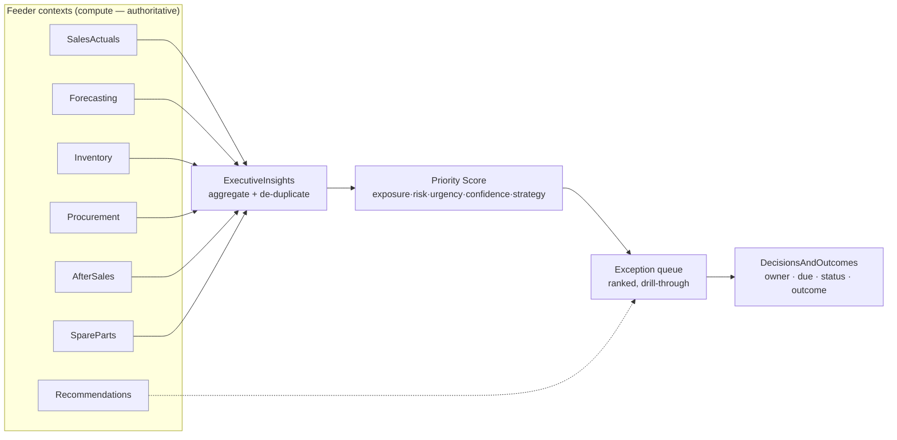
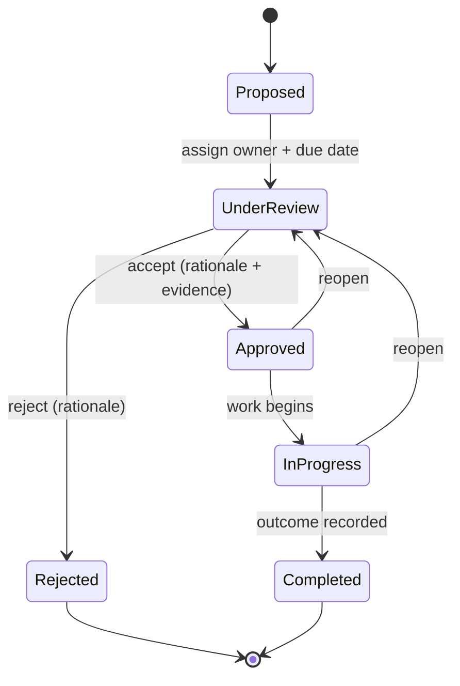
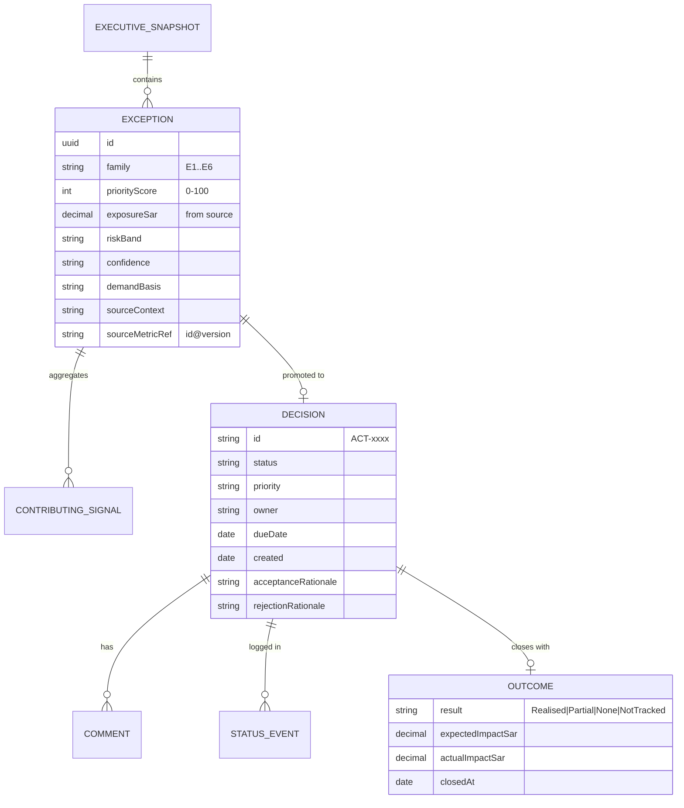
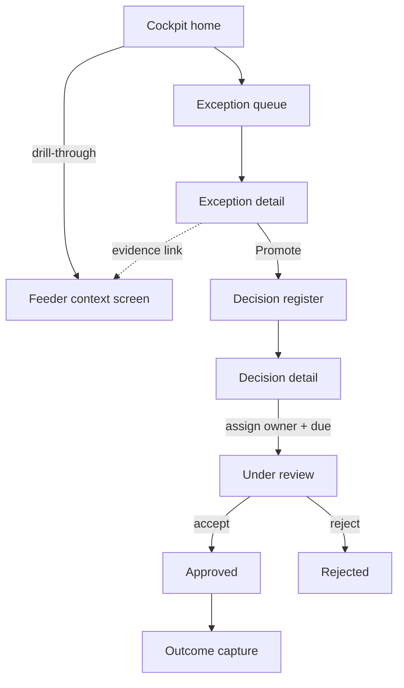

# UC8 — Executive Decision Cockpit

> A single, prioritised, cross-module view of every material exception at ADMC — with an owner, a due date, and an auditable decision trail from flag to outcome.

---

## 1. Purpose & scope

The Executive Decision Cockpit is the landing experience for ADMC leadership (General Manager,
CFO, Head of Sales, Head of After-Sales, Supply-Chain lead). It answers three questions the POC
wireframe already frames on the Executive Cockpit screen — *"What's happening, why it matters, and
what to do next"* — but productionised as a governed decision workflow, not a static dashboard.

BeeEye computes signals inside the specialised bounded contexts (Forecasting, Inventory,
Procurement, AfterSales, SpareParts, SalesActuals). **UC8 does not recompute any of them.** The
`ExecutiveInsights` context *aggregates* the material exceptions those contexts already produced,
*ranks* them by business impact, and hands each to the `DecisionsAndOutcomes` context, which tracks
the human decision — owner, due date, status, comments, evidence, acceptance/rejection and the
realised outcome.

In scope:

- Cross-module exception aggregation and de-duplication.
- A transparent, configurable prioritisation score (financial exposure · risk · urgency ·
  confidence · strategic importance).
- Executive KPI header, exception queue, and a decision register with full lifecycle tracking.
- Optional AI-authored natural-language executive summary, grounded strictly in validated
  structured metrics.

Out of scope: computing forecasts, risk scores, quantities, values or recommendations (owned by the
feeder contexts); write-back of physical actions to Oracle Fusion or dealer systems (Oracle Fusion
is a read-only system of record).

Currency is **SAR** throughout. All monetary and unit figures shown are the exact values emitted by
the source context — the cockpit re-labels and ranks them, it never re-derives them.

---

## 2. Grounding in the existing wireframe

The POC's **Executive Cockpit** screen (screen 1 of 10 in `Meridian BI.dc.html`, persona =
Executive) is the direct antecedent. Every production element below maps to something already
rendered by `rvExec()` and the deterministic `BIEngine.execInsights()` insight engine.

| Wireframe element (POC) | Source in POC code | Production home |
|---|---|---|
| "Executive AI Summary" — 5 grounded insight lines | `engine.js › execInsights()` → `execInsights` | `ExecutiveInsights` narration (optional GenAI) |
| 10-tile KPI row (units, inventory value, high/critical-risk value, daily & accumulated holding cost, forecast accuracy/WMAPE, forecast bias, next-quarter forecast, transfer opportunities, critical actions) | `execKpis` in `rvExec()` | KPI header, values proxied from feeders |
| Total demand — actuals, back-test & forecast (80% band) | `execTrend` / `forecast()` | `Forecasting` read-model |
| Inventory value by risk band · units by aging band · forecast accuracy by model | `execRiskDonut`, `execAging`, `execAcc` | `Inventory` / `Forecasting` read-models |
| Top high-risk model·variant · holding-cost exposure by location | `execTopMV`, `execTopLoc` | `Inventory` read-model |
| **Priority exceptions** list (risk-scored, top N) | `execExceptions` ← `topRiskUnits()` | UC8 **exception queue** |
| **Recommended actions** with **Create** button → action register | `execActions` → `addAction()` | UC8 **decision register** |

The wireframe's "Create" button already turns a recommendation into a tracked item with
`{ id, status, priority, owner, due, created, notes, category, action, evidence, impact, source }`
(see `addAction()` and the Management Actions screen). UC8 formalises that object as the **Decision**
aggregate and adds status history, comments, evidence links and outcome capture.

Design tokens carry over unchanged: risk bands use `--risk-low/med/high/crit` (green→red on the
OKLCH scale), AI-authored content is tinted with `--ai-1`/`--ai-2` (purple/blue), IBM Plex Sans for
UI and IBM Plex Mono for figures, 12px radius.

---

## 3. Exception taxonomy

An **Exception** is a material, decision-worthy deviation surfaced by a feeder context. UC8 ingests
six families (extending the two the POC surfaces today — overstock risk and forecast bias — to the
full cross-module set). Each exception references the **source metric by id + version**; it never
carries a number the source context did not compute.

| # | Family | Trigger signal (owning context) | Financial exposure basis |
|---|---|---|---|
| E1 | **Sales underperformance** | Actual vs plan / prior-period gap, declining demand trend (`SalesActuals`) | Revenue gap in SAR |
| E2 | **Forecast bias / accuracy** | Back-test WMAPE above threshold, bias beyond ±3% (`Forecasting`) | Units/SAR at-risk from mis-planning |
| E3 | **Overstock / aging risk** | High + Critical inventory risk value, aging ≥ Watch band (`Inventory`) | High/critical-risk purchase value + accrued holding cost |
| E4 | **Procurement mismatch** | Over-covered model·variant, transfer imbalance, over/under-order vs demand (`Procurement`) | Avoidable holding / stock-out exposure |
| E5 | **After-sales / service risk** | Service demand vs sales correlation breaks, capacity/SLA breach (`AfterSales`) | Service revenue / SLA-penalty exposure |
| E6 | **Spare-parts risk** | Predicted parts stock-out or overstock (`SpareParts`) | Parts revenue at risk / obsolescence value |

Thresholds (risk bands `0–34 / 35–59 / 60–79 / 80–100`; aging bands `New ≤30 / Healthy ≤60 /
Watch ≤90 / High attention ≤120 / Critical >120` days; bias ±3%) are the same values the engine uses
today and are configurable in `PlatformAdministration` — never hard-coded into the cockpit.

`service_date` remains **excluded** from risk scoring until its business meaning is confirmed
(consistent with the POC assumption); E5 exceptions therefore derive from confirmed after-sales
signals only.

---

## 4. Prioritisation model

Exceptions are ordered by a transparent **Priority Score (0–100)** — an additive weighted blend, in
exactly the spirit of the POC's explainable additive risk model (never a black box). The score
**ranks pre-computed signals; it introduces no new financial figure.**

| Dimension | Default weight | Input (already computed by feeder) |
|---|---|---|
| Financial exposure | 35% | SAR exposure from the source metric, percentile-normalised |
| Risk severity | 25% | Risk band / WMAPE band from the owning context |
| Urgency | 20% | Aging band, days-to-breach, or forecast horizon proximity |
| Confidence | 10% | Source confidence (High/Medium/Low) and demand-basis fallback level |
| Strategic importance | 10% | Model/location/segment strategic weighting (ADMC-configurable) |

**Confidence transparency (carried from the POC):** where a metric used the demand-fallback
hierarchy (location→national-share→model-level→"insufficient history"), the basis is displayed on
the exception, and the confidence dimension is damped accordingly. Insufficient-history exceptions
are labelled, not silently treated as zero.

**De-duplication:** a single root cause (e.g. an over-covered `Patrol VX` at one location) can raise
overstock (E3) *and* procurement-mismatch (E4) signals. UC8 groups them under one exception with
multiple contributing signals so the executive sees one decision, not two.

---

## 5. Decision lifecycle

Each prioritised exception can be promoted to a **Decision** (the productionised action-register
item). The lifecycle uses the exact status set already implemented in the POC action register.

| Status | Meaning | Required on entry |
|---|---|---|
| **Proposed** | Auto-created from an exception; not yet triaged | Linked exception + evidence |
| **Under review** | Owner assigned, being assessed | Owner, due date |
| **Approved** | Accepted for action | Acceptance rationale |
| **In progress** | Execution underway (outside BeeEye) | — |
| **Completed** | Done; realised outcome captured | Outcome record |
| **Rejected** | Declined | Rejection rationale |

**Tracked fields** (superset of the POC `addAction()` object):

- **Ownership & timing** — `owner`, `dueDate`, `priority` (Critical/High/Medium/Low), `created`.
- **Provenance** — `sourceContext`, `sourceMetricId@version`, `exceptionId`, `category`,
  `recommendedAction`, `model` / `variant` / `location`.
- **Evidence** — `evidence[]`: deep links back to the originating screen/record (Inventory unit,
  Forecast model, Procurement line) plus the supporting metric values as captured **at decision
  time** (immutable snapshot, so later refreshes cannot silently rewrite the rationale).
- **Deliberation** — `comments[]` (threaded, attributed), `statusHistory[]`.
- **Disposition** — `acceptance` / `rejection` with `rationale` and `decidedBy` / `decidedAt`.
- **Outcome** — `outcome` (Realised / Partial / No effect / Not tracked), `expectedImpact` vs
  `actualImpact` (SAR or units), `closedAt`. Feeds the `DecisionsAndOutcomes` learning loop for
  future model calibration.

Owner assignment and approaching/overdue due dates raise events into `Notifications`. Every field
change is written to the immutable `Audit` trail (who, what, when, before/after), satisfying the
POC's "human approval required before any recommended action is executed" governance rule.

---

## 6. Data model (read-model + decision aggregate)

The `EXECUTIVE_SNAPSHOT` is a read-model rebuilt on each data refresh from feeder read-models; it is
scoped by the executive's org/filter context (the POC's `execScopeLabel` — e.g. "all locations" or a
region). Snapshots are versioned so a decision always cites the metric values that were live when it
was made.

---

## 7. Proposed screens & flows

Five surfaces, extending the single POC screen into a governed workflow. The KPI header, charts and
insight summary are reused verbatim from the wireframe.

1. **Cockpit home** — KPI header (10 tiles) · optional AI executive summary · demand trend · risk /
   aging / accuracy charts · **top exception queue (5–6)** · quick "recommended actions". Drill-through
   on every element (the POC `drilldown()` behaviour: tile → context screen with pre-applied filter).
2. **Exception queue** — full ranked list, filterable by family, owner, priority, status; shows the
   priority-score breakdown (the five weighted dimensions) so ranking is explainable.
3. **Exception detail** — the aggregated signals, evidence deep-links, source metric refs + versions,
   confidence/demand-basis, and the feeder's recommended action; primary CTA **"Promote to decision"**.
4. **Decision register** — the productionised Management Actions screen: status/owner/due editable
   inline, status distribution summary, CSV export (as the POC's `meridian_action_register.csv`).
5. **Decision detail & outcome** — full lifecycle: comment thread, status history, evidence,
   accept/reject with rationale, and outcome capture (expected vs actual impact).

**Persona & access:** Executive persona lands here by default (as in the POC `setPersona()` map);
`Identity` + `Organisation` enforce RBAC (Exec / Analyst / IT) via Entra ID, and scope the snapshot
to the org units a user may see. Analysts can triage and comment; only authorised roles accept/reject.

---

## 8. Guardrails

These are hard constraints, aligned with the platform's provider-neutral GenAI policy and the POC's
"AI grounding" section.

- **No duplicate computation.** UC8 never recomputes forecasts, risk scores, quantities, values or
  recommendations. It references the owning context's metric by `id@version`. If a figure would
  differ from the source, that is a defect, not a feature.
- **No contradiction.** The cockpit's exposure/risk/urgency inputs are copied from the source metric;
  only the *ordering* (priority score) is UC8's own, and it is shown as an explainable additive
  breakdown.
- **GenAI narrates, never decides.** The natural-language executive summary is **optional** and is
  derived **only** from the validated structured snapshot. The model may rephrase and prioritise
  validated numbers; it must never introduce a number absent from the snapshot, must say
  "associated with" not "caused by", must not claim production validation or live Oracle Fusion data,
  and must state when a fallback basis or "insufficient history" applies. Output is schema-validated
  (structured-output validation) before display — matching the POC's strict-JSON contract
  (`answer / keyFindings / metrics / confidence / assumptions / recommendedActions`).
- **Human-in-the-loop.** No decision auto-executes. Acceptance, rejection and status changes are
  explicit human acts, attributed and audited.
- **Determinism where it matters.** Priority scoring, thresholds and de-duplication are deterministic
  and reproducible from the snapshot; only the prose layer is generative.

---

## 9. Bounded-context responsibilities

| Context | Role in UC8 |
|---|---|
| **ExecutiveInsights** | Owns aggregation, de-duplication, priority scoring, snapshot read-model, optional GenAI narration. |
| **DecisionsAndOutcomes** | Owns the Decision aggregate, lifecycle, comments, acceptance/rejection, outcome capture. |
| SalesActuals · Forecasting · Inventory · Procurement · AfterSales · SpareParts | Authoritative sources of exception signals and every figure. |
| Recommendations | Supplies the recommended action attached to an exception. |
| Notifications | Owner assignment, due-date reminders, overdue escalation. |
| Audit | Immutable change trail for governance/compliance. |
| Identity · Organisation | RBAC, persona routing, snapshot scoping. |
| PlatformAdministration | Threshold, band and priority-weight configuration. |

---

## 10. Acceptance criteria (indicative)

- Every exception displays its priority-score breakdown and links to the exact source metric
  (`id@version`); no figure in the cockpit diverges from its source context.
- Promoting an exception creates a Decision with an immutable evidence snapshot; assigning owner +
  due date is required to leave *Proposed*.
- Accept/reject requires a rationale; outcome capture requires expected-vs-actual impact.
- The AI summary passes structured-output validation, contains no number absent from the snapshot,
  and is fully functional-degradable (cockpit works with the AI layer off — the POC's deterministic
  insight engine is the fallback).
- All state transitions are audited and attributable.

---

## Traceability

- POC screen & engine: [`Meridian BI.dc.html`](../../wireframes/Meridian%20BI.dc.html) (Executive
  Cockpit, `rvExec()`), [`engine.js`](../../wireframes/engine.js) (`execInsights`, `topRiskUnits`,
  `computeInventory`, `recommend`, `answer`).
- Methodology & grounding: [METHODOLOGY.md](../../wireframes/docs/METHODOLOGY.md) ·
  [DERIVED_METRICS.md](../../wireframes/docs/DERIVED_METRICS.md) ·
  [ASSUMPTIONS_LIMITATIONS.md](../../wireframes/docs/ASSUMPTIONS_LIMITATIONS.md) ·
  [DATA_DICTIONARY.md](../../wireframes/docs/DATA_DICTIONARY.md) ·
  [INTEGRATION_AZURE_ORACLE.md](../../wireframes/docs/INTEGRATION_AZURE_ORACLE.md).
- Feeder use cases: UC1 Monthly Vehicle Order Optimisation · UC2 Sales Forecast Accuracy · UC4
  Procurement Quantity Optimisation · UC5 Inventory Aging & Overstock Risk · UC6 Sales vs After-Sales
  Correlation · UC7 Spare-Parts Demand Prediction — each supplies exception families E1–E6 consumed by
  this cockpit.
